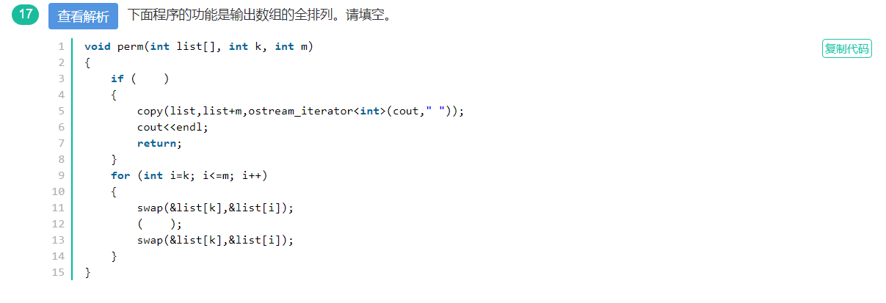

# C++基础

## [动态内存分配]

1. 

解析：对于内置类型而言，new仅仅是分配内存，除非后面显示加(),相当于调用它的构造函数，对于自定义类型而言，只要一调用new，那么编译器不仅仅给它分配内存，还调用它的默认构造函数初始化，即使后面没有加()

**动态分配的对象是默认初始化的，这意味着内置类型或组合类型的对象的值是无定义的，而类类型对象将用默认构造函数进行初始化**。

## [程序分析题]

1. 

解析：分解因数。题目的意思是n从2开始递增，如果m能被n整除了，说明n是m的因数。分出来，再计算prim(m/n, n)

2. 

解析：求n元素全排列，共有n!种可能，第一个位置有n种，后面则是n-1种，以此类推。发现for循环里面有依次把k到m的元素放第一个位置，然后递归一下，再放回来。说明这里递归前是确定了第k个位置的元素，再递归，那么肯定是递归k+1,m了

**先根据给出的功能自己想想是怎么数学实现的。再看看函数是怎么实现这点的，最后得到参数的含义与递归的过程**

## [变量的初始化]

1. 

解析：**全局变量时初始化为0，局部变量时初始化为随机值**

## [大小计算]

1. Strlen和sizeof

   

解析：sizeof对数组是计算数组分配的大小，这个大小包括\0，strlen则不包括。对指针则是计算指针本身的大小。

2. [类的大小计算]

答案：12 9

解析：

**空类占一个字节，不为空这个字节就不算了**

**static成员变量，类方法不占类的内存**

**类的局部数据成员按内存对齐原则计算**

**如果有虚函数，则加上虚函数表的指针大小**

**如果是继承的子类，则加上父类数据成员大小**

**如果该子类是多继承，则虚函数表的指针有多个**

**内存对齐：**

+ 结构体第一个成员的**偏移量（offset）**为0，以后每个成员相对于结构体首地址的 offset 都是**该成员大小与有效对齐值中较小那个**的整数倍，如有需要编译器会在成员之间加上填充字节。

+ **结构体的总大小**为 有效对齐值 的**整数倍**，如有需要编译器会在最末一个成员之后加上填充字节。

