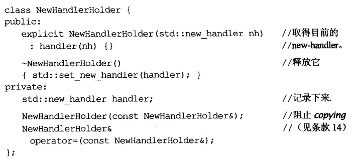

# 《Effective C++》notes

## 0 导读

### 0.1 术语

+ 函数签名
  + 主要包括函数名、参数类型、个数、熟悉及其所在的类和命名空间
  + <font color = red>并不包括返回值</font>

+ 声明式
  + 仅提供某个东西的名称和类型，但忽略了细节。

+ 签名式
  + 函数的就是参数、函数名称、返回类型，但是严格的说返回类型不是签名的一部分
+ 定义式
  + 主要任务是为编译器提供声明式所遗漏的细节，它决定了编译器如何为其分配内存。
  + 对于函数和函数模板而言，定义式就是提供了它的函数本体
  + 而对于类和类模板，定义式列出它们的成员

+ 初始化
  + 类的初始化中，常常通过在默认构造函数前加explicit来禁止隐式类型转换

## 1 让自己习惯C++

+ C++已经是一个多重泛型编程语言、支持面向过程形式、也支持面向对象形式、函数式、泛型形式、元编程形式的语言。
+ <font color = blue><u>条款1：可以认为C++包括如下4个方面</u></font>
  
  + C
  + 面向对象的C++
  + C++模板
  + STL
  
+ <font color = blue><u>条款2：尽量用const、enum、inline替换#define</u></font>

  + 准确的说，就是用编译器替换预处理器，因为define在预处理阶段完成，而前者则是编译期间。
  + 而如果define的部分在编译期发生报错，提示的消息很可能不是define出来的常量，而是其所代表的莫名其妙的值。
  + 特殊情况：
    + 对于常量指针，我们往往为了复用，会将其定义在头文件内。因此其实有必要将常量指针也定义为指针常量。这个也没法用define，因为涉及了两个const
    + 对于class内常量，常常是定义为static const，而且，会发现使用的是声明式而非定义式。这个没法用define完成。在C++中，const静态成员直接在类内初始化，而非const的静态成员则要在类外初始化。当然，我们常常使用static constexpr来定义编译期就能得到结果的编译期常量，或者是使用enum来定义

  + 我们常常使用define来定义宏，每个参数都得加上括号，但是这依然会有一系列问题，比如下面的这个，如果a传入了a++，a++的次数取决于选择哪个分支，显然不好

    ```c++
    #define CALL_WITH_MAX(a,b) f((a)>(b)?(a):(b))
    ```

    一种替代的做法是定义template inline

    ```c++
    template<typename T>
    inline void callWithMax(const T& a, const T& b)
    {
        f(a > b ? a : b);
    }
    ```

  + 总而言之，对于常量，最好用const、enum替换define

  + 对于define宏函数，最好用inline替换

+ <font color = blue><u>条款3：尽可能用const</u></font>

  + 常见问题就是const int * const p， const int * p、 int * const p等的区别
  + 迭代器定义为const和const_iterator是不同的，前者表示iterator不能变，后者表示iterator指向的内容不能变
  + const常常也用来**定义返回值**，这样就避免了客户将返回值作为左值进行奇怪的赋值运算。
  + **const修饰class的成员函数时(放在函数尾部)**，表示它不会修改class内容，于是它就可以用于const对象上，这样，谁能操作const对象，也就更明白了。
    + 当然，如果类内定义了指针，即使在不修改指针的情况下，我们依然可以修改指针指向的内容，这也没修改class内容。
    + 然而，很多情况下，const函数也需要修改成员，这些成员常常被定义为mutable
    + 很多时候，定义了const版本和非const版本，常常就会用非const版本调用const版本

+ <font color = blue><u>条款4：确定对象被使用前已先被初始化</u></font>
  + 需要注意的是，在构造函数体内进行的赋值操作不是初始化，初始化发生在进入构造函数体之前，比如使用成员初始化列表。如果没有用初始化列表，它实际就是先默认构造，然后再进入构造函数的函数体，实行赋值操作。
  + 在使用成员初始化列表的时候，最好把成员都列出来，即使没打算赋值，也可以加上括号内为空的定义。
  + 如果成员本身就是const或者reference，那初始化就更必要了
  + 如果定义了多个构造函数，而成员初始化列表又有很多重复的部分，那就可以通过定义private函数来复用那些赋值操作的开销不大的部分。
  + 另一种情况：static对象的初始化依赖问题
    + static定义在函数内的被称为logical static对象；而在classes内的、namespace内的、file作用域内的，统一称non-logical static对象。
    + 如果在文件a.cpp内定义对象A时依赖一个extern来的non-logical对象B，而B又没法保证有定义，若B没定义出来，那会导致严重的问题。一个解决办法是将B的定义改写到函数内部，在函数内部定义static对象，并返回。那么这样一个函数接口，就能确保在调用的时候必然拿到一个已经有定义的B，从而保证了A的使用。**这也是单例模式里常用的一个技巧**
  + 总而言之，大概涉及如下几个方面
    + 为内置型对象手工初始化
    + 构造函数最好用成员初始化列表，而不是赋值。排列次序也尽可能按照定义次序。
    + 为免除“跨编译单元的初始化次序”问题，用local static来替代non-local static对象。

## 2 构造/析构/赋值运算

+ <font color = blue><u>条款5：了解C++默默编写并调用哪些函数</u></font>
  + 一般地，编译器为你定义的类默认产生一个copy构造、一个copy赋值、一个非虚的析构函数、一个默认构造等这样4个默认的inline public函数。
  + 一旦自己定义了构造函数，就不再给你产生默认构造函数
  + 对于默认的赋值函数，如果你在class内定义了引用类型亦或者const成员，又或者是在基类定义了private copy赋值函数，那编译器会拒绝给你完成赋值，只能自己定义合适的处理方式。编译器生成的赋值函数只完成bit到bit的拷贝，以及调用基类的copy赋值，如果基类的没法调用，它也无能为力。
+ <font color = blue><u>条款6：若不想使用自动生成的函数，就应该明确拒绝</u></font>
  + 如何拒绝？
    + 一个做法是定义成private，而且不给实现，仅留个声明。
    + 另一个便捷的方式就是利用继承，既然这些函数会调用基类的对应函数，那么只要保证基类的对应函数被我拒绝了就行，这样就完成了复用，只要想禁止某个自动生成的函数，我就继承它。
    + 当然，到了现在的C++11可以直接用=delete来禁止调用。

+ <font color = blue><u>条款7：为多态基类声明virtual析构函数</u></font>
  + 实际就是为了确保析构基类指针指向的子类对象时，能正确应用到虚函数机制，析构掉子类部分，而不是仅仅析构父类的部分。
  + 需要注意的是，不是所有的基类都是为了实现多态而进行定义的例如iterator_tag的一系列定义，它实际上是为了赋予特性。当然，不打算做派生的，那就别给它安上虚析构函数了，减少虚函数表和虚函数指针。只有当类里面至少有一个virtual函数的时候，才应该定义虚析构函数。
  + 为了定义抽象接口，我们常常会声明纯虚函数，最好给它有个定义，这样保证能调用这个析构接口来析构基类。

+ <font color = blue><u>条款8：别让异常逃离析构函数</u></font>

  + 当需要在析构函数进行某个操作，而该操作又可能抛出异常的时候，就尽量在析构函数内保部进行catch和处理，别让它吐出异常。当然，构造函数，往往是需要让外部知道结果的，所以一般会选择传播异常。

    + 往往有两种处置手段

      ```c++
      // 结束程序法
      DBConn::~DBConn()
      {
          try {db.close();}
          catch(...)
          {
              // 记录异常
              std::abort();
      	}
      }
      
      // 吞下异常法
      DBConn::~DBConn()
      {
          try {db.close();}
          catch(...)
          {
              // 记录异常
      	}
      }
      ```

    + 当然，最好是提供一个close接口，用户去close，出现的异常让用户自己解决。析构函数则在用户没法解决的情况下使用上述两种处置办法。

+ <font color = blue><u>条款9：绝不在构造和析构过程中调用virtual函数</u></font>
  + 最最关键的点：在派生类构造函数执行之前，它不被视为一个derived class对象，而是视为一个base class对象，这使得它的虚函数被编译到base class。同样的，对于派生类的析构函数，一旦它的析构开始执行，那么对象内的derived class成员变量,虚函数等，就被视作不存在了，而进入到base class的析构后，它的虚函数被认为是base class的部分了。
    + 如果基类的构造函数打算使用一个virtual function，那么构造子类时所调用的基类构造函数，它使用的该virtual function版本其实就是基类的版本，而不是子类的版本。也就是说，无法达到多态的效果。

+ <font color = blue><u>条款10：令operator=返回一个reference to *this</u></font>
  + 懂的都懂，主要是为了连续赋值

+ <font color = blue><u>条款11：在operator=中处理“自我赋值”</u></font>

  + 完全存在自我赋值的可能。而如果是内部含有指针的情况，如果不考虑这种可能，一律采取delete原指针，深度copy新指针的形式，就会导致数据丢失。

  + 处理办法

    + 在函数开头设置一个“证同测试”来完成这个判断。但如果后面的深度copy失败，还是有异常问题

    + 使用具备异常安全性的代码

    + 使用copy and swap技术

      ```c++
      // 写法一
      class Temp{
      	void swap(Temp& rhs);
          Temp& operator=(const Temp& rhs)
          {
              Temp temp(rhs);
              swap(temp);
              return *this;
          }
      }
      
      // 写法二——利用值传递涉及copy构造
      class Temp{
      	Temp& operator=(Temp rhs)
          {
              swap(rhs);
              return *this;
          }
      }
      ```

+ <font color = blue><u>条款12：复制对象的时候不要忘记每一个成分</u></font>

  + 一般的，会为对象的复制留下copy构造以及copy赋值两个接口。

  + 对于derived class的情况，一定要确保复制的时候，基类的部分也成功复制

    + 一个是复制所有的local成员变量
    + 一个是调用合适的base class的copy构造或者copy赋值函数。千万别在copy构造里调用copy赋值，不然死循环了。相反也是一样，如果实在有重叠，建议像之前提到的一样，设置一个private init函数，将赋值开支不那么明显的放进去拿来复用。

    

## 3. 资源管理

+ <font color = blue><u>条款13：以对象管理资源</u></font>

  + 一些基本现象
    + 通过某个返回指针的资源获取函数获取了指针，但却因为异常 / 提早return / 提早continue导致没法执行到delete语句，使得资源泄露。
  + 一个基本的参考思路就是智能指针的实现方式，既然手动维护pointer的释放很不便，不如把它封装到一个对象里面，只要它生命周期结束了，它就自动调用析构函数，我们只要把资源释放步骤放到里面就行。
  + 所以，对于调用端使用某个返回指针的资源获取函数时，应当让这个资源获取函数返回一个智能指针。或者是返回到你所定义的一个资源管理对象里。
  + <font color = red>关键思路</font>
    + RAII，获取资源后立刻放到管理对象里面
    + 管理对象在析构函数内确保资源释放。
      + 当然如果涉及异常，就用条款8的做法防止异常逃离

  + 需要注意，最好别用auto_ptr，尽量用unique_ptr或者shared_ptr，因为它们对于多个指针指向同一对象有更好的处理方式，尽管对于环状引用问题还有待处理。
  + 综上
    + 防止内存泄漏，尽可能使用RAII对象。
    + 常用的是shared_ptr以及unique_ptr

+ <font color = blue><u>条款14：在资源管理类中小心coping行为</u></font>

  + 上述第13条款提到的资源管理的对象，可能会存在试图复制的情况

  + 主要解决思路

    + 禁止复制。很多情况下，应该禁止这样的复制手段。至于如何禁止，主要就是条款6提到的那些手段。

    + 引用计数。这也是shared_ptr的原理。

      ```c++
      #ifndef __SHARED_PTR_
      #define __SHARED_PTR_
      
      template <typename T>
      class shared_ptr {
      public:
          shared_ptr(T* p) : count(new int(1)), _ptr(p) {}
          shared_ptr(shared_ptr<T>& other) : count(&(++*other.count)), _ptr(other._ptr) {}
          T* operator->() { return _ptr; }
          T& operator*() { return *_ptr; }
          shared_ptr<T>& operator=(shared_ptr<T>& other)
          {
              ++*other.count;
              if (this->_ptr && 0 == --*this->count)
              {
                  delete count;
                  delete _ptr;
              }
              this->_ptr = other._ptr;
              this->count = other.count;
              return *this;
          }
          ~shared_ptr()
          {
              if (--*count == 0)
              {
                  delete count;
                  delete _ptr;
              }
          }
          int getRef() { return *count; }
      private:
          int* count;
          T* _ptr;
      };
      #endif
      ```

    + 复制的时候进行深度拷贝。

    + 转移底部资源的所有权。这也是unqiue_ptr的实现原理。

+ <font color = blue><u>条款15：在资源管理类中提供对原始资源的访问</u></font>
  + 所谓提供原始资源的访问，实际就是提供接口，能让我们得到管理类所管理的低层原始资源。
  + 解决办法
    + 一个是提供适配器，让资源管理类作为中间适配者，提供指针指向的低层资源的访问
    + 另一个就是提供类型转换，比如explicit operator T()，既然你想要这个指针，那我提供一个机制让你从这个资源管理类可以直接转换得到这个指针

+ <font color = blue><u>条款16：成对使用new和delete时要采取相同形式</u></font>
  + new和delete; new []和delete []

+ <font color = blue><u>条款17：用独立语句将new出来的对象放入智能指针</u></font>

  + new指针到智能指针的转换是必须显式转换的过程

    shared_ptr\<T>(new T)

  + 基本问题：

    + 有些操作涉及到智能指针的传入和其它操作的调用

      ```c++
      processWidget(shared_ptr<Widget>(new Widget), priority());
      ```

      不同的操作的顺序无法预测，而一旦priority操作异常了，并且在new操作之后进行，那就完全可能导致new Widget内存泄露

  + 解决办法
    + 关键就是将new对象转换成智能指针的过程独立出来。

## 4 设计与声明

+ <font color = blue><u>条款18：让接口容易被正确使用，不易被误用</u></font>

  + 实现的一些技巧

    + 明智地导入新类型来预防接口误用

      + 比如导入外履类型来对传入类型进行判断，然后在构造函数中使用这些类型，通过外履类型封装，在里面进行判断。

        ```c++
        class Date{
        public:
            Date(int month, int day, int year);
        }
        
        class Date{
            Date(const Month& m, const Day& d, const Year& y);
        }
        ```

        

    + 限制类型的值

      + 比如month，我们就可以定义特定接口获取月份值。

        

    + 限制类型内啥可以做，啥不可以做。

      + 比如加上给返回值加const，禁止客户给结果再次赋值

    + 尽量让封装的外履类型的行为和被包装的类型的行为一致

    + 提供行为一致的接口。

      + 就像STL里面大多都有size这个接口一样

    + 不要试图让客户记得做某些事情，应该先发制人给他搞定

      + 比如返回指针的，如果想让客户记住之后要delete或者要拿智能指针包装，就不是一个好设计。应当设计的时候就返回智能指针。

  + 总结

    

+ <font color = blue><u>条款19：设计class犹如设计type</u></font>
  + 创建一个class时，需要考虑如下问题
    + 如何创建和销毁？
      + 构造、析构、operator new, operator new[], operator delete, operator delete []
    + 初始化和赋值的差别？
    + 被作为值传递参数的时候，要怎么做？
      + copy构造函数
    + 它的合法值是什么？
      + 就是要在构造函数、赋值操作符还有一些设置值的函数上考虑值的合法判断。
      + 在不合法的情况，要有异常抛出、异常处理等手段。
    + 需要继承父类吗？
      + 如果要继承，就可能要进行某些虚函数进行重定义，还可能要将析构函数定义为虚函数。
    + 需要有哪些类型转换？
      + 可能要定义operator T()类型转换运算符，它可能是explicit的
    + 需要哪些操作符和函数？
    + 什么函数不许外部使用？
      + 这些就得定义为protected或者private
    + 谁能用定义的成员？
      + 同上
    + 什么是未声明接口？
    + class一般化吗？
      + 是不是要定义class template

+ <font color = blue><u>条款20：函数参数用const T&来替换T</u></font>
  + 作用：
    + 一个是能够节省值传递带来的复制开销（比如传递的是一个类的时候，就会涉及到这个局部类的构造，用完之后还有它的析构开销）
    + 一个是能够利用到多态的特性，如果T是一个对象，要使用到多态的时候，我们更希望T是一个基类的指针或者引用，而不是基类的值传递。当然，这实际应该算到引用传递和值传递的优劣。
  + 最常见的地方就是copy constructor，它的参数被定义为const T&；在没定义移动构造函数的情况下，右值也能进入到这个函数体
  + 除了内置类型和STL迭代器，函数对象外，任何其它的都最好定义为const T&

+ <font color = blue><u>条款21：必须返回对象的时候，别妄想返回它的引用</u></font>

  + 这主要是指，能返回引用固然好，但别试图返回一个函数体内的临时对象的引用，也别试图返回一个函数内static对象的引用，除非你用的单例。

+ <font color = blue><u>条款22：将成员变量声明为private</u></font>

  + 作用：

    + 一个是确保客户接口的一致性，最好别让客户在用这个类的时候判断是不是要加括号。

    + 声明为private后，我们可以通过提供不同权限等级的接口，来限制客户对该值的访问

    + 符合封装的面向对象的特质。如果打算修改客户赖以访问该成员变量的方式，我们就只要修改访问的接口函数体就行，这样有更大的弹性。

      ```c++
      const Point& upperLeft() const;//只能读，不能改
      Point& upperLeft() const;//能读能改
      void setPoint(...);//只给改
      ```

      

      + 业务上，几乎可以认为public就不应该随便变动了，弹性更小。同样的，protected也会造成很大的破坏。
      + 封装性越高，它被修改时可能造成的代码破坏量越低。

  + 总结：

    + 成员变量声明为private。
    + 最好认为只有private和其它这样两种权限。protected也不比public好到哪去。

+ <font color = blue><u>条款24：写方便函数的时候，宁肯用非成员函数、非友元函数来替换成员函数</u></font>

  + 它似乎与封装的要义相违背。但事实是，封装的目的在于能让更多的东西不可见，而衡量一个数据的封装程度，可以看能够访问它的函数的数量。当我们写好必要的访问接口后，如果打算写上整合多个接口的方便函数，类似于void ClearEverything()，那我们更应该将它定义为非成员函数、非友元函数，而不是成员函数或者友元函数，这样可以提高封装性，因为只要它不是类的一部分，就不会影响private成员的封装性。

  + 在程序组织上，建议采用这样的分割定义的方式。

    ```c++
    // webbrowser.h,定义了class本身
    namespace WebBrowserStaff {
    	class WebBrowser {...};
    }
    
    // webbrowserbookmarks.h,定义和书签有关的方便函数
    #include "webbrowser.h"
    namespace WebBrowserStaff {
    	void clearEverything(WebBrowser& wb);
        ...
    }
    
    // webbrowsercookies.h,定义和cookies有关的方便函数
    #include "webbrowser.h"
    namespace WebBrowserStaff {
    	void clearCookies(WebBrowser& wb);
        ...
    }
    ```

  + 总结：

    + 在设计方便函数的时候，用non-member和non-friend函数替换member函数，有更好的封装性。
    + 采用上述组织形式，有更好的包裹弹性和机能扩充性

+ <font color = blue><u>条款24：如果所有参数都需要类型转换，应该用非成员函数</u></font>

  + 比如设计一个分数类型

    ```C++
    class Rational{
    private:
        int numerator;
        int denominator;
    public:
        Rational(int numerator = 0, int denominator = 1);//不为explicit，允许了隐式类型转换
        int getNumerator();
        int getDenominator();   
    }
    
    // 假如要写一个乘法
    
    // 不合理的版本
    class Rational{
    	...
    public:
        const Rational operator*(const Rational& rhs) const;
        //这样的写法问题在于，当我们使用int和它运算的时候，Rational * int是可行的，因为Rational是operator调用者，也是隐含参数，int则可以通过类型转换，转换成Rational类型，完成运算。但是int * Rational则不可以，这时int是调用者，也是隐含参数，而隐含参数不会进行类型转换，也就是说int不会变为Rational类型，导致调用失败。
    }
    
    // 合理的版本（当然其实也能写成成员函数）
    const Rational operator*(const Rational& lhs, const Rational& rhs)
    {
        return Rational(lhs.getNumerator() * rhs.getNumerator(), lhs.getDenominator() * rhs.getDenominator());
    }
    ```

  + 总结

    + 如果需要为包括this指针指代的隐含参数在内的所有参数进行类型转换，就应该使用non-member函数

+ <font color = blue><u>条款25：考虑写一个不会抛出异常的swap函数</u></font>

  + C++只允许对class template进行偏特化，而不允许对函数进行偏特化，但是能全特化，如果硬要进行，那最好用仿函数。

  + 一般地，会有如下一些做法

    + 直接用std::swap。然而对于用成员指针指向一个对象，其内含真正数据的这种类的swap，原来只要交换指针就行，结果进行了很多不必要的复制和析构。对这种pimpl手法的类型不太好。
    + 将std::swap全特化。然而会涉及到向std添加内容。最好不要这样做。

  + 一个最好的做法是

    + 如果std::swap不太好，比如用了pimpl手法。那就应该提供一个member swap函数，然后再在class的命名空间下提供一个non-member swap方便函数，用以调用这个member swap函数。如果这个类不是模板类，那应该再特化std::swap。每次在调用swap的地方，加上using std::swap的声明，这样在swap的时候，会选择最合适的方式进行swap。
    + member swap函数不要抛出异常。因为swap的一个最好的应用就是帮助classes体用强烈的异常安全性保障。当然，非成员版还是可以的，基于拷贝构造和拷贝赋值的std::swap也是可以的。

  + 总结：

    

## 5 实现

+ <font color = blue><u>条款26：尽可能延后变量定义式的出现时间</u></font>
  + 定义了一个变量，控制流到达的时候，就会有构造成本；生命周期结束，就有析构成本。所以只有确定要用它的时候，你再定义它。把它延后到使用的前一刻。
  + 定义的时候，最好直接给它初值。因为可以直接通过构造函数完成构造，不用承担多余的赋值的成本。
  + 对于循环式，如果迭代成分的赋值成本更低，你就放外面声明，否则就在for循环里重复定义。

+ <font color = blue><u>条款27：尽量少做转型动作</u></font>

  + 基本知识：

    + C++四种转型
      + const_cast\<T>()常量移除或者volalile移除
      + dynamic_cast\<T>()安全向下转型。只能用于上层Base指针或引用向下层转换的情况。但无法应用在缺乏虚函数的类型上。
      + reinterpret_cast\<T>()低级转型
      + static_cast\<T>()强制类型转换，除了const_cast的功能以外。

  + 一个常见情况

    某些框架要求子类函数调用时首先要调用基类的函数，再完成子类操作

    ```c++
    class SpecialWindow : public Window {
    public:
        virtual void onResize() {
            //正确的写法
            Window::onResize();
            
            //错误的写法
            static_cast<Window>(*this).onResize();
            //原因在于，这个类型转换实际是创建了一个副本，如果onResize上有修改成员变量的操作，那么实际就是副本完成了修改，而真正的base没修改
    	}
    }
    ```

  + 另一个常见情况

    有了一个基类指针，然而子类有新增的函数，想判断如果是指向子类就调用新增函数。一个简单的做法是将新增函数定义到基类上，声明为虚函数，基类啥也不做。

  + 总结

    

+ <font color = blue><u>条款28：避免返回handles指向对象内部成分</u></font>

  + 所谓handles，就是用来取得变量的一个门牌号，比如指针，引用，迭代器。
  + 常见情况
    + 一个成员变量的封装性最多只到达返回其reference的函数接口的访问级别。所以，如果设计不好，就可能导致客户获得了不应获得的访问权限。
      + 但是和上面提到的条款22相关。我们可以通过改变接口来修改封装程度，即使返回了handles，我们依然限制了客户对这个handle的操作。
    + handle的生命周期比它指向的对象要长，那么就存在悬挂的可能。

  + 总结

    

+ <font color = blue><u>条款29：为“异常安全”而努力是值得的</u></font>

  + 异常安全性的函数要求

    + 不泄露任何的资源

      

      如上图所示的就不符合这一点，因为一旦bgImage的new操作出错，就会导致unlock没能执行，这就使得索梓源被永远把持。应当换成下图的做法，就是利用条款13里提到的<font color = red>RAII</font>的机制。

      

    + 不允许数据败坏

      同样是上图，如果new操作出错，这样bgImage会指向一个被删除的对象，而imageChange也已经累加，这就导致数据败坏。

  + <font color = red>异常安全函数或异常安全码提供下列三个保证之一</font>

    + 基本承诺

      + 异常如果抛出，程序内的任何事务都应该保证在有效状态下，而没有任何对象或者数据结构会因此被破坏，所有对象都处于内部前后一致的状态。实际就是保证程序还能跑，并且对异常有个相对妥善的处理。

    + 强烈保证

      + 异常如果抛出，程序状态不改变。程序调用成功，就成功；否则就保证恢复到调用它之前的状态。

        紧接上面的图，依然以其为例子，我们利用shared_ptr封装指针，同时将自增操作修改顺序，这样，就提供了一个强烈保证。当然，如何恢复已经从istream读取的因为new操作失败而丢失的imgsrc信息还有待解决。

        

      + 与此相关的还有一种设计策略——<font color = red>copy and swap</font>。为你打算进行修改的东西copy一份，在copy的部分上进行修改，没有异常，再将修改过后的与原来的进行swap。实现上，则通常是使用pimpl idiom，也就是类内部含有指向真正数据的指针成员。

      + 提供强烈保证所存在的问题：

        + 难度很大。一个函数调用者内部往往涉及多个函数调用，函数们如果只影响调用者对象的状态，只操作局部性状态，那么很容易提供强烈保证。但是一旦存在函数对非局部性数据有连带影响时，就很难提供保证了。
        + 效率问题上。以copy and swap为例，总是要进行拷贝，这使得消耗了很大的时间空间效率。
  
    + nothrow保证
  
      + 承诺绝不会有异常。当然，既然承诺了不会抛出异常，就应该确保它真的不会抛出，不然其会抛出意料之外的难以承受的异常。
  
  + 总结
  
    

+ <font color = blue><u>条款30：透彻了解inline机制</u></font>

  + inline的基本概述

    + inline的申请
      + inline是一种申请，不是强制命令。大部分对于有递归或循环的、以及虚函数，都不会受理。而且试图通过函数指针调用一个inline函数的时候，也可能不被受理。
    + inline的提出
      + inline可以隐式提出，比如在class定义的时候直接写出函数体；其实友元函数定义也是可以写在class内的。显式提出则是在<font color = red>定义式</font>前面加上inline
    + inline的目标
      + 让编译器优化调用，减少函数调用开销。
    + inline的缺陷
      + inline当然会导致目标码更大，体积过大意味着会有更多的换页行为，降低了cache的命中率。
      + 对于inline函数，一旦函数要修改，所有用到它的客户端都要重新编译。而如果是non-inline的，只要重新链接就行。
      + 调式很难完成。因为实际没有这个函数，这样导致很多调试环境都是调式时禁止发生inline的。

    + inline函数的设计
      + inline函数一般是定义在头文件内的。它在C++一般是编译期间完成的。
      + 千万别觉得构造函数和析构函数仿佛代码量很少就肆意使用inline
      + 总的来说。先不要声明inline，或者仅把那些稀松平常的声明为inline

  + 总结

    

+ <font color = blue><u>条款31：将文件间的编译依存关系降到最低</u></font>

  + 编译依存关系

    + 编译器对于需要用到的实现代码，比如变量定义。都是需要它们对应的定义式的，它们通常被#include提供。

      + 定义式为编译器提供了这个类型的大小信息。

      + 当然一种替代方法就是pimpl idiom思想，定义一个类实例，我们需要用到它的定义式，但是指针就只要用它的声明式，像下面这样将接口和实现分离。它<font color = red>用“声明的依存性”代替了“定义的依存性”。这也是编译器依存性最小化的本质：尽量让头文件自我满足，否则就让他和其它文件的声明式(而非定义式)依存</font>。后面这个pImpl类也称为一个Handle class，负责Person接口的具体实现。当然，还有其它的组织形式，比如将Person定义为抽象基类Interface class，然后将PersonImpl定义为它的子类。即使handle class和interface class有一定代价，但是也是值得的。

        

    + 一旦#include的某个文件被改了，那么用到它的文件都要重新编译

  + <font color =red>“声明的依存性”代替“定义的依存性”策略</font>

    + 如果用object referennces 或者object pointers就能完成的，就别用objects
    + 尽量用class声明式替换定义式。
      + 当我们声明一个函数的时候，它的形参定义是依存声明式的，即使形参是值传递。
      + 因此，我们要用到这个class来完成函数声明的时候，尽量用前置声明。这样，能够将“提供class定义式”的义务从“函数声明所在”的头文件转移到“函数调用所在”的客户文件，这样就可以把不必要的定义式依存去掉。
    + 为声明式和定义式提供不同的头文件

  + 总结

    

## 6 继承与面向对象设计

+ <font color = blue><u>条款32：确定public继承是个is-a关系</u></font>

  + 常见的关系
    + is-a
    + has-a
    + is-implement-in-terms-of（根据某物实现出）

  + 总结

    

+ <font color = blue><u>条款33：避免遮掩继承来的名称</u></font>

  + 实例

    

    

    + 当然using会使得基类里面mf1的所有同名函数都可见

    + 另一种办法是使用转交函数forwarding function，主要是当我们只想继承到同名函数中的某个函数的时候，我们使用私有继承，接着再对应的函数接口内使用Base::mf1();

      

  + 总结

    

+ <font color = blue><u>条款34：区分接口继承和实现继承</u></font>

  + 以公有继承为例

    + 声明一个pure virtual函数是让derived classes只继承接口。当然C++其实还是允许为pure virtual函数提供实现的。

    + 声明一个impure virtual函数是让derived classes继承接口和缺省实现。

      + 然而，可能出现的问题就是本应该改写接口实现的时候不小心忘了，导致使用了缺省实现。为此的解决办法是<font color = red>将缺省实现和接口分离</font>，它有如下两种思路：

        + 改写impure接口为pure接口，以便让客户完全记得要加上这个接口。然后将缺省实现放在另一个protected的函数内。

          

        + 一种是直接利用C++内能为pure接口提供实现的特性。改写impure接口为pure接口，以便让客户完全记得要加上这个接口。然后将缺省实现直接写在pure接口实现上。当然，这导致缺省实现变为了public。

          

    + 声明一个non-virtual函数是让derived classes继承函数的接口以及一份强制性实现。不变性是凌驾于特异性的。

  + 总结

    

+ <font color = blue><u>条款35：考虑virtual函数以外的其他选择</u></font>

  + 藉由Non-virtual Interface手法实现Template Method

    + ```C++
      // former version
      class GameCharacter {
          public:
          	virtual int healthValue() const;
      }
      
      // Non-virtual Interface
      class GameCharacter {
      	public:
          	// a wrapper
          	int healthValue() const {
                  // work before
      			int value = doHealthValue();
                  // work after
              }
          private:
          	virtual int doHealthValue() const;
      }
      ```

      上述做法就是一个模板模式的思想。这样做的另一个好处是可以设置work before & after，这样可以设置好调用场景，比如：

      + 调用前设置好锁、设置好log entry，验证class的约束条件，验证virtual函数调用的先决条件等。
      + 调用后解除锁、验证函数的事后条件、再次验证class约束条件等。

  + 藉由Function Pointers实现Strategy模式（策略模式）

    + 
    + 策略模式的好处
      + 每个类实例都可以有不同的计算策略
      + 可以在运行期实现策略变更

  + 藉由function模板来完成Strategy模式

    + ```c++
      typedef std::function<int (const GameCharacter&)> HealthCalcFunc;
      ```

    + 好处在于

      + 使用function，它既可以匹配函数指针，也可以匹配仿函数、lambda、甚至是成员函数

        

  + 古典的Strategy模式

    + 就是将策略封装成一个类，然后使用策略的这个类则包含一个这个策略基类的指针

  + 总结

    

    

+ <font color = blue><u>条款36：绝不重新定义继承而来的non-virtual函数</u></font>
  + non-virtual是静态绑定的，重新定义不符合上面提到的non-virtual应该保持不变性大于特异性的特点。

+ <font color = blue><u>条款37：绝不重新定义继承而来的缺省参数值</u></font>

  + 尽管virtual函数是动态绑定的，但virtual函数里面的缺省参数值或者叫默认参数，却是静态绑定的。

  + 这意味着，当你用Basic指针或引用指向一个派生对象，并试图调用一个被重新定义了缺省参数值的虚函数的时候，这个虚函数的缺省参数值会参照静态绑定的类，也就是基类定义的缺省参数，出现调用了子类虚函数，但默认参数却是基类定义的默认参数的情况。

  + 为了避免这种问题，或者为了让使用者明确知道，在Derived class内重新定义虚函数的形参默认值是徒劳的。可以采用上面提到的Non-virtual interface技巧，确保一眼就知道只能用基类的默认值。

    

  + 总结
    + 绝对不要重新定义一个继承而来的缺省参数值，唯一要重写的只有虚函数本身，虚函数的形参默认值是静态绑定的。

+ <font color = blue><u>条款38：通过复合表示has-a或者is-implement-in-terms-of的关系</u></font>

  + 其实就是设计模式里提到的多用组合，少用私有继承。

  + 尽量用这种方式去表示has-a的关系和根据某物去实现的关系

  + 总结

    

+ <font color = blue><u>条款39：明智而审慎地使用private继承</u></font>

  + private继承意味着is-implement-in-terms-of的关系，Derived class采用了或者继承了Basic class的特性。

  + 这也意味着只有实现部分被继承了，而接口部分应略去。

  + private继承和composition如何取舍？

    + 尽量用组合
    + 当一个derived class想访问basic class的protected成分，或者是为了重新定义virtual函数的时候用private继承。
      + 当然也可以在derived class内定义一个继承base class的类，使用组合的做法，来用这样一个子类完成功能
    + 涉及空间最优化的情况时
      + 其实是一种极端情况，即基类本身不含数据成员，也不含虚函数的时候，就是所谓空类的时候，使用private继承Base，可以有EBO机制（空白基类最优化）使得本该占1个字节的直接忽略。
      + 而若是使用复合，那必然会占据更大的内存空间。

  + 总结

    

+ <font color = blue><u>条款40：明智而审慎地使用多重继承</u></font>

  + 多重继承比较复杂，个人观点偏向最好别用，除非仅仅是用于表示某种特性叠加的时候，也就是这个基类没有数据成员的时候。
  + 多重继承的一个很常见的问题就是virtual inheritance。
    + 虚拟继承使得Derived class有更大的体积，更慢的访问速度。还要负责虚基类的初始化操作。

  + 总结

    

## 7 模板与泛型编程

+ <font color = blue><u>条款41：了解隐式接口和编译期多态</u></font>

  + 与面向对象的显式接口和运行期多态（动态多态）对应；模板编程涉及到所谓隐式接口和编译期多态（静态多态）
    + 所谓静态多态，就是编译期模板的具体化。
    + 所谓显式接口和隐式接口。对于显式接口，比如一个完整的类定义，它有很多的成员函数声明，这些声明都是显式接口。而对于隐式接口，比如一个模板函数里涉及到的表达式，表示了模板参数会调用的成员函数，说明模板必须有这样一个接口，这就是隐式接口。

  + 总结

    

+ <font color = blue><u>条款42：了解typename的双重意义</u></font>

  + 显然，typename和class在尖括号内声明模板参数时的意义是相同的，但它不止有这样一个意义。typename更重要，或更广泛的意义在于它的<font color = red>指涉作用</font>。

  + 从属名称和非从属名称

    + template内出现的类型名称如果依赖于某个template参数，就称为从属名称；如果这个名称又在class内呈嵌套状，就称为嵌套从属名称，比如:

      > C::const_iterator，就取决并嵌套在模板参数C内

    + 当然，不依赖的就是非从属名称了

  + <font color =red>typename必须作为嵌套从属类型名称的前缀词</font>。我们可以利用typename来指涉一个嵌套从属名称，告诉编译期，这个模板参数就是有这个从属名称。

    ```c++
    template<typename C>
    void Print2nd(const C& container)
    {
        if (container.size() >= 2)
            typename C::const_iterator iter(container.begin());
    }
    ```

    + 例外：<font color = red>typename不可以出现在<u>基类list内的嵌套从属名称前</u>，也不能出现在<u>成员初始化列表中</u></font>

      如图，Nested为Base内部定义的一个类

      

    + 于是乎通常会有如下一些应用

      ```c++
      template<typename ContainerIterator>
      void workOfIterator(ContainerIterator iter)
      {
          typedef typename std::iterator_traits<iter>::value_type value_type;
          value_type temp(*iter);
          ....
      }
      ```

  + 总结

    

+ <font color = blue><u>条款43：学习处理模板化基类内的名称</u></font>

  + C++编译器拒绝在模板化基类中查找继承而来的名称。也就意味着当我们定义一个继承自模板类Base\<T>的模板类时，无法直接去调用基类的函数或接口。而要亲自告诉它，base class的任何特化版本都支持泛化版本的这个接口。

  + 为解决这个问题，主要有三个办法

    + 在调用base class的函数前加上"this->"

      ```c++
      template<typename Company>
      class LoggingMsgSender : public MsgSender<Company> {
      public:
          void sendMsg(const MsgInfo& info)
          {
              ...
              this->sendClear(info);//sendClear是MsgSender内定义的函数
              ...
          }
      }
      ```

    + 使用using声明式。

      ```c++
      template<typename Company>
      class LoggingMsgSender : public MsgSender<Company> {
      public:
          using MsgSender<Company>::sendClear;
          void sendMsg(const MsgInfo& info)
          {
              ...
              sendClear(info);//sendClear是MsgSender内定义的函数
              ...
          }
      }
      ```

    + 明确指出接口在base class内

      但这个做法并不提倡，原因在于如果sendClear是virtual function时，这将导致其关闭virtual的动态多态。

      ```c++
      template<typename Company>
      class LoggingMsgSender : public MsgSender<Company> {
      public:
          void sendMsg(const MsgInfo& info)
          {
              ...
              MsgSender<Company>::sendClear(info);//sendClear是MsgSender内定义的函数
              ...
          }
      }
      ```

  + 当然，如果这样指涉了，但是实际编译的时候你又没有这个接口，那编译器会报错，可能是解析derived class定义式时，也可能是模板的实参具体化时

  + 还有一个问题则是名称掩盖的情况，即LoggingMsgSender内不小心定义了sendClear的情况，如果要在这种情况下调用函数参数不同的基类的同名函数，就必须使用using，将其定义在子类里面，表示子类启用已被掩盖的同名函数，这时，就可以当做子类的成员函数来用了。

  + 总结

    

+ <font color = blue><u>条款44：将与参数无关的代码抽离templates</u></font>

  + templates的使用也有其负面影响。比如目标代码膨胀，肥胖臃肿。这样一来，working set就会更大，导致缺页几率更高，指令访问更慢

  + 而对应的处理方案：<font color = red>共性和可变性分析</font>。实际来说，就是设计模式里提到的<font color = red>提取并独立出变化的部分</font>

  + 实例：矩阵及其转置操作

    ```c++
    // 初版
    template<typename T, std::size_t n>
    class SquareMatrix {
    public:
        ...
        void invert();
    }
    
    // 显然，对于T相同但是n不同的模板具体化，会导致生成很多重复的invert代码。我们应该提取出变化的部分，分割变和不变。这样改进后，T相同但n不同的具体化的SquareMatrix可以共用相同的SquareMatrixBase<T>
    // 改进1
    template<typename T>
    class SquareMatrixBase {
    	...
        void invert(std::size_t matrixSize);
    }
    
    template<typename T, std::size_t n>
    class SquareMatrix : private SquareMatrixBase<T>{
    private:
        using SquareMatrixBase<T>::invert;
    public:
        ...
        void invert() {
            ...
            invert(n);
            ...
        }
    }
    
    // 当然，还得涉及矩阵数据的交互，一种做法是基类的invert加上一个参数，另一种做法就是基类定义一个对应的数据成员，用于存储这样一个类型的矩阵数据，避免反复传参
    template<typename T>
    class SquareMatrixBase {
    public:
        SquareMatrixBase(std::size_t n) : data(new T[n * n]) {}
        void invert(std::size_t matrixSize);
    private:
        T * data;
    };
    
    template<typename T, std::size_t n>
    class SquareMatrix : private SquareMatrixBase<T>{
    private:
        using SquareMatrixBase<T>::invert;
    public:
        SquareMatrix() : SquareMatrixBase<T>(n) {}
        void invert() {
            invert(n);
        }
    };
    ```

  + 除上面提到的因非类型模板参数导致的不必要膨胀以外，类型模板参数也会导致不必要的膨胀，比如指针类型，指针都是一律4个字节，拥有完全相同的二进制表述；long和int也是如此，根本没必要为了它们的不同而生成多份实例，对于指针，一个做法是让强类型指针模板参数T*去调用void\*的函数。

  + 总结

    

+ <font color = blue><u>条款45：运用成员函数模板接受所有兼容类型</u></font>

  + 实例

    ```c++
    // C++中普通指针具有动态多态的性质，如今shared_ptr<Base>也可以用shared_ptr<Derived>来实例化了
    
    template<typename T>
    class SmartPtr {
    public:
        template<typename U>
        SmartPtr(const SmartPtr<U>& other) : myPtr(other.get()) {}; //不声明为explicit，以便能利用隐式转换完成赋值
        T* get() const {return myPtr};
    private:
        T* myPtr;
    }
    ```
  
  + 成员函数模板的作用不仅可以用于构造函数，另一个则是支持赋值操作。比如shared_ptr就有多个copy  constructor的模板，以及多个赋值运算符重载模板，用于支持不同的指针、智能指针向shared_ptr的转换。
  
  + 需要注意的是，如前所述，<font color =red>如果没有声明copy constructor，那么编译器会为你自动生成</font>，而模板在这个阶段其实并没实例化，因此，必须同时声明模板copy constructor以及正常的copy构造函数，以避免编译器来生成。
  
    
  
  + 总结
  
    

+ <font color = blue><u>条款46：需要类型转换时，为模板定义非成员函数</u></font>

  + 例子：将条款24提到的Rational类改写为模板类，尝试利用non-member函数实现乘法。这就涉及到模板参数推导时无法参考隐式类型转换的一个问题的解决方案了。

    ```c++
    template<typename T>
    class Rational {
    public:
        Rational(const T& numerator = 0, const T& denominator = 1);
        const T numerator() const;
        const T denominator() const;
        ...
    };
    
    template<typename T>
    const Rational<T> operator*(const Rational<T>& lhs, const Rational<T>& rhs) {...};
    
    // 实例1
    Rational<int> oneHalf(1,2);
    Rational<int> result = oneHalf * 2;
    // 这样一个调用是有问题的，它无法完成。首先进行名称查找，找到了上面的operator*的non-member function，然后进行实参推导，根据第一个实参，将T推导为int，但是却由于第二个实参是int类型，导致推导失败。因为实参推导的过程中，是不会将隐式类型转换纳入考虑的，仅仅是调用函数的时候，它才会纳入考虑，也就是说，这会导致实参推导失败。
    
    // 解决办法也很简单
    // 一个做法就是以某种做法让程序显式地出现Rational<int> operator*(...)的声明。比如将上面的non-member operator function声明为Rational类的友元，这样，一旦Rational<int>被实例化，编译器就会立刻生成一个Rational<int>的声明。
    template<typename T>
    class Rational {
    public:
        Rational(const T& numerator = 0, const T& denominator = 1) : numerator(numerator), denominator(denominator) {};
        const T getNumerator() const {return numerator;};
        const T getDenominator() const {return denominator;};
        // friend const Rational<T> operator*(const Rational<T>& lhs, const Rational<T>& rhs)
        // {
        //     cout << "Func is successfully executed";
        //     return Rational<T>(lhs.getNumerator() * rhs.getNumerator(), lhs.getDenominator() * lhs.getDenominator());
        // }
        friend const Rational operator*(const Rational& lhs, const Rational& rhs)
        {
            cout << "Func is successfully executed";
            return Rational(lhs.getNumerator() * rhs.getNumerator(), lhs.getDenominator() * lhs.getDenominator());
        }
        /*这个写法和上面那个等价，因为在class template中，className<T>和className等价*/
        /*需要注意的是，必须在内部给它提供定义，因为一旦Rational被实例化，就会生成对应的友元operator*(...)的声明，而这个声明是在Rational实例内的，就像普通的non-template函数一样，要让友元有效，必须外部也有一个同样的声明才行，而我们没法让外部定义的函数模板来根据Rational实例化来同步实例化相关定义。所以只能在类的内部完成这个操作*/
    private:
        T numerator;
        T denominator;
    };
    
    // 另一个做法
    Rational<int> result = operator*<int>(oneHalf, 2);
    ```

  + 其它知识

    + template实参推导只使用在function template上，class template是不这么做的。
    + 偏特化只用在class template上，没有function template的偏特化。

  + 总结

    

+ <font color = blue><u>条款47：使用traits classes来表现类型信息</u></font>

  + 实例：advance移动迭代器的实现

    ```c++
    template<typename IterType, typename DistType>
    void advance(IterType& iter, DistType distance)
    {
        if (iter is random_access_iterator) { //这就是traits大放异彩的地方了，简单的说就是要判断函数参数是不是某个类的实例
            iter += distance;
        }
        else {
            if (d >= 0) {
                while(d--)
                    ++iter;
            }
            else {
                while(d++)
                    --iter;
            }
        }
    }
    ```

  + iterator_traits的实现思路简述

    ```c++
    tempalte<typename IterT>
    struct iterator_traits {
    	typedef typename IterT::iterator_category iterator_category;
    };
    
    // 一般地，一定会声明一个名为iterator_category的typedef，用以确认IterT的迭代器分类。因此，每个用户自定义迭代器类型必须要嵌套一个typedef，选择标准库定义的某个合适的tag命名为iterator_category
    
    // 当然，还需要为其定义指针的偏特化版本
    tempalte<typename IterT>
    struct iterator_traits<IterT* > {
    	typedef random_access_iterator_tag iterator_category;
    };
    ```

  + 如何实现traits_class

    

  + ```c++
    template<typename IterType, typename DistType>
    void advance(IterType& iter, DistType distance)
    {
        //显然，我们应该把这个运行期才进行的判断移到编译器完成。这实际是一个分支，那么基于元编程的思想，在编译期实现分支的手段那就是函数重载
        if (iter is random_access_iterator) {
            iter += distance;
        }
        else {
            if (d >= 0) {
                while(d--)
                    ++iter;
            }
            else {
                while(d++)
                    --iter;
            }
        }
    }
    
    //改写advance
    template<typename IterType, typename DistType>
    void advance(IterType& iter, DistType distance)
    {
        doAdvance(iter, distance, typename::std::iterator_traits<IterT>::iterator_categoy());
    }
    // 利用函数重载，转移条件分支
    template<typename IterT, typename DistT>
    void doAdvance(Iter& iter, DistT d, std::random_access_iterator_tag)
    {
        iter += d;
    }
    ```

  + 如何使用traits

    

  + 小结

    

+ <font color = blue><u>条款48：认识template元编程</u></font>

  + 元编程的一些例子

    + 优化矩阵计算
    + custom design patterns。
      + generative programming

  + 小结

    

## 8 定制new和delete

+ <font color = blue><u>条款49：了解new-handler行为</u></font>

  + operator new在分配失败的时候，往往抛出异常bad_alloc

  + 当然，为了弥补new失败返回null但不抛异常的传统，可以用new (std::nothrow) myClass来进行分配。但是缺点就是，myClass可能分配成功了，但是调用myClass构造函数的时候也可能用new，而这些new的失败却没法被这个操作知道。最好别用

  + 不管上面那条，按照抛出异常的做法来说，在出错之后，抛出异常之前，会先调用客户用set_new_handler接口指定的new-handler函数，再重复之前分配内存的操作，知道new-handler为nullptr或者是抛出bad_alloc异常给它，这时operator new再继续转发异常。

    ```c++
      typedef void (*new_handler)();
    
      /// Takes a replacement handler as the argument, returns the
      /// previous handler.
      new_handler set_new_handler(new_handler) throw();
    
      /// Return the current new handler.
      new_handler get_new_handler() noexcept;
    ```

  + 什么是良好的new-handler设计？

    

  + 如何为类定义自己的new-handler？

    + 要实现的效果

      + 调用class自身的operator new时，首先会通过set_new_handler，将class自己的new-handler函数设置为全局的handler。
      + 然后执行内存分配，如果分配失败，就会调用该handler。最终如果也无法分配，就会抛出bad_alloc异常。这时，需要恢复原来的全局的handler。并传播该异常；如果分配成功，也需要恢复全局的handler。

    + 如何实现？见如下例子

      下图是利用RAII机制，设置一个资源管理类来维护new_handler，析构的时候自行恢复全局new-handler

      

      下图是operator new的实例。每次new的时候，都会设置某个用户定义的handler为全局handler，并将原来的全局handler保存到NewHandlerHolder类里。最后调用完成时，NewHandlerHolder生命周期结束，在析构函数内恢复全局handler

      

    + 写成模板

      

    + 这样在使用的时候，就只要这么做就行了，这样一来，Example就完全继承了NewHandlerSupport所拥有的operator new

      ```c++
      class Example : public NewHandlerSupport<Example>
      {
          ...
      }
      ```

  + 总结

    

+ <font color = blue><u>条款50：了解new和delete的合理替换时机</u></font>

  + 为了检测运用错误
  + 收集动态分配内存使用的统计信息
  + 增加分配和归还的速度。比如单线程程序里就可以用不具备线程安全的做法替代线程安全的做法。
  + 降低缺省内存管理器带来的空间额外开销
  + 弥补缺省分配器中的非最佳齐位。比如64位一次访问8个字节，那你最好把对应类型的起始位置摆在以对应类型大小为倍速的内存位上。
  + 将相关对象成簇集中。比如利用placement  new将常常一起聚集的放到一块去，这样可以减少缺页问题的频率。
  + 获得非传统的行为

+ <font color = blue><u>条款51：编写new和delete时需要固守常规</u></font>

  + 如何编写？

    ```c++
    // 常规的operator new和delete在new头文件内有，签名式一般长这样。
    void *operator new(std::size_t) throw(std::bad_alloc);
    void operator delete(void* rawMemory) throw();
    // 这是类内定义new、delete的经典写法
    class Example {
    public:
        // 这里的size实际在使用的时候，就是隐式传入的sizeof(Example),当然由于继承的问题，继承了Example类但没有自己定义operator new的子类可能会导致size和sizeof(Example)不同而失败
        static void* operator new (std::size_t size) throw(std::bad_alloc)
        {
            if (size != sizeof(Example))
                return ::operator new(size);
            while (true) {
                // try to allocate size bytes;
                if (success)
                    return pointer;
                new_handler globalHandler = set_new_handler(0);
                set_new_handler(globalHandler);
                if (globalHandler) 
                    (*globalHandler)();
                else
                    throw std::bad_alloc();
            }
        }
        // 第二个size_t并非必要
        static void operator delete(void* rawMemory, std::size_t size) throw()
        {
            if (rawMemory == nullptr)
                return;
            if (size != sizeof(Base)) {
                ::operator delete(rawMemory);
                return;
            }
            // try to resolve resources;
            return;
        }
    }
    ```

  + 总结

    

    + 对于错误申请，转交给::operator new / delete来解决

+ <font color = blue><u>条款52：写了placement new也要写placement delete</u></font>

  + placement new和placement delete在头文件new里面有

  + 什么是placement new和delete呢？其实就是在经典版本上带有其它参数的，都是placement的，在调用的时候，需要自己像这样传入参数的：

    ```c++
    void * operator new (std::size_t, void* pMemory) throw(bad_alloc);
    //示例：
        new (buffer) int;
    //  当然也可以有多个参数
    struct Temp {
        static void * operator new(std::size_t size,const int& t, const int& i) throw(bad_alloc) {
            return nullptr;
        }
    };
    	new (5,6) Temp;
    ```

  + placement new里面用的最多的，也就是带有一个对象被构造的位置的参数的版本

    ```c++
    void * operator new (std::size_t, void* pMemory) 
    ```

  + 如果定义了对应的placement new，那就应该定义相对应的带有相同额外参数的placement delete。

    ```c++
    void operator delete (void* rawMemory, void* pMemory);
    //注意，不能用下面这个，虽然size是经典delete内可选的参数，但是到了placement里面就不认为这样了。
    void operator delete (void* rawMemory, size_t size, void* pMemory);
    ```

    但是这个<font color = red>placement delete仅仅在”伴随placement new调用而调用的构造函数“出现异常</font>时，才会自动调用。如果只是对指针delete，则是使用的经典版delete

  + 还有一个问题是在类内定义new、delete或者它们的placement版的时候，会掩盖global作用域的new和delete。一个简单的做法就是定义一个base class，内含有正常形式的new和delete。有想用的，直接using就行。

  + 总结

    

## 9 杂项讨论

+ <font color = blue><u>条款53：不要轻忽编译器的警告</u></font>

+ <font color = blue><u>条款54：让自己包括TR1在内的熟悉标准库</u></font>

+ <font color = blue><u>条款55：让自己熟悉Boost</u></font>
