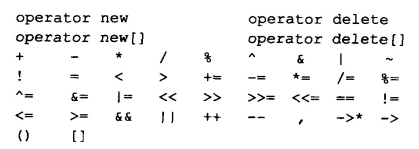
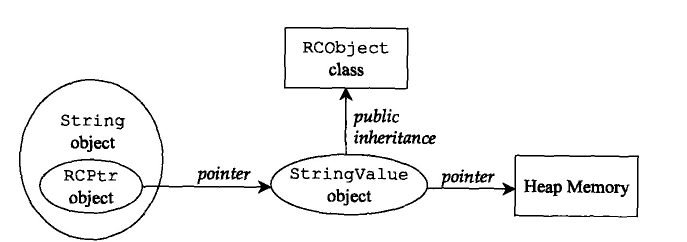
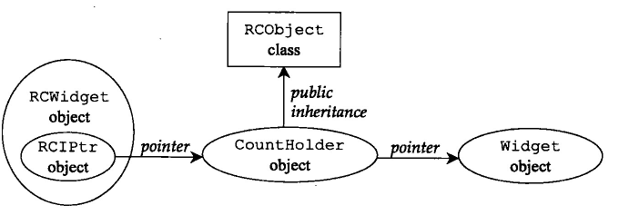
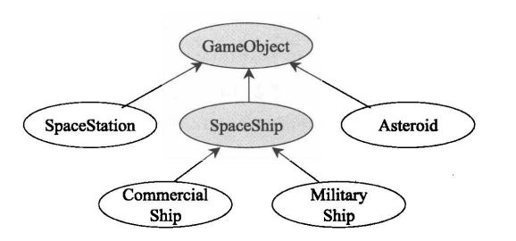
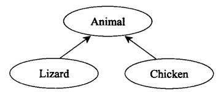
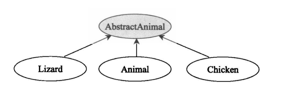

# 《More Effective C++》 notes

## 导读

## 基础议题

+ <font color = blue><u>**条款1：区别好指针和引用**</u></font>
  + 如果允许不指向任何对象，就应该用指针。反之，则可以用引用，而且用的时候还不用判空。因为引用必须初始化
  + 如果允许更改指向的对象，就应该用指针。因为引用没法修改指向对象的。
+ <font color = blue><u>**条款2：最好使用C++转型操作符**</u></font>
  + C++四种转型
    + const_cast\<T>()常量移除或者volalile移除
    + dynamic_cast\<T>()安全向下转型。只能用于上层Base指针或引用向下层转换的情况。但无法应用在缺乏虚函数的类型上。
    + reinterpret_cast\<T>()低级转型，但并不具备移植性，最好别用就是。
      + 常用用途是转换函数指针
    + static_cast\<T>()强制类型转换，除了const_cast的功能以外。

+ <font color = blue><u>**条款3：别用多态的方式处理数组**</u></font>

  + 实际就是说，Base[]的这种函数参数不能用多态来处理。

    ```c++
    class Base {};
    class Derived {};
    // 由于参数上被认为是指针，Derived数组确实能传进去
    void Func(Base array[])
    {
        // Example 1
        // array[i]实际是* (array + sizeof(element))，element却被统一认定为Base。
        cout << array[i];
        
        // Example 2
        // delete的时候，使得每个都调用Base::~Base();
        delete [] array;
    }
    ```

    

  + 指针能表示一个数组，多态能用于处理指针，但千万别试图用于数组

+ <font color = blue><u>**条款4：非必要不提供default constructor**</u></font>
  + 对于没有外来信息就无法完全进行初始化的，就别提供default constructor。可以无中生有的，则可以提供。
  + 没提供default constructor的影响
    + 没法在不提供参数的条件下随意new了。没法随意创建或者new一个数组。不过可以创建一个指针数组。
    + 不适用于许多template-based container classes。也就是容器模板，因为它们往往存在一个数组，而在实例化一个对应的模板，并创建这样一个容器的时候，就常常有data = new T[size]这样的操作。
    + 第三个则是有关虚继承的问题。如果虚基类没有default constructor，这意味着一个most Derived class在实例化的时候还要了解怎么去实例化Base，实在是难以推崇。
  + 提供无意义的default constructor的影响
    + 这使得其它member function执行前都存在类似判断class是否有意义的操作，使得代码量上升。

## 操作符

+ <font color = blue><u>**条款5：对定制的“类型转换函数”保持警觉**</u></font>

  + 哪些成员函数提供了类型转换的功能？

    + 单自变量constructors或者是除第一参数以外，其余参数都有默认值的constructors

      + 主要是将参数类型的东西转变成这个类类型

    + 隐式类型转换操作符

      + 主要是将类类型转变成对应的那个类型

      > operator double() const

  + 为什么最好不要提供任何类型转换函数？
    + 可能导致错误的或者非预期的函数被调用。
  + 替代方案：
    + 对隐式类型转换函数，我们就用另外的一个普通函数替代就行，这样就关闭了隐式转换的窗口。
    + 对单自变量的
      + 直接用在声明前面加上explicit
      + 而另一种做法，就是设置一个proxy class(代理类)，编译器不会进行两级转换，比如原来的temp class的constructor接收一个int参数，可以存在int到temp的隐式转换。现在把int封装到一个proxy class内，proxy作为参数，这时，编译器可以实现int到proxy的隐式转换和proxy到temp的隐式转换，但没法完成int->proxy->temp

+ <font color = blue><u>**条款6：区别++ / --的前置和后置的形式**</u></font>

  + ```c++
    class Temp {
    public:
        Temp& operator++();			//++temp
        const Temp operator++(int);	//temp++
    }
    ```

  + 前置的表达式结果是一个左值；后置的表达式结果是一个右值。

    + 于是++++i合法；而i++++则非法

  + 处理用户自定义类型时，尽可能用前置的++i

+ <font color = blue><u>**条款7：千万不要重载&&，||，还有，**</u></font>

  + 由于C++采用“骤死式”语义判断条件语句，一旦得到了值，后面的表达式就不再求值了，当然这里说的与元编程里的是不同的。

  + 一旦重载了&&，||，就会取代这一规则。

  + 逗号，正常人别重载就完事了

  + C++能重载的操作符如下

    

+ <font color = blue><u>**条款8：了解各种不同意义的new和delete**</u></font>

  + new operator、operator new、placement new

    + new operator就是平常用到的语言内置的操作符new。会在堆上分配内存

      + 主要完成两个工作：调用某个函数分配内存；调用constructor

    + operator new则是那个分配内存的函数，就像是malloc一样。

      + 我们可以对其进行重载。这样某个具体的类就能使用特定的内存分配方式了，在使用new operator产生该对象时，会自动调用自定义的operator new来分配内存。

      ```c++
      // 全局版本的
      void * operator new(size_t size);
      ```

    + placement new
    
      + 最经典的placement new主要是用于在指定位置上构造对象
    
      ```c++
      // 全局版本的placement new
      void * operator new(size_t, void *location)
      ```
    
  + delete operator、operator delete、placement delete
    + 和上面一一对应
  + 用于数组Arrays的new operator、operator new[]
    + 在创建数组的时候，new operator的内存分配不再由operator new完成，而是由operator new[]来完成大块内存的分配。分配完了再调用多次构造函数

## 异常

这一部分很多地方都是利用RAII的机制去避免异常导致资源泄露

+ <font color = blue><u>**条款9：利用destructors避免资源泄露**</u></font>
  
  + 和《Effective C++》提到的智能指针的思想，RAII机制一样，在函数涉及指针的操作时，往往伴随其它操作抛出异常，导致指针未被delete而使得资源泄露。这时，我们<font color = red>将行为封装成一个类</font>就可以在这个函数因为异常而跳出导致局部变量析构的时候完成delete操作。
  + 当然，还需要确保你的构造和析构函数提供一定的异常安全保证（参考《Effective C++》条款29）。
  
+ <font color = blue><u>**条款10：在constructors内阻止资源泄露**</u></font>
  + constructor执行存在抛出异常的可能，而抛出异常的时候，因为类没有完成构造，故并不会执行destructor。
  + 对于类的非指针成员，我们往往不必在意它，类被销毁的时候，它们会自行销毁或是析构，但是对于指针成员，销毁可没法阻止它指向的内存泄露。仅仅在析构函数里去delete这些指针，又因为constructor失败，故没法执行destructor而阻止失败。
  + 解决办法：
    + 在constructor函数内部可能异常的操作部分加上try-catch块，一旦catch到了异常，就在constructor内执行清除操作，同时传播异常。
    + 而在constructor的成员初始化列表可能出现异常的操作，则将操作移动到一个成员函数上，成员初始化列表调用该函数，在该函数内设置try-catch操作。
    + <font color = red>利用RAII机制，既然是普通成员没事，而指针可能导致泄露，那就把它封装成一个普通成员。</font>

+ <font color = blue><u>**条款11：禁止异常流出destructors**</u></font>
  + 为什么不应该让exception流出destructor？
    + 如果在已有exception在作用的条件下，又出现了exception，就会terminate。比如外来exception触发栈展开机制，导致对应类调用析构函数，如果析构又抛出exception，那就麻烦了。
    + 析构如果出现异常就会导致destructor执行不完全。
  + 在C++11内，默认你的构造和析构是noexcept的

+ <font color = blue><u>**条款12：了解“抛出exception”和“传递参数”、“调用虚函数”之间的差异**</u></font>

  + 相同点

    + 函数参数和exceptions的传递都有值、引用、指针三种。exceptions一般不用指针来传递，因为抛出异常的时候，常常是涉及到复制的，这就可能面临抛出局部对象的指针的问题。

  + 不同点

    + 调用函数，控制权最终会回到调用者；抛出异常，控制权不会再回去了。

    + 参数传递，不一定有复制。而函数抛出异常的时候，catch块在函数外，那么必然会涉及到exception的复制。

      当然，如果是catch块内继续传播抛出，就视写法而定了。

      ```c++
      catch(WidgetException& w) {
          ...
          throw;	//重新抛出异常，这不涉及复制
      }
      
      catch(WidgeException& w) {
          throw w; //重新抛出异常，涉及复制
      }
      ```

      抛出异常的时候，复制是基于静态类型来复制的。

    + catch语句可以用non-const引用来接收by value抛出的exception临时对象；而函数参数里non-const的引用形参无法接收临时对象
    + catch语句不涉及到隐式类型转换的问题，比如抛出一个int，那么catch一个double的，就不会捕捉它。但是有两种特殊情况：
      + 对于类继承的类型转换还是有效的。catch(Base)的可以catch到Derived的
      + 对于void *指针的，可以catch任意有类型指针的
    + catch子句总是按照catch的出现次序依次匹配，采用首次匹配机制，一旦匹配成功，后面的都不会再catch到它了。
      + 所以一般都是Base的放后面，Derived的放前面

+ <font color = blue><u>**条款13：以by reference方式捕捉exceptions**</u></font>
  + 为什么不用by pointer？
    + 前面条款12讲了，除非你保证指针指向的exception在之后依然存在，那就没事。
    + 第二个问题在于，指针可以是new出来的exception，也可以是全局定义的某个exception的地址，那么delete与否就很成问题。
  + 为什么不用by value？
    + 这使得exception被复制2次，一次是try块内抛出exception的时候，一次是catch by reference的时候，即使没触发构造函数，但是复制了2次。
    + 第二个问题在于，如果exception是某个继承来的类，我们catch块写的基类，那么就没法发挥多态的特性了。

+ <font color = blue><u>**条款14：明智运用exception specifications**</u></font>

  + 当然，C++已经不提倡用什么throw()到函数后面了。这主要是为了避免出现unexpected exceptions

  + 有如下一些方式预防unexpected exceptions
    + 别为template提供exception specifications，谁也不知道模板参数会抛什么异常
    + A调用了B，如果B没有exception specifications，那A也不应该设置
    + 处理系统可能抛出的exceptions，比如最常见的bad_alloc
  + 出现了unexpected exceptions要怎么解决？
    + 主要解决思路就是将非预期的exceptions转换成一个已知类型
      + 利用set_unexcepted(Func)来设置出现非预期的异常时调用的函数，而可以在Func里统一抛出自定义的某个异常。这样，我们如果将这个自定义的也放在expected exceptions内，那就没问题
      + 如果Func里写的throw；要直接抛出当前exception，就会被标准类型bad_exception代替。这时，expected exceptions内如果有bad_exception或者基类exception就没问题了

+ <font color = blue><u>**条款15：了解异常处理的成本**</u></font>
  + 异常处理成本
    + 大量的记录工作，记录try的入口、出口；catch子句及其能处理的exceptions；抛出exceptions时的复制和销毁等，代价很多
    + try语句块、exceptions specifications，导致代码膨胀，效率下降
  + 因此，异常处理，最好是别抛出异常，非用不可的时候再用

## 效率

+ <font color = blue><u>**条款16：80-20法则**</u></font>

  + 80%的资源用在20%的代码上。优化瓶颈是至关重要的。
  + 如何找出性能瓶颈？
    + 利用程序分析器来识别或观察瓶颈代码，或者叫经常性事件。
      + 提供测试用的数据样本很重要。一种做法是提供尽可能多的数据来分析。

+ <font color = blue><u>**条款17：考虑使用<font color  = red>lazy evaluation</font>缓式评估**</u></font>

  + 所谓lazy evaluation，就是让他们延缓运算，直到它们的结果被迫切需求为止。

    + 可以联想的是：
      + cache的写回和内存页的替换策略，只有被移除的时候，才写回到页和磁盘交换分区。
      + fork创建子进程时，采用写时复制策略
      + 一个大型网页在显示的时候，很多地方其实并没显示出来，只有往下划的时候，才会重新发送连接请求，获取数据

  + 用途

    + Reference Counting引用计数

      ```c++
      string s1 = "hello";
      string s2 = s1;
      
      // 常规的办法就是立刻为s2分配空间，然后复制s1的串内容到s2
      
      // 其实，只有当s1，s2发生修改的时候，才需要将s1的内容写到s2内去
      ```

    + 区分读写

      + 可惜很多时候没法区分。比如字符串operator []函数调用，它既可能准备进行一个读取操作，也可能打算取出来修改。
      + 可以使用条款30提到的proxy classes代理类来延缓决定。
        + p.s. 此前proxy classes被用于禁止由单参数构造函数导致的隐式类型转换

    + Lazy Fetching缓式取出

      + 对于一个很大的对象，我们没必要一次性就从数据库里加载出来，而是需要的时候再取

        ```c++
        class LargeObject {
        public:
            LargeObject(ObjectId id);
            const string& field1() const;
            int field2() const;
            ...
        private:
            ObjectId myId;
            mutable string *field1Value;
            //声明字段为可更改，这样在末尾带有const的函数内也能动它
            mutable int *field2Value;
            ...
        }
        
        LargeObject::LargeObject(Object id) : myId(id), field1Value(nullptr).....{};
        
        const string& LargeObject::field1() const
        {
            if (field1Value == nullptr) {
                // get data from somewhere
            }
            return *field1Value;
        }
        ```

    + Lazy Expression Evaluation表达式缓评估

      + 比如矩阵运算，我们没必要对一个暂且没用到的表达式求值，相反，把它暂时记录起来
        + 一个是没准以后会被修改，就不用计算它了。
        + 另一个是，只需要结果的某一行的值，那我就计算这个结果的某一行的值。

  + Lazy evaluation策略往往需要维护数值之间的依赖关系，通常可能是用到观察者模式。这可能造成另外的性能开支，但很多时候是值得的。

+ <font color = blue><u>**条款18：分期摊还预期的计算成本**</u></font>

  + 与条款17提到的laziness不同，一个新的改善性能的做法是：超前进度地去完成“要求以外”的工作，也即所谓“<font color = red>超急评估（over eager evaluation）</font>”

  + 实例：

    ```c++
    template<typename NumericalType>
    class DataCollection {
    public:
        NumericalType min() const;
    }
    ```

    在对min的实现上，有如下一些做法：

    + eager evaluation，在min被调用的时候才检查所有数据，时间复杂度为O(n)
    + lazy evaluation，返回特定数据结构，只有其返回值被派上用场的时候，才决定适当的值。
    + over-eager evaluation，比如我们在记录被修改的时候就去超前计算这样一些个结果，而min被调用的时候，只要访问这个结果即可。

  + <font color = red>over-eager evaluation的理念</font>

    + 程序如果经常会用到某个计算或者某个计算的结果，可以尝试降低每次计算的平均成本。更广泛意义上说，就是典型的空间换时间的体现。

  + over-eager evaluation的实现技巧

    + caching：把计算好但是之后可能再次被需要的数据缓存起来。
      + 像是已经打开但是一段时间内没去查看的网页。
      + 还有一些查找的函数实现，我们就可以在内部设置函数内的static map，用于做一个local cache局部缓存。
    + prefetching：主要是基于空间局部性原理，预先把附近的数据缓存起来。
      + 比如主存块一次换块就有4k的数据，但是访问基本上是取决于计算机的位宽，我们直接把那附近的其它数据也都放到了cache内。还有类似的指令cache等。
      + 最常说的vector的扩张，就是这样一个原理。每次扩大为原来的两倍，而不用每次insert都调用new，而new所调用到的operator new又常常可能调用到malloc系统调用，这样成本一下子就上去了

+ <font color = blue><u>**条款19：了解临时对象的来源**</u></font>

  + 临时对象是什么
    + 临时对象不是局部变量。
  + 产生原因：产生一个匿名的none-heap object时
    + 比如实参完成隐式类型转换以使得函数被成功调用的时候。当然这种情况要求形参是by value传递 / by const reference传递
    + 函数返回对象的时候
      + 这就涉及到一个叫做“返回值优化RVO”的策略
  + 我们应当尽可能地减少临时对象的产生，因为这常常涉及到许多的构造函数和析构函数的调用

+ <font color = blue><u>**条款20：协助完成“返回值优化”(RVO)**</u></font>

  + 必须以by value返回的情况，可能没法优化它的返回方式。但是我们可以去<font color = red>降低构造整个操作的成本</font>，比如，我们不是返回这样一个对象，而是返回构造这样一个对象的参数。这样，编译器就能减少一次返回的临时对象的构造和析构了，因为往往出来之后是将其赋值给某个同类型的东西，到时候再构造即可。

+ <font color = blue><u>**条款21：利用重载技术避免隐式类型转换**</u></font>

  + 实例

    ```c++
    class UPInt {
    public:
        UPInt();
        UPInt(int value);
        //这导致当涉及int参与下面的这个operator运算的时候，会将int转为UPInt对象。这时，这样一个临时对象的构造过程如何省去？其它类似的函数也是如此
    }
    // 将该函数作为一个non-member函数，利用public提供的接口来完成任务，而不是向其暴露整个UPInt的内部访问权限
    const UPInt operator+(const UPInt& lhs, const UPInt& rhs);
    
    // 解决办法：重载
    const UPInt& operator+(const UPInt& lhs, const int rhs); // 值传递足矣
    
    const UPInt& operator+(const int lhs, const UPInt& rhs); // 调用上面这个函数
    ```

+ <font color = blue><u>**条款22：考虑用操作符复合形式取代独生形式**</u></font>

  + 比如x = x + y用x += y代替

  + 原因：

    + 我们可以重定义+=，否则利用operator+就得多一次operator=的操作，还涉及到这个临时对象的构造和析构

    + 其实还能用+=来实现operator+

      ```c++
      const operator+(const T& lhs, const T& rhs) {
          // 这就使得C++编译器的返回值优化策略派上了用场，这个做法的前提是编译器确实利用T(lhs)创建临时对象，而不是强制类型转换
          return T(lhs) += rhs;
      }
      ```

+ <font color = blue><u>**条款23：考虑使用其它程序库**</u></font>
  + 需要在提供相同功能的不同程序库中抉择。
    + 不同的程序库将效率、扩充性、移植性、类型安全性的不同设计具体化，它们的权重可能各不相同。

+ <font color = blue><u>**条款24：了解virtual functions、multiple inheritance、virtual base classes、runtime type identification的成本**</u></font>
  + virtual functions的实现和成本
    + 由于编译器需要知道一个指针指向的对象的动态类型，于是使用了虚函数表vtbls和虚函数表指针vptrs
      + vtbl是什么？
        + 一个由函数指针构成的数组，有些编译器使用链表取代。每个声明虚函数的类都有自己的vtbl。
      + vtbl放在哪？
        + 一种做法是在每个需要vtbl的目标文件都生成一个vtbl副本，整合连接的时候再剥离重复的副本
        + 探勘式做法：把vtbl放在对应类的第一个提供“排第一个的非inline的非纯虚函数的普通virtual函数”定义的目标文件内。
          + 当然其实也提到过inline对虚函数没啥用处，因为inline是编译期行为，而决定调用哪个虚函数，则是运行期的问题
      + vptr是什么？
        + 是存在class内的一个隐藏的data member，指向该class的vtbl。一般是放在类实例的最前面，以实现多继承的一个最高性能。对于多继承，则是有几个基类有虚函数，那这个子类就准备多少个vptr成员，当然，子类新定义的虚函数则放在第一个vptr指向的vtbl内
      + 编译器如何产生代码找到运行的虚函数？
        + 根据vptr找到vtbl
        + 从vtbl找到对应的函数指针
        + 调用指针指向的virtual function
      + 成本开支
        + 除了上面涉及到的vtbl和vptr的存储开支。
        + 在调用上，和通过一个函数指针来调用函数的开支基本一样。
        + 上面提到了inlining的行为是一个编译期行为，使用virtual函数，实际就放弃了inlining
  + multiple inheritance、virtual base classes
    + 多继承常常涉及到虚基类，和虚函数类似，子类虚继承base的时候会有虚基类指针
    + 对于菱形继承，中间两个类，都是各有一个虚基类指针和一个虚函数表指针，而最Derived的多继承类，则是一个虚基类指针，两个虚函数表指针
  + RTTI的成本
    + RTTI主要信息存在type_info类对象内，利用typed操作符可以获取某个class对应的type_info对象信息。
    + 只有类型里至少有一个虚函数，我们才能用RTTI来检验它的动态类型，RTTI就是根据vtbl来实现的

## 技术

+ <font color = blue><u>**条款25：将constructor和non-member function的行为虚化**</u></font>

  + virtual constructor是什么？

    + 这里指的绝不是将构造函数定义为虚函数，而是说一个虚的创建函数，比如说工厂类的createObject函数，提供类的副本的一个clone函数等。它们通过调用各自非虚的函数接口，而利用虚的函数接口来呈现结果，以达到虚化constructor的目的。

      ```c++
      class NLComponent {
      public:
          virtual NLComponent * clone() const = 0;
      }
      
      class TextBlock : public NLComponent {
      public:
          // 返回类型协变
          virtual TextBlock * clone() const {
              return new TextBlock(*this);
          }
      }
      
      class NewsLetter {
      public:
          NewsLetter(const NewsLetter& rhs);
      private:
          list<NLComponent *> components;
      }
      
      NewsLetter::NewsLetter(const NewsLetter& rhs) {
          for (auto iter = components.begin(); iter != components.end(); ++iter) {
              components.push_back((*iter)->clone());
          }
      }
      ```

  + 将non-member functions的行为虚化

    + 显然，我们没放让一个non-member函数虚化。所以基本思想也是和上面的一样，non-member functions去调用virtual的member functions，使得行为虚化

+ <font color = blue><u>**条款26：限制class所能产生的对象数量**</u></font>

  + 允许0个或者1个对象
    + 单例模式，常常将constructor定义为private，而要获得这样一个对象，就只能调用static getInstance接口，获得函数内部定义的唯一的静态实例。
      + p.s. 当然，将函数定义为static，会有一些问题，因为C++对同一个编译单元内的static有保证初始化顺序，但是对于不同编译单元内的static的初始化顺序没有任何说明。这就产生一些依赖层级的问题。
      + 另一个问题是内部定义了static，这使得该函数放弃了inlining。
  + 不同的对象构造状态
    + 限制数量的另一种思路是在class内定义一个静态成员count，这种做法可以使得最大数量为1以外的值。
      + 新问题在于：
        + class它的实例可以为自己的实例、派生类的base部分、其它class的成员对象，class本身的数量限制就可能限制了其它class的数量。要解决也很简单，只要把constructor声明为private，以禁止派生和嵌套于其它对象

  + 允许对象生生灭灭

    + 前面提到的允许0或者1个对象的情况。但这没法解决一个问题：如果先创建了一个对象，用完，然后destroy，接着再创建一个对象。这也是只有0个或者1个，但是涉及到对象的销毁和重新产生，显然单例的思路是不行的。
    + 如何解决？
      + 还是利用上面的不同对象的构造状态里提到的做法，提供virtual constructor，virtual copy constructor

  + 一个用来计算对象个数的Base class

    + 就是设计一个Base class，封装涉及到的计数操作，让所有有这种需求的class继承它

      ```c++
      template <class TypeCounted>
      class Counter {
      public:
          class TooManyObjectsException {};
          static int objectCount() {return numberCounted;}
      protected:
          Counted();
          Counted(const Counted& rhs);
          ~Counted(){--numObjects;}
      private:
          // 这些由用户自己去定义
          static int numberCounted;
          static const size_t maxObjects;
          void init();	// 封装一些统一的操作
      }
      
      // 为什么用private，因为private可以避免多态所涉及的基类指针指向子类对象然后delete指针不小心删除Example的情况
      class Example : private Counter<Example>
      {
      public:
          using Counter<Example>::numberCounted;
      }
      ```

+ <font color = blue><u>**条款27：要求或者禁止对象产生于heap中**</u></font>

  + 如何规定对象只能产生于heap中？	

    + 一个做法就是将constructor / destructor定义为private类型，当然一般只要将destructor设置为private即可，然后提供一个接口用于调用destructor来销毁对象。
      + 如何解决涉及到的继承问题和组合问题？
        + 对于继承问题，那我们可以将destructor定义为protected而不是private来解决，但是这时候作为基类的对象就不是在heap中了
        + 对于组合问题，那就只能在组合的时候用指针而不是用对象实例了。

  + 如何判断一个对象是否在heap中？

    + 利用operator new或者operator new []进行tick设置，然后在constructor内检查tick的做法或许可行
      + 但是operator new []只有一次操作，但要涉及多个constructor的调用，没法让它一次性完成这么多class实例的tick的设置
    + 另一种则是利用stack内变量从高地址向低地址生长的特性
      + 一个是不具备可移植性
      + 另一个则是无法区别静态区数据和堆区数据的差异

    + <font color = red>总的来说，我们不好判断一个对象是否是在heap内，但是我们可以判断一个指针能否安全地delete，只要判断指针是不是new出来的即可，我们定义operator new操作是在已分配的一片内存中获取一个空间，operator delete则是进行回收操作，只要判断地址是不是在这块空间内就知道是该回收还是抛出exception了，这也可以直接知道是不是在heap内。</font>

      ```c++
      // 其它类只要继承它，就能获得这些接口了
      class HeapTracked {
      public:
          class MissingAddressException{};
          virtual ~HeapTracked() = 0;
          static void * operator new(size_t size);
          static void operator delete(void * ptr);
          bool isOnHeap() const;
      private:
          typedef const void * RawAddress;
          static list<RawAddress> address;
      }
      ```

  + 如何禁止对象产生于heap中？

    + 对象实例化的三种情况
      + 直接实例化
      + 作为一个base
      + 作为其它class的成员
    + 阻止直接实例化在heap
      + 定义operator new和operator delete为private，当然还有[]版本。
    + 阻止作为一个base的对象产生在heap中
      + 基类定义operator new和operator delete为private，且子类不重写这个函数

+ <font color = blue><u>**条款28：智能指针**</u></font>

  + 话题一：智能指针的一些基本函数

    + 构造和析构
    + 复制和赋值
    + 解引

    ```c++
    // shared_ptr的可能做法
    tempalte<class T>
    class Shared_ptr {
    private:
        size_t * count;
        T * realPtr;
    public:
        // 构造
        Shared_ptr(T* real = nullptr) : count(new size_t(1)), realPtr(real) {}
        Shared_ptr(const Shared_ptr& other) {
            count = other.count;
            realPtr = other.realPtr;
            ++(*count);
        }
        ~Shared_ptr() {
            --(*count);
            if (*count == 0) {
                delete realPtr;
            }
    	}
        
        // 赋值
        Shared_ptr& operator=(const Shared_ptr& rhs) {
            --(*count);
            if (*count == 0) {
                delete realPtr;
            }
            count = rhs.count;
            realPtr = rhs.realPtr;
            ++(*count);
        }
        
        // 解引
        T* operator->() const {
            return realPtr;
            // ptr->func();被编译器解释为(ptr.operator->())->func()
        }
        
        // 解引
        T& operator*() const {
            if (realPtr == nullptr) {
                ...
            }
            return *realPtr;
        }
    }
    ```

  + 话题二：智能指针如何判空？

    + 需要利用operator==的重载，或者是引入隐式类型转换函数operator void*()。但是都是有风险的

  + 话题三：如何把Smart Ptr转为普通指针(dumb pointer)？

    + 有时候涉及到版本问题，需要考虑这种操作。解决办法是加入operator T*()隐式类型转换，但常常有很多问题
      + 一个是会破坏引用计数
      + 一个是由于C++禁止连续的类型转换（条款5），这就使得原本要从dumb pointer完成一次转换才能调用的函数，变成要smart pointer - > dumb pointer -> parameter Type的行为无法实现。
      + 还有就是破坏了使用原则，正常的smart ptr不用自己delete，而如果可恶的客户用了delete去操作smart ptr，提供这种隐式转换的结果就是十分可怕的。
    + <font color = red>结论就是，别提供smart ptr->dumb ptr的接口</font>

  + 话题四：Smart Ptrs及与继承有关的类型转换

    + 如何让指向子类对象的smart ptr能够转换为基类对象的指针？
      + 这和《Effective C++》第45条相关。可以用模板复制构造函数来完成，当然这种做法更泛化，不过也需要引入__is_base_of大法。而且依然存在问题。

        ```c++
        class Base {...};
        class Derived1 : public Base {...};
        class Derived2 : public Derived11 {...};
        
        void Func(const SmartPtr<Base>& ptr);
        void Func(const SmartPtr<Derived1>& ptr);
        
        template<class T>
        SmartPtr{
            template<typename U, enable_if_t<is_base_of<U, T>>>* = nullptr>
            operator SmartPtr<U>();
        
        template<class T>
        SmartPtr{
            template<typename U, enable_if_t<!is_base_of<U, T>>>* = nullptr>
            operator SmartPtr<U>();
        }
        }
        ```

        

      + 为子类提供隐式转换操作符为基类智能指针的接口。而这种方式存在的问题是

        + 它只能完成直接基类的转换，如果打算转换成基类的基类，那就没法通过子类->基类->基类的基类的方式完成，而必须在子类中再准备一个隐式转换为基类的基类的接口。

        + 而一旦为子类提供了转换为基类的基类的接口，遇到这种情况，就很难办，因为传入子类参数时，不知道该用哪个接口

          ```c++
          void func(const SmartPtr<BaseBase>&);
          
          // 重载
          void func(const SmartPtr<Base>&);
          ```

    + 总而言之，结论是：SmartPtrs无法当成普通的指针来完成动态多态

  + 话题五：智能指针和const

    + 传统视角

      + 智能指针没法像dumb pointers一样将const放在不同位置来表示指针不变或者是指向的数据不变。只能这么做

        ```c++
        SmartPtr<const type> p;	// pointer to a const
        const SmartPtr<type> p; // a const pointer
        
        // 可惜没法这么做，除非提供了Smart<type>到Smart<const type>的转换
        SmartPtr<const type> = new type;
        ```

    + 另一个视角

      + 对于const type具有的行为，普通的type是必然能完成的，而type本身还具有const type之外的更多功能。

      + 利用继承的观点，我们将存储non-const ptr的SmartPtr派生自存储const ptr的SmartPtr。

        对于存储dumb pointer的部分，则在基类使用union来共享const和non-const dumb pointer

+ <font color = blue><u>**条款29：reference couting引用计数**</u></font>

  + 基本阐述

    + 作用：允许多个等值对象共享同一实值。也是构建GC的一个简单形式

  + 话题一：reference counting实现(参考上面的SmartPtrs)

    ```c++
    class String {
    public:
        String(const char *initValue = "");
        String(const String& rhs);
        String& operator=(const String& rhs);
        
        // 写时复制 [也是lazy evaluation思想]
        // 一定要注意，返回值不作为函数的签名，不是重载判断依据，而是否是const函数，则影响重载判断，故第一个必须要后面加const。
        // 调用函数的对象是const时，他会调用const后缀的函数
        // 前者是不需要复制的，后者则需要在内部做复制操作
      	const char& operator[](int index) const;
        char& operator[](int index);
        
        
    private:
        struct StringValue {
            size_t refCount;
            char *data;
            StringValue(const char *initValue);
            ~StringValue();
        }
        StringValue *value;
    }
    
    
    String::StringValue::StringValue(const char* initValue) : refCount(1) {
    	data = new char[strlen(initValue) + 1];
        strcpy(data, initValue);
    }
    
    String::StringValue::~StringValue() {
    	delete [] data;
    }
    
    String::String(cosnt String& rhs) : value(rhs.value) {
    	++value->refCount;
    }
    
    String::~String() {
    	if (--value->refCount == 0)
            delete value;
    }
    
    String& String::operator=(const String& rhs) {
        if (value == rhs.value) {
    		return *this;
        }
        if (--value->refCount == 0) {
    		delete value;
        }
        value = rhs.value;
        ++value->refCount;
        return *this;
    }
    
    const char& String::operator[](int index) const {
    	return value->data[index];
    }
    
    // 只能悲观地认为调用到了就是写操作，即使它可能用于读
    char& String::operator[](int index) {
        if (value->refCount > 1) {
            --value->refCount;
            value = new StringValue(value->data);
        }
        return value->data[index];
    }
    ```

  + 话题二：如何避免外在指针的影响？

    + client可以使用自己的指针来指向operator[]获取的结果的地址，会破坏引用计数的效果
    + 解决办法：
      + 视而不见
      + 提示别这么做
      + 设置flag来表示是否可共享，一旦发现non-const版的operator[]被调用了，就标记为不可共享。而在其他的函数内，每次都先判断是不是可共享，如果发现不可共享，说明需要重新new一个串来。这也仅限于client用自己的指针进行修改之前有效。

  + 话题三：Reference-count基类

    ```c++
    class RCObject {
    public:
        RCObject();
        RCObject(const RCObject& rhs);
        RCObject& operator=(const RCObject& rhs);
        virtual ~RCObject() = 0;
        void addReference();
        void removeReference();
        void markUnshareable();
        bool isShareable() const;
        bool isShared() const;
    private:
        int refCount;
        bool shareable;
    }
    
    // 初值为0，原因和后面的代码有关，后面统一调用init函数，将refCount++
    RCObject::RCObject() : refCount(0), shareable(true) {}
    
    // 初值为0
    RCObject::RCObject(const RCObject&) : refCount(0), shareable(true) {}
    
    // 管理引用计数的类的赋值并不影响外围的String类对data的引用次数
    RCObject& RCObject::operator=(const RCObject&) {
        return *this;
    }
    
    RCObject::~RCObject() {}
    
    void RCObject::addReference() {++refCount;}
    
    // delete this，会因为多态而调用到正确的外围类的析构函数
    void RCObject::removeReference() {
    	if (--refCount) {
            delete this;
        }
    }
    
    bool RCObject::isShareable() const {
    	return shareable;
    }
    
    bool RCObject::isShared() const {
        return refCount > 1;
    }
    ```

    ```c++
    struct StringValue : public RCObject {
        char *data;
        StringValue(const char *initValue);
        ~StringValue();
    }
    
    StringValue::StringValue(const char *initValue) {
        data = new char[strlen(initValue) + 1];
        strcpy(data, initValue);
        // 这里没写addReference，看后面
    }
    ```

  + 话题四：如何让addReference和removeReference自动化？

    + 主要是引入智能指针，封装StringValue。在话题1中，我们看到，当String调用copy constructor时，会调用到StringValue的copy constructor，这时会修改refCount；当String析构时，会判断并修改refCount；当String调用operator=时，会调用到StringValue的赋值运算。于是在智能指针中，就要在对应的被调用的接口上进行重载。

      当然，既然把String对应的copy constructor、destructor、operator=的工作都转移了，String本身就可以省略掉这些接口了

    ```c++
    class RCObject;
    
    template<class T>
    class RCPtr {
    public:
        RCPtr(T* realPtr = nullptr);
        RCPtr(const RCPtr& rhs);
        ~RCPtr();
        RCPtr& operator=(const RCPtr& rhs);
        
        T* operator->() const;
        T& operator*() const;
        
        void makecopy();
    private:
        T *pointee;
        void init();
    }
    
    template<class T>
    RCPtr<T>::RCPtr(T* realPtr) : pointee(realPtr) {
    	init();			// 这就是为什么上面的RCObject的refCount初始化为0，因为利用封装好的智能指针来实现自动化增减refCount的时候，一旦调用了对应函数，就会创建一个pointee，完事后再addReference，就正好是1了。
    }
    
    // String被构造的时候，会调用到它
    template<class T>
    RCPtr<T>::RCPtr(const RCPtr& rhs) : pointee(rhs.pointee) {
        init();
    }
    
    template<class T>
    void RCPtr<T>::init() {
        if (pointee == nullptr) {
    		return;
        }
        if (pointee->isShareable() == false) {
            pointee = new T(*pointee);
            // 这里会调用到StringValue的copy constructor，按话题一的做法，应当设计为深度copy，同时，为了避免pointee指向派生类的影响，最好将copy constructor设计为virtual类型
        }
        pointee->addReference();
    }
    
    // String自己调用赋值操作的时候，就会调用到它
    template<class T>
    RCPtr<T>& RCPtr<T>::operator=(const RCPtr& rhs)
    {
        if (pointee != rhs.pointee) {
            if (pointee) {
                pointee->removeReference();
            }
            pointee = rhs.pointee;
            init();
        }
        return *this;
    }
    
    template<class T>
    RCPtr<T>::~RCPtr() {
    	if (pointee)
            pointee->removeReference();
    }
    
    template<class T>
    T* RCPtr<T>::operator->() const {
        return pointee;
    }
    
    template<class T>
    T& RCPtr<T>::operator*() const {
        return *pointee;
    }
    ```

  + 话题五：最终层次

    

    + 从话题1到话题4的实现过程，String的接口不变，而仅仅改变了低层实现。有很多亮点
      + 充分利用封装和函数重载，将工作从String类中解放出来，分布到更小的模块内
      + 利用继承，将可工具化的类独立出来
      + 利用smart pointers代替dumb pointers，一个是起到了封装的作用，重新实现了初版对dumb pointers操作所涉及的函数接口；同时利用了RAII机制

  + 话题6：将Reference counting施加到任何类型上

    + 前面的例子是将Reference counting施加到char *上。以加到Widge上为例

      

      

  + 总结

    + Reference counting的适用前提
      + 对象常常共享实值
      + 相对多数的对象共享相对少量的实值
      + 对象实值的产生 or 销毁的成本很高 / 对象实值适用的内存很多

+ <font color = blue><u>**条款30：Proxy classes（替身类、代理类）**</u></font>

  + 引入部分

    问题一：如何让设计的二维数组类Array能够以array[i]\[j]的形式访问数组元素？

    + 显然不能重载[]\[]，但是却可以内置存放一维数组的Array1D,让Array和一维数组Array1D都重载[]，Array返回Array1D对象，Array1D则完成一维数组的访问，就是一个嵌套。

  + 概念部分

    + proxy objects & proxy classes：
      + 上面的Array1D就是这样的proxy class

  + 话题一：区分operator[]的读写操作

    + 与条款5里提到的proxy用于阻止类型转换不同，这里的功能是用于协助区分operator[]的读写操作。

    + 通常的，我们认为读操作不修改数据，而写操作修改数据。

    + 如何区分string的operator[]的读写操作？

      + 基本矛盾：
        + string的operator []无法通过在后面加const限定来区分是用来读的还是用来写的。仅仅是const string调用const函数而已。无法完成读写函数的区分。

        + 一个类可以通过定义operator char()来将该类型转换为char类型。可以通过定义constructor来让其它类型转换为该类型。作为左值时，调用operator=来表明应转换为左值。而作为右值时，不会调用到operator=，相反，可能调用operator char()等隐式类型转换函数，完成读写操作的区分。更进一步，如果写为operator char() const，那只有const CharProxy能调用，追加了右值的不可修改。

        + 本质就是基本类型与函数没有区分手段，而一个完整的类则有手段区分

      + 解决办法：
        + 使用代理类，string的operator []返回char代理类对象CharProxy，而不再返回一个char。将区分读写的工作交由CharProxy类，而不是operator[]
        ```c++
        //以String里的[]实现为例
          class String {
          public:
              class CharProxy {
                  public:
                    CharProxy(String& str, int index);
                  // 当作为左值使用的时候，会使用operator=函数
                  CharProxy& operator=(const CharProxy& rhs);
                  // 当作为右值被使用的时候，会调用operator char()完成类型转换。
                  operator char() const;
                  private:
                    String& theString;
                    int charIndex;
              }
              // 对于const string，它的返回类型为const CharProxy，也就限制了CharProxy只能使用operator char() const这样的const函数。
              const CharProxy operator[](int index);
              CharProxy operator[](int index);
              friend class CharProxy;
          private:
              RCPtr<StringValue> value;
          }
        
        cosnt String::CharProxy String::operator[](int index) const {
            return CharProxy(const_cast<String&>(*this), index);
        }
        
        String::CharProxy String::operator[](int index) {
            return CharProxy(*this, index);
        }
        
        String::CharProxy::operator char() const {
        	return theString.value->data[charIndex];
        }
        
        String::CharProxy& String::CharProxy::operator=(char c) {
        	if (theString.value->isShared()) {
        		theString.value = new StringValue(theString.value->data);
            }
        }
        ```

    + 缺陷 / 限制（归根结底在于Proxy和其代理的类型是有差距的）

      + 并不是仅在遇到赋值操作的时候，才需要用左值。
        + 比如作为引用传递的函数参数的时候。可惜Proxy只提供了转换为临时右值对象的办法。
        + 取地址的时候。这个倒是可以定义operator&()和其const版本来解决问题。

      + 如果用于数组，那还得重载++、+=等操作符

      + 如果Proxy代理的也是一个类，还得采取某种做法让它能适配代理的类的方法，保证能正常使用。

        ```c++
        int a = array[19].denominator();
        // 其中array是一个Array<Rational>的对象，denominator是一个Rational的函数。必须也要让Proxy类提供类似的接口，承接Rational的功能。
        ```

      + 编译器仅支持一步转换，也就是条款5提到的，当调用的函数的参数是一个本可由被代理的类型一步转换完成的时候，使用代理类就需要两步，进而导致无法调用。嘛，当然，依据条款5，我们对于一步转换才能调用的函数，也基本会保持警觉。

  + 总结

    + Proxy classes有很多的应用
      + 多维数组
      + 左值 / 右值的区分
      + 压制隐式转换（参考条例5）
    + Proxy classes也有许多缺点
      + 扮演代理对象的时候，返回临时值，这需要复制析构开销。
      + 为了完全充当代理对象，需要设计不少接口，提高了复杂度

+ <font color = blue><u>**条款31：让函数根据一个以上的对象类型来决定如何虚化**</u></font>

  + 有时候不得不出现这种情况：一个虚函数的功能取决于若干个类的具体类，而不是基类。

  + 基本概念

    + message dispatch消息分派：指虚函数调用过程
    + double dispatch：就是调用函数的时候根据两个参数而虚化
    + multiple dipatch：根据多个参数而虚化

    ```c++
    // GameObejct都是基类，但Collide的功能取决other的运行时类型
    void Collide(GameObject& other);
    ```

  + 办法一：virtual function + RTTI

    + 利用typeid关键字，可以获得一个类型或者类型实例的type_info信息，type_info类型的信息可以进行比较，两个相等说明其实际类型相同
    + 问题：实际操作起来，就是写很多的if-else语句。缺点显而易见，难以维护，而且修改困难。

  + 办法二：只使用虚函数

    + 实际操作就是重载出接受对应子类型的虚函数接口。

      ```c++
      void GameObject::collide(GameObject& other);
      
      void GameObject::collide(Derived& other);
      void GameObject::collide(Derived2& other);
      
      // 以子类Derived为例，调用积累参数版本的时候，会改而调用other.collide，同时传入*this，由于*this为运行时对象，就直接调用到Derived2::collide(Derived&);版本
      void Derived::collide(GameObject& other) {
      	other.collide(*this);
      }
      
      void Derived::collide(Derived2& other);
      ```

    + 问题：

      + 基类重载接口，要求必须知道具体子类，一旦要新增一个子类，势必导致所有子类都要添加这个重载接口的实现。

  + 办法三：自行仿真虚函数表格

    + 如何完成这个仿真？虚函数实际就是通过对象的动态类型来调用虚函数表内的对应函数。最重要的就是维护动态类型到对应函数的映射

      ```c++
      class GameObject {
      public:
          // 这里就别重载了，而是使用member函数，写多个一样的名字不同的接口。用作后面的映射
          virtual void collide(GameObject& other) = 0;
      };
      
      class SpaceShip : public GameObject {
      public:
          virtual void collide(GameObject& other);
          virtual void collideSpaceShip(SpaceShip& other);
          virtual void collideSpaceStation(SpaceStation& other);
      private:
          typedef void (SpaceShip::*HitFunctionPtr)(GameObject&);
          static HitFunctionPtr lookup(const GameObject& hitObject) {
              static HitMap collisionMap = initializeCollisionMap();
              auto& mapEntry = collisionMap.find(typeid(hitObject).name();
              if (mapEntry == collisionMap.end()) 		{
                  return nullptr;
              }
              return (*collisionMap).second;
          }
          typdef map<string, HitFunctionPtr> HitMap;
          static HitMap initializeCollisionMap();
      }
      ```

    + 在调用initializeCollisionMap函数进行HitMap的初始化时，可能会有复制的成本（实际测试的时候在gnu8.1.0下会有优化，对于返回一个对象的时候，为了提高效率，对于利用临时对象进行构造的时候，不会调用copy constructor，而是采用某种机制直接搬过来，而且也不是移动构造函数。仅当用于构造的对象不是临时对象的时候才会用）

      + 为了规避复制的成本，可以通过返回指针的方式来完成，当然是智能指针

  + 话题三：使用non-member的collide函数

    + 上面的办法2让我们在基类重新定义了多个参数相同但名称不同的函数。结果就是当新增一个子类时，要在基类增加定义，还要在子类增加实现，实现甚至是重复的代码。
    + 解决办法
      + 将这些函数搬到外面来，同时将map的映射从一个string作为键变为一个pair<string, string>作为键。lookup的接口则改为接收两个const string&。
      + 这样，新增一个子类时，就只用增加统一的non-member函数就行，而不用到各个子类里面各自追加

  + 话题四：继承+自行仿真的虚函数表格

    + 上面的话题三、话题二对于下面这种情况的处理不理想

      

      + 要让Commercial和Military的ship的碰撞和SpaceShip保持一致，还得在map内维护多余的映射

  + 话题5：将自行仿真的虚函数表格初始化

    + 原因：原用于存放映射的map不具有动态性。为了能对它做增删改操作。需要进行另外的设计。

    + 做法是将这个映射的map放入一个类中，利用类提供修改map的接口和查询的接口。为了让其具有全局唯一性，可以设计为一个单例。

      ```c++
      class CollisionMap {
      public:
          typedef void (*HitFunctionPtr)(GameObject&, GameObject&);
          void addEntry(const string& type1, const string& type2, HitFunctionPtr collisionFunction, bool symmetric = true);
          void removeEntry(const string& type1, const string& type2);
          static CollisionMap& theCollisionMap();
      private:
          CollisionMap();
          CollisionMap(const CollisionMap&)
      }
      ```


## 杂项讨论

+ <font color = blue><u>**条款32：在未来时态下发展程序**</u></font>

  + 主要是要注意到程序的拓展性和未来的可变性
  + 需要考虑如下一些要点
    + 提供完整的classes。即使某些部分目前用不到
    + 设计好接口，让其有利于共同的操作行为，阻止共同的错误。对于copy或assignment不合理的行为，应当定义为private或者delete来禁止
    + 尽量使得代码更加一般化

+ <font color = blue><u>**条款33：将非尾端类设计为抽象类**</u></font>

  + 就是在继承树的里头不是叶子结点的类，都设计为抽象类

  + 问题：

    + 遇到这样一种组织关系，并要求设计oeprator=的机制，能够让基类指针指向的子类对象的赋值正确进行。保证Lizard可以赋值给Lizard，Animal可以赋值为Animal，而Lizard和Chicken不能相互赋值

      

      ```c++
      // 这样，对于*a = *b的时候，就会调用a的运行时类型的虚函数。
      class Animal {
      public:
          virtual Animal& operator=(const Animal& rhs);
      };
      
      class Lizard : public Animal{
      public:
          virtual Lizard& operator=(const Animal& rhs);
      };
      
      class Chicken : public Animal{
      public:
          virtual Chicken& operator=(const Animal& rhs);
      };
      ```

    + 存在的问题是：基类指针可能指向不同的子类对象，故赋值操作还要判断b的实际类型，需要用dynamic_cast看能否向下转型，这需要提供相应支持。或者是利用typeid来获得type_info，比较是不是相同的类型。

    + 优化办法1：

      ```c++
      class Lizard : public Animal{
      public:
          // 它要么类型相同，完成赋值操作，要么无法向下转型，抛出bad_cast exception
          virtual Lizard& operator=(const Animal& rhs) {
              return operator=(dynamic_cast<const Lizard&>(rhs));
          }
          Lizard& operator=(const Lazard& rhs);
      };
      ```

    + 它依然需要dynamic_cast支持

    + 优化办法2：

      ```c++
      // 不使用虚函数机制，而是禁止基类的赋值操作
      class Animal {
      protected:
          Animal& operator=(const Animal& rhs);
      };
      
      class Lizard : public Animal{
      public:
          Lizard& operator=(const Animal& rhs);
      };
      
      class Chicken : public Animal{
      public:
          Chicken& operator=(const Animal& rhs);
      };
      ```

    + 它造成了基类本身的赋值被禁止

    + 优化办法3

      

      + 直接将它定义为抽象类，不允许生成实例，而将允许赋值的就统一作为子类完成。
      + 抽象一般可以将destructor定义为pure virutal function，并给出其定义，毕竟抽象基类还是需要析构的。
      + 实际而言，抽象类有无必要提前进行设置？其实可以采用lazy evaluation的做法，只有确切觉得需要继承自一个具体类的时候，再去导入即可。

  + 话题一：当打算继承一个程序库里的具体类以扩充它功能，但是却无法修改程序库以像上面提到的那样安插一个新的抽象类时，怎么做？

    + 做法1：直接继承这个类
    + 做法2：采用组合的思想，利用想继承的那个类作为数据成员，提供调用它的功能的接口

+ <font color = blue><u>**条款34：如何在同一个程序中结合C++和C**</u></font>

  + 主要涉及4个方面

    + 名称重整
    + statics初始化
    + 动态内存分配
    + 数据结构的兼容

  + 话题一：名称重整

    + 由于C++有函数重载，为了区分不同的函数接口，C++调用自己定义的函数时，编译器可能会将其重新命名，名曰名称重整。
    + 可是，在C语言中，不存在函数重载，不进行名称重整。

    + 利用下面的做法，可以禁止重整，防止C++调用C函数的时候使用重整的名称。表示函数是以C语言的方式来调用，压制名称重整，使用直观的func名称。

      ```c++
      extern "C"
      void func(int x);
      
      // 也可以一次性声明多个都不重整
      extern "C" {
          void func1();
          void func2();
      }
      ```

    + 当然，为了让上面的extern "C"仅对C++使用下生效，可以加上预处理命令

      ```c++
      #ifdef __cplusplus
      extern "C" {
      #endif
          ...
      #ifdef __cplusplus
      }
      #endif
      ```

  + 话题2：statics的初始化

    + 对于static class对象、全局对象、namespace内的对象以及文件范围内的对象，它总是在main执行前就调用了他们的constructors。其destructors总是在main结束之后调用

    + 如何完成这个工作的？

      + 编译器会提供一个特殊的函数或者是inline函数，在main一开始的地方，完成static initialization。在最尾端则完成static destruction。

    + 这意味着如果没有main，那这种对象不会被构造也不会被析构

    + 启示：

      + 当要写main的时候，最好是在C++里面去写main，而对于实际是在C文件里执行main操作的，就这么写

        ```c++
        extern "C" int realMain(int argc, char* argv[]);
        
        int main(int argc, char* argv[]) {
            return realMain(argc, argv);
        }
        ```

  + 话题3：动态内存分配

    + C里面用malloc、free。C++用new、delete。
    + 对于使用的返回指针的库函数，如果它来自C的库，那应该用free释放，C++就用delete释放。

  + 话题4：数据结构的兼容性

    + C++和C之间的对话仅限于C能接受的范围。
    + 什么是具有可移植性的做法？
      + struct指针、non-member函数指针、static函数指针、内建变量的指针等
      + C++的带有non-vritual member functions的struct。只要和C的内存布局一致，就可以兼容。

+ <font color = blue><u>**条款35：让自己习惯于std C++语言**</u></font>

  + C++一些重要的点

    + 语言特性
      + RTTI
      + mutable
      + explicit
      + 为class内的const static classs members进行初值指定
    + C++ templates
    + exception handling
    + 内存分配
      + new / delete
      + 定位new / delete
      + operator new / operator delete
    + 增加新的转型形式

  + C++ STL

    + 主要包括六大部件

      + containers
      + iterators
      + algorithms
      + allocators
      + Functors
      + Adaptors

    + 从find函数看STL泛化设计

      ```c++
      int* find(int *begin, int* end, int value) {
          while(begin != end && *begin != value)
          	++begin;
          return beign;
      }
      
      // 一层泛化
      template<class T>
      T* find(T* begin, T* end, const T& value) {
          while(begin != end && *begin != value)
          	++begin;
          return beign;
      }
      
      // 二层泛化
      // 既然!=，*，++等都可以通过运算符重载进行定义，为什么不把pointer封装一下，改成一个class呢？何必局限于指针，应该让支持如上操作的都可以适合这个接口
      
      template<class Iterator, class T>
      Iterator find(Iterator begin, Iterator end, const T& value) {
          while (begin != end && *begin != value) ++begin;
          	return begin;
      }
      
      // 要使得iterators能得到begin，end支持，就需要containers来配合提供相应的end()，begin()接口。
      // 要使得iterators能支持++操作，就要求iterator对operator++有完好的定义
      // 更进一步地，在container内定义特定的container<T>::iterator这样的typedef，同时定义const_iterator
      ```

      