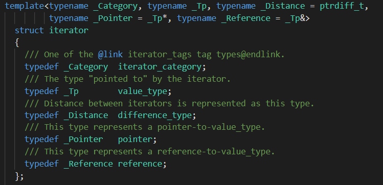
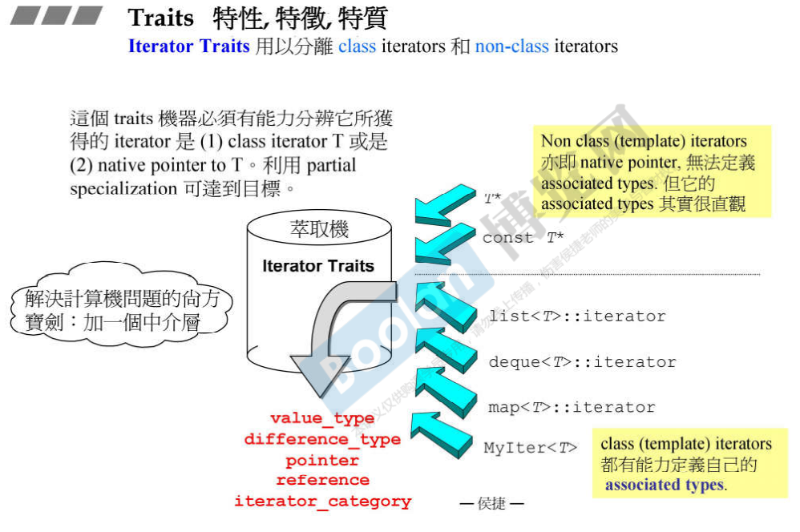

# C++STL && 泛型编程

##  1. 认识头文件、版本、资源

+ string
+ vector
+ functional
+ algorithm

##  2. STL体系结构基础介绍

### 2.1 六大部件

+ **容器Containers**：是各种数据结构，从实现角度看，是一种class template
+ 分配器Allocators：负责空间配置与管理，从实现角度看，它实现了动态空间配置、空间管理、空间释放的class template
+ **算法Algorithms**：包含各种常用算法。是一种function template
+ 迭代器Iterators：主要用于算法对容器的访问，是所谓的泛型指针。从实现角度来看，是一种将 operator*、operator->、operator++、operator- - 等指针相关操作进行重载的class template。所有STL容器都有自己专属的迭代器，只有容器本身才知道如何遍历自己的元素。原生指针(native pointer)也是一种迭代器。
+ 适配器Adapters：用来修饰容器、仿函数、迭代器接口的东西。例如像是queue和stack，实际算是一种容器适配器，因为低层是借助deque的。改变仿函数的叫函数适配器，改变容器的叫容器适配器，改变迭代器的交迭代器适配器。
+ 仿函数Functors：行为类似函数，但是是一个class，它重载了operator()，一般的函数指针也视作仿函数。


+ 这些都是相对独立的
+ 容器用来存放数据，分配器用来将数据存入容器。算法则通过迭代器作为桥梁对容器的数据进行操作。迭代器相当于一个泛化的指针。*<u>迭代器是前闭后开的，end()指向最后一个元素的后一个位置，cend()则是第一个的前一个</u>*
+ 仿函数，作用像个函数
+ 适配器，常常用于转换。图中有三种，容器的，迭代器的，仿函数的


+ 上述代码实现了对容器内元素判断是否大于40。bind2nd将函数第二个参数绑定为40，进行了适配
+ 代码很好的体现了STL各个部分的分工和联系

### 2.2 迭代器和C++11的基于范围的for循环

+ 对于需要对容器内所有元素进行操作时，可以使用基于范围的for循环代替普通的迭代器循环，当然也可以for_each
+ 迭代器可以善用auto的自动类型推断

## 3. 容器之分类与各种测试

### 3.1 容器分类

+ Sequence Containers序列式容器/顺序式容器

  + array：C++11新增。相当于一个定长数组
  + vector：可以认为是自动扩充的数组
  + deque：双向队列
  + list：双向循环链表。
  + forward_list:C++11新增。是单向链表

+ Associative Containers关联式容器

  ​	有key，value。适合快速地进行查找

  + set、multi_set:使用红黑树。key和value是不分的
  + map,multi_map:使用红黑树，是一种高度平衡的二叉树。key和value分开
  + multi表示可重复，有了multi的map，就无法使用[]访问了

+ Unordered Containers无序性容器，也是一种关联式容器

     是C++11的新内容

     一般是使用了哈希表HashTable，而哈希表一般使用的冲突解决办法是用**链地址法**，这也是公认的最好的。

  【哈希冲突解决办法：1.开放地址法(线性探测再散列、二次探测再散列、伪随机探测再散列)2.链地址法3.再哈希法4.建立公共溢出区】
  
  + unordered_set/unordered_multiset
  + unordered_map/unordered_multimap


### 3.2 array

+ 定长数组

```c++
#include<array>
#include<iostream>
#include<iterator>
#include<stdlib>
int compareLong(const void* a, const void* b)
{
    if (*(int *)a == *(int *)b)
        return 0;
    if (*(int *)a > *(int *)b)
        return 1;
    return -1;
}
array<long, 5> longArray;
int target = 1;
qsort(longArray.data(), 5, sizeof(long), compareLong);//进行排序
int *pos = (int *)bsearch(&target, longArray.data(), 5, sizeof(int), compareLong);//进行二分查找
copy(array.begin(), array.end(),ostream_iterator<int,char>(cout, " "));//放入输出流
```

+ 常用成员函数
  + begin(),end()
+ 常用algorithm
  + qsort
  + find
  + bsearch

### 3.3 vector

+ 前闭后开数组
+ <u>多用namespace让程序具有条理</u>
+ **一般能向后加东西的都能push_back，emplace_back**
+ vector在push_back一个新元素时，如果空间不足，就会分配成原来两倍大小的空间。而在分配时，实际就是把元素进行重新构造的过程，如果vector的元素是对象，它会判断是否能安全使用移动构造函数，如果移动构造函数标记为noexcept，不抛出异常，那么会调用移动构造函数，而不是复制构造函数。
+  emplace的三个函数是C++11新增的给vector，list，deque三个顺序容器的新函数，与insert的不同点在于insert传入要插入的对象，而emplace传入的是容器容纳的对象进行构造所需要的参数，emplace还会返回插入成功时该元素的迭代器

```c++
1.构造
vector<int> a(3); // a ={ , , };
vector<int> a(3, 1);//a={1,1,1};
vector<int> b(a);//b = {1,1,1};
vector<int> c(b.begin(),b.begin()+1);
				//c = {1};
int nums[5] = {1,2,3,4,5};
vector<int> d(nums, nums + 5);
				//d={1,2,3,4,5}

2.常用成员函数
（1）a.assign(b.begin(), b.begin()+3); //b为向量，将b的0~2个元素构成的向量赋给a
（2）a.assign(4,2); //是a只含4个元素，且每个元素为2
（3）a.back(); //返回a的最后一个元素
（4）a.front(); //返回a的第一个元素
（5）a[i]; //返回a的第i个元素，当且仅当a[i]存在
（6）a.clear(); //清空a中的元素
（7）a.empty(); //判断a是否为空，空则返回ture,不空则返回false
（8）a.pop_back(); //删除a向量的最后一个元素
（9）a.erase(a.begin()+1,a.begin()+3); //删除a中第1个（从第0个算起）到第2个元素，也就是说删除的元素从a.begin()+1算起（包括它）一直到a.begin()+3（不包括它）
（10）a.push_back(5); //在a的最后一个向量后插入一个元素，其值为5
（11）a.insert(a.begin()+1,5); //在a的第1个元素（从第0个算起）的位置插入数值5，如a为1,2,3,4，插入元素后为1,5,2,3,4
（12）a.insert(a.begin()+1,3,5); //在a的第1个元素（从第0个算起）的位置插入3个数，其值都为5
（13）a.insert(a.begin()+1,b+3,b+6); //b为数组，在a的第1个元素（从第0个算起）的位置插入b的第3个元素到第5个元素（不包括b+6），如b为1,2,3,4,5,9,8         ，插入元素后为1,4,5,9,2,3,4,5,9,8
（14）a.size(); //返回a中元素的个数；
（15）a.capacity(); //返回a在内存中总共可以容纳的元素个数
（16）a.resize(10); //将a的现有元素个数调至10个，多则删，少则补，其值随机
（17）a.resize(10,2); //将a的现有元素个数调至10个，多则删，少则补，补的其值为2
（18）a.reserve(100); //将a的容量（capacity）扩充至100，也就是说现在测试a.capacity();的时候返回值是100.这种操作只有在需要给a添加大量数据的时候才         显得有意义，因为这将避免内存多次容量扩充操作（当a的容量不足时电脑会自动扩容，当然这必然降低性能） 
（19）a.swap(b); //b为向量，将a中的元素和b中的元素进行整体性交换
（20）a==b; //b为向量，向量的比较操作还有!=,>=,<=,>,<
 (21) emplace(a.begin() + 1, 3);//在第二个地方插入3;
 (22) emplace_back(int)//注意没有emplace_front
 (23) a.at(0)//返回索引为0处的值
3.常用algorithm
（1）sort(a.begin(),a.end()); //对a中的从a.begin()（包括它）到a.end()（不包括它）的元素进行从小到大排列
（2）reverse(a.begin(),a.end()); //对a中的从a.begin()（包括它）到a.end()（不包括它）的元素倒置，但不排列，如a中元素为1,3,2,4,倒置后为4,2,3,1
（3）copy(a.begin(),a.end(),b.begin()+1); //把a中的从a.begin()（包括它）到a.end()（不包括它）的元素复制到b中，从b.begin()+1的位置（包括它）开始复制，覆盖掉原有元素
（4）find(a.begin(),a.end(),10); //在a中的从a.begin()（包括它）到a.end()（不包括它）的元素中查找10，若存在返回其在向量中的位置
```


### 3.4 list

+ 双向链表
+ 自己也有sort，且更快
+ 同时自己也有find

```c++
1.构造
list() 声明一个空列表；
list(n) 声明一个有n个元素的列表，每个元素都是由其默认构造函数T()构造出来的
list(n,val) 声明一个由n个元素的列表，每个元素都是由其复制构造函数T(val)得来的
list(n,val) 声明一个和上面一样的列表
list(first,last) 声明一个列表，其元素的初始值来源于由区间所指定的序列中的元素

//和vector没差

//没注释的就和vector一样的
2.常用成员函数
(1) push_back(),push_front()
(2) empty()
(3) resize(),resize(int size, T value)
(4) clear()
(5) pop_back(),pop_front()
(6) assign()
(7) swap()
(8) reverse()
(9) merge(list<int>, less<int>())//合并两个链表，若两个本来就是升序，则会将其排列为升序。否则没效果
(10) insert()
(11) erase()
(12) emplace(),emplace_back(),emplace_front()
(13) at()
3. 常用algorithm
1. qsort()
2. find()
3. reverse()
4. sort()
```

### 3.5 forward_list

+ 单向链表，是首插法的链表，所以有push_front，无push_back
+ 常用的函数和list基本一致

### 3.6 deque

+ 双向队列
+ 其结构是<font color = #dd00a0>分段连续</font>的。它的每个元素都指向一个buffer，iterator就在这些buffer里面的元素进行移动，给用户一种全部连续的感觉，实际上不同的buffer的头和尾可能是不相连的。扩充时也是以一个buffer为单位进行扩充的。


+ 自己没有find，sort
+ 常用基本函数


### 3.7 stack

+ 栈
+ 实际是默认用deque实现的，也因此被称为容器的adapter
+ 不提供iterator

```c++
1. 构造
    stack<int> a;
	stack<int> b(a);
	stack<int, list<int>> nums;
2. 常用成员函数
    top();	//返回栈顶元素
	push();
	pop();
    empty();
    size();
    swap();
```


### 3.8 queue

+ 队列
+ 实际是默认用deque实现的，也因此被称为容器的adapter
+ 不提供iterator

```c++
1. 构造
    queue<int> a;
	queue<int> b(a);		   //复制构造
	queue<int, list<int>> nums;//指定容器
	//容器要求提供这些操作：front()、back()、push_back()、pop_front()、empty() 和 size()
2. 常用成员函数
    front()		//非空时，返回队首元素的引用
    back()		//非空是，返回队尾元素的引用
    push()		//加入元素到队尾
    pop()		//删掉第一个元素
    size()		//返回元素个数
    empty()		//是否为空
    emplace()	//在尾部加入元素
    swap(queue<T> &other)
    			//进行交换
```

### 3.9 multiset

+ 利用红黑树存储的集合，可以放重复的元素进去。键=值

```c++
1. 构造
multiset<int> num;
multiset<int> second(num)//也可以是{1,2,3,4,5}这样的
multiset<int> third(num.begin(),num.end())//也可以是其它容器

2. 常用函数
    insert();
	erase(2);erase(num.begin(),num.end());erase(num.begin());
	find();
	count();//计算某个值的数量
	swap();
	clear();
	emplace();
	emplace_hint();
    size();max_size();
    beigin();end();rbegin();rend();
    empty();
    lower_bound(num.begin(),num.end(),1);//返回第一个不小于给定元素key的位置
	upper_bound(num.begin(),num.end(),1);//返回第一个大于给定元素key的位置
```

### 3.10 multimap

```c++
1. 构造
    multimap<char, int> first;
	multimap<char, int> second(first.begin(),first.end());
	multimap<char, int> third(second);
	
2. 常用函数
    first.insert(pair<char,int>('a',1));
	first.insert({'a', 1});
	begin();end();
    empty();
    size();max_size();
	first.erase(first.begin());first.erase('a');
	first.erase(first.begin(),first.end());
	auto iter = first.find('a');
	int count(key);
	first.swap(second);
	clear();
	emplace();
	lower_bound();upper_bound();
```

### 3.11 unordered_multiset

+ 使用散列表实现的

```c++
1. 构造
    unordered_multiset<string> first;
	unordered_multiset<string> second({"red","green"});
	unordered_multiset<string> fourth(second);
	unordered_multiset<string> fifth(fourth.begin(),fourth.end());
2. 常用函数
    myums.insert (mystring);                       
  	myums.insert (mystring+"dish");                 
  	myums.insert (myarray.begin(), myarray.end());
  	myums.insert ( {"purple","orange"} );
	
	erase();clear();swap();
	begin();end();
	find();count();
	emplace();
	reverse();
```

### 3.12 unordered_multimap

+ 和上面的用法大同小异，就是插入都是以键值对的方式，构造也是

  unordered_multimap<string,string> a({{"apple","green"},{"apple","red"}});

### 3.13 set

### 3.14 map

+ 与map不同的是，可以直接利用[]对不存在的键赋值，这样会直接加入到其中去。如果利用[]进行读数据操作，且数据不在其中，则会加入一个对应的key-value，但是value是默认值。

  对于[]执行的操作

```c++
mapped_type&operator[](const key_type& __k)
{// concept requirements
__glibcxx_function_requires(_DefaultConstructibleConcept<mapped_type>)
	iterator __i = lower_bound(__k);
	// __i->first is greater than or equivalent to __k.
	if (__i == end() || key_comp()(__k, (*__i).first))
#if __cplusplus >= 201103L
	  __i = _M_t._M_emplace_hint_unique(__i, std::piecewise_construct,
std::tuple<const key_type&>(__k),std::tuple<>());
#else
	  __i = insert(__i, value_type(__k, mapped_type()));
#endif
	return (*__i).second;
}
//调用lower_bound进行二分查找，知道了，就返回，否则就插入一个默认的value_type(_k,data_type());再返回
```

### 3.15 priority_queue

+ 也就是堆

```c++
1. 构造
    priority_queue<Type, Container, Functional>
    //传入数据类型，容器（vector<Type>;deque<Type>之类的，不能list，默认vector<Type>），第三个决定了是大顶堆还是小顶堆，是仿函数，不过要注意堆顶在最后一个元素，不是第一个，这就意味着less<int>表示大顶堆，而不是小顶堆

2. 常用函数
    priority_queue<int> a;
	a.push(1);
	a.top();//返回堆顶元素
	a.pop();//弹出堆顶元素
	a.empty();//看是否为空
```

## 7. 分配器测试allocator

## 8. 源代码之分布VC,GCC

+ 程序 = 算法 + 数据结构

## 9. OOP面向对象编程 vs GP 泛型编程

(object-Oriented programming vs Generic Programming)

+ OOP试图将数据和方法关联在一起，而GP则试图将数据和方法分开来
+ GP能让容器和算法分开来，之间使用迭代器进行交互沟通


## 10. 操作符重载、模板具体化 & 部分具体化

## 11. 分配器

+ 一般地，new最终都会调用到malloc头上，malloc会根据操作系统调用对应系统的内存分配的接口。

### 11.1 operator new() & malloc()

+ malloc会分配一定大小的空间，不过还会在所分配的内存的前后加上附加信息，分配的内存越多，附加开销占比越小。

### 11.2 allocator & deallocate

```c++
template <class _Ty, class _Alloc = allocator<_Ty>>
class vector { // varying size array of values
    //other info
}

allocate()最后会调用::operator new，最后调用到malloc
dealllocate()调用::opeartor delete，最后调用到free
```


+ GCC2.9的alloc会使用一个长度为16的表，第i个结点专门分配大小为8 * (i + 1)字节大小的内存块，而且这些内存块使用统一的cookie，从而避免每次调用malloc都给分配的内存前后加上cookie，提高内存利用率

## 12. 容器之间的实现关系与分类


## 13. 深度探索list


+ 由于要符合前闭后开的iterator原则，会在末尾加入一个多余的空白结点
+ 在64位下的MSVC，sizeof(list\<int>)为24，因为其使用了两个指针，一个int的类，而指针在前，int在后；同时由于64位内存对齐默认使用8字节对齐，使得类的内存为24字节。
+ 而对于64位的GCC4.9.2下，list的size为16，它继承的\_List_base父类所含有的成员List_impl结构体_M_node成员含有两个指针，各自为8字节。
+ 对于list.iterator的++，--操作，都是修改node。需要注意的是，和基本类型的++，--相同。前置的++返回引用类型，而后置的++返回值类型，也即右值。

### 13.1 list实现结构


+ 这里使用了<font color = "red">桥接模式</font>

## 15.迭代器的设计原则和Iterator Traits的作用和设计

### 15.1 算法与迭代器的问答

+ 算法利用迭代器对容器进行操作前，需要知道迭代器的一些信息，这些信息通常由五种associated type组成。

  如图为iterator基类

  

+ iterator_category

  + 定义迭代器是输入的/输出的/双向的/单向的/随机的
    + 可以发现，这里使用继承，巧妙地实现了多个特性的结合


  

+ value_type

  + 表示该迭代器所处理的值的类型

+ pointer

  + 表示处理的数据的指针类型

+ reference

  + 表示处理的数据的引用类型

+ difference_type

  + 表示了两迭代器之间距离的量
  + 在GCC4.9.2中，如果是64位系统，它被定义为long long类型。32位则是long int

每个容器的迭代器都继承之，并为其定义合适的5种信息。

### 15.2 指针和iterator，Traits

+ 前面已经知道了algorithm需要知道iterator的5中信息的若干种。<font color = "red">而正如日常所说的，iterator被视为广义指针，故指针也算一种退化的iterator，由于指针不像iterator能够在类里面进行typedef，如何为指针定义这5种信息是一个问题，Traits的引入较好的回答了这个问题</font>

#### 15.2.1 Traits

+ 是特性的意思。迭代器Traits对于传入的迭代器，能够“萃取”其类型的特性。
+ 在算法和iterator或者指针进行问答过程中充当中间层。<font color = #cc00cc>中介者模式</font>，这样，将algorithm对于5种types的询问的工作交由Traits完成，实现了algorithm和具体iterator的解耦，这里的具体iterator是专门指一般的iterator和指针。
+ 所谓问答和萃取，实质就是使用typedef typename xxxx的方式，将传入的iterator中使用typedef定义的信息进行提取，



+ algorithm询问traits，traits则有对应的模板，当模板参数是指针/const指针类型时，会有特定的处理方式，而对迭代器，则继续问迭代器。需要注意的是，对于const T*类型，得到的value_Type是T，而不是const T，以便用该类型进行赋值。<font color = #cc00cc>静态多态</font>

+ 基本结构

  ```c++
  template<typename _Iterator, typename = __void_t<>>
  struct __iterator_traits { };
  
  template<typename _Iterator>
  struct __iterator_traits<_Iterator,
  __void_t<
  typename _Iterator::iterator_category,
  typename _Iterator::value_type,
  typename _Iterator::difference_type,
  typename _Iterator::pointer,
  typename _Iterator::reference				//这里相当重要，相当于是对iterator进行限制，能创建这个struct的必然是定义了如上typedef的一个类；而这些typedef就能决定它必然是一个迭代器；防止非迭代器成分调用到它。
  >>
  {
      typedef typename _Iterator::iterator_category iterator_category;
      typedef typename _Iterator::value_type        value_type;
      typedef typename _Iterator::difference_type   difference_type;
      typedef typename _Iterator::pointer           pointer;
      typedef typename _Iterator::reference         reference;
  };
  
  // 老版本没有__void_t<>的区域，实际就无法对这个模板参数进行判断和要求了
  template<typename _Iterator>
  struct iterator_traits
  {
      typedef typename _Iterator::iterator_category iterator_category;
      typedef typename _Iterator::value_type        value_type;
      typedef typename _Iterator::difference_type   difference_type;
      typedef typename _Iterator::pointer           pointer;
      typedef typename _Iterator::reference         reference;
  };
  
  // 泛型版本
  template<typename _Iterator>
  struct iterator_traits : public __iterator_traits<_Iterator> { };
  
  // 指针的偏特化版本
  template<typename _Tp>
  struct iterator_traits<_Tp*>
  {
      typedef random_access_iterator_tag iterator_category;
      typedef _Tp                         value_type;
      typedef ptrdiff_t                   difference_type;
      typedef _Tp*                        pointer;
      typedef _Tp&                        reference;
  };
  
  // const指针的偏特化版本
  template<typename _Tp>
  struct iterator_traits<const _Tp*>
  {
      typedef random_access_iterator_tag iterator_category;
      typedef _Tp                         value_type;
      typedef ptrdiff_t                   difference_type;
      typedef const _Tp*                  pointer;
      typedef const _Tp&                  reference;
  };
  
  
  // 函数接口，可以看到，后面很多地方都使用这种方式，利用模板函数的自动类型推断，将类的构造从用户端解放出来，转移到函数内部去实现。这个函数的功能就是得到iterator_category，即前面那个struct
  template<typename _Iter>
  inline _GLIBCXX_CONSTEXPR
  typename iterator_traits<_Iter>::iterator_category __iterator_category(const _Iter&)
  { return typename iterator_traits<_Iter>::iterator_category(); }
  ```

+ 看源代码可以发现，C++11开始，使用了一个继承结构，以往iterator_traits是负责这些typedef的工作的，现在则是使用继承的_iterator_traits来完成这个工作，这里可以得到一个提高拓展性的思路。
+ 直接利用传入的iterator,使用typedef typname xxx定义出相应的iterator的信息

+ 对于指针，其category都是random_access_iterator_tag

### 15.2.2 其它的Traits

+ 除iterator traits外还有
  + type traits
  + char traits
  + allocator traits
  + pointer traits
  + array traits

## 16.vector深度探索

### 16.1 vector的扩容

+ vector每次遇到空间不够的时候，就会分配原来的2倍的大小。如果找不到了，就分配失败了。

+ 在GCC2.9中，vector只包含三个数据成员，一个指向start的指针/迭代器，一个指向finish的指针/迭代器，还有一个指向空间结尾的指针/迭代器。总共占24个字节(64位)/12个字节(32位)

  ```c++
  template<typename _Tp, typename _Alloc = std::allocator<_Tp> >
  class vector : protected _Vector_base<_Tp, _Alloc>
  {}
  
  template<typename _Tp, typename _Alloc>
  struct _Vector_base
  {
      struct _Vector_impl : public _Tp_alloc_type
      {
          pointer _M_start;
          pointer _M_finish;
          pointer _M_end_of_storage;//其中pointer是一个typedef
      }
  
  }
  ```

+ 新版则没有定义数据成员，而是继承自父类_Bvector_base\<T>，该父类定义了一个名为\_Vector_impl\<T>的struct，这个struct里面包含了这三个数据成员，因此vector依旧还是那么大，12字节/24字节。

### 16.2 迭代器

+ vector的迭代器是一个\_Bit_iterator，继承自\_Bit_iterator_base，而它又继承自std::iterator<std::random_access_iterator_tag, bool>。

### 16.3 vector实现结构


## 17. array、forward_list深度探索

+ array分配时，需指定大小，这定义在模板参数上，而且如果传入的是0，则会分配1个元素大小的空间

+ foward_list则和list差不多，可以类比

## 18. deque深度探索


+ deque是<font color = #dd00cc>分段连续</font>的，使用一个修改版vector，每个元素存放一个指针，都指向一个数组，这个vector在扩容的时候会把之前的指针都copy到中段，而不是首部，以便于push_front和insert。这里有三个迭代器，一个指向头，start，一个为finish，一个是自己遍历时定义的。这个迭代器含有4个成员，cur指向当前访问的块所指向的数据位置，first指向一个块的开头，last指向一个块的finish，node指向当前数据所在的块。

  这样一来，一个deque::iterator的大小就是4个指针的大小

### 18.1 deque大小

+ deque本身的大小由其所具有的4个成员决定。

```c++
class deque
{
    iterator start;//4个指针大小
    iterator finish;//4个指针大小
    map_pointer map;//1个指针大小
    size_type map_size;//1个size_t大小
}//64位下是80个字节。
```

+ 而对于deque的每个缓冲区可容纳元素的个数，会根据元素值的大小sizeof(value_type)确定。

  capacity = size < 512?(512 / size):1;

  当sizeof(value_type) < 512时，会为它分配512/size的大小。否则只分配1个

### 18.2 iterator

+ 该iterator定义自己为random_access_iterator_tag

```c++
iterator queue::insert(iterator position, const value_Type& x)
{
    if (position.cur == start.cur)
    {
        push_front(x);
        return start;
    }//如果在最前面插入，则直接push_front
    else if (position.cur == finish.cur)
    {
        push_back(x);
        iterator temp = finish;
        --temp;
        return temp;
    }//如果是在最后面，则直接push_back，注意返回时得修改temp
    else
    {
        return insert_aux(position, x);
    }
}

iterator deque::insert_aux(iterator pos, const value &x)
{
    difference_type index = pos - start;//得到两者距离作为代价
    value_type x_copy = x;
    if (index < size() / 2)//离头近
    {
        push_front(front());
        //...移动元素
    }
    else
    {
        push_back(back());
        ...
        copy_backward(pos, back2, back1);
        //将元素往后移动
    }
    *pos = x_copy;
    return pos;
}
```

### 18.3 deque模拟连续空间 

+ 这完全归功于deque::iterator的实现

```c++
reference front()
{
    return *start;
}
reference back()
{
    reurn *(finish - 1);
}
size_type size() const
{
    return finish - start;
}
bool empty() const
{
    return finish == start;
}
```

```c++
// iterator内的函数
reference opeartor*() const
{
    return *cur;
}
pointer operator->()const
{
    return &(operator*());
}

// 计算两个迭代器的距离
difference_type operator-(const self& x) const
{
    return buffer_size() * (node - x.node - 1) + cur - first + x.last - x.cur;
}
```

### 18.4 queue && stack

<font color = #ddd0>适配器模式</font>

不提供遍历，于是无迭代器

+ queue

  + 先进先出

  + 内部默认使用deque，也可list，封锁了相关功能。第二个模板参数用于指定容器

+ stack

  + 后进先出
  + 内部使用默认deque，也可list，vector。第二个模板参数用于指定容器

### 18.5 deque实现结构


## 20 RB tree 红黑树 深度探索

+ 红黑树是一种高度平衡的二叉查找树，每个结点的左孩子小于本结点，右孩子大于等于本结点
  + 有利于查找和插入
  + 提供遍历功能，还能得到一个排序状态。按照iter的自增遍历，可以得到一个从小到大的结果。但遍历时不应该改变结点/结点的key


+ 其中key表示当前的键，value表示值，是将结点的key和data合在一起作为值，并不是data，keyofvalue指明要如何从value中取得key，compare定义比较key大小的方法，alloc是分配器
+ 红黑树提供两种操作，一个是insert_unique，用于插入一个独一无二的结点，已经有了则不进行插入，一个是insert_equal，说明可重复

### 20.1 RB-tree的大小

```c++
template<typename _Key, typename _Val,typename _KeyOfValue,typename _Compare, typename _Alloc = allocator<_Val>>
class _Rb_tree
{
    struct _Rb_tree_impl : public _Node_allocator， _Rb_tree_key_compare<_Key_compare>,_Rb_tree_header
    {
        //functions
    }
}

template<typename _Key_compare>
struct _Rb_tree_key_compare
{
    _Key_compare _M_key_compare;
}
struct _Rb_tree_header
{
    _Rb_tree_node_base _M_header;
    size_t 			   _M_node_count;
}
struct _Rb_tree_node_base
{
    _Rb_tree_color _M_color; //一个枚举
    _Base_ptr 	   _M_parent;//指针4字节
    _Base_ptr	   _M_left;	 //指针4字节
    _Base_ptr	   _M_right; //指针4字节
}
//再经过内存对齐，即为24个字节
```

### 20.2 红黑树的使用

```c++
#include<map>
#include<iostream>
using namespace std;
class Solution {
public:
};
int main()
{
	_Rb_tree<int, int, _Identity<int>, less<int>> tree;
	tree._M_insert_unique(3);
	tree._M_insert_unique(3);
	tree._M_insert_equal(3);
	cout << tree.size() << tree.count(3);
	return 0;
}
```

### 20.3 RBTree实现结构


+ 使用桥接模式，好处是将接口和具体实现的分离。不过正如其它stl，它们都将impl直接定义到自己的类内部。
+ GCC8.1.0还有些许不同，在_Rb_tree_imple中不是依赖一个Rb_tree_node_base，二是把它的成员搬进来了

## 21 set、multiseet深度探索

+ 以rb_tree为低层
+ 提供iterator操作
+ 由于set的key和value是一体的，无法使用iterator改变元素值,因为set里面的iterator使用的是rb_tree的const_iterator
+ 两者的不同在于set.insert调用了红黑树的insert_unique(),而multisetinsert调用了insert_equal();

+ 类似于一个<font color = "red">适配器</font>

```c++
template<typename _Key, typename _Compare = std::less<_Key>,typename _Alloc = std::allocator<_Key> >
class set
{
    _Rb_tree
<key_type, value_type,_Identity<value_type>,
key_compare, _Key_alloc_type>
    _M_t;//定义了一个红黑树
    	//key_type就是_Key
    	//value_type也是
    	//_Identity<value_type>就是判断如何从value_type得到value，这里就是直接返回
}

template<typename _Tp>
struct _Identity : public unary_function<_Tp, _Tp>
{
	_Tp&
	operator()(_Tp& __x) const
	{ return __x; }

	const _Tp&
	operator()(const _Tp& __x) const
	{ return __x; }
};
```

## 22 map、multimap深度探索

+ 与set不同的是，每个元素包括一个key和data
+ 无法使用iterator改key，可以改data。与set使用const_iterator不同，map中是在定义红黑树时，将pair<key,data>定义成pair<const key_type, data_type>，而iterator照常使用普通的iterator，以此实现能够改data部分，但无法修改const的key

```c++
template <typename _Key, typename _Tp, typename _Compare = std::less<_Key>,
typename _Alloc =std::allocator<std::pair<const _Key, _Tp>>>
class map
{
public:
    typedef _Key key_type;
    typedef _Tp	mapped_type;
    typedef std::pair<const _Key, _Tp> value_type;
    //value_type是pair<const key_type,mapped_type>是在这里保证了map无法修改红黑树的key
    typedef _Compare key_compare;
    typedef _Alloc allocator_type;
private:
    _Rb_tree<key_type, value_type,_Select1st<value_type>,
    key_compare, _Pair_alloc_type> _M_t;
        //使用_Select1st<value_type>从pair里取得key
    
    
  template<typename _Pair>
    struct _Select1st
    : public unary_function<_Pair, typename _Pair::first_type>
    {
      typename _Pair::first_type&
      operator()(_Pair& __x) const
      { return __x.first; }

      const typename _Pair::first_type&
      operator()(const _Pair& __x) const
      { return __x.first; }

#if __cplusplus >= 201103L
      template<typename _Pair2>
        typename _Pair2::first_type&
        operator()(_Pair2& __x) const
        { return __x.first; }

      template<typename _Pair2>
        const typename _Pair2::first_type&
        operator()(const _Pair2& __x) const
        { return __x.first; }
#endif
    };
```

## 23 hashtable深度探索

### 23.1 Hashtable原理

+ 假如散列表有100个地址，那么根据存入的key%100 ，得到其位置，如果那里有元素，就挂到链表后面

  问题在于，如果一个list里面元素过多，则又增加了查询时间。

  于是，使用了bucket（篮子）这个概念，上述的100个地址实际就是篮子。当元素的个数大于bucket的数目时，就要打散，进行rehashing。<font color = a0700>一般地，bucket的值会采用质数，在GNU中，初始默认53个</font>，在进行rehashing时，会选取53的2倍附近的质数作为新的篮子数目，所有元素都得进行重新hash计算，进行放置


### 23.2 hashtable代码

```c++
template<
typename _Key,
typename _Value, 		//和前面的红黑树一样，						value是key+data
typename _Alloc,
typename _ExtractKey,	//指明了如何从value中取							得key的一个仿函数
typename _Equal,		//如何判断两个data的key是相同的，这个仿函数返回值为bool
typename _H1, typename _H2,
						//H1是哈希函数，形参为_Key类型，返回size_t类型索引
						//H2是一个范围哈希函数，给定两个参数，两个都是size_t类型，返回值也是size_t类型，给定r，N，返回[0,N)的一个值
typename _Hash,
						//一个二元函数
//默认是hash(k,N)=h2(h1(k),N)，除非给定哈希函数，给定了就会忽略掉H1,H2
typename _RehashPolicy,
						//再哈希类，有三个函数
//_M_next_bkt(n)，返回一个大于等于n的bucket count
//_M_bkt_for_elements(n)，由个数n返回一个合适的数量值
//_M_need_rehash(n_bkt, n_elt, n_ins)，根据当前bucket count和element count决定是不是要扩展，是的话，返回一个pair<bool, size_t>(true, n)，否则false+anything
typename _Traits>
class _Hashtable
{
    __bucket_type* _M_buckets = &_M_single_bucket;
      size_type	_M_bucket_count	= 1;
      __node_base		_M_before_begin;
      size_type			_M_element_count	= 0;
      _RehashPolicy		_M_rehash_policy;
      __bucket_type		_M_single_bucket	= nullptr;
}
// 实际布局，按照官方注释，可以如下所示
std::forward_list<_Node>
//containing the elements,插入的时候，使用首插法
std::vector<std::forward_list<_Node>::iterator>
//representing the buckets
```

### 23.3 hashnode

```c++
//首先第一层
//有一个指针的形式，完成链表的功能，但没有数据成员，符合单一职责原则
struct _Hash_node_base
  {
    _Hash_node_base* _M_nxt;

    _Hash_node_base() noexcept : _M_nxt() { }

    _Hash_node_base(_Hash_node_base* __next) noexcept : _M_nxt(__next) { }
  };
//接着加入了value的定义和获取，这里还定义了所属的bucket
template<typename _Value>
struct _Hash_node_value_base : _Hash_node_base
{
	typedef _Value value_type;

__gnu_cxx::__aligned_buffer<_Value> _M_storage;

    _Value* _M_valptr() noexcept
    { 
        return _M_storage._M_ptr();
    }

    const _Value*_M_valptr() const noexcept
    { 
        return _M_storage._M_ptr();
    }

    _Value& _M_v() noexcept
    { 
        return *_M_valptr();
    }
    const _Value& _M_v() const noexcept
    { 
        return *_M_valptr();
    }
};
//第三层则是用于将基类的链表的功能进行强制类型转换
template<typename _Value>
struct _Hash_node<_Value, false> :_Hash_node_value_base<_Value>
{
    _Hash_node*_M_next() const noexcept
    { 
        return static_cast<_Hash_node*>(this->_M_nxt);
    }
};
```

### 23.4 hashtable的迭代器

```c++
//第一层
//首先是定义了一个_Hash_node *current;
//再定义了iterator移动的函数接口_M_incr()
template<typename _Value, bool _Cache_hash_code>
struct _Node_iterator_base
{
	using __node_type = _Hash_node<_Value, _Cache_hash_code>;
	__node_type*  _M_cur;
	_Node_iterator_base(__node_type* __p) noexcept : _M_cur(__p) { }
	void _M_incr() noexcept
    {
        _M_cur = _M_cur->_M_next(); 
    }
};

//第二层
//定义迭代器的++，->,*等操作
template<typename _Value, bool __constant_iterators, bool __cache>
struct _Node_iterator : public _Node_iterator_base<_Value, __cache>
{
private:
      using __base_type = _Node_iterator_base<_Value, __cache>;
      using __node_type = typename __base_type::__node_type;

public:
      typedef _Value					value_type;
      typedef std::ptrdiff_t				difference_type;
      typedef std::forward_iterator_tag			iterator_category;//同时，可以看到这里使用了前向迭代器的tag
      using pointer = typename std::conditional<__constant_iterators,
						const _Value*, _Value*>::type;

      using reference = typename std::conditional<__constant_iterators,
						  const _Value&, _Value&>::type;

      _Node_iterator() noexcept
      : __base_type(0) { }

      explicit
      _Node_iterator(__node_type* __p) noexcept
      : __base_type(__p) { }

      reference
      operator*() const noexcept
      { return this->_M_cur->_M_v(); }

      pointer
      operator->() const noexcept
      { return this->_M_cur->_M_valptr(); }

      _Node_iterator&
      operator++() noexcept
      {
	this->_M_incr();
	return *this;
      }

      _Node_iterator
      operator++(int) noexcept
      {
	_Node_iterator __tmp(*this);
	this->_M_incr();
	return __tmp;
      }
    };
```

### 23.5 hashfunction和hashcode

<font color = "red">静态多态</font>

```c++
//模板类
template <class key> struct hash{}
//模板具体化
template<> struct hash<char>
{
    size_t operator()(char x) const{return x;}
}
//对于char,short,unsigned short,int,unsigned int, long, unsigned long都是直接返回
//而对于const char*
template<> struct hash<char *>
{
    size_t operator()(char* s)const
    {
       return __stl_hash_string(s);
    }
}
inline size_t __stl_hash_string(const char *str)
{
    unsigned long h = 0;
    char* s = static_cast<char *>str;
    for(;*s;++s)
        h = h*5 + *s;
    return size_t(h);
}//一般因人而异
//标准库不提供hash<string>
```

## 27. 算法的形式

+ 算法是一个模板函数，STL中其它的都是模板类

```c++
//基本形式
template<class Iterator>
Algorithm(Iterator iter1, Iterator iter2)
{
    ...
}

template<class Iterator, class Cmp>
Algorithm(Iterator iter1, Iterator iter2, Cmp cmp)//第二个模板参数往往是一个比较大小的准则，它可以是或者lambda
{
    ...
}
```

+ 算法通过向迭代器问询信息，而迭代器则利用萃取得到对应容器的这些信息，相当于一个中介者，负责统一调度算法和容器之间的信息交流。有点像MVVP

## 28. 迭代器的分类(category)


+ 不同容器的迭代器类型
  + Array、Vector、Deque都是Random Access，可以随机访问
  + List是Bidirectional，无法随机访问，但可以左右移动
  + Forward_list，是forward，因为只能单向
  + 以红黑树为低层的容器，如map,set,multiset,multimap，都是Bidirectional，因为可以发现红黑树的父子结点之间有两条边，让他们双向遍历
  + unordered容器，得看散列表是用的forward_list还是list，像vc里面就是类似list，那就是Bidirectional，而GNU是用的类似forward_list，就是forward
  + 输入输出迭代器，就是input或者output类型
+ 一个特点是，在定义迭代器类型的时候，<font color = "red">使用的是结构体，而非枚举</font>
  + 不同的类型之间可能有包含关系，这样可以利用继承来实现，而不是使用枚举

### 28.1 istream_iterator& ostream_iterator

```c++
// istream_iterator
template<typename _Tp, typename _CharT = char,typename _Traits = char_traits<_CharT>, typename _Dist = ptrdiff_t>
class istream_iterator: public iterator<input_iterator_tag,	_Tp, _Dist, const _Tp*, const _Tp&>{}
//这里使用继承，定义了迭代器类型，这个父类全typedef

// ostream_iterator
template<typename _Tp,typename _CharT = char,typename _Traits = char_traits<_CharT>>
class ostream_iterator: public iterator<output_iterator_tag, void, void, void, void>{}// 也是使用继承，定义了迭代器类型
```

## 29. 迭代器分类category对算法的影响

+ 算法在设计时，往往会留一个用户调用的接口，比如下面的distance，我们可以传入迭代器，而由于不同的迭代器又有不同的处理方式，这也是一种多态。在这里，它就在接口里面调用其它用于实现这个功能的函数，与动态多态不同，这里是静态多态，比如_distance使用不同的iterator_tag作为参数来标识不同类型迭代器的处理函数。

  这样，就可以<font color = "red">实现特定类型的最高处理效率</font>

### 29.1 distance

+ 该函数用于求迭代器之间距离的算法distance

```c++
template<typename _InputIterator>
inline _GLIBCXX17_CONSTEXPR
typename iterator_traits<_InputIterator>::difference_type
// 对于返回类型，可能直观感受就是int，但是为了避免极端情况，比如某些迭代器的distance不是int，就应当把这个类型视为可变项，算法去询问萃取器traits，问这个迭代器的difference_type是什么类型
distance(_InputIterator __first, _InputIterator __last)
{
    // concept requirements -- taken care of in __distance
    return std::__distance(__first, __last,
                           std::__iterator_category(__first));
    // 不同迭代器类型有不同做法，比如random的，直接减就行，而forward可能要慢慢++
}

//对于Ramdom迭代器的处理
template<typename _RandomAccessIterator>
inline _GLIBCXX14_CONSTEXPR
typename iterator_traits<_RandomAccessIterator>::difference_type
    __distance(_RandomAccessIterator __first, _RandomAccessIterator __last,
               random_access_iterator_tag)//最后一个参数标识了要进哪个函数，但是不分配形参，只是作为标记
{
    // concept requirements
    __glibcxx_function_requires(_RandomAccessIteratorConcept<
                                _RandomAccessIterator>)
        return __last - __first;//可见是直接减
}

// 对于input_iterator_tag以及以其为基类的所有子类的处理，这也是为什么分类是使用struct而非枚举来表示，这样能很好的根据继承的层次写入不同的tag来作为不同的处理方式
template<typename _InputIterator>
inline _GLIBCXX14_CONSTEXPR
typename iterator_traits<_InputIterator>::difference_type
    __distance(_InputIterator __first, _InputIterator __last,
               input_iterator_tag)
{
    // concept requirements
    __glibcxx_function_requires(_InputIteratorConcept<_InputIterator>)

        typename iterator_traits<_InputIterator>::difference_type __n = 0;
    while (__first != __last)
    {
        ++__first;
        ++__n;
    }//只能从first遍历到last看走了多少步
    return __n;
}
```

### 29.2 advance

+ 该函数用来将迭代器进行移动

### 29.3 copy


+ copy会利用模板的具体化调用不同的处理函数，实现一个多态处理
+ 这个地方还有类型萃取器type traits的影响

### 29.4 destroy

+ 该函数用于在销毁类型时进行一些操作


### 29.5 unique_copy

+ 重复的不进行copy，只copy不一样的

### 29.6 sort

+ sort进行快速排序，它与上面的distance和advance不同，它只允许传入random_access的迭代器，但是在形式上和上面那些保持一致，只是形式上会有暗示，如果传了非法的进来，编译出错。

```c++
template<typename _RandomAccessIterator, typename _Compare>
inline void
sort(_RandomAccessIterator __first, _RandomAccessIterator __last,_Compare __comp){}
```

## 30. 算法源代码剖析

+ STL标准库的算法一般和C函数不同，其具有特定的形式

  ```c++
  template<typename Iterator>
  std::Algorithm(Iterator iter1, Iterator iter2)
  {
      ...
  }
  ```

  

### 30.1 accumulate

+ 主要功能就是累计
+ 这个函数的意义说明了STL中往往为同一个接口设计多个不同的算法，用于拓展相应的功能
+ STL往往会有一个提供函数或者仿函数的参数版本，基本的意义，比如用于比较函数内的，用于对迭代器范围内的元素执行某个操作这样的

```c++
1.接口1，就是把[first, last)的元素加到init上，返回init的结果
template<typename _InputIterator,typename _Tp>
inline _Tp accumulate(_InputIterator __first, _InputIterator __last, _Tp __init)
{
      for (; __first != __last; ++__first)
	__init = __init + *__first;
      return __init;
}

2.接口2，将[first, last)中的元素和init作__binary_op操作，并返回init，__binary_op可以是一个functor，可以是一个函数
template<typename _InputIterator, typename _Tp, typename _BinaryOperation>
inline _Tp accumulate(_InputIterator __first, _InputIterator __last, _Tp __init,_BinaryOperation __binary_op)
{
      for (; __first != __last; ++__first)
	__init = __binary_op(__init, *__first);
      return __init;
}
```

### 30.2 for_each

```c++
1. 功能就是对[first, last)的元素都调用函数__f
template<typename _InputIterator,typename _Function>
_Function for_each(_InputIterator __first, _InputIterator __last, _Function __f)
{
    for (; __first != __last; ++__first)
		__f(*__first);
      return __f;
}
```

### 30.3 replace,replace_if,replace_copy

+ 这个系列说明了STL的部分算法的统一命名方式

+ 类似的如count和count_if

```c++
1.replace：对[first, last)中的元素进行判断，如果值为old value，则将其替换成new value
template<typename _ForwardIterator, typename _Tp>
void replace(_ForwardIterator __first, _ForwardIterator __last,const _Tp& __old_value, const _Tp& __new_value)
{
	for (; __first != __last; ++__first)
	if (*__first == __old_value)
		*__first = __new_value;
}

2.replace_if:和上面类似，只是将old value的位置改成了一个函数或者仿函数，作为判断条件；条件成立，则将其换成new value
template<typename _FIterator, typename _Predicate, typename _Tp>
inline void replace_if(_FIterator __begin, _FIterator __end, _Predicate __pred,const _Tp& __new_value, __gnu_parallel::sequential_tag)
{ 
	for (; __first != __last; ++__first)
	if (__pred(*__first))
		*__first = __new_value; 
}

3.replace_copy：是一个复制用的算法，对于给定[first, last)的元素，它将元素值和old value比较，如果相等，则在复制位置用new value替代，否则照常copy，它实际是调用了replace_copy_if，也就是上面的if版本，只是仿函数传入了判断相等的函数
template<typename _InputIterator, typename _OutputIterator, typename _Tp>
inline _OutputIterator replace_copy(_InputIterator __first, _InputIterator __last,_OutputIterator __result, const _Tp& __old_value, const _Tp& __new_value)
{
	for (; __first != __last; ++__first, (void)++__result)
		if (*__first == __old_value))
			*__result = __new_value;
		else
			*__result = *__first;
	return __result;
}
```

### 30.4 count, count_if

+ 函数的功能就是统计容器中某个元素的个数，或者是符合条件的元素的个数
+ 这个例子说明有些全局的算法在某些容器内也有自己的定义版本
+ 不自己带count的，就是array，vector，list，forward_list,deque等非关联式容器；而像set，map，unordered版，multi版，unordered_multi版等关联式容器，就有自己的定义

### 30.5 find, find_if

+ 查找函数，像非关联式容器，就没有自己的定义，而关联式容器，则有自己的方法。
+ 它的查找方式就是从头到尾一个个找，毕竟不确定容器是否有序

### 30.6 sort

+ 关联式容器就没有这个sort，当然，其它的一些非关联式容器也没有，如vector，array，deque；只有list，forward_list有sort函数，毕竟它们无法随机访问，而sort要求使用随机访问迭代器
+ sort函数有一个默认参数，就是所谓<号。可以传入function，也可以传入仿函数

### 30.7 binary_search

+ 用前默认容器已经排序了
+ 实际上是使用lower_bound，即查找第一个大于等于目标的位置，即插入一个元素进去的最低点；upper_bound则是第一个大于它的，即插入一个元素进去的最低点。

## 31. 仿函数和函数对象

### 31.1 Functor仿函数/函数对象

+ 服务于算法的一个用类包装的函数。
+ 主要分成三类
  + 算数类
    + 加减乘除这种
  + 逻辑运算类
    + 与非或这种
  + 相对关系类
    + 如比较大小的，greater,less,equal
+ 此外，还有一些非标准的，如\_Identity，\_Select1st，\_Select2nd等

#### 31.1.1 Functor的继承

+ functor有两个基本的基类unary_function和binary_function，表示一元函数和二元函数，实际就是一个参数，两个参数的区别
+ 实际上，由于没有data，大小就是1，当然，如果有人继承它，实例化的作为基类的自己大小为0
+ 这种手法也很重要，即在基类中定义所谓typedef，来作为一些类的特性，而继承它的类则具有这样的特性。

```c++
template<typename _Arg, typename _Result>
struct unary_function
{
	/// @c argument_type is the type of the argument
	typedef _Arg 	argument_type;   
	/// @c result_type is the return type
	typedef _Result 	result_type;  
};

template<typename _Arg1, typename _Arg2, typename _Result>
struct binary_function
{
	/// @c first_argument_type is the type of the first argument
	typedef _Arg1 	first_argument_type; 
	/// @c second_argument_type is the type of the second argument
	typedef _Arg2 	second_argument_type;
	/// @c result_type is the return type
	typedef _Result 	result_type;
};
```

+ 对于自定义的functor，如果要融入标准库，则可以尝试继承上面这两个之一，这样，也就完成了一个适配，当适配器adaptor来询问时，就会得到正确的反应。

```c++
1. less的基本代码
template<typename _Tp>
struct less : public binary_function<_Tp, _Tp, bool>
{
	_GLIBCXX14_CONSTEXPR
	bool operator()(const _Tp& __x, const _Tp& __y) const
	{
		return __x < __y; 
	}
};

2.某个adaptor的询问机制
//这里可以看到，使用binder2nd的时候，必须要求定义了first_argument_type, second_argument_type，还有result_type。也就是说，要求必须是binary_function及其子类functor
template<typename _Operation>
class binder2nd : public unary_function<typename _Operation::first_argument_type, typename _Operation::result_type>
    // 这里将一个二元的binary_function类型的_Operation functor转为了一个一元的functor
{
	protected:
		_Operation op;//做法很高明，首先是定义这个原来的functor，毕竟要调用它的方法
		typename _Operation::second_argument_type value;//接着直接定义出它的第二个参数的一个变量
	public:
		binder2nd(const _Operation& __x, const typename _Operation::second_argument_type& __y) : op(__x), value(__y) { }//在进行bind的时候，传入一个functor，以及它的第二个参数，直接用成员初始化列表赋值
		typename _Operation::result_type operator()(const typename _Operation::first_argument_type& __x) const
		{
			return op(__x, value); 
		}//而在调用时，只传入第一元的那个参数，固定了第二元的参数，并调用存放着的functor
		typename _Operation::result_type operator()(typename _Operation::first_argument_type& __x) const
		{
			return op(__x, value);
		}//还提供了一个const的版本
} _GLIBCXX_DEPRECATED;
```

## 32. Adaptor适配器

+ 承接上文，bind2nd其实就是一个适配器，相当于改了改接口
+ adaptor的关键在于，它一般会存在一个被adpated的原接口，用于功能的实现，而实际上用户使用的时候，则是被适配过后的接口。也即所谓<font color = "red">适配器模式</font>。当然，要包含原接口的时候，还是基于多用组合，少用继承的原则来进行。

+ adaptor当然也有可能作为functor传给algorithm，既然algorithm可能也要询问，所以，一般地，adaptor也有类似functor一样的继承机制，比如，继承一个unary_function,binary_function之类的


+ 常见的适配器，比如stack使用deque，queue也使用deque。例如，stack的pop实际是使用了deque的pop_back();

## 33. bind2nd

```c++
例子：
count_if(v1.begin(), v1.end(), not1(bind2nd(less<int>(), 40)));

/*
上面这个bind2nd并不是一个binder2nd类，因为创建这样一个类必须指定好模板参数，而函数调用则可以推断，创建类的工作留给用户做就相对麻烦，于是使用bind2nd这样一个接口，在bind2nd中自己创建binder2nd，用户只要传入这个less<int>()就行，而不需要使用binder2nd<less<int>>(less<int>(), 40)
*/
    
template<typename _Operation, typename _Tp>
inline binder2nd<_Operation> bind2nd(const _Operation& __fn, const _Tp& __x)//用户使用的适配的版本
{
	typedef typename _Operation::second_argument_type _Arg2_type;//这里实际就是一个询问环节
    //注意，这里对模板参数的里面的某个定义进行使用时必须要使用typename，毕竟这样才能提示说传入的模板参数具有second_argument_type这个定义
	return binder2nd<_Operation>(__fn, _Arg2_type(__x));//会强制将x，也即第二参数转换，不能转，就可能出错
}
```

+ functors可被适配的条件
  + functors应当继承binary_function或者unary_function这两个类，以备询问

+ 在新版的适配器部分中，有许多修改和替换


## 34. not1

+ 在前面的例子中，count_if传入的操作是not1(bind2nd(less\<int>(), 40))

```c++
template<typename _Predicate>
_GLIBCXX14_CONSTEXPR
inline unary_negate<_Predicate>
not1(const _Predicate& __pred)
{
    return unary_negate<_Predicate>(__pred);//返回一个这样的unary_negate对象
    //这个对象也是一个functor普遍继承的模板
    //它自己继承自unary_function这个基类
}

template<typename _Predicate>
class unary_negate : public unary_function<typename _Predicate::argument_type, bool>
{
	protected:
		_Predicate _M_pred;
	public:
		_GLIBCXX14_CONSTEXPR
		explicit unary_negate(const _Predicate& __x) : _M_pred(__x) { }
		 _GLIBCXX14_CONSTEXPR
		bool operator()(const typename _Predicate::argument_type& __x) const
		{
             return !_M_pred(__x);
         }
};
```

## 35. bind

+ 主要用于取代bind1st，bind2nd
+ 功能
  + 绑定函数：functions
  + 绑定函数对象：function objects
  + 绑定成员函数：member functions, _1(一个占位符，由于对象隐含this指针，所以这个必须要有，是用于指定类的)
  + 绑定类的数据成员：data members, _1
+ 返回一个函数对象


## 36. reverse iterator

+ 这里涉及到了迭代器的适配器

```c++
template<typename _Tp>
inline _GLIBCXX17_CONSTEXPR reverse_iterator<const _Tp*> rbegin(initializer_list<_Tp> __il)
{
    return reverse_iterator<const _Tp*> (__il.end());//以某个特别的例子为例，这个说明返回了一个对象，rbegin就是取的end()
}

template<typename _Iterator>
class reverse_iterator : public iterator<typename iterator_traits<_Iterator>::iterator_category,
typename iterator_traits<_Iterator>::value_type,
typename iterator_traits<_Iterator>::difference_type,
typename iterator_traits<_Iterator>::pointer,
typename iterator_traits<_Iterator>::reference>
{
    protected:
    _Iterator current;

    typedef iterator_traits<_Iterator>		__traits_type;

    public:
    typedef _Iterator					iterator_type;
    typedef typename __traits_type::difference_type	difference_type;
    typedef typename __traits_type::pointer		pointer;
    typedef typename __traits_type::reference		reference;

    /**
       *  The default constructor value-initializes member @p current.
       *  If it is a pointer, that means it is zero-initialized.
      */
    // _GLIBCXX_RESOLVE_LIB_DEFECTS
    // 235 No specification of default ctor for reverse_iterator
    _GLIBCXX17_CONSTEXPR
        reverse_iterator() : current() { }

    /**
       *  This %iterator will move in the opposite direction that @p x does.
      */
    explicit _GLIBCXX17_CONSTEXPR
        reverse_iterator(iterator_type __x) : current(__x) { }

    /**
       *  The copy constructor is normal.
      */
    _GLIBCXX17_CONSTEXPR
        reverse_iterator(const reverse_iterator& __x)
        : current(__x.current) { }

    /**
       *  A %reverse_iterator across other types can be copied if the
       *  underlying %iterator can be converted to the type of @c current.
      */
    template<typename _Iter>
    _GLIBCXX17_CONSTEXPR
    reverse_iterator(const reverse_iterator<_Iter>& __x)
    : current(__x.base()) { }

    /**
       *  @return  @c current, the %iterator used for underlying work.
      */
    _GLIBCXX17_CONSTEXPR iterator_type
        base() const
    { return current; }

    /**
       *  @return  A reference to the value at @c --current
       *
       *  This requires that @c --current is dereferenceable.
       *
       *  @warning This implementation requires that for an iterator of the
       *           underlying iterator type, @c x, a reference obtained by
       *           @c *x remains valid after @c x has been modified or
       *           destroyed. This is a bug: http://gcc.gnu.org/PR51823
      */
    _GLIBCXX17_CONSTEXPR reference
        operator*() const
    {
        _Iterator __tmp = current;
        return *--__tmp;
    }

    /**
       *  @return  A pointer to the value at @c --current
       *
       *  This requires that @c --current is dereferenceable.
      */
    _GLIBCXX17_CONSTEXPR pointer
        operator->() const
    { return &(operator*()); }

    /**
       *  @return  @c *this
       *
       *  Decrements the underlying iterator.
      */
    _GLIBCXX17_CONSTEXPR reverse_iterator&
        operator++()
    {
        --current;
        return *this;
    }

    /**
       *  @return  The original value of @c *this
       *
       *  Decrements the underlying iterator.
      */
    _GLIBCXX17_CONSTEXPR reverse_iterator
        operator++(int)
    {
        reverse_iterator __tmp = *this;
        --current;
        return __tmp;
    }

    /**
       *  @return  @c *this
       *
       *  Increments the underlying iterator.
      */
    _GLIBCXX17_CONSTEXPR reverse_iterator&
        operator--()
    {
        ++current;
        return *this;
    }

    /**
       *  @return  A reverse_iterator with the previous value of @c *this
       *
       *  Increments the underlying iterator.
      */
    _GLIBCXX17_CONSTEXPR reverse_iterator
        operator--(int)
    {
        reverse_iterator __tmp = *this;
        ++current;
        return __tmp;
    }

    /**
       *  @return  A reverse_iterator that refers to @c current - @a __n
       *
       *  The underlying iterator must be a Random Access Iterator.
      */
    _GLIBCXX17_CONSTEXPR reverse_iterator
        operator+(difference_type __n) const
    { return reverse_iterator(current - __n); }

    /**
       *  @return  *this
       *
       *  Moves the underlying iterator backwards @a __n steps.
       *  The underlying iterator must be a Random Access Iterator.
      */
    _GLIBCXX17_CONSTEXPR reverse_iterator&
        operator+=(difference_type __n)
    {
        current -= __n;
        return *this;
    }

    /**
       *  @return  A reverse_iterator that refers to @c current - @a __n
       *
       *  The underlying iterator must be a Random Access Iterator.
      */
    _GLIBCXX17_CONSTEXPR reverse_iterator
        operator-(difference_type __n) const
    { return reverse_iterator(current + __n); }

    /**
       *  @return  *this
       *
       *  Moves the underlying iterator forwards @a __n steps.
       *  The underlying iterator must be a Random Access Iterator.
      */
    _GLIBCXX17_CONSTEXPR reverse_iterator&
        operator-=(difference_type __n)
    {
        current += __n;
        return *this;
    }

    /**
       *  @return  The value at @c current - @a __n - 1
       *
       *  The underlying iterator must be a Random Access Iterator.
      */
    _GLIBCXX17_CONSTEXPR reference
        operator[](difference_type __n) const
    { return *(*this + __n); }
};

```

## 37. inserter

```c++
list<int> foo, bar;
for (int i = 1; i <= 5; ++i)
{
    foo.push_back(i);
    bar.push_back(i * 10);
}
list<int>::iterator it = foo.begin();
advance(it, 3);

copy(bar.begin(), bar.end(), inserter(foo, it))
```

+ 效果：


+ 实现原理和技巧

```c++
//copy的底层
static _OI __copy_m(_II __first, _II __last, _OI __result)
{
    for (; __first != __last; ++__result, (void)++__first)
        *__result = *__first;
    return __result;
}

/*用户使用的inserter接口*/
template<typename _Container, typename _Iterator>
inline insert_iterator<_Container>
inserter(_Container& __x, _Iterator __i)
{
    return insert_iterator<_Container>(__x,                                  typename _Container::iterator(__i));
}//这里返回一个inert_iterator对象

template<typename _Container>
class insert_iterator : public iterator<output_iterator_tag, void, void, void, void>
{
    protected:
    _Container* container;				//原容器的指针
    typename _Container::iterator iter; //原容器的那个迭代器

    public:
    typedef _Container          container_type;

    // 构造函数，主要就是初始化两个成员变量
    insert_iterator(_Container& __x, typename _Container::iterator __i)
        : container(std::__addressof(__x)), iter(__i) {}

    #if __cplusplus < 201103L
    insert_iterator&
        operator=(typename ::const_reference __value)
    {
        iter = container->insert(iter, __value);
        ++iter;
        return *this;			//就是在iter前插入value，返回的iter还是之前这个iter
    }
    #else
    insert_iterator&
        operator=(const typename _Container::value_type& __value)
    {
        iter = container->insert(iter, __value);
        ++iter;
        return *this;
    }

    insert_iterator&
        operator=(typename _Container::value_type&& __value)
    {
        iter = container->insert(iter, std::move(__value));
        ++iter;
        return *this;
    }
    #endif

    /// Simply returns *this.
    insert_iterator&
        operator*()
    { return *this; }//一般的迭代器返回容器存储的值的引用类型；而这里则直接返回迭代器本身的引用，这样，在*result = *first的时候，就可以使用到这个insert_iterator::operator=(typename _Container::value_type&& __value)了

    /// Simply returns *this.  (This %iterator does not @a move.)
    insert_iterator&
        operator++()
    { return *this; }

    /// Simply returns *this.  (This %iterator does not @a move.)
    insert_iterator&
        operator++(int)
    { return *this; }
};
```

+ 由此，可以发现，在copy的固定的一个统一的接口\*\__result = *__first上，藉由不同运算符重载实现，实现了不同的动作，从这个意义上讲，在C++中，既可以把函数作为接口，也可以把能够重载的运算符作为接口。

## 38. ostream_iterator&&istream_iterator

```c++
//例子：
std::copy(myVector.begin(), myVector.end(), ostream_iterator<int>(std::out, ","));
```

+ 基本思想和上面的inserter一样，也是运算符重载的一个灵活运用

+ 不同点在于，这个没有使用一个函数接口，而是直接使用以往作为实现的一个类，故在使用时，并不能像bind那样的函数可以实现自动推断，这里创建一个functor就得自己指定模板参数
+ 这相当于一个ostream的适配器

```c++
template<typename _Tp, typename _CharT = char,
typename _Traits = char_traits<_CharT> >
class ostream_iterator : public iterator<output_iterator_tag, void, void, void, void>
{
public:
    typedef _CharT                         char_type;
    typedef _Traits                        traits_type;
    typedef basic_ostream<_CharT, _Traits> ostream_type;
private:
    ostream_type*	_M_stream;//注意是个指针
    const _CharT*	_M_string;//这是一个分隔符，准确命名为delim

public:
    ostream_iterator(ostream_type& __s) : _M_stream(std::__addressof(__s)), _M_string(0) {}
    ostream_iterator(ostream_type& __s, const _CharT* __c) : _M_stream(&__s), _M_string(__c)  { }
	ostream_iterator(const ostream_iterator& __obj) : _M_stream(__obj._M_stream), _M_string(__obj._M_string)  { }
    ostream_iterator& operator=(const _Tp& __value)//=的重载作用就是用<<向stream输入数据和分隔符
    {
        __glibcxx_requires_cond(_M_stream != 0,
                                _M_message(__gnu_debug::__msg_output_ostream)
                                ._M_iterator(*this));
        *_M_stream << __value;
        if (_M_string) *_M_stream << _M_string;
        return *this;
    }

    ostream_iterator&
        operator*()
    { return *this; }//和上面的inserter一样

    ostream_iterator&
        operator++()
    { return *this; }

    ostream_iterator&
        operator++(int)
    { return *this; }//不能++和--
};
```

## 38. istream_iterator

+ 两个例子

```c++
//1. 
istream_iterator<int> eos;
istream_iterator<int> iit(cin);
if (iit != eos) value = *iit;
//2.
istream_iterator<int> iit(cin), eos;
copy(iit, eos, inserter(c, c.begin()));
```


```c++
template<typename _Tp, typename _CharT = char,
typename _Traits = char_traits<_CharT>, typename _Dist = ptrdiff_t>
class istream_iterator : public iterator<input_iterator_tag, _Tp, _Dist, const _Tp*, const _Tp&>
{
public:
    typedef _CharT                         char_type;
    typedef _Traits                        traits_type;
    typedef basic_istream<_CharT, _Traits> istream_type;

private:
    istream_type*	_M_stream;
    _Tp		_M_value;
    bool		_M_ok;

public:
    ///  Construct end of input stream iterator.
    // 无参数的构造函实际构造了一个istream_iter的统一结尾end，因为可以根据_M_ok是否false来判断是否end
    _GLIBCXX_CONSTEXPR istream_iterator() : _M_stream(0), _M_value(), _M_ok(false) {}
    ///  Construct start of input stream iterator.
    istream_iterator(istream_type& __s) : _M_stream(std::__addressof(__s))
    { 
        _M_read(); //通过赋值istream_type的构造函数一进来就读取数据到_M_vavlue;
    }
    /// copy Construct
    istream_iterator(const istream_iterator& __obj) : _M_stream(__obj._M_stream), _M_value(__obj._M_value),_M_ok(__obj._M_ok){ }

    // *iter就是取value
    const _Tp& operator*() const
    {
        __glibcxx_requires_cond(_M_ok,
                                _M_message(__gnu_debug::__msg_deref_istream)
                                ._M_iterator(*this));
        return _M_value;
    }

    const _Tp* operator->() const { return std::__addressof((operator*())); }

    // ++iter就是读下一个字符到value上
    istream_iterator& operator++()
    {
        __glibcxx_requires_cond(_M_ok,
                                _M_message(__gnu_debug::__msg_inc_istream)
                                ._M_iterator(*this));
        _M_read();
        return *this;
    }

    // iter++则是取了value再读下一个到value
    istream_iterator operator++(int)
    {
        __glibcxx_requires_cond(_M_ok,
                                _M_message(__gnu_debug::__msg_inc_istream)
                                ._M_iterator(*this));
        istream_iterator __tmp = *this;
        _M_read();
        return __tmp;
    }

    // 相不相等就看是否ok就行，这个会被定义为非成员函数的operator==和operator!=调用
    bool _M_equal(const istream_iterator& __x) const
    { return (_M_ok == __x._M_ok) && (!_M_ok || _M_stream == __x._M_stream); }

private:
    void _M_read()
    {
        _M_ok = (_M_stream && *_M_stream) ? true : false;//读取首先判断_M_stream是否为空
        if (_M_ok)
        {
            *_M_stream >> _M_value;						//不为空则读取数据到_M_value;
            _M_ok = *_M_stream ? true : false;			//然后继续判断ok与否，因为_M_stream.operator>>()的返回值一般为自己的引用，仅当eof时返回0，故一旦发现*_M_stream为0了，就说明已经到了end
        }
    }
};
```

## 40. 一个万用的hash函数

+ 一些基本的"原子"数据，都是有hash的，它们的hash就是自己；一些复杂的，如string，也是有hash的，一般有一个比较复杂的hash计算
+ 如何为被视作处理单元的自定义类来定义合适的hash函数是一个重要问题

### 40.1 基本框架

```c++
#include <functional>
class Customer{
	...
};
// 1.使用仿函数作为其hash函数
class CustomerHash{
public:
    size_t operator()(const Customer& c) const
    {
        return ...
	}
}
unordered_set<Customer, CustomerHash> customerSet;

// 2.使用一个定义的外部函数
size_t customer_hash_func(const Customer& c)
{
    return ...
}
unordered_set<Customer, size_t(*)(const Customer&)> customerSet(20, customer_hash_func);
```

### 40.2 万用hash

+ 一个首先想到的办法是将每个成员（一般是所谓原子成员）的hash全部相加作为类的hash；当然，很可能导致碰撞的问题。**不应该使用**
+ 下面有一个万能hash函数，它的思想来自tr1；这里涉及到可变模板参数的使用，函数根据具体化程度的不同跳入不同的接口去处理。

```c++
// 1.可以传入任意个参数的一个接口，这玩意一般就是调用的入口，也是具体化程度最低的
template<typename... Types>
inline size_t hash_val(const Types& ... args)
{
    size_t seed = 0;
    hash_val(seed, args...);//接着调用2
    return seed;
}

// 2.这里是一个包含三个部分参数的接口，具体化程度高，用于递归，一个个处理val，让args逐步减少
template<typename T, typename ... Types>
inline void hash_val(size_t& seed, const T& val, const Types& ... args)
{
    hash_combine(seed, val);//每次都处理一个val，将其结果与已有的seed作一个操作
    hash_val(seed, args...);
}

// 3.最后是落到这个函数，说明只有一个val了，会由2跳到这里，最后完成hash
template<typename T>
inline void hash_val(size_t& seed, const T& val)
{
    hash_combine(seed, val);
}

template<typename T>
inline void hash_combine(size_t& seed, const T& val)
{
    seed ^= hash<T>()(val) + 0x9e3779b9 + (seed << 6) + (seed >> 2);
}
```

+ 上面这个其实还是有问题的，因为当初次就要调用hash_val(size_t, T, Types&...)时，会进入2，而不是1

### 40.3 基于STL的hash的框架

+ 由unordered_map定义出发

```c++
template<typename _Key, typename _Tp,
typename _Hash = std::hash<_Key>,
//这里默认是hash<key>
typename _Pred = std::equal_to<_Key>,
typename _Alloc = std::allocator<std::pair<const _Key, _Tp> >>
class unordered_map : public _GLIBCXX_STD_BASE, public _Unordered_profile<unordered_map<_Key, _Tp, _Hash, _Pred, _Alloc>,true>
{...}
```

+ 这样，我们可以自己为自定义的类定义出hash\<myConcreteClass>

```c++
// 该hash模板也是相当简单，所以只要自己特化出仿函数版本就行
template<typename _Tp>
struct hash : __hash_enum<_Tp>
{ };

template<>
struct hash<Customer>
{
    size_t operator()(const Customer& s) const noexcept
    {
        return ...;
    }
}

/// 下面是STL中的一个为float的特化版本
/// Specialization for float.
template<>
struct hash<float> : public __hash_base<size_t, float>
{
    size_t operator()(float __val) const noexcept
    {
        // 0 and -0 both hash to zero.
        return __val != 0.0f ? std::_Hash_impl::hash(__val) : 0;
    }
};

/// 下面是bits/basic_string.h下对string的特化版本
template<>
struct hash<string> : public __hash_base<size_t, string>
{
    size_t operator()(const string& __s) const noexcept
    { return std::_Hash_impl::hash(__s.data(), __s.length()); }
};
```

## 41. tuple及其用例

+ tuple即所谓元组，就是一些任意类型或者东西组合在一起

```c++
// 1. 创建
tuple<string, int, int> t;
auto t1 = make_tuple(2, 4, "awef");

// 2. 获取某个元素的引用
get<0>(t1);

// 3. tuple的比较
t < t1
    
// 4. tuple与元素绑定
int i, int k, string val;
tie(val, i, k) = t;
```

### 41.1 tuple存储元素的实现

+ 和上面那个万用hash类似，也是使用可变模板参数的技巧来递归，不过这里是使用递归地继承从而实现tuple，这是一个最大的亮点。
+ 第二点则是在实现上相当细粒度地遵循**单一职责原则和最小知道原则**，tuple桥接一个\_Tuple_impl来实现这个递归继承的功能，而\_Tuple_impl则继承一个\_Head_base，实现对这样一个单一数据的一些操作
+ 第三点是充分利用了函数模板的自动推测机制来弥补模板类创建时的无法自动推断缺陷

```c++
// tuple类
/*
tuple类实际继承一个_Tuple_impl类，作为桥接和实现的一个类。
*/
// 基本的类声明
template<typename... _Elements>
class tuple;
// 1. 无参版本，作为一个具体化
template<>
class tuple<>{};
    
// 2. 部分具体化的两个参数版，主要是涉及了从一个pair完成的构造
template<typename _T1, typename _T2>
class tuple<_T1, _T2> : public _Tuple_impl<0, _T1, _T2>{};

// 3. 泛型的版本
template<typename... _Elements>
class tuple : public _Tuple_impl<0, _Elements...>{}


// _Tuple_impl结构体，里面还有一个_Head_base，里面存放了类型为_Head的一个数据
// 1. 泛型版本
template<std::size_t _Idx, typename _Head, typename... _Tail>
struct _Tuple_impl<_Idx, _Head, _Tail...> : public _Tuple_impl<_Idx + 1, _Tail...>,private _Head_base<_Idx, _Head>{}//我们看到这里就发现有个不断递归继承的一个关系

// 2. 具体化
template<std::size_t _Idx, typename _Head>//最后的最后，会继承到这个结构体，最终就完成这样一个串接
struct _Tuple_impl<_Idx, _Head> : private _Head_base<_Idx, _Head>{}
```

### 41.2 tuple获得head, tail的实现

```c++
// 实现部分主要是依靠桥接的_Tuple_impl结构体

/* head实现 */
/*
就是直接获得存储数据的_Head_base类的的_M_head
*/
static constexpr _Head& _M_head(_Tuple_impl& __t) noexcept
{ return _Base::_M_head(__t); }

/* tail实现*/
/*
所谓tail，对每一层继承，其实都是指的继承的所有的上层结点形成的整体。所以，可以通过强制类型转换，得到对应的_Inherited的结构体
*/
static constexpr _Inherited& _M_tail(_Tuple_impl& __t) noexcept
{ return __t; }
```

## 42. type traits类型萃取机制

+ 就是对一个类型，包括int，float这些基本类型还有一些class这样的classes，对它们的默认构造函数、复制构造函数、赋值运算符、析构函数进行重要度的定义，以指导在对不同类型进行处理时采取不同的措施


+ 比如一个包含有指针的类，它就可以定义它的析构为重要的
+ 其中的POD表示是不是C语言的那种struct

### 42.1 c++11还有很多其它的traits

+ 到了C++11，加入更多的东西，包括了对类是否有哪类复制运算符，复制构造函数，是否是真正，是否是void，是否是float，甚至是否是class，都进行了定义。在头文件type_traits里面可以看到

```c++
template<typename _Tp>
struct is_reference : public __or_<is_lvalue_reference<_Tp>,
is_rvalue_reference<_Tp>>::type
{ };
```

+ 仅仅只是做了type_def，又怎么知道它是重要还是不重要呢，这涉及其实现

## 43. type_traits的实现

+ 还是拿例子说明

```c++
// 1. is_void的例子
template<typename _Tp>
struct is_void : public __is_void_helper<typename remove_cv<_Tp>::type>::type{ };

//首先看到remove_cv这个东西，当然还有add_系列也是一样的，都是模板使用的出神入化
// 1.1 从remove系列入手
// 1.1.1 remove_const
template<typename _Tp>
struct remove_const
{ typedef _Tp     type; };//这里定义一个模板，没办法，虽然只要使用特化版本就行，但也必须为此定义出模板才行

template<typename _Tp>
struct remove_const<_Tp const>
{ typedef _Tp     type; };//使用特化版本，如果是const，就定义type为不带const的版本，这样就去掉了const

// 1.1.2 remove_volatile
// 基本思路和remove_const一致
template<typename _Tp>
struct remove_volatile
{ typedef _Tp     type; };

template<typename _Tp>
struct remove_volatile<_Tp volatile>
{ typedef _Tp     type; };

// 1.1.3 remove_cv，实际就是结合remove_const和remove_volatile
template<typename _Tp>
struct remove_cv
{
    typedef typename remove_const<typename remove_volatile<_Tp>::type>::type     type;//这就是精妙之处了，很厉害这个思路
};

// 1.2 __is_void_helper
template<typename>
struct __is_void_helper
    : public false_type { };

template<>
struct __is_void_helper<void>
    : public true_type { };
//这里就可以发现，结合起来了，false_type和true_type，会对这样一个东西判断是否是void，如果是void就可以返回true_type
```

```c++
// 2. is_integral判断是否是整型
template<typename _Tp>
struct is_integral : public __is_integral_helper<typename remove_cv<_Tp>::type>::type{ };

// 2.1 __is_integral_helper
template<typename>
struct __is_integral_helper
    : public false_type { };//定义一个模板，默认传false_type

template<>
struct __is_integral_helper<bool>
    : public true_type { };//而定义许多特化版本，包括bool，unsigned int，long，long long，unsigned long long这样的，它都返回true_type
```

+ 而对于is_class,is_union,is_enum,is_pod，is_move_assignable这样的，在实现时没有找到实现代码，可能是编译器完成的
+ 从上面这个实现来看，可以得到诸多结论和设计上的思路
  + 一是实现上广泛使用模板的特化。

## 44. cout

+ 实际就是一个对象，重载了<<运算符，对各种基本类型的输入有反应

## 45. movable元素对deque速度效能的影响

+ 对于带有指针的，使用movable的办法，可以很好地降低构造所耗费的时间。这常常体现在使用所谓的移动构造函数，当然，对于复制构造和赋值，还是使用的深拷贝。当然，既然使用了移动构造的这个特性，那么在析构函数中就不可避免地需要加上对指针是否为nullptr的判断。

+ 这也要求在使用move时，一定要确认它不会再被使用

## 小结

+ STL的一些基本特点
  + 充分体现了设计原则和设计模式，许多地方有着相当细粒度地遵循单一职责，最小知道等原则。
  + 静态多态和模板编程的极致使用。
    + 萃取机制
    + 模板递归
    + 函数模板辅助生成类模板的实例
    + 通过冗余参数，例如函数参数，甚至模板参数，来限制函数的进入条件；
      + 比如_iterator_traits就使用了\_void_t<一系列typedef>来约束传入的模板参数
      + 比如distance函数，distance函数实际上是借助__distance函数来实现的，distance接口只传入了两个迭代器，而在实现中，\_\_distance则有第三个参数，同时这个参数也是一个模板参数，传入的就是迭代器类型iterator_category，而甚至没分配形参，仅作为模板特化的工具，利用不同的iterator_category，进入不同的特化版本，从而计算不同的distance类型，返回值则是利用iterator_traits从迭代器里萃取的difference_type
