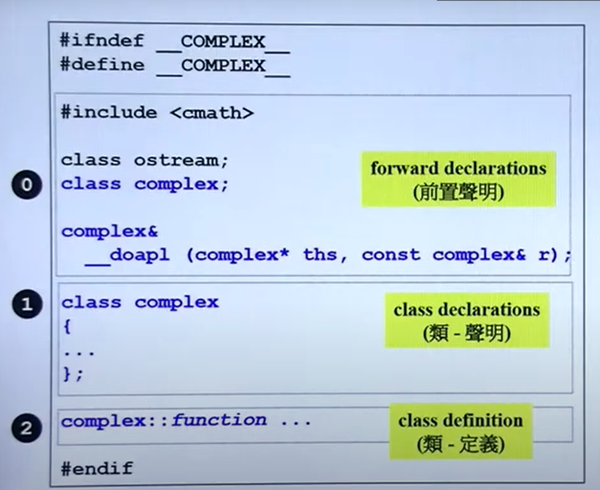

# 面向对象高级编程C++

## 第一节  C++编程简介

### 1.1 基于对象&面向对象

+ 面向对象：classes之间的继承，组合，委托

## 第二节  头文件和类的声明

### 2.1 数据和函数

+ 在面向对象编程中，函数和其要处理的数据放在一起，构成一个类
+ 类一般分成两种考虑，一种是带指针成员的，一种是不带指针成员的

### 2.2 头文件
+ 在定义头文件时，一般要加入如下部分
```c++
//以Complex为例
#ifndef __COMPLEX__
#define __COMPLEX__
//这里写头文件的定义
#endif
```

+ 一般定义头文件的形式



## 第三节 构造函数

### 3.1  内联函数inline
+ 一般地，定义成inline是对编译器的建议。是不是内联还得由编译器决定
### 3.2 访问级别
+ 一般地，数据放在private，自己用的也是，外部访问的放public
### 3.3 构造函数
+ 建议用初始化列表，这是初始化阶段进行的赋值；放括号里面是赋值阶段。
+ 构造函数可以有多个。**但要注意，带默认值的构造函数要和默认构造函数进行区分，别留下每个参数都是默认参数的构造函数**
## 第四节 参数传递与返回值
+ 构造函数放private的，一般用途是单例模式
```c++
class A
{
public:
	static A& getInstance();
	setup(){}
private:
	A();
	A(const A& rhs);
	...
}

A& A::getInstance()
{
	static A a;
	return a;
}
```
+ 常量成员函数
```c++
double real () const{return re;}
```
  + 表示本函数不改变数据成员
  + 对于const对象，它只能使用常量成员函数
+ 参数传递
  + 值传递和引用传递
    + 引用低层就是指针
    + 返回值和参数传递尽量传引用
      + 对于返回值：如果要返回的结果的空间存在于函数之外，则传引用；如果是函数内的局部对象，则返回值。
+ 友元
  + 能够自由取得类的数据
## 第五节 操作符重载
+ 任何成员函数都有一个隐藏的this指针指向当前调用该函数的对象
+ 时刻注意要传引用还是传值，这要考虑函数的功能，如果函数的操作要返回的是临时对象，则一般传值，如果要返回的是引用类型，则传递引用。
+ 一般地，操作符重载往往分成两种，一种是作为成员函数，一种是作为非成员函数。成员函数要求调用者是这个对象类型，非成员则不要求。常常是这样安排的：
  + 对于==，!=都是作为非成员函数。 
  + 对于<<、>>作为非成员函数。而且注意输出流不要const
  + 对于+=、-=、*=、/=都可
  + +，-，×，/都可，正负也是
+ 一般地，会存在这样一些操作：
```c++
//以复数类型为例
complex a,b;
1. a += b += c
inline complex& operator+=(const complex& x);//成员函数
2. a = b + c
inline complex operator+(const complex&x, const complex& y);//非成员函数
inline complex complex::operator+(const complex&);//成员函数
3. a = -b
inline complex operator-(const complex&)//非成员函数
inline complex complex::operator-()//成员函数
4. a != b
inline complex operator==(const complex&, const complex&)
```

+ 临时对象，如果未命名，那么它的生命周期就在该语句结束时到此为止。

## 第六节  复习Complex类的实现过程

## 第七节 带指针的类的复制构造、赋值构造、析构

```c++
class String
{
public:
    String(const char * str = nullptr);
    String(const String& str);
    String& operator=(const String& str);
    ~String();
    char * GetCChar const();
private:
    char * myStr;
}
```

