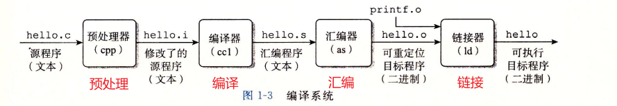

# 第0部分

## 第一章 计算机系统漫游

### 1.1 信息就是位+上下文

+ 系统中所有信息都是由一串bit表示。而如何识别它，得靠这些对象的上下文。

### 1.2 程序被其它程序翻译成不同格式

+ 预处理阶段：根据#开头的命令，将包含的头文件直接插入到程序文本中，得到另一个C程序，以.i结尾
+ 编译阶段：编译器将hello.i翻译成hello.s，这是一个汇编语言程序
+ 汇编阶段：汇编器将hello.s翻译成机器语言指令，打包成可重定位目标程序，并保存在hello.o中
+ 链接阶段：链接器将程序中使用的函数对应的.o目标文件合并到hello.o中，得到一个可执行文件。

### 1.3 编译系统的学习意义

+ 优化性能。
+ 理解链接错误
+ 避免安全漏洞

### 1.4 处理器读并解释内存中的指令

#### 1.4.1 系统硬件组成

1. 总线

   贯穿了整个系统的一组电子管道。用来传送定长的字。对于32位系统，字长4个字节。64位则8个

2. I/O设备

   每个I/O设备都通过一个Controller或者adapter和I/O总线相连

3. 主存

   处理器处理程序时用于临时存放程序和程序处理的数据的存储设备。是由一组动态随机存取存储器组成的。

4. 处理器/CPU

   解释/执行主存中指令的引擎。核心是PC，它是一个大小为1个字的寄存器，PC即程序计数器。CPU总是从PC指向的内存处读取指令执行，每读取出来一个，就会让PC指向下条指令。

   + CPU可能执行的操作
     + 加载：从主存复制数据到寄存器
     + 存储：与加载相反
     + 操作：进行算数运算
     + 跳转：从指令中抽取一个字，并复制到PC

#### 1.4.2 