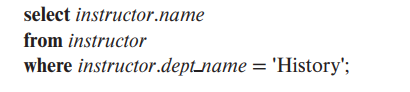
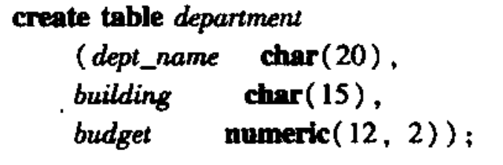

# DataBase Group

## 01 课程介绍: 关系模型

### 1.1 数据库管理系统

+ 数据库管理系统(DBMS)
  + 概念：由一个互相关联的数据的集合(database)和一组用于访问这些数据的程序组成。
  + 目标：方便高效存取数据库信息。

### 1.2 Problems in designing

+ 例子：
  + 假如数据库存储方式如下
  "Ice Cube", 1989, "USA" 
+ 如何确保填入的条目是正确的？而不存在拼写问题
+ 如何防止输入形式错误
+ 数据冗余和不一致？
+ 如何查找一个特定记录？
+ 如何在不同应用中复用同一个数据库？
+ 如果多线程访问数据库，如何确保数据库安全？

+ 如何复制数据库到多台机器实现分布式数据库以确保一台机器故障后数据依然安全？

+  如何将**逻辑层和物理层解耦合？**

### 1.2 数据库系统的目标

+ 传统文件管理系统的弊端：
  + 数据冗余和不一致性：可能有多个副本，这使得数据冗余，还可能导致修改时只改了一个地方，原本的另一个副本信息没更新。
  + 数据访问困难：这主要和需求的预料和更改有关。
  + 数据孤立：数据过于分散，或者有不同格式
  + 完整性问题
  + 原子性问题
  + 并发异常
  + 安全性问题

### 1.3 数据视图

+ 数据库系统要隐藏关于数据存储和维护的某些细节。

#### 1.3.1 数据抽象

屏蔽复杂性，可以将其分成若干层。有点像MFC模式

+ 物理层
  + 最低层抽象，描述数据的存储和相关的低层的数据结构
+ 逻辑层
  + 稍高于物理层
+ 视图层
  + 最高层的抽象，只描述数据库的某个部分。

#### 1.3.2 实例和模式

+ 实例：特定时刻存储在数据库中的信息的集合
+ 数据库的模式：数据库的总体设计
  + 按数据抽象分层
  + 物理模式
  + 逻辑模式
  + 子模式

#### 1.3.3 数据模型

+ 数据库的基础就是数据模型。它是一个描述数据、数据联系、数据语义、一致性约束的概念工具的集合。
+ 分类
  + 关系模型
    + 用表的集合表示数据间的关系，每列有列名。
    + 是一张基于记录的模型。
    + 使用最广泛
  + 实体-联系模型(E-R)
    + 一个对象由组成基本对象的实体及其联系构成。
  + 基于对象的数据模型
    + E-R增加封装、方法和对象标识
  + 半结构化数据模型
    + 允许相同类型的数据项有不同的属性集的数据定义

+ 例子
  + Relational，常用于DBMS
  + NoSQL: 如Key/Value，Graph，Document，Column-family
  + Array/Matirx:常用语Machine Learning

### 1.4 数据库语言

+ **数据定义语言**:定义数据库模式
+ **数据操纵语言**:表达数据库的查询、更新。两个往往是相同的语言的不同部分，如SQL语言

#### 1.4.1 数据操纵语言DML

+ 作用：使得用户可以访问/操纵按照某种适当的数据模型组织起来的数据。
+ 主要操作：
  + 检索
  + 插入
  + 删除
  + 修改
+ 分类
  + 过程化DML：用户得指定需要的数据及其获取方式
  + 声明式DML：用户只要指定要什么数据即可。

+ DML中涉及查询query的部分也叫查询语言，不过往往和DML混为一谈

#### 1.4.2 数据定义语言DDL

+ 作用：定义数据库模式的实现细节，当然，对于用户来说是透明的。
+ 数据在数据库中的**一致性约束**。比如money总是非负的。DLL提供了指定这类约束的工具，对数据进行插入/修改时进行检查。
  + **域约束**。每个属性必须对应一个所有可能取值构成的域，约束它所可以取得的值
  + **参照完整性**。一个给定集的取值要在另一个上面出现才行。如数学课所列的系名得在教务处的department也有才行。
  + 断言。数据库时刻要满足的某个条件。
  + 授权。
    + 读
    + 插入
    + 更新
    + 删除

### 1.5 关系数据库

+ 基于关系模型，使用表来表示数据关系。

#### 1.5.1 表

#### 1.5.2 数据操纵语言

+ SQL查询语言

  + 是声明式的

    

    上图表示从历史系找出所有教员的名字

#### 1.5.3 数据定义语言

+ SQL

  

#### 1.5.4 来自应用程序的数据库访问

+ 有些操作在SQL语言中不支持。只能由宿主语言完成，如c，java。当应用程序以这种方式与数据库进行交互时，主要有两种途径
  + 提供过程集（应用程序接口），将DML和DDL语句发送给数据库，再返回结果
  + 扩展宿主语言，在宿主语言的程序中嵌入DML调用。并通过预处理器，如DML预编译期，将DML语句转变成宿主语言中的过程调用

### 1.6 数据库设计

+ 主要内容是**数据库模式的设计**

#### 1.6.1 设计过程

+ 需求分析阶段：详细刻画预期用户需求
+ 概念设计阶段：根据需求，选择合适数据模型
  + 需求能满足
  + 无冲突
  + 减少冗余特性
  + 重点是描述数据及其联系，不是指定存储细节
+ 逻辑设计阶段
  + 将高层概念映射到使用的数据库系统的实现数据模型上。
+ 物理设计阶段

#### 1.6.3 实体-联系模型(E-R)

+ 使用一组称为实体的基本对象，以及这些对象之间的联系。
+ 数据库中，entity使用属性集合来描述。
+ 联系，则是指若干实体之间的关联。
+ 同一类型的所有实体的集合称为实体集，同一类型所有联系的集合称作联系集

+ 数据库的总体逻辑结构可以用实体-联系图来图形化表示。

#### 1.6.4 规范化

