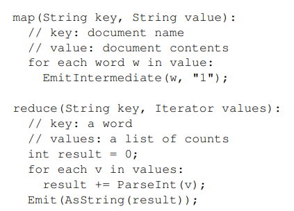
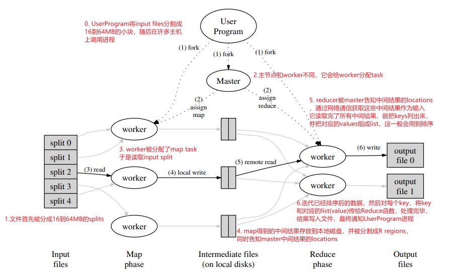

# MapReduce论文阅读

## Abstract

### 2. Programming Model

+ Input & Output
  + a set of input key/value pairs, and produces a set of output key/value pairs

+ Map:以一个键值对为输入，输出a set of 键值对
+ Reduce：接收一个中间值key，以及一系列键值为该key的value，然后形成一个更小的value集合

#### 2.1 Example—WordCount



#### 2.2 Types

+ MapReduce

  + Map(k1, v1)->list(k2, v2)

  + Reduce(k2, list(v2))->list(v2)//这里输出的list(v2)是另一个结果，不是形参list(v2)

#### 2.3 MoreExamples

+ 计算URL访问次数：map函数接收web page的访问请求记录文件，把(URL, 1)作为输出；而Reduce则输出(URL, total Count)
+ 分布式查找：map函数负责对文件内容检索，只要满足就输出k，v pair。而reduce则对合计的结果进行copy输出。
+ 翻转网络连接图：map对网页能到达的其它网页输出(target, source)，Reduce则输出(target, list(source))，得到能到达该target的source网页。这甚至可以连环使用MapReduce，形成mapReduce管道
+ 词向量检索：这旨在将文献中最重要的词进行检索。map对每个document输出(hostname, term vector)，hostname就是document的URL。Reduce则对同一个hostname的词向量相加，得到最终的(hostname，term vector)

+ 倒排索引：map接收documents，并输出(word,documentID)。而reduce则对出现过word的documentIDs进行排序，输出(word, list(document ID))，这样可以清楚知道单词的位置
+ 分布式排序

### 3. Implementation执行

#### 3.1 Execution Overview

+ Map函数在分布式主机上并行执行，input data被分割成许多M大小的splits，这些splits被并行的获取。Reduce函数的也是，被partition算法分割成R大小的pieces
+ Master充当了从map到reduce的一个导管，需要将mapper输出的数据信息的locations告知reducer



+ 上图一轮完成以后，User Program可能会继续利用它调用另一轮MapReduce，或者其它分布式计算。

#### 3.2 Master Data Structure

```c++
struct MasterDataStructure
{
    state;//保存了每个map/reduce的task的状态，idle/in-progress,completed，同时还存储了worker机器的标识
    struct
    {
        locations;
        sizes;		//存储已经完成的map的输出数据的位置和大小。往往在map完成时告知master
    }
}
```

#### 3.3 Fault Tolerance

+ Worker Failure
  + master会周期性地ping这些worker，只要发现一定时间内无法ping通，就把对应worker标记为failed
  + 每个map worker完成工作以后，或者failed以后，都会重置为idle，并可供调度。
  + master对正常执行的worker，不会重复让他们执行这个map task，而对于failed workerA，它的工作会被其它的没有failed的idle workerB拿去执行。这时，其它的reduce就不会从之前的workerA上获取，而是从转移到的新的workerB上获取
+ Master Failure
  + master定期记录struct信息作为结点，放入文件，一旦故障，则从上一个结点上恢复状态。
+ Semantics in the Presence of Failures语义(就是一致性的问题)
  + 每个task都把结果写到本地临时文件；当map完成时，worker向master发送消息，并将这R个临时文件的名字放入消息中。如果master收到了一个已经完成的map task发来的消息，则忽略之，否则在data structure内记录之。
  + 而对于reduce，reduce会将结果文件进行命名，执行原子命名操作，如果同一个reduce任务在多个主机上执行了，通过原子命名操作就可以使得data就只是一次reduce task的结果。

#### 3.4 Locality

+ 由于网络带宽平均一下就很少了，即可能成为性能瓶颈，map的input file都采用GFS存储到worker本地，并被分成64MB的blocks，并在不同的主机上存上备份，一般是3份。master得到了intput file的location信息，就会试图在一个拥有copy的主机上调度map task。如果没法在这样的主机上调度，比如说它们都在忙，就会调度在同一子网内的主机去执行，或者最近的主机去执行。以最大限度减少网络通信

#### 3.5 Task Granularity任务尺寸

+ map的input是M pieces，Reduce则是R pieces，则master有O(M+R)进行调度，有O(M*R)个状态要维护
+ 一般M= 200，000，R=5000，在使用2000个worker的情况下。

#### 3.6 Backup Tasks

+ 通常有一些落伍的worker，其它的都执行完了，就等它了，这会限制MapReduce全局性能。

+ 解决办法就是，当MapReduce快要完成时，就会调度空闲的分布式主机支援完成尚未完成的工作。主机们把剩余工作完成了，就说明MapReduce完成了

### 4 Refinements细化阶段

#### 4.1 分割函数Partitioning Functions

+ 分割函数用来给intermediate key作划分。如：指定reduce的input个数为R，要限制在R个以内。

  则可能采用hash(key) mod R,当然有时key可能不是单纯的数字，这就要用万能hash的办法了。

#### 4.2 Ordering Guarantees顺序确保

+ 在给定的分割下，键值对应当呈递增形式，这样的output更好排序，也更好按键访问

#### 4.3 Combiner Function

