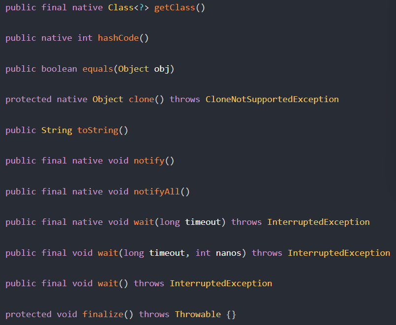

## Java学习

### Java基础

#### 1. 基本知识点

##### 数据类型

1. 基本类型

   + 整数：int(32), short(16), byte(8), long(64)
   + 浮点：float(32), double(64)
   + 字符：char(2)初值为空格
   + 布尔：boolean(1)

   Java不允许隐式向下转型，比如1.1默认double，不能转float

2. 包装类型

   + 原因：基本类型放在栈里面，利用包装类型，可以把值放在堆（一个池子，不是C++里面那种堆）里面，这就涉及到装箱和拆箱。装箱就是把基本数据类型变成引用类型，反过来就是拆箱

   + 对应关系：
     + Integer----int

     + Long----long

     + Short----short

     + Byte----byte

     + Character----char

     + Double----double

     + Float----float

     + Boolean----boolean

     + BigInteger无，可以支持任意精度整数

     + BigDecimal无，用于金钱计算

   + 与基本类型的不同：

     +   在Java中，一切皆对象，但八大基本类型却不是对象。
     +   声明方式的不同，基本类型无需通过new关键字来创建，而封装类型需new关键字。
     +   存储方式及位置的不同。基本类型是直接存储变量的值保存在堆栈中能高效的存取，包装类型需要通过引用指向实例，具体的实例保存在堆中
     +   初始值不同，包装类型的初始值为null，基本类型的的初始值视具体的类型而定
     +   使用方式的不同：如与集合类合作使用时只能使用包装类型。

##### 缓存池

+ 也就是前面提到的装箱问题里的池子

  ```java
  new Integer(123);//每次都新建对象
  Integer.valueOf(123);//使用缓存池中的对象
  ```

+ Java8中，short、int缓存池默认-128~127；byte都在；char则是在\u0000 to \u007F

##### String类型

+ 被声明为final，不可继承。
+ 内部用char数组保存数据，数组也是final，初始化后不可引用其他数组，String内部也没有改变value的方法，是不可变的。
+ 不可变的好处
  + 可以存储Hash
  + 用于String Pool
  + 通信安全
  + 线程安全，不可变，那就天生线程安全。
+ StringBuffer、StringBuilder、String的区别联系
  + 可变性
    + String不可变
    + StringBuffer和StringBuilder可变
  + 线程安全性
    + String安全
    + StringBuffer安全，内部是synchronized进行同步
    + StringBuilder不安全
+ 相关API
  + String.intern()
    + 返回String对象的引用。就是把String引用的对象放在String Pool中，再返回这个对象的引用。

##### JVM内存模型

+ 堆：线程共享。new出来的对象所放的位置，是GC主要区域
+ 栈：线程私有。分为Java虚拟机和本地方法栈，存放局部变量表、操作栈、动态链接、方法出口等，方法执行对应着入栈到用直接内存
+ 方法区：线程共享。存放已被加载的类信息、常量、静态变量、即时编译器编译后的代码等信息、JDK1.8中被元空间替代。
+ 本地方法栈：Native关键字，凡是被Native修饰的方法，都会调用底层C语言库，调用到JNI接口（Java Native Interface，主要用于融合不同语言）
+ 程序计数器：线程私有

##### 运算

1. 参数传递是值传递，准确来说，是把引用所存储的地址值进行传递，类似于C++里指针参数。
2. swich，不支持long

##### 面向对象

+ 访问权限
  + public
    + 可以在任何类、任何包里访问
    + 可修饰类、成员变量、成员方法、构造方法
  + protected
    + 可以被同一个包的或者其他包里但是是子类的类访问
    + 可修饰成员变量、成员方法，构造方法。不修饰类（内部类除外）
  + default
    + 只能被当前类或者同一个包的类访问
    + 可修饰类，成员变量，成员方法，构造方法。
  + private
    + 只能在当前类中访问
    + 可修饰成员变量、成员方法、构造方法。不修饰类（内部类除外）

+ 抽象类 & interface

  + 抽象类

    ```java
    public abstract class Example {
        protected int x;
        public abstract void func();
    }
    
    public class ExampleImpl extends Example{
        @override
        public void func1() {
            ...   
        }
    }
    ```

  + interface

    + 可以看成一个成员都是public static final的abstract class

    ```java
    public interface InterfaceExample {
        void func1();
        
        default void func2() {
            ...
        }
    }
    
    public class InterfaceImpl implements InterfaceExample {
        @override
        public void func1() {
            ...
        }
    }
    ```

  + 比较

      + abstract class更适合IS-A；interface则LIKE-A
      + 一个class可以实现多个interface，不能继承多个abstract class
      + 权限不同
      + 类优先于interface，假如继承的父类里有和interface里同名的函数，那就保留父类的。

+ super

    + super()表示父类的构造函数，子类可以用
    + super关键字可以访问父类，比如子类调用super.func1()，就是调用父类的实现

+ 重载 & 重写

    + 略。和C++一样

+ Object通用方法（Object可认为是所有引用类型的基类）

    + 

    + equals

      + 判断相等。对于基本类型，用==即可。对引用类型，==用于判断引用的对象是否是同一个，equals则用于判断引用的对象是否等价

        ```java
        @Override
        public boolean equals(Object o) {
            if (this == o) return true;
            if (o == null || getClass() != o.getClass()) return false;
        
            EqualExample that = (EqualExample) o;
        
            if (x != that.x) return false;
            if (y != that.y) return false;
            return z == that.z;
        }
        ```

    + hashCode

      + 返回散列值。equal为true的，散列值相同，但反之则不一定
      + 理想的散列函数应当具有均匀性，不相等的对象应当均匀地分布在所有可能的散列值上，所以应当把所有域的值都考虑进来，比如都当成某R进制的某位，再组成一个R进制的整数。用质数的散列性更好
      + 计算hash值，常用31进制
        + 不用更小的：发生hash冲突的可能性更低
        + 不用更大的：容易出现溢出。
        + 乘以31还可以被优化

    + toString

      + 默认返回ClassName@hashCode的形式

    + clone

      + clone是object类的一个protected方法，如果要让其他类能使用某个类A的clone方法，就得让A去override这个方法，同时要A实现Cloneable接口。

        ```java
        public class CloneExample implements Cloneable {
            private int a;
            private int b;
        
            @Override
            protected CloneExample clone() throws CloneNotSupportedException {
                return (CloneExample)super.clone();
            }
        }
        ```

      + 深拷贝和浅拷贝

        + 根据自定义的clone的实现可以知道是深拷贝还是浅拷贝。

      + 最好不要用clone去copy，而是用拷贝构造函数或者拷贝工厂来拷贝对象。

##### 关键字

+ final
  + 对数据：表示为常量，编译期的或者运行时初始化后不改变的。类似于const或者constexpr
  + 对方法：表示不能被子类重写。其实private就被隐式指定为了final了。如果子类又有一个同名的，那就是添加了新方法
  + 对类：表示不允许被继承
+ static
  + 静态变量：类比C++静态成员
  + 实例变量：非静态成员
  + 静态方法：和C++一样，不能是抽象方法，必须有实现

### 集合框架

### 多线程&并发

### IO/NIO/AIO