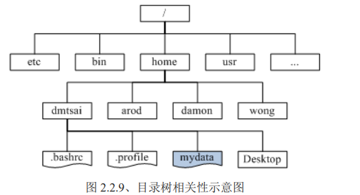

# Linux鸟哥私房菜学习

## 0 计算机概论

## 1 Linux简介与学习办法
### 1.1 历史简介

#### 1.1.1 Linux简介

#### 1.1.2 Unix历史

+ Unix的两个重要概念
  + 程序与系统装置都是文件
  + 不管构建编辑器还是负数文件，程序的目的都是有效完成目标

#### 1.1.5 Linux核心版本

+ 版本号中间的数为偶数，则为稳定版本；如2.6.5，奇数则是发展中版本

### 1.3 Linux应用

+ 数据管理系统
+ 网络服务器
+ 高效运算
+ 云计算，云程序

### 1.4 Linux学习办法

+ 计算机硬件知识
+ 基本指令
+ Linux的权限
+ vim
+ Shell和Shell Script
+ 软件管理
+ 网络基础

## 2 主机规划和磁盘分区

### 2.2 磁盘分区

#### 2.2.4 磁盘分区选择

## 4 首次登入

### 4.1 一些常用指令

