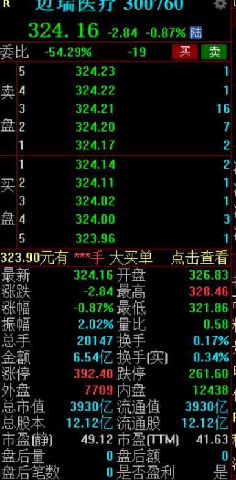

## 股票入门

### 2. 炒股工具介绍

+ 常用软件：同花顺、东方财富

### 3. 股票分类

+ A股
  + 沪深京A股
  + 60开头的上证A股
  + 0开头的深证A股
  + 8和4开头的北京A股
  + 3开头的创业板
+ B股、H股、N股、S股
+ 上证指数反映了整个股票行情的好与坏，就是大盘走势。牛市就是持续上涨，熊市就是持续下跌。

### 4. 交易时间

+ 交易时间：周一到周五上午9:30到11:30，下午13:00到15:00（法定节假日除外）
+ 集合竞价：9:15到9:20可以随便挂单撤单；9:20到9:25就不能撤单了
  + 挂单:是指投资者向交易系统发出买入或卖出股票指令
  + 撤单:即撤销交易指令

### 5. 股票涨跌幅

+ 不同股票，以及不同时间，它的涨跌幅限度都是不一样的，所以有涨停跌停
+ 不同股票的涨跌幅
  + 沪深A股：0和60开头的每天10%
  + 创业板3开头的：每天20%
  + 科创板68开头：前五个交易日无限制，后面20%
  + 北京A股：收个交易日无限制，后面30%
  + ST股：亏损股，5%
+ 除权免息：就是公司向股东派发股权的时候股票会下跌，以保证股东权益平衡。主要有两种方式
  + 送股：就是送你更多的股票数，但是股价 * 股票数不变
  + 派息：就是转一部分为现金，然后保证股东手里的股价 * 股票数 + 现金不变

### 6. 股票分时图讲解

### 7. K线图

### 8. 交易规则

+ 股票购买：最低1手，即100股，按手算，都是100的整数倍
+ 股票交易费用
  + 交易佣金：买卖时给券商的，最高收万分之3，最低5块钱。最好选大券商开户
  + 印花税：卖的时候收，统一1‰
  + 过户费（仅上海股票收取）：按交易金额的0.02‰

### 9. 看盘软件基本操作

+ 自选股：就放自己关注的股票

+ 从K线图跳到当天分时图：连点2下left mouse

### 10. 看盘软件界面讲解

+ 均线
  + K线图里的MA5就是5天的收盘价的平均值。MA20就是20天的

+ 成交量
  + 也有均线，叫MAVOL，比如MAVOL10，是10天的成交量的平均值
+ MACD
  + 白线比黄线高，大概会上涨

### 11. 股票趋势讲解

+ 顺大盘，别只看个股，大盘差，尽量少投别投
+ 下跌尽量别搞，抄底误判会导致亏损。尽量做上涨趋势的股票

### 12. 支撑位和压力位

+ 压力位：股票上涨时，快到上一上涨趋势的高点时。这时可以考虑卖出

+ 支撑位：股票下跌时，快到上一下跌趋势的低位时。这时可以考虑买入

  

### 13. 突破和跌破

+ 和12的对应
+ 突破：突破了压力位并继续上涨，可以考虑买入，追涨。如果发现上涨力度不够了，就要及时卖出
+ 跌破：跌破了支撑位并继续下跌，可以考虑卖出，杀跌（当然也存在看好之后的发展，继续加仓的）
+ 抄底摸顶

### 14. 盘口介绍

+ 上面就是买入和卖出的价格
+ 最新表示的是上比成交价
+ 涨跌是涨幅是上比成交价格相对昨天收盘价格的涨跌情况
+ 振幅就是上下涨跌的幅度
+ 总手就是成交的总金额
+ 涨停和跌停就是今天能涨到和跌到的最低价格，和涨跌幅相关
+ 总市值：就是总股本 * 上比成交价
+ 总股本：总的股数
+ 流通值：市面上可用于买卖的股票数 * 上比成交价。小就是小盘子，大就是大盘子

### 15. 股票买卖机制

+ 先得开户：注意交易的佣金，是不是知名券商
+ 仓位：股市里面的资金。涉及的名词：满仓、清仓
+ 买入时，可以输入买入价格等成交；没有成交也可以撤单。如果特别想买，可以把价格定高点，优先买入
+ 沪深A股和基金交易是T + 1，当天买，不能当天卖，主要是政府防范股市风险（有些不是的，比如美股和港股，投机性更强）

### 16. 怎么选股票

+ 基本面选股：看K线图走势，基本面在涨就买
+ 热点题材选股：根据目前市场行情选股
+ 事件突发选股：比如疫情初期买入医疗股，比如做家用检测仪的，家用呼吸机的，特别是卖官方指导药物的；北溪炸段导致欧洲油价上涨，可以买入石油股；冲突地区可以军工股，各种生活物资概念股。冲突加剧会导致投资者恐惧，套现离场，股价下跌