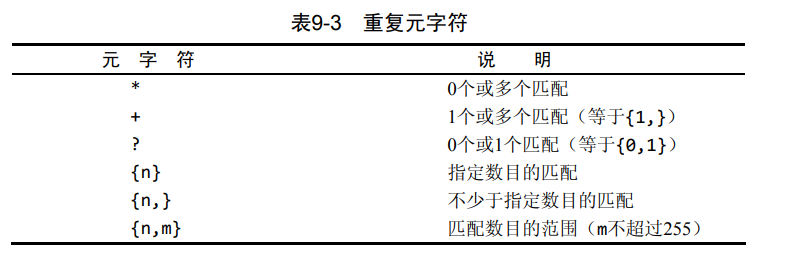

# MySQL必知必会

## 第一章 了解SQL

### 1.1 数据库基础

#### 1.1.1 啥是数据库

#### 1.1.2 表

+ 表就是某种特定类型数据的结构化清单
+ 表名
+ 模式：关于数据库和表的布局及特性的信息。

#### 1.1.3 列和数据类型

+ 表都是列组成的。列里头存着一个字段的信息。

#### 1.1.4 行

+ 每一行都是一个记录。

#### 1.1.5 主键

+ 主键其实就是主码，就是能够唯一标识不同行的一个列或者是一组列。
  + 任何两行都不具有相同的主键值
  + 主键值不能为NULL，每行都有主键值
+ <font color = "red">主键值规则</font>

+ 一般地，对于主键的值，最好这么做
  + 不更新
  + 不重用
  + 不使用可能发生改变的标签作主键

### 1.2 啥是SQL

+ SQL：结构化查询语言。用于和数据库进行通信。基本所有DBMS都支持它

## 第二章 MySQL简介

### 2.1 啥是MySQL

+ MySQL是一个数据库软件，是DBMS。而SQL是查询语言。

#### 2.1.1 C-S软件

+ DBMS分类
  + 基于共享文件系统的DBMS
  + 基于客户机-服务器的DBMS
    + 实际就是一个服务器功能的解耦合。将原来集成的通信功能和请求处理分成不同模块，让服务器的功能更单一。
    + Oracle，MySQL等都是

### 2.2 MySQL工具

#### 2.2.1 MySQL命令行实用程序

```mysql
#指定user为ben的用户进行mysql登入
mysql -u ben
#还可以用-h指定主机名，-P指定端口名
mysql -u ben -p -h myserver -P 9999
#退出命令
quit
exit
#MySQL是默认不区分大小写的
```

#### 2.2.2 MySQL Administrator

+ 是一个非必需的图形交互客户机组件。主要包括这些
  + Server Information服务器信息
    + 显示了客户机和被连接的服务器的状态和version信息
  + Service Controll服务控制
    + 允许停止和启动MySQL以及指定服务器特性
  + User Administration用户管理
    + 定义MySQL用户、登陆和权限
  + Catalogs目录
    + 列出可用的数据库并允许创建数据库和表

#### 2.2.3 MySQL Query Browser

+ 是一个图形交互客户机，用于编写和执行MySQL命令

## 第三章 使用MySQL

### 3.1 连接

+ MySQL要求在执行命令前要登陆到DBMS。
+ MySQL的登录名可以和网络登录名不相同，它在内部保存了自己的用户列表，同时把每个用户与各种权限关联起来。

#### 3.1.1 连接到MySQL

+ 需要的信息
  + 主机名，例如本地的就是localhost
  + 端口，默认是3306
  + 合法用户名
  + 用户口令（非必需）

### 3.2 选择数据库

```mysql
#创建一个名为crashcourse的数据库
create schema crashcourse;

#选择该数据库
use crashcourse;
```

### 3.3 了解数据库和表

```mysql
#查看已经有的数据库的信息
show databases;

#查看当前选的数据库内的可用的表的列表
show tables;

#查看选的一个表的列信息
#包括这个字段的字段名Field、数据类型Type、是否允许NULL、键的信息、默认值、以及其他信息，比如是否是自增的auto_increment
#自增量一般就是为了表示某个列的项必须是唯一值
show columns from customers;
describe customers;

#显示广泛的服务器状态信息
show status;

#显示创建特定数据库或者表
show create database;
show create table;

#显示授予用户的安全权限
show grants;

#显示服务器错误或者警告信息
show errors;
show warnings;
```

## 第四章 检索数据

+ 主要就是使用select语句来检索一个或多个数据列。

### 4.1 SELECT语句

+ 使用要诀
  + 给出想选择的东西以及从哪选择

### 4.2 检索单个列

```mysql
SELECT prod_name FROM products;
#注意，它返回的是一个无序的结果
```

### 4.3 检索多个列

```mysql
SELECT prod_id, prod_name, prod_price FROM products;
```

### 4.4 检索所有列

```mysql
SELECT * FROM products;
```

### 4.5 检索不同的行

```mysql
#普通的检索会显示所有结果，即使两个值相同
SELECT vend_id FROM products;

#使用DISTINCT关键字可以忽略重复结果，只返回不同的vend_id行
SELECT DISTINCT vend_id FROM products;

#如果是对多个列进行显示时，只有几个列都不同的，才会认为是重复的
```

### 4.6 限制结果

```mysql
#限制显示前5行
SELECT prod_name FROM products LIMIT 5;

#限制显示从第4行开始的5行，注意行的索引从0开始
SELECT prod_name FROM products LIMIT 4,5;

#和上面的等价
SELECT prod_name FROM products LIMIT 5 OFFSET 4;

#如果行数不够，就只会返回那么多的行
```

### 4.7 完全限定的表名

```mysql
#原来的不加限定的
SELECT prod_name FROM products;

#完全限定的列名
SELECT products.prod_name FROM products;

#完全限定的表名
SELECT products.prod_name FROM crashcourse.products;
```

## 第5章 排序检索数据

### 5.0 相关概念

+ 字句clause
  + SQL语句由子句构成，例如SELECT里的FROM子句。排序检索使用到的ORDER BY子句等。

### 5.1 排序数据

```mysql
#排序数据
#此语句会按照prod_name的字典顺序输出
SELECT prod_name FROM products ORDER BY prod_name;
```

### 5.2 按多个列排序

```mysql
#按多个列排序的时候，会依次按照逗号分隔的排序标准依次排序
SELECT * FROM products ORDER BY prod_price, prod_name;
```

### 5.3 指定排序的方向

```mysql
#一般是默认升序的排序ASC，即ascend
#如果使用了DESC关键字(descend)，就能够降序排序，但需要注意的是，DESC关键字和DISTINCT不同，DESC只会应用到它修饰的列上，这也是为什么DESC是放在列后面，而不是SELECT后面。所以如果都要降序，就得每个都指定DESC
SELECT * FROM products ORDER BY prod_price, prod_name DESC;

SELECT prod_price FROM products ORDERED BY prod_price DESC LIMIT 1;
```

## 第6章 过滤数据

+ 这样的好处是将数据的过滤放在数据库内完成，这就避免了传输多余数据的性能开销，比如网络带宽，I/O开销等。

### 6.1 使用WHERE子句

```mysql
SELECT prod_name, prod_price FROM products WHERE prod_price = 2.50;
```

<font color = red>WHERE应该在ORDER BY前面</font>

### 6.2 WHERE子句操作符


#### 6.2.1 检查单个值

+ 由于MySQL是不做大小写检查的，所以匹配的是字符串的时候要注意。

#### 6.2.2 不匹配检查

+ 注意对串类型，还是要用引号括起来

#### 6.2.3 范围值检查

```mysql
SELECT prod_name, prod_price FROM products WHERE prod_price BETWEEN 5 AND 10
```

#### 6.2.4 空值检查

+ NULL无值

```mysql
SELECT prod_name FROM products WHERE prod_price IS NULL;
```

+ 需要注意的是，使用不匹配检查的时候，是没法一并返回值为NULL的行的，这是需要注意的

## 第7章 数据过滤

### 7.1 组合WHERE子句

+ 就是使用AND和OR来连接

#### 7.1.3 计算次序

+ AND优先级高于OR，不过一般建议还是使用括号

### 7.2 IN操作符

+ 主要是用于指定条件范围的

```mysql
#表示vend_id为1002或者1003的都行
SELECT prod_name FROM products WHERE vend_id IN (1002, 1003) ORDERE BY prod_name;
```

+ <font color = red>IN操作符的好处是比OR执行快；同时还用来包含其它的SELECT语句</font>

### 7.3 NOT运算符

+ 其实就相当于!，进行否定运算
+ MySQL支持使用NOT对IN,BETWEEN还有EXISTS句子进行取反。

## 第8章 用通配符进行过滤

+ 通配符
  + 就是拿来匹配值的一部分的特殊字符
+ 搜索模式
  + 由字面值、通配符或者两者结合的搜索条件
+ 谓词
  + 操作符作为谓词的时候就不是操作符了。

### 8.1 LIKE操作符

### 8.1.1 %通配符

+ 表示**任何字符**出现**任意次数**

```mysql
#这样就筛选了所有prod_name开头为jet的行
SELECT prod_id, prod_name FROM products WHERE prod_name LIKE 'jet%'
```

+ <font color = "red">如果设置了区分大小写，那jet将不会和JET匹配</font>

+ 当然，如果开头有空格，也打算匹配进去，就需要靠函数来去掉空格以完成正常匹配了

#### 8.1.2 _下划线匹配符

+ 表示**任何字符**出现**一次**

### 8.2 使用通配符的技巧

+ 代价：时间消耗更高
+ 技巧
  + 能用其它的就别用通配符
  + 最好别把通配符放开头
  + 留意通配符的位置；不要放在不合理的位置上。

## 第9章 正则表达式进行搜索

### 9.2 使用MySQL正则表达式

#### 9.2.1 基本字符匹配

```mysql
#和通配符使用的LIKE不同，这里使用REGEXP。REGXEP只要匹配的对象在目标里出现，就会选中；而LIKE则是必须整个列值要完全匹配才行

#这会把所有的prod_name里面包含1000的全部选择出来
SELECT prod_name FROM products
WHERE prod_name REGEXP '1000'
ORDER BY prod_name;

# . 可以匹配任意一个字符，这里就是表示把000
SELECT prod_name FROM products
WHERE prod_name REGEXP '.000'
ORDER BY prod_name;
```

+ <font color = red>MySQL默认是不区分大小写的。但可以使用REGEXP BINARY来区分大小写</font>

### 9.2.2 | 进行OR匹配

+ 为了搜索两个串之一的，可以用|

```mysql
#出现1000或者是2000的都行
SELECT prod_name FROM products
WHERE prod_name REGEXP '1000|2000'
ORDER BY prod_name;
```

#### 9.2.3 []匹配几个字符之一

```mysql
#出现1000，2000，3000的都行。这样就没必要写成1000|2000了
SELECT prod_name FROM products
WHERE prod_name REGEXP '[123]000'
ORDER BY prod_name;

#也可以使用^来否定
#这个表示选择开头不是1，2，3的字符接三个0的
SELECT prod_name FROM products
WHERE prod_name REGEXP '[^123]000'
ORDER BY prod_name;
```

#### 9.2.4 []匹配范围

```mysql
#如果要匹配0到9
[0123456789]
[0-9]

#同样的，也可以
[a-z]
```

#### 9.2.5 匹配特殊字符

+ 如果想匹配前面说的"."，"|"，"[]"，"-"以及其它字符，就得使用\\\转义字符

```mysql
SELECT vend_name FROM vendors WHERE vend_name REGEXP '\\.' ORDER BY vend_name;
```

+ \\\也用来引用元字符


#### 9.2.6 匹配字符类


#### 9.2.7 匹配多个实例



```mysql
#匹配了stick和sticks
SELECT prod_name FROM products
WHERE prod_name REGEXP 'sticks?)';


#匹配了4位数字的
SELECT prod_name FROM products
WHERE prod_id REGEXP '[:digit:]{4}';
```

#### 9.2.8 定位符

+ 能够让你匹配在特定位置上出现对应字符的数据


```mysql
#匹配开头是数字或者小数点开头的
SELECT prod_name FROM products
WHERE prod_name REGEXP '^[0-9\\.]';
```

+ **^用在[]里面，表示否定；而用在[]外面，则表示在开头进行匹配**
+ 同时使用^和$，就使得REGEXP的作用和LIKE类似了

### 9.3 小结

```mysql
#可以在不使用表的情况下对REGEXP还有LIKE进行测试
SELECT 'hello' REGEXP '[0-9]';
```

## 第10章 创建计算字段

### 10.1 计算字段概念

+ 背景
  + 有时候需要的数据是在表里分散存放的，我们需要检索出转换、计算或者是格式化之后的数据。它常常是写在SELECT语句内的。
+ 相关概念
  + 字段field
    + 基本上和列column的意思一样，但是这里就指计算字段。

### 10.2 拼接字段Concat

```mysql
#使用Concat进行拼接
SELECT Concat(vend_name, '(', vend_country, ')') FROM vendors ORDER BY vend_name;
```

+ <font color = red>删除右侧多余空格，使用RTrim(),删除左侧多余空格， 使用LTrim()</font>

```mysql
SELECT Concat(RTrim(vend_name), '(', RTrim(vend_country), ')') FROM vendors ORDER BY vend_name;
```

+ 使用别名
  + 我们知道，查询出来的结果其实没给它命名，这就导致查询出来了只能看，没法引用。这时出现了别名(alias)
  + <font color = red>别名就是一个字段或者值的替换名，我们使用AS关键字来赋予别名</font>

```mysql
#对于SELECT的结果进行嵌套SELECT的时候，必须对之前的结果进行别名赋予才行，否则外层的FROM就不知道从哪SELECT了

#这是对SELECT的结果的表进行别名赋予，注意是(SELECT ...) as t;
SELECT * FROM (SELECT Concat(cust_id, '(',cust_name,')') FROM customers AS cust_select) as t;

#这个是对SELECT出的结果列进行别名赋予，写在了SELECT的内容后面
SELECT Concat(RTrim(vend_name), '(', RTrim(vend_country), ')') AS vend_title FROM vendors  ORDER BY vend_name;

#整合在一起
SELECT cust_select FROM (SELECT Concat(cust_id, '(',cust_name,')    ') as cust_select FROM customers) as t;
```

### 10.3 执行算术计算

```mysql
SELECT prod_id, quantity, item_price, quantity * item_price AS expanded_price FROM orderitems WHERE order_num = 20005;
```

+ +-*/四种运算都可以

## 第11章 使用数据处理函数

### 11.1 函数

### 11.2 使用函数

+ 基本的分类
  + 用于处理文本串的，比如RTrim去掉右侧多余空格、删除或者填充值、大小写切换等。
  + 用于数值数据上的算术操作
  + 处理日期和时间值并提取特定成分。
  + 返回DBMS正在使用的特殊信息。

#### 11.2.1 文本处理函数

+ Upper(str)函数
  + 将文本变成大写

```mysql
SELECT Upper(vend_name) AS vend_name_upcase FROM vendors ORDERE BY vend_name;
```

+ Lower(str)函数
+ Left(str, length)
  + 返回串左边length个字符，注意length要大于等于0

+ Length(str)
  + 返回串的长度
+ Locate(str1, str2,[pos])
  + 返回str2里面str1第一次出现的位置。如果传入了pos，则从pos开始算起
+ LTrim(str)
  + 去掉左边的空格
+ RTrim(str)
  + 去掉右边的空格
+ Right(str, length)
  + 返回串右边length个字符
+ SubString()
  + 返回子串的字符

```mysql
MySQL中，SUBSTRING（）是截取字符串函数
使用语法为：
select substring(str,pos)
select substring(str from pos)
select substring(str,pos,len)
select substring(str from pos for len)
select  substring('helloWorld',6,5)  返回结果是‘World’

在MySQL中
第一个参数为要截取的字符串，第二个参数是从第几个字符开始（包括这个字符）截取
第三个参数是表示想要截取的字符串的长度。
如果只有两个参数则表示从第pos个字符开始截取到最后一个字符

pos的值是可以为负数的，当pos为-5时则表示从字符串的倒数第5个字符开始截取
select substring('helloWorld',-5,3) 结果为：World
```

+ Soundex()
  + 返回串的SOUNDEX值。该值是任何字符串转为描述其语音表示的字母数字模式的算法。使得能对串进行发音比较而不是字母比较。

#### 11.2.2 日期和时间处理函数


+ AddDate
  + 

+ 注意，日期的格式必须是yyyy-mm-dd的形式


## 第19章 插入数据

### 19.1 数据插入INSERT

+ 主要用途
  + 插入一个完整的行
  + 插入行的一部分
  + 插入多个行
  + 插入某些查询的结果

### 19.2 插入完整的行

+ 不推荐的写法

```mysql
#如果这一列允许空值，又不打算填入，就可以NULL
#而如果是auto_increment的，那也可以填NULL，这时database会自动给它填下一个id
INSERT INTO Customers
VALUES(
	NULL,
    'Pep',
    '100 Angeles',
    'CA',
    NULL,
)
```

+ 推荐的写法

```mysql
#由于给出了列名，这样在表发生变化的时候就可以更安全，
INSERT INTO customers(cust_name,cust_address,cust_city,cust_state,cust_zip,cust_contry)
VALUES('Pep','100','Los Angeles','CA','800','USA');
```

+ 省略列
  + 允许为NULL值的
  + 有默认值的
  + 为auto_increment的

+ <font color = red>提高整体性能</font>

  ```mysql
  #使用LOW_PRIORITY
  INSERT LOW_PRIORITY INTO
  ```

### 19.3 插入多个行

```mysql
INSERT INTO customers(
    cust_name,
    cust_address,
    cust_city,
    cust_state,
    cust_zip,
    cust_contry)
VALUES(
    'Pep',
    '100',
    'Los Angeles',
    'CA',
    '800',
    'USA'),
    (
        ...#第二行的数据
    );
```

### 19.4 插入检索出来的数据

+ 其实就是把SELECT出来的数据进行INSERT INTO

```mysql
INSERT INTO custNew(
    cust_id,
    cust_contract,
    cust_email,
    cust_name,
    cust_address,
    cust_city,
    cust_state,
    cust_coutry)#其实是不关心列名的，列名并不要求相同，仅仅是SELECT出来的东西要能放到对应的这个列里头就行
    SELECT cust_id,#可以发现这里没有使用VALUES()的形式，而是直接接了一个SELECT的结果
    cust_constract,
    cust_email,
    cust_name,
    cust_address,
    cust_city,
    cust_state,
    cust_country
    FROM customers;
```

### 第20章 更新和删除数据

### 20.1 更新数据

+ UPDATE可以更新表的特定行；也可以更新所有行
+ 一般配合WHERE使用，如果没有WHERE，就会导致更新所有的行
+ 一般，如果能为NULL，也可以用这种办法删除数据

```mysql
UPDATE customers
SET cust_email = 'fawefwa@126.com',
	cust_name = 'The Pigs'
WHERE cust_id = 1005;
```

+ IGNORE关键字
  + UPDATE更新多行数据出错时，就会回退，取消所有修改。如果要求即使出错也要更新，就加IGNORE

```mysql
UPDATE IGNORE customers
SET cust_email = 'fawefwa@126.com',
	cust_name = 'The Pigs'
WHERE cust_id = 1005;
```

### 20.2 删除数据

+ DELETE语句用来删除整个行的。可以删除特定的行，也可以删除所有行
+ <font color = red>要删除指定的列，就使用UPDATE；要删除所有行，就使用TRUNCATE TABLE；DELETE只用于删除特定行比较合适</font>
+ 同样地，不要省略WHERE子句

```mysql
DELETE FROM customers
WHERE cust_id = 1005;
```

### 20.3 更新和删除的指导原则

+ 除非打算更新和删除每一行，否则就不要用不带WHERE子句的UPDATE和DELETE；删除每一行，建议用TRUNCATE TABLE
+ 使用WHERE子句来UPDATE和DELETE的时候，最好先SELECT出来看看。毕竟MySQL没有undo
+ 使用强制实施引用完整性的database，这样MySQL就不允许删除具有其它表相关联的数据的行

## 第21章 创建和操纵表

### 21.1 创建表

#### 21.1.1 表创建基础

+ 创建一个表必须给出表名以及列的名字与定义。自然，表名不能与已有的表名冲突，自然也可以加限定if not exists
+ 其它的东西可以选择在创建表之后创建


上图创建了一个名为customer的表

+ MySQL的语句是忽略多个空格以及多个行的影响的，可以合理选择缩进。

#### 21.1.2 使用NULL值

+ NULL值允许插入行的时候不给出它的值
+ 不指定的时候，默认是NULL

#### 21.1.3 主键再介绍

+ 上面的仅是以一个列为主键
+ 也可以用多个列作为主键，这时要求它们组合的结果是唯一的


#### 21.1.4 使用AUTO_INCREMENT

+ 主要是为了解决并发访问时的序号+1问题以及序号+1时执行额外MySQL操作带来的效率低下问题。

+ 标识了AUTO_INCREMENT后，该列会在每加一行的时候自动+1。如果使用的INSERT值并不是原来的+1，就按着你INSERT的值作为后续的+1起点，进行覆盖。

+ <font color = "red">每个表只允许一个列有这个属性，且它必须被索引</font>。比如让它成为主键。

+ ```mysql
  #获取最后一个AUTO_INCREMENT的值
  SELECT last_insert_id()
  ```

#### 21.1.5 指定默认值

```mysql
CREATE TABLE orderitems
(
    order_num  int      NOT NULL,
    order_item char(10) NOT NULL,
    #这里就是指定quantity的默认值为1
    quantity   int      NOT NULL DEFAULT 1,
    item_price decimal(8,2) NOT NULL,
    PRIMARY KEY (order_num, order_item)
)ENGINE=InnoDB;
```

+ 和很多DBMS不一样的是，MySQL不允许使用函数作为默认值，仅支持常量。
+ 很多情况下，大伙都会倾向用默认值，而不是NULL

#### 21.1.6 引擎类型

+ MySQL有多种引擎，它们有不同的优缺点。如果省略了ENGINE=xxx，就会用默认的，一般大多会是MyISAM
+ 三个引擎类型
  + InnoDB引擎
    + 是一个可靠的事务处理引擎，不支持全文本搜索
  + MEMORY
    + 功能等同于MyISAM，但是数据是在内存里而不是磁盘里，常用于临时的表
  + MyISAM
    + 性能很高，支持全文本搜索而不支持事务处理
+ 不同表，可能选择不同的引擎
+ <font color = "red">外键不能跨引擎</font>

### 21.2 更新表

```mysql
#给表vendors新加一个列vend_phone
ALTER TABLE vendors
ADD vend_phone char(20);

#给表vendors删除列vend_phone
ALTER TABLE vendors
DROP COLUMN vend_phone;

#当然也可以一次改多下，每个修改都用逗号隔开就行
```

+ ALTER TABLE常见的用途其实是定义外键


+ 使用ALTER TABLE的时候，最好还是在用之前备份表

### 21. 3 删除表

```mysql
#和使用ALTER修改表一样，也是用DROP
#无法撤销
DROP TABLE customers2;
```

### 21.4 重命名表

```mysql
RENAME TABLE customers2 TO customers;

#多个表重命名
RENAME TABLE customers2 TO customers,
			 back_vendors To vendors;
```

