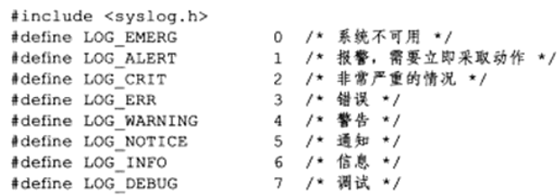
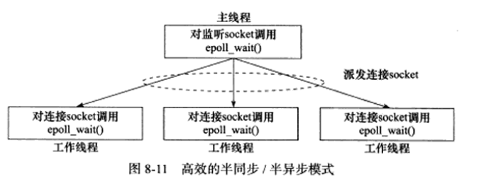

# Linux高性能服务器编程

## 第7章 Linux服务器程序规范

### 7.0 导论

+ Linux服务器一般以<font color = "red">后台进程形式运行，即守护进程。</font>其父进程一般是init进程(pid = 1)
+ <font color = "red">有一套日志系统</font>负责输出log到文件(/var/log下)/专门的UDP server
+ 以非root身份运行。
+ 通常是可配置的。一般都有配置文件，放/etc下
+ 启动时生成PID文件并存入/var/run目录，来记录后台进程的PID
+ 设计时得考虑系统资源和限制，预测自身能承受多大的负荷，比如进程可以用文件描述符总数和内存总量。

### 7.1 日志

+ server的调试和维护离不开log系统

#### 7.1.1 Linux系统日志

+ Linux由rsyslogd守护进程来处理日志。

+ rsyslogd守护进程既能接收用户进程的输出日志，也能接收内核日志。

  使用syslog函数

+ rsyslogd则监听文件，获取用户进程的输出。

+ 对于系统日志，则使用printk打印到内核的环状缓存ring buffer，其内容会映射到/proc/kmsg文件中。rsyslogd则通过读取文件得到内核日志。

+ 文件目录

  + debug信息->/var/log/debug
  + normal信息->/var/log/messages
  + kernal信息->/var/log/kern.log
  + 【可以在/etc/rsyslog.conf中设置】


#### 7.1.2 syslog函数

```c++
#include<syslog.h>
void syslog(int priority, const char * message, ...);
```

+ priority等级



+ priority是LOG_USER和上面这些相或

```c++
#include<syslog.h>
void openlog(const char* ident, int logopt, int facility);
// 用于改变syslog的默认输出方式
// ident：其指定的字符串被添加到日志消息的date + time后，一般设置成程序名
// logopt：对syslog调用的行为进行配置
// facility:修改syslog函数的默认设施值
```


```c++
#include<syslog.h>
int setlogmask(int maskpri);
// 设置日志掩码，改变日志级别，从开发到发布时就可能修改。返回之前的日志掩码值
```

```c++
void closelog();//关闭日志功能
```

### 7.2 用户信息

#### 7.2.1 UID,EUID,GID,EGID

+ 大部分服务器以root启动，不以root运行。

  + UID:真实user id

  + EUID:有效用户id
  + GID:真实组
  + EGID:有效组

```c++
#include<sys/types.h>
#include<unistd.h>
uid_t getuid();
uid_t geteuid();
gid_t getgid();
gid_t getegid();
int setuid(uid_t uid);
int seteuid(uid_t uid);
int setgid(gid_t gid);
int setegid(git_t gid);
```

+ 每个进程都有UID和EUID。EUID方便资源访问，使得运行程序的用户uid拥有该程序的有效用户euid的权限。有效用户为root的进程为特权进程。
+ 例子：

```c++
#include<unistd.h>
#include<stdio.h>
#include<iostream>
using namespace std;
int main()
{
    uid_t uid = getuid();
    uid_t euid = geteuid();
    cout << uid << endl << euid << endl;
}

> g++ test.cpp -o test && ./test
> 1000
> 1000
//一般直接执行就是user的uid，euid

>sudo chown root:root test #设置文件所有者为root
>sudo chmod +s test #设置文件的set-user-id
>./test
>1000 #是实际执行这个程序的进程的id
>0 #就是root的id
```

#### 7.2.2切换用户

 ### 7.3 进程间关系

#### 7.3.1 进程组

+ Linux中每个进程隶属一个进程组，所以进程除了pid外，还有pgid（进程组id）
+ 每个进程组都有一个首领进程。它的PGID和PID相同。进程组一直存在，直到其中所有进程退出/被加到其它进程组。

```c++
#include<unistd.h>
pid_t getpgid(pid_t pid);
// 获取进程为pid的进程组的pgid
// return：成功则返回进程pid所属进程组pgid，失败返回-1，设置errno

int setpgid(pid_t pid, pid_t pgid);
// 设置进程为pid的进程组PGID为pgid
// return：成功返回0，反之-1，并设置errno
// 1. 若pid == pgid，则设置pid进程为进程组的首领
// 2. 若pid == 0，则是设置当前进程的PGID，不是设置root进程
// 3. 若pgid为0，则使用pid作为PGID
```

+ 一个进程只能设置自己及其子进程的PGID，且子进程调用exec系列函数后，也没法再在父进程中设置其PGID。

#### 7.3.2 会话session

+ 有关联的进程组会形成会话。

```c++
#include<unistd.h>
pid_t setsid(void);
// 由非进程组首领的进程调用。
// return：成功则返回PGID，失败返回-1，设置errno

pid_t getsid(pid_t pid);
```

+ setsid调用后
  + 调用进程变会话首领，该进程是会话的唯一成员。
  + 新建进程组，PGID就是该进程的PID，会成为该组的首领。但是sid本身不存在这个东西，直接用PGID代替
  + 进程将甩开终端

#### 7.3.3 用ps命令查看进程关系


### 7.4 系统资源限制

```c++
#include<sys/resource.h>
struct rlimit
{
    rlim_t rlim_cur;
    rlim_t rlim_max;
    //rlim_t是个整数类型，描述资源的级别。
    //cur描述软限制，最好不要超过它，否则可能会发送信号终止运行。
    //max是硬限制，是软限制的上限，普通程序可以减小硬限制，只有以root运行的才能增加。
};

int getrlimit(int resource, struct rlimit * rlim);
int setrlilmit(int resource, const struct rlimit * rlim);
```


### 7.5 改变工作目录和根目录

+ webserver的逻辑根目录并非文件系统的根目录，而一般是站点的根目录(如：/var/www/)

```c++
#include<unistd.h>
char * getcwd(char * buf, size_t size);
// 获取当前工作目录，buf用于存放目录绝对路径，大小为size，返回NULL或者buf或者指向存放绝对路径的缓存区
// 1. 若路径长度超了，返回NULL，设置errno为ERANGE
// 2. 若buf为NULL，而size!=0，则可能在内部malloc。这之后还得我们自己free它。
int chdir(const char* path);
// 切换工作目录到path，成功0，失败-1，设置errno
int chroot(const char* path);
// path参数指定要切换到的目标根目录。成功时返回0，失败时返回-1并设置errno。这个必须要root权限
// chroot不改变进程的工作目录，基本都是在此之后接着chdir("/")
```

### 7.6 服务器程序后台化

+ 让服务器进程以守护进程的方式运行
+ 详见P139

```c++
#include<unistd.h>
int daemon(int nochdir, int noclose);
// nochdir:是否改变工作目录，0则设置为"/"根目录，否则使用当前目录
// noclose：0表示标准的输入输出和标准的错误输出都被重定向到/dev/null文件，否则使用原来的设备，成功返回0，失败-1，设置errno
```

## <font color = "red">第8章 高性能服务器程序框架</font>

### 8.0 导论

三个模块

+ <font color = "red">I/O处理单元</font>：主要包含4个I/O模型和2个高效事件处理模式
+ <font color = "red">逻辑单元</font>：2个高效并发模式以及高效的逻辑处理方式—有限状态机
+ 存储单元

### 8.1 Server模型

#### 8.1.1 C/S模型

+ 计网里提过，实际C，S在网络传输过程是对等的，区分只在于其主要承担的工作。
+ C/S特点
  + 优势：
    + 适合资源集中型
  + 缺点：
    + 对Server的吞吐量要求挺高。可以采用distributed systems进行效率提高。
+ C/S模型的逻辑
  + Server启动，创建若干监听socket，调用bind绑定到特定server端口
  + 调用listen等待连接
  + Server稳定后，client就可以调用connect发起连接
  + 由于clients的请求往往是随机异步的，Server使用某个I/O模型监听这个event。如I/O复用中的select调用。
  + 接收到了请求，使用accpet接收它，分配逻辑单元为新的连接服务。如弄一个子进程、子线程、或者线程池等。与此同时，主线程/主进程持续监听请求。

+ 例子

  

#### 8.1.2 P2P模型

+ 特点
  + 优点
    + 资源能充分共享。例子：高性能云计算集群
  + 缺点
    + 传输请求多的时候，网络负载加重。
    + 主机之间难以互相发现。所以实际还有一个专门的发现服务器，提供查找甚至内容提供服务。这就形成了混合模型


### 8.2 服务器编程框架


+ Server基本模块的功能描述

| 模块  |对单个服务器程序| 对服务器机群 |
| ---- | ---- | ---- |
|  I/O处理单元    | 处理客户连接，读写网络数据 | 作为接入Server，实现负载均衡 |
| 逻辑单元 | 业务进程或线程 | 逻辑服务器 |
|网络存储单元|本地database，file或者cache|database server|
|请求队列|各单元之间的通信|各服务器之间的永久TCP连接|

#### 8.2.1 I/O处理单元

+ 工作
  + 对单个服务器程序而言：等待、接收client连接，收发客户的data（收发可能会在逻辑单元执行，这取决于采用的事件处理模式）
  + 对服务器机群：作为专门的接入服务器，实现负载均衡，从所有逻辑服务器中选取负荷最小的一台来为新客户服务，这相当于<font color = "red">中介者</font>

#### 8.2.2 逻辑单元

+ 工作
  + 通常作为进程/线程。分析处理client的data，然后根据使用的事件处理模式，将message或者result传给I/O处理单元，或是直接发给client，对server cluster而言，一个逻辑单元就是一台逻辑服务器。服务器通常有多个逻辑单元，实现对多个用户任务的并行处理。

#### 8.2.3 网络存储单元

+ 可以是database，cache或者file，甚至是独立的server。

#### 8.2.4 请求队列

+ 各个单元之间通信方式的抽象。I/O处理单元接收到client请求时，需要以某种方式通知一个逻辑单元处理这个请求。同样的，多个逻辑单元同时访问一个存储单元时，也需要通过它来处理竞态条件。
+ 这一般是一个<font color = "red">池</font>。
+ 对server cluster而言，请求队列是各台server之间预先建立的，静态的，永久的tcp连接。能提高server之间交换数据的效率。

### 8.3 <font color = "red">I/O模型</font>

+ 阻塞和非阻塞适用于包括socket、管道在内的所有文件描述符。将I/O分成了阻塞I/O和非阻塞I/O
+ 在socket的基础API中，可能被阻塞的系统调用包括accept、send、recv、connect。
+ 对非阻塞，调用后立即返回，不管是否发生对应事件，没发生，则一般返回-1，设置errno。这时要根据errno来区分是出错还是确实没发生事件。
  + 对accpet，send，recv
    + 未发生为EAGAIN，EWOUOLDBLOCK
  + 对connect
    + 未发生为EINPROGRESS

显然，需要在事件已发生的非阻塞I/O下提高服务器程序效率。非阻塞I/O一般要和其它I/O通信一块用，如：I/O复用和SIGIO信号。

#### 8.3.1 I/O复用

+ 定义：应用通过I/O复用函数向内核注册一组事件，内核通过I/O复用函数把其中就绪的事件通知给应用程序。

  <font color = "red">观察者？</font>

+ 常用的I/O复用函数

  + select
  + poll
  + epoll_wait

+ I/O复用函数是阻塞的，提高效率的要义在于它们能同时监听多个I/O事件。

#### 8.3.2 SIGIO信号

+ 指定宿主进程，它捕获倒SIGIO信号时，就说明有事件发生，SIGIO信号的信号处理函数就会被触发，于是就能在处理函数中对目标文件描述符执行非阻塞I/O操作了。

#### 8.3.3 基本总结

+ I/O模型可分为两类

  + 同步I/O

    + 阻塞I/O
      + 程序阻塞于I/O函数

    

    + 非阻塞I/O

    

    ​		如上图所示，用户态下的进程不断轮询

    + I/O多路复用（也称事件驱动I/O）
      + select，poll，epoll

    

    ​		进程依然会阻塞，但不是阻塞在I/O上，二是阻塞在select/poll调用上。这需要两个系统调用，实际上其最大的优势在于能一次监听多个连接。与之类似的是多线程上每个线程都使用阻塞I/O

    + 信号驱动I/O

    

  + 异步I/O

    + 内核执行读写并触发读写完成事件。程序没有阻塞阶段。

### 8.4 两种高效的事件处理模式

+ 服务器一般要处理：I/O事件，信号，定时事件

#### 8.4.1 Reactor模式

+ 同步I/O常采用这个模式
  + 主线程（即I/O处理单元）只负责监听文件描述上是否有事件发生，有则立即将该时间通知工作线程（即逻辑处理单元）
  + 逻辑单元负责读写数据，接受新的连接，处理客户请求。
+ 基本工作流程，以epoll_wait为例
  1. 主线程向epoll内核事件表中注册socket上的读就绪事件。
  2. 主线程调用epoll_wait等待socket上的读就绪事件。
  3. 当socket上有数据可读时，epoll_wait通知主线程。主线程将socket可读事件放入请求队列。
  4. 某个工作线程被唤醒，从socket中读写数据，处理客户请求，然后往epoll内核事件表中注册该socket上的写就绪事件。
  5. 主线程调用epoll_wait等待socket可写
  6. socket可写时，epoll_wait通知主线程。主线程将socket可写事件放入请求队列。
  7. 某个工作线程被唤醒，向socket上写入服务器处理客户请求的结果。


#### 8.4.2  Proactor模式

+ Proactor将所有I/O操作交给了主线程和内核处理，工作线程仅负责业务逻辑。
+ 异步I/O常使用这个
+ 基本工作流程（以aio_read和aio_write为例）
  1. 主线程收到socket请求，调用aio_read函数向内核注册socket上的读完成事件，告诉内核，用户读缓冲区的位置，以及读操作完成时如何通知应用程序。
  2. **内核进行数据读取**，主线程继续其它逻辑。
  3. socket上的数据被读入用户缓冲区后，内核向应用程序发送一个信号，通知应用程序数据已经可用。
  4. 应用程序预先定义好的信号处理函数选择一个工作线程处理客户请求。工作线程处理完用户请求后，调用aio_write函数向内核注册socket上的写完成事件，告诉内核，用户写缓冲区的位置，及写操作完成时如何通知应用程序。
  5. 内核进行数据写操作，主线程继续其它逻辑。
  6. 用户缓冲区的数据被写入socket后，内核向应用程序发送一个信号，通知应用程序已经发送完毕。
  6. 应用程序根据预先定义的信号处理函数选择一个工作线程来做善后处理，比如是不是要关掉socket。


+ 上面的epoll_wait只能用来监听连接请求，而无法用来检测读写事件，读写事件直接由aio_read/write注册的，不是epoll_wait注册的。

#### 8.4.3 模拟Proactor模式

+ 这是使用同步I/O方式模拟Proactor的方法
+ 原理：
  + 主线程执行数据读写操作，读写完成后，主线程向工作线程通知这个“完成事件”。从工作线程角度上看，它直接得到了数据读写的结果，直接拿来逻辑处理。实际上就是注册的读写就绪事件，由主线程读写，而不是注册读写完成事件由内核读写。
+ 工作流程
  1. 主线程向epoll内核事件表注册socket上的读就绪事件
  2. 主线程调用epoll_wait等待socket上有数据可读。
  3. socket上有数据可读时，epoll_wait通知主线程。主线程从socket循环读取数据，将数据封装成一个请求对象，并插入请求队列。
  4. 某个工作线程唤醒，获得请求对象，处理请求，并向epoll内核事件表注册socket上的写就绪事件。
  5. 主线程调用epoll_wait()等待socket可写。
  6. socket可写时，epoll_wait通知主线程。主线程向socket上写入服务器处理客户请求的结果。


### 8.5 两种高效的并发模式

+ 对于I/O密集型，并发编程有很大优势。实际上能将线程从等待I/O的状态解放出来执行任务。这常常是那些经常要访问数据库，读写文件的。
+ 并发一般常常有multi-threads 和 multi-process

#### 8.5.1 半同步/半异步模式

+ I/O模型的同步，异步取决于向内核注册的事件是就绪事件还是完成事件，也即是谁完成I/O（应用程序 or 内核）

+ 并发内的同步异步

  

  + 同步：程序完全按顺序执行。
    + 按同步运行的线程就是同步线程
  + 异步：程序执行需要系统事件的驱动，如中断，signal等。
    + 按异步运行的线程是异步线程。显然效率更高，实时性好。

+ 半同步/半异步模式的两个线程

  + 同步线程处理客户逻辑，毕竟计算密集型。相当于逻辑单元。
  + 异步线程处理I/O事件。相当于I/O处理单元。

+ 工作流程

  + 异步线程每当监听到客户请求时，就读取请求，将信息封装成请求对象，插入请求队列。
  + 请求队列通知某个在同步模式的工作线程来处理该请求对象。如何通知？可用简单的轮流选取工作线程的Round Robin算法，也可以条件变量或者信号量，来随机选择。

  

##### 8.5.1.1 衍生模型：半同步/半反应堆


+ 要点
  + 主线程充当异步线程，用于监听所有socket的事件。
    + 如果**监听socket**上有新的可读请求事件，说明有新连接到来，**主线程接收之**，并得到新的**连接socket**。接着向内核事件表**注册socket上的读写就绪事件**。
    + 如果**连接socket上有**新的读写就绪事件，即有新的客户请求到来或者有数据要发送给客户端，主线程就将连接**socket插入请求队列**。所有**工作线程**都睡眠在请求队列中，有新任务来时，它们通过**竞争**得到任务的接管权，空闲的工作线程才有机会处理新任务。
  + 可以发现，这就是结合了Reactor模式的半同步半异步。
  + 所谓半反应，就是指**工作线程自己从socket上读请求，自己从socket写入服务器的应答信息**。

+ 半同步/半反应模式的缺点

  + 主线程和工作线程共享请求队列，因而涉及读写互斥，浪费CPU时间。
  + 每个工作线程同一时间只能处理一个客户请求。可能导致任务堆积。而且工作线程的切换也会浪费很多CPU时间。

+ 改进半同步/半异步

  

  + 主线程只负责管理**监听socket**，而**连接socket**由工作线程管理，有新连接到来时，主线程就接收并派发一个连接socket给某个工作线程，此后该socket的所有I/O操作都由这个工作线程来处理，直到client关闭socket连接。
  + 如何派发？可以使用管道，主线程可以用主线程和工作线程之间的管道写数据，当工作线程收到数据时，如果发现管道内的信息表名有一个新的连接到来，就将该连接socket的读写事件注册到自己的epoll内核事件表。

#### 8.5.2 领导者/追随者模式

+ 基本思想：多个工作线程**轮流**获得事件源集合，轮流监听、分发并处理事件的一种模式。突出一个轮流。

+ 程序只有一个领导者，它负责监听I/O事件，其它追随者休眠在线程池中等待成为新的领导者。当前领导者若检测到了I/O事件，首先从线程池得到新的领导者线程，然后处理I/O事件。这样，新的领导者可以在它处理I/O的同时负责下监听I/O，从而实现I/O监听和I/O处理的并发。

+ 包含的组件

  

  + 句柄集HandleSet

    + 所谓句柄，指的就是I/O资源，在Linux下通常是一个文件描述符。HandleSet管理众多的句柄，使用wait_for_event来监听句柄上的I/O事件，将就绪的通知给leader。leader就利用register_handle来调用绑定到Handle上的EventHandler来处理事件。

  + 线程集ThreadSet

    + 是一个线程管理者，负责各线程的同步，以及新leader的推选。

    + Leader的推选和Follower等待成为新Leader的操作都得修改ThreadSet，因此需要注意同步问题，避免竞态条件。

    + 一般，每个线程都有三种状态

      

      + Leader状态：负责处理I/O事件
      + Processing状态：正在处理事件。Leader检测到I/O，就转移到Processing状态处理事件，同时调用promote_new_leader推选新Leader。不过，也可以指定其它追随者来处理事件，这样它就还是Leader。如果Processing下的线程已经完成工作，而此时ThreadSet内又没有Leader时，它得成为Leader，否则成为Follower。
      + Follower：线程当前处于Follower，可以通过调用join等待成为新的Leader；当然，也可能直接被Leader指定处理某个任务直接到Proccessing状态。

  + 事件处理器EventHandler和具体的事件处理器ConreteEventHandler

    + 通常包含若干回调函数handle_event，它们用于处理对应事件对应的业务逻辑。事件处理器在使用前需要绑定到具体的句柄上，当handle有事件发生，Leader就会执行与之绑定的事件处理器中的回调函数。

      

+ 优劣分析：
  + 不需要在线程之间传递额外数据，也不必像半同步/半反应堆那样在线程之间同步对请求队列的访问。
  + 缺点就是仅支持一个事件源集合，无法让每个工作线程独立地管理多个客户连接。

### 8.6 有限状态机

+ 这是逻辑单元内部的一种编程方法

```c++
//带状态转移的有限状态机
State_Machine()
{
    State currentState = stateA;
    while(currentState != stateC)
    {
        Package pack = getNewPackage();
        switch(currentState)
        {
            case stateA:
                ProccessPackageStateA(pack);
                currentState = stateB;
                break;
            case stateB:
                ProccessPackageStateB(pack);
                currentState = stateC;
                break;
            case stateC:
                break;
        }
    }
}
```

+ 例如在Http报文的解析上，就可以使用主从状态机来进行解析
  + http报文一般包含首部行和请求行；因此主状态可以用两个枚举量表示之。在某个主状态下，头部和请求行的每个部分都是按照\r\n结尾的，所以可以设置从状态机，并用3个枚举代表其状态，一个表示已经读取到一个完整行，一个表示行出错，一个表示数据尚且不完整，需要等进一步的信息。
  + 对于处理结果，也可以使用枚举表示，例如请求不完整，已经得到完整客户请求，客户请求有语法错误，资源访问受阻，服务器内部出错，客户关闭连接等。
+ 代码示例可参照P159

### 8.7 提高服务器性能的其它建议

+ 硬件方面：CPU个数、速度、内存大小
+ 软件：系统软件资源；服务器程序本身，高效事件处理方式，并发模式，逻辑处理方式。

#### 8.7.1 池

+ 实际就是空间换时间。在server启动开始就给它分配这样一个静态资源集合，运行的时候有需要就从池子里面取出，直接从池中取得所需要的资源也比动态分配快，用完了就送回池子，暂不释放。
+ 分类
  + 内存池
    + 常用于socket的接收缓存和发送缓存。对于某些长度有限的请求，预先分配一个大小够用的接收缓冲区比较合理，长度超过时，可以选择扩大或者丢弃请求。
  + 进程池
    + 用于并发，这样就不用老是使用消耗性能的pthread_create了
  + 线程池
    + 也是用于并发，这样就不用老是fork了
  + 连接池
    + 常用于Server或者是Server Cluster的内部永久连接。例如，每个逻辑单元可能需要频繁地访问本地某个数据库。与其每次要访问就发起连接请求，访问完了就释放，不如使用连接池。
    + 连接池是Server预先和Data base建立的一组连接的集合。当某个逻辑单元要访问Data Base时，它可以直接从连接池中取得一个连接的实体并使用之。待完成数据库的访问之后，逻辑单元再将该连接返还给连接池。

#### 8.7.2 数据复制

+ 应当尽量减少不必要的数据赋值，特别是发生在用户代码和内核之间的时候。
  + 例如ftp服务器，如果只是要对用户请求的文件判断是否存在以及用户有无权限获取，那它就无须把目标文件的内容完整地读入到应用程序缓冲区中并调用send函数发送，它只要使用sendfile这个零拷贝函数就行。
+ 也尽量减少用户代码内部的数据赋值。比如进程通信，如果通信数据庞大，就别用管道或消息队列了，直接使用共享内存比较好。

#### 8.7.3 上下文切换和锁

+ 上下文切换
  + 是并发程序必须考虑的，进程/线程切换时，会导致较大的开销。因此，尽量不要为每个用户都创建一个工作线程，而可以参考半同步/半异步。多线程Server的一个优点是不同的线程可以同时运行在不同的CPU上。当线程的数量不大于CPU数目时，上下文切换就没问题了。
+ 共享资源的加锁保护
  + 锁常常导致Server效率低下。因此减小锁的粒度是一个方向，比如使用读写锁，一般就是无优先的读写同步。

#### 8.8 小结

#### 8.8.1 基本的模式

| 模式                       | 主线程工作                                                   | 内核工作   | 工作线程工作                       |
| -------------------------- | ------------------------------------------------------------ | ---------- | ---------------------------------- |
| Reactor                    | 负责管理监听socket和连接socket；不负责I/O；注册读写**就绪**事件； | 不负责读写 | 同时负责读写和处理报文             |
| Proactor                   | 负责管理监听socket和连接socket；不负责I/O；注册读写**完成**事件； | 负责读写   | 仅处理报文                         |
| 模拟Proactor               | 负责管理监听socket和连接socket；负责I/O；注册读写**就绪**事件 | 不负责读写 | 仅处理报文                         |
| 半同步半反应(Reactor)      | 负责管理监听socket；不负责I/O；注册连接socket的读写**就绪**事件 | 不负责读写 | 负责管理连接socket，处理报文，读写 |
| 半同步半反应(模拟Proactor) | 负责管理监听socket；负责I/O；注册socket的读写就绪事件        | 不负责读写 | 仅处理报文                         |
| 半同步半异步改进版         | 负责管理监听socket；负责分配socket给工作线程                 | 不负责读写 | 负责一个连接socket的处理和读写     |
| 领导者追随者               | 略                                                           | 略         | 略                                 |

## 第5章 Linux网络编程基础API

### 5.1 socket地址API

#### 5.1.1 主机字节序和网络字节序

+ 大端存储和小端存储
+ 原因：不同机器的字节序可能不同，需要转换；不同进程也可能存在不同。

转换的API：

```c++
#include<netinet/in.h>
unsigned long int htonl(unsigned long int);
unsigned long int ntohl(unsigned long int);
unsigned short int htons(unsigned short int);
unsigned short int ntohl(unsigned short int);
```

#### 5.1.2 协议通用socket地址（不好用）

+ socket结构体

```c++
#include <bits/socket.h>
struct sockaddr_storage
{
    sa_family_t sa_family;//地址族类型，与协议族对应
    unsigned long int __ss_align;
    char __ss_padding[128-sizeof(__ss_align)];//存放socket地址值
}
```

+ 地址族和协议族一一对应

  

#### 5.1.3 协议专用socket地址（一般用这个）

+ TCP/IP协议族

  + IPv4和IPv6

    

+ 注意在使用时，这些专用，通用的都得转换成sockaddr这个类型。

#### 5.1.4 IP地址转换函数

+ 转char数组为可供处理的整型

```c++
#include <arpa/inet.h>
int_addr_t inet_addr(const char* strptr);
//将点分十进制变整型
int inet_aton(const char* cp, struct in_addr* inp);
//将点分十进制转整型并放imp中，0失败，1成功
char* inet_ntoa(struct in_addr in);
//反过来。但是是不可重入的


// 新版的
int inet_pton(int af, const char* src, void * dst);
const char* inet_ntop(int af, const void * src, char* dst, socklen_t cnt);
```

### 5.2 创建socket

```c++
#include <sys/types.h>
#include <sys/socket.h>
int socket(int domain, int type, int protocol);
/*
domain:底层协议族
		PF_INET,PF_INET6用于ipv4,6
type:指定服务类型
		SOCK_STREAM流服务，即TCP用的
		SOCK_DGRAM数据报服务，即UDP用的
		现在也能传上面两个与SOCK_NONBLOCK和		SOCK_CLOEXEC相与的结果，前者表示非阻		塞，后者则小时fork出的子进程会关闭			socket
protocol:在前两个参数构成的协议集合下再选择一个		具体的协议，它常常唯一，指定为0即可。
return value：成功则返回一个socket文件描述符，否则返回-1
*/
```

### 5.3 命名socket

+ 创建socket，只是指定了地址族，还得将其与socket地址绑定，这就是所谓命名socket。

+ 对client，它通常不用命名，直接匿名让os自动分配。

  对server则需要。

```c++
#include<sys/types.h>
#include<sys/socket.h>
int bind(int sockfd, const struct sockaddr* my_addr, socklen_t addrlen);
/*
功能：将my_addr所指socket地址分配给未命名的sockfd文件描述符，addrlen指出socket地址的长度
成功返回0，否则-1。
*/
```

### 5.4 监听socket

+ 命名后，还得创建一个监听队列来存放待处理的客户连接

```c++
#include<sys/socket.h>
int listen(int sockfd, int backlog);
/*
sockfd：指定被监听的socket
backlog:提示监听队列的最大长度
returnvalue：成0败-1
*/
```

### 5.5 接收连接

```c++
#include<sys/types.h>
#include<sys/socket.h>
int accept(int sockfd, struct sockaddr *addr, socklen_t *addrlen);
/*
sockfd:执行过listen的socket
addr：用于获取被接受连接的远端socket地址，		server会通过读写该socket来与client通信
returnvalue:成0败-1
*/
```

+ accept并不对连接状态敏感，只单纯从监听队列中取出连接

### 5.6 发起连接

```c++
#include <sys/types.h>
#include <sys/socket.h>
int connect(int sockfd, const struct sockaddr *serv_addr, socklen_t addrlen)
/*
功能：成功连接则返回一个socket，否则返回-1，并置erro。erro要么是ECONNEREFUSED要么ETIMEDOUT
*/
```

### 5.7 关闭连接

```c++
#include<unistd.h>
int close(int fd);
/*
功能：实际是把fd的引用计数减1，只有为0时才关闭连接，由于fork会使得父进程中打开的socket的引用计数加1，所以在父子进程中都要close，才会关闭连接
*/

#include<sys/socket.h>
int shutdown(int sockfd, int howto);
/*
sockfd：待关闭的socket
howto：指明了shutdown的行为。
		SHUT_RD表示关闭读，socket接收缓冲区的		数据全部被丢弃
		SHUT_WR表示关闭写，发送缓冲区的数据全		 部发送之后才关。
		SHUT_RDWR同时关
returnvalue：成0败-1
*/
```

### 5.8 数据读写

#### 5.8.1 TCP数据读写

```c++
#include <sys/types.h>
#include <sys/socket.h>
ssize_t recv(int sockfd, void *buf, size_t len, int flags);
ssize_t send(int sockfd, const void *buf, size_t len, int flags);

/*
表示从sockfd读取到buf或发送buf的内容，len指定了buf的大小，返回成功读写的字符个数。失败返回-1。flags一般设置为0
*/
```

+ flags的一些取值

  

## 第6章 高级i/o函数