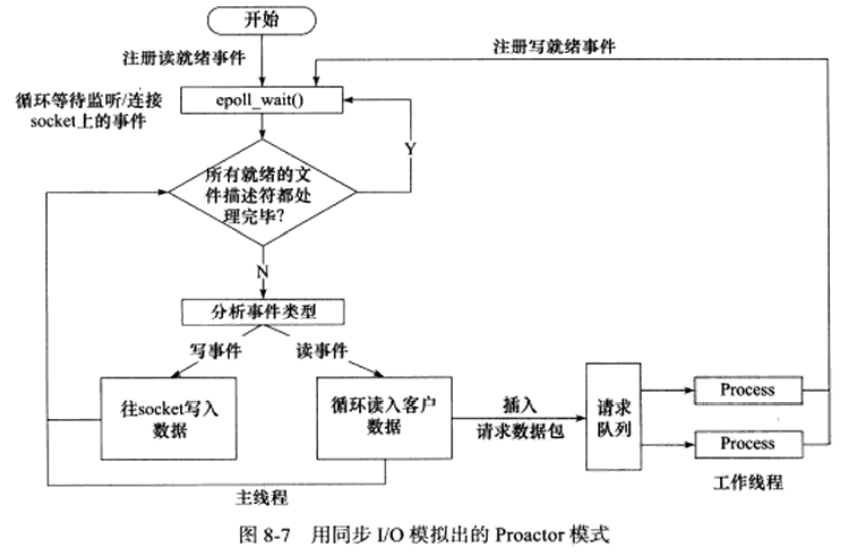
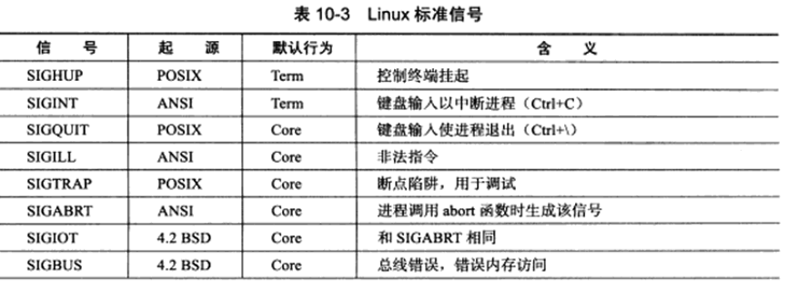

# Linux高性能服务器编程笔记

[TOC]


# 第一篇  TCP/IP协议详解

## 第1章 TCP/IP协议族

+ 目前的TCP/IP协议族是一个分层、多协议的通信体系。

### 1.1 TCP/IP协议族体系

+ 这是一个四层协议系统(除去物理层）

  

#### 1.1.1 链路层

+ 主要作用：<font color = "red">实现了网卡接口的网络驱动程序</font>
+ 常见协议：ARP协议(地址解析协议)、RAPP协议(逆地址解析协议)。两者主要都是实现IP地址和mac地址之间的相转换。
+ <font color = "red">网络层使用IP地址寻址一台机器，链路层则是使用物理地址</font>

#### 1.1.2 网络层

+ 主要作用：实现数据报的选路和转发。

  + WAN广域网常使用分级路由连接分散主机或是LAN局域网。所以通信的两机器一般不直接相连。于是网络层就是对上层隐藏网络拓扑细节，并实现通信双方的连接。

+ 重要协议：IP协议、ICMP协议

  + IP协议采用逐跳的方式确定路径。

  + ICMP协议则是IP协议的重要补充，主要用于检测网络连接。当然，ICMP并非实质上的网络层协议，因为它使用了IP协议的功能和服务。

    

    + 8位类型：将报文分成两类，一类是差错报文。一类是查询报文。差错报文主要是用于回应网络错误，如目标不可达、重定向等。查询报文则是查询网络信息，如ping就是使用的查询报文，看是否可达
    + 16位校验和：和IP头部一样，是对整个报文进行循环冗余校验。

#### 1.1.3 传输层

+ 主要作用：为两台主机提供端到端的通信。它只关心起始端和目的端，而不关心网络层那样的逐跳通信和中转。
+ 常见协议：TCP协议、UDP协议、SCTP协议
  + TCP是一个为应用层提供可靠的、面向连接的和基于流的服务。TCP协议使用超时重传、数据确认等方式确保数据正确、可靠发送。是一种有状态的协议，也为连接的维持准备了必要的数据结构，如连接状态、读写缓冲区、定时器等。
  + TCP是基于流的，无长度限制，发送端可以逐字节向流写入数据，接收端则逐字节读出。
  + UDP协议则是提供不可靠、无连接、基于数据报的服务。因此，如果上层要求要可靠传输，就必须在应用层引入自己对处理数据的确认和超时重传机制。由于UDP是无连接的，所以每次发送数据都得明确接收端的地址。基于数据报的服务，使得每次接收端都得以其长度为最小单位将内容一次读出，否则数据就会被截断。也因此UDP并没有像TCP那样的滑动窗口，缓存已发送报文。
  + SCTP协议即流控制传输协议。主要是为了在网络上传输电话信号的

#### 1.1.4 应用层

+ 主要作用：负责处理应用程序的逻辑。前面的层次基本都是在内核空间实现，而应用层则是主要在用户空间实现的，负责处理众多的逻辑。
+ 常见协议
  + ping应用程序：使用ICMP报文检测网络连接，主要用于调试网络环境。
  + telnet协议是一种远程登陆协议，使得我们能在本地完成远程任务。也是网络调试的好帮手。
  + OSPF协议，即开放最短路径优先协议，是一种动态路由更新协议，主要用于路由器之间的通信。
  + DNS协议，基于UDP协议实现机器域名到IP地址的转换。
+ <font color = "red">应用层协议或程序可能跳过传输层而直接使用网络层的服务，但这并不说明它们属于传输层而非应用层</font>

### 1.2 封装

+ 作用：封装是上层协议使用下层服务的方式

  

+ 链路层帧：一般是以太网帧或者是令牌环帧。以以太网帧为例，它包含目的mac、源mac的12字节的字段，2字节的类型字段（表示是IP数据报还是ARP还是RARP），以及数据字段，还有4字节的循环冗余校验字段。
  + 最大链路层帧MTU限制了一个帧里的最大传输单元，这影响了过长IP数据报的分片传输。

### 1.3 分用

+ 含义：分用就是说帧到达目的主机时，沿着协议栈自底向上传递的过程。

### 1.5 ARP协议的工作原理

+ 主要作用：实现网络层地址到物理地址的转换。
+ 工作原理：主机向所在网络广播ARP请求，只有目标机器会回答一个ARP应答，包含了自己的物理地址。

#### 1.5.1 以太网ARP请求/应答报文详解


#### 1.5.3 ARP高速缓存的查看和修改

+ ARP维护一个高速缓冲，包含经常访问或者是最近访问的机器的IP地址到物理地址的映射。

  ```shell
  #Linux可以使用arp-a来查看缓存
  sudo arp -a
  #删除
  sudo arp -d 192.168.1.109
  #添加
  sudo arp -s 192.158.1.109 09:00:22:53:10:66
  ```

#### 1.5.4 实例：使用tcpdump来观察ARP通信过程

+ tcpdump可以用来抓包

  

### 1.6 DNS工作原理

+ 主要作用：完成域名到IP的转换。

#### 1.6.1 DNS查询和应答报文详解

+ DNS是一套分布式的域名服务系统。每个DNS服务器上都有大量的机器名和IP地址的映射，且是动态更新的。

+ 查询和应答报文格式：

  

  + 16位标识：标记一对DNS查询和应答，以免出错

  + 16位标志：主要是协商具体的通信方式和反馈通信状态。

    

  + 接下来的就是个数+内容的配置了

  + 查询问题的一般格式如下：

    

    + 类型为A表示获取IP，CNAME表示获取别名，PTR表示反向查询

#### 1.6.2 Linux下访问DNS服务

```shell
#Linux下在/etc/resolv.conf有dns服务器的ip

#Linux下还可以通过host程序访问DNS服务器
#-t表示要指明的查询类型
$host -t A www.baidu.com
```

#### 1.6.3 实例：使用tcpdump观察DNS通信过程


### 1.7 socket和TCP/IP协议族的关系

+ socket就是为了实现这组系统调用的API
+ 特点与功能：
  + 将data从用户缓冲copy到TCP/UDP的内核发送缓冲以交付发送数据。或是相反，以读取数据
  + 使得应用程序能通过它们来修改内核中各层协议的某些头部信息以及其它数据结构。例如：使用setsockopt来修改IP数据报在网络上存活的时间。

## 第2章 IP协议详解

### 2.1 IP服务的特点

+ IP协议为上层提供了无状态，无连接，不可靠的服务。

  + 无状态：通信双方不同步传输数据的状态信息。因此无法处理乱序和重复的IP数据报。但优点就是简单而高效，因为没必要为此去分配额外的字段来维护状态。

    虽然IP头部有这样的标识字段，但其实仅是用来分片和重组的，并不显示接收顺序。

  + 无连接：IP通信双方都不长久地维持对方的任何信息。故每次发送时，都要明确对方的IP信息。
  + 不可靠：即不保证数据报能准确到达对方，仅是提供一种尽力而为服务。
    + IP数据报在网络上存活时间太长等
    + 接收端发现收到的IP数据报不正确等

### 2.2 IPv4头部结构

#### 2.2.1 头部结构


+ 版本号：指定IP协议的版本。对于IPv4而言，它的值是4.
+ 头部长度：标识头部到底有多少个4字节，由于4位总共15，故最长就是60字节了。
+ 服务类型TOS：这8个bit里面有3bit优先权字段(已忽略)，4bit的TOS字段，以及1bit的保留字段(必须置为0)。TOS字段表示最小延时，最大吞吐量，最高可靠性，最小费用，最多有一个能置为1。比如ssh和talnet可能就要最小延时，而文件传输可能就是用最大吞吐量。
+ 16bit总长度：表示整个IP数据报大小。但实际上会由于MTU的限制将长度超过MTU的数据进行分片传输，所以实际传输的IP数据报的长度远远没达到最大值。
+ 16位标识：唯一地识别主机发送的每个数据报，随机决定初始值后，以后每个数据报都是+1，当然，一个数据报的所有分片，都是有相同标识值的。
+ 3bit的标志字段：第一位为保留位；第二位为DF禁止分片；第三位为MF更多分片，如果一个IP数据报有很多分片，那么除最后一个分片以外，其它的分片都要置为1。
+ 13位分片位移：就是当前分片相对于原始IP数据报开始处的偏移，实际偏移值是这个值左移3位得到的。**也就是说，除了最后一个IP分片以外，每个IP分片的数据部分的长度必须是8的整数倍**。
+ 8位生存时间：数据报到达目的地之前允许经过的路由器跳数。TTL值被发送端设置，经过一个路由器就-1，为0时，路由器丢弃之，并发送一个ICMP差错报文到发送端。
+ 8位协议：区分上层协议，可以到/etc/protocols文件定义的数值上查看，ICMP是1，TCP是6，UDP是17
+ 16位头部校验和：进行循环冗余校验
+ 32位源IP和目的IP
+ 可选字段：最多40字节的信息。可以加入记录路由、时间戳、松散源路由选择、严格源路由选择等。

#### 2.2.2 实例：使用tcpdump观察IPv4头部结构

（详细见书20页，pdf37页）

### 2.3 IP分片

+ IP数据报的长度超过帧的MTU时，就会分片传输。它极可能发生在发送端，也可能发生在中转路由器上。仅在接收端才会重新组装。
+ 与分片相关的三个字段是：标识、标志、片位移。同一个IP数据报的分片具有相同的标识、可能不同的标志、以及不同的片位移。标志除了最后一个分片以外，其余都是MF。每个分片的IP头部的长度字段设置为该分片的长度。
+ 一般的，MTU是1500字节，去除IP的头部20b，还剩1480给IP数据报的正文用，如果一个IP数据报的正文，如ICMP报文，有1481字节，那第一个分片就是1500满载，第二个就只有21字节了。

### 2.4 IP路由

+ 这是IP协议的核心任务

#### 2.4.1 IP模块工作流程

（见PDF的40页）

#### 2.4.2 路由机制

#### 2.4.3 路由表更新

### 2.5 IP转发

### 2.6 重定向

### 2.7 IPv6头部结构

+ IPv6的改进：
  + 解决了地址不够的问题
  + 增加了多播和流的功能
  + 为网络媒体内容提供精细控制
  + 引入自动配置功能
  + 加入了网络安全功能

#### 2.7.1 IPv6固定头部结构


+ 4bit版本号：指定IP协议版本，为6
+ 8bit通信类型：指示数据流通信类型或者优先级，类似TOS
+ 20bit的留标签：是新增的，用于某些对连接的服务质量有特殊要求的通信，如音频或者视频等实时数据传输。
+ 16bit的净荷长度，指的是拓展头部和数据长度之和，不包括固定头部长度。
+ 8bit的下一个包头，指出紧跟IPv6固定头部的包头类型，如扩展头、TCP头、UDP头、ICMP头等。
+ 8bit的跳数限制。类似IPv4的TTL
+ 16字节的IP地址。与IPv4的点分十进制表示不同，它更类似于mac地址的表示，使用十六进制字符串配:来表示,分成8组，每组2个字节。

#### 2.7.2 IPv6拓展头部

+ 拓展头部可以没有，也可以有。它的类型主要是在前一个头部的8bit包头里面指定，它的前一个头部既可以是固定头部、也可以是拓展头部。

  

## 第三章 TCP协议详解

### 3.1 TCP服务的特点

+ 面向连接

  + 双方必须先建立连接，分配响应的内核资源，以管理连接的状态和连接上面的数据传输，然后才能开始数据的读写。
  + 通信是全双工的。
  + 完成交换数据后，通信双方都要断开连接。
  + 面向连接使得它不适合基于广播和多播的应用。

+ 字节流

  + <font color = "red">TCP模块发送的TCP报文段的个数和应用程序的写操作次数没有固定的数量关系；同理，读操作和接收到的TCP报文段的个数也没有固定的数量关系。</font>执行send的时候，是把message从用户缓冲区copy到TCP的发送缓冲区，在TCP发送的时候，才封装成一个个TCP报文段发送。

  + 含义：程序对于数据的发送和接收没有边界限制 。具体表现就是通信双方不必执行相同次数的读写操作。

    

+ 可靠传输

  + 发送和应答机制
  + 超时重传机制
  + 拥塞控制
  + 流量控制

### 3.2 TCP头部结构

#### 3.2.1 TCP固定头部结构


+ 端口号都是16bit，各2个字节
  + TCP通信过程中，client常常使用自动选择的临时端口；而server则是使用众所周知的约定端口。
  + 这些约定的端口一般放在/etc/services中


+ 序号和确认号各4个字节。
  + 主动发送请求的一方开始会设置一个ISN初始序号值，后续每个TCP报文段的序号被设置成它的报文段的首个字节相对ISN的偏移
+ 4bit的头部长度（单位为4字节）：说明TCP报文段头部最长60字节。
+ 6bit的标志位：
  + URG表示紧急指针是否有效
  + ACK表示确认号是否有效，为1的说明是确认报文段
  + PSH提示接收端应立刻从TCP接收缓冲区读取数据，以为后续数据腾出空间。
  + RST表示要求对方重建连接。携带RST标志的TCP报文段为复位报文段
  + SYN表示建立一个连接。携带SYN标识的为同步报文段
  + FIN表示这端打算关闭连接。携带FIN标识的为结束报文段。
+ 16bit的窗口大小：主要是用于流量控制。告知对方本端的TCP接收缓冲区还能容纳多少个字节的数据，以控制对方发送数据的速度。
+ 16bit检验和：循环冗余校验，它会对整个TCP报文段实行CRC校验。
+ 16bit紧急指针：和序号相加表示最后一个紧急数据的下一字节的乵。其实就是紧急偏移，主要用于发送紧急数据。

#### 3.2.2 TCP头部选项

#### 3.2.3 实例：使用tcpdump观察TCP头部信息

### 3.3 TCP连接的建立和关闭

#### 3.3.1 使用tcpdump观察TCP连接的建立和关闭


#### 3.3.2 半关闭状态


+ 出现原因：TCP是全双工的协议，允许两个方向的数据传输被独立地关闭。于是，存在一方已经发送结束报文段，但仍然能接受另一方数据，等待对方发送结束报文段的情况。
+ <font color = "blue">一般地，可以通过read系统调用去看返回值是否为0来判断，当然，在epoll里面还新增了其它的做法</font>

#### 3.3.3 连接超时

+ 通过talnet和tcpdump来抓包观察，可以发现当client发送请求而server一直不响应时，client会重复发送连接请求。超时时间间隔依次为1、2、4、8、16、32s，可见类似于慢启动的过程
+ 其设置是在/proc/sys/net/ipv4/tcp_syn_retries内核变量定义的。可以修改之。

### 3.4 TCP状态转移

+ 可以通过netstat命令查看TCP连接的状态


+ 虚线就是典型的server的状态变迁；实线则是典型的client的状态变迁1

#### 3.4.1 TCP状态转移总图

对于client：

​	连接建立过程：

+ 首先通过connect系统调用主动和server建立连接，发送SYN，进入SYN_SENT状态。

+ connect失败返回的两个情况：

  + **如果connect的目标端口不存在或者端口仍然被TIME_WAIT状态的连接占用。server就会发送RST复位报文段，connect调用失败。**
  + **目标端口存在，但是connect在超时时间内未收到来自服务器的确认报文**

  connect失败，就会回到closed状态。反之就会ESTABLILSHED

​	连接断开过程：

+ client主动断开，会进入FIN_WAIT_1，接着进入FIN_WAIT_2，再进入TIME_WAIT。然而，如果只有三次挥手，也可以直接从FIN_WAIT_1进入TIME_WAIT

+ FIN_WAIT_2转入TIME_WAIT的标志是client收到来自server的FIN报文。

  然而，client存在停留在FIN_WAIT_2状态的情况：

  + client执行关闭后，没等server关闭，client就直接强行退出了。这时在客户端上连接由内核来管理，成了孤儿连接。

    Linux内核里/proc/sys/net/ipv4/tcp_max_orphans和/proc/sys/net/ipv4/tcp_fin_timeout可以对孤儿连接诶的数目以及孤儿连接在内核内的生存时间进行管理。


#### 3.4.2 TIME_WAIT状态

+ 进入TIME_WAIT状态后，client还要等2MSL的时间，一般MSL的值为2min，保证了连接上的数据在两个方向都已经消失。
+ 存在原因：
  + **可靠地终止TCP连接**
    + 主要就是上图的报文段7丢失的时候，会重复收到来自server的FIN报文
  + **保证让迟来的TCP报文段有足够的时间被识别和丢弃**
    + Linux里，一个TCP端口无法被同时打开多次。一个TCP连接处于TIME_WAIT状态时，就无法立刻使用占用的端口建立新连接。这就可以防止新连接和当前这个连接一模一样而收到来自当前连接的过期报文。
+ 一般地，对于client，它建立连接一般会使用系统自动分配的临时端口来建立连接，一般与上一次使用的不同。而server则一般使用知名的端口，如果server主动关闭连接，这个状态就可能导致其无法立刻重启。
+ 可以通过socket选项SO_REUSEADDR来强制进程立刻使用处于TIME_WAIT状态的连接占用的端口。

### 3.5 复位报文段

+ 产生复位报文段的三种情况
  + 访问不存在的端口或者是处于TIME_WAIT的端口
  + 异常终止连接
    + 异常终止的做法就是给对方发送一个复位报文段，这时，发送端所有排队等待发送的数据都被丢弃。
    + 可以使用socket选项SO_LINGER来发送RST复位报文段来异常终止一个连接
  + 处理半打开状态
    + 例子：server关闭或者异常终止了连接，而client没收到结束报文，这就使得client维持着连接而server却已经没有该连接的任何信息了。这时，如果client向这个连接继续写入数据，对方就会发送一个RST报文段。

### 3.6 TCP交互数据流

+ TCP报文段的两种应用数据：
  + 交互数据。包含数据少，实时性要求高，如telnet、ssh
  + 成块数据。包含数据大，一般就是TCP最大报文段长度。对传输效率要求高。
+ 一般地，服务器每次发送确认的时候，都会携带应用程序数据，而client一般没有。服务器的这种处理就是一种延迟确认，收到数据时暂且不进行确认，发送确认的时候会等待一段时间看是否有数据要发，有，就和确认一起发出，这样就减少了发送TCP报文段的数量。
+ 通过telnet观察，可以发现这样的微小的交互数据流很多。可以通过Nagle算法进行优化，规定TCP连接的双方在任何时刻都只能发送一个没确认的报文，而只有确认到来时才发送下一个报文。在等待确认的时候收集这样的微小报文，一旦确认到来，就一次性发送。类似于停等协议。

### 3.7 TCP成块数据

+ TCP成块数据在传输的时候，发送方可以连续发送报文，接收方可以一次性进行累积确认。

### 3.8 带外数据

+ 也即OOB，以迅速通告对方本端发生的重要事件。通常有更高的优先级，总是被立刻发送。

+ UDP没带外数据的实现，TCP也没有，不过TCP有紧急指针标志和紧急指针。将紧急数据映射到普通数据连接里，去传输紧急数据。

  

+ 一个进程已经往TCP连接的发送缓冲区写入了N个字节的普通数据，然后又写入了3字节的带外数据abc，这时，等待发送的TCP报文段头部就会设置URG标志，且紧急指针被置为带外数据的下一字节位置。一次发送多字节的带外数据时，只有最后一个字节会被当做带外数据，所以多个TCP报文段发送缓冲区内容时，都会设置URG标志，但只有一个TCP报文段真正携带了带外数据。
+ TCP接收端会将带外数据存放在带外缓存里。如果设置了SO_OOBINLINE，则带外数据会像普通数据一样放在TCP接收缓冲区。

### 3.9 TCP超时重传

+ TCP超时重传在Linux内也是一样，超时事件发生时，重传间隔加倍。屡次失败，就会由IP和ARP接管，直到放弃连接。
+ 相关内核参数：
  + /proc/sys/net/ipv4/tcp_restries1
    + 指定低层IP接管前，TCP最少执行的重传次数，默认3
  + /proc/sys/net/ipv4/tcp_restries2
    + 指定连接放弃前，TCP最多可执行的重传次数

### 3.10 拥塞控制

#### 3.10.1 拥塞控制概述

+ 作用：降低丢包率
+ 主要部分：
  + 慢启动
  + 拥塞避免
  + 快速重传
  + 快速恢复
+ 相关算法
  + reno
  + vegas
  + cubic
  + /proc/sys/net/ipv4/tcp_congestion_control指示了当前用的拥塞控制算法。
+ 发送窗口SWND
  + 主要就是根据网络通路的拥挤状态来限制发送方连续发送的TCP报文段的数量，这里引入了一个叫CWND的拥塞窗口。和流量控制不同的是，流量控制是基于接收方的缓存能力，就是所谓接收窗口RWND来决定发送方发送的报文段的范围。
  + 实际上SWND = min(RWND, CWND)


#### 3.10.2 慢启动和拥塞避免

#### 3.10.3 快速重传和快速恢复

## 第四章 TCP/IP通信案例：访问Internet上的Web服务器

### 4.1 实例总图


+ 这就是一个squid程序模拟的代理服务器的例子

### 4.2 部署代理服务器

#### 4.2.1 HTTP代理服务器的工作原理

+ 代理服务器通常作为中间的代理通信平台，一个通信过程往往有多个代理服务器相互代理转发。后面的代理服务器称为前面的上游服务器。

+ 分类

  + 正向代理服务器
    + client自己设置服务器的address。每次client请求都发送到这个代理。
  + 反向代理服务器
    + 设置在server端。所谓反向代理，就是用代理server来接收连接请求，然后转发给内部网络上的Server，同时还负责将内部得到的结果发给client。
    + 这时，代理server对外就是一个真正的seerver了。
    + 这常常还涉及到负载均衡的设计。
    + <font color = "red">代理模式</font>

  

  + 透明代理服务器
    + 只能设置在网关上。实际就是一种正向代理

+ 一般地，代理server还提供缓存资源的功能。

#### 4.2.2 部署squid代理服务器


# 第二篇  深入解析高性能服务器编程

## 第5章 Linux网络编程基础API

### 5.1 socket地址API

#### 5.1.1 主机字节序和网络字节序

+ 大端存储和小端存储
+ 原因：不同机器的字节序可能不同，需要转换；不同进程也可能存在不同。一般大都是小端存储，
+ 解决办法：规定总是按照大端字节序的方式传输，接收方再去用自己的字节序决定怎么转换。其中**大端字节序也叫网络字节序**。

转换的API：

```c++
#include<netinet/in.h>
/*host to network long将long类型数据转换成网络字节序形式*/
unsigned long int htonl(unsigned long int);
unsigned long int ntohl(unsigned long int);
/*前两个一般用于转换IP，而后两个一般用于转换端口号，当然实际上任何格式化的数据都要使用它们进行字节序转换*/

unsigned short int htons(unsigned short int);
unsigned short int ntohs(unsigned short int);
```

#### 5.1.2 协议通用socket地址（不好用）

+ socket结构体

```c++
#include <bits/socket.h>
struct sockaddr_storage
{
    sa_family_t sa_family;//地址族类型，与协议族对应
    unsigned long int __ss_align;//用于内存对齐
    char __ss_padding[128-sizeof(__ss_align)];//存放socket地址值
}
```

+ 地址族adress family和协议族protocal family一一对应

  
  
  

#### 5.1.3 协议专用socket地址（一般用这个）

+ TCP/IP协议族

  + IPv4和IPv6

    
    
    
    
    

+ 注意在使用时，这些专用，通用的都得转换成sockaddr这个类型。

+ 这些个socket地址就主要是包括三个部分：协议族、地址信息、端口号。ipv6则有一个流信息

#### 5.1.4 IP地址转换函数

+ 转char数组为可供处理的整型

```c++
#include <arpa/inet.h>
//这个则是放在一个静态变量内
int_addr_t inet_addr(const char* strptr);
//将点分十进制变整型internet adress to network
int inet_aton(const char* cp, struct in_addr* inp);
//将点分十进制转整型并放imp中，0失败，1成功
char* inet_ntoa(struct in_addr in);
//反过来。但是是不可重入的


// 新版的
int inet_pton(int af, const char* src, void * dst);
/*
af：地址族
src：点分十进制的字符串
dst：目标位置
*/
const char* inet_ntop(int af, const void * src, char* dst, socklen_t cnt);
/*
cnt：表示dst的大小。一般是使用来自netinet/in.h头文件的两个define:
#define INET_ADDRSTRLEN 16
#define INET6_ADDRSTRLEN 46
*/
```

### 5.2 创建socket

+ Unix/Linux将所有东西视作文件。所以socket基本也是一个可读、可写、可控制、可关闭的文件描述符

```c++
#include <sys/types.h>
#include <sys/socket.h>
int socket(int domain, int type, int protocol);
/*
domain:底层协议族
		PF_INET,PF_INET6用于ipv4,6。Unix本地域就是PF_UNIX了
type:指定服务类型
		SOCK_STREAM流服务，即TCP用的
		SOCK_DGRAM数据报服务，即UDP用的
		现在也能传上面两个与SOCK_NONBLOCK和SOCK_CLOEXEC相与的结果，前者表示非阻塞，后者则表示fork出的子进程会关闭这个socket
protocol:在前两个参数构成的协议集合下再选择一个		具体的协议，它常常唯一，指定为0即可。
return value：成功则返回一个socket文件描述符，否则返回-1
*/
```

### 5.3 命名socket

+ 创建socket，只是指定了地址族，用的是TCP还是UDP，这之后还得将其与socket地址绑定，这就是所谓命名socket。

+ 对client，它通常不用命名，直接匿名让os自动分配。

  对server则需要。

```c++
#include<sys/types.h>
#include<sys/socket.h>
int bind(int sockfd, const struct sockaddr* my_addr, socklen_t addrlen);
/*
功能：将my_addr所指socket地址分配给未命名的sockfd文件描述符，addrlen指出socket地址的长度
成功返回0，否则-1并设置errnno。
一般地，会设置EACCES和EADDRINUSE两种
EACCES:表示被绑定的地址是受保护的地址，仅root用户能访问，普通用户将socket绑定到知名服务端口的时候，就会返回这个错误。
EADDRINUSE：被绑定的地址正在使用之中。比如将socket绑定到一个TIME_WAIT状态的socket地址
*/
```

### 5.4 监听socket

+ 命名后，还得创建一个监听队列来存放待处理的客户连接

```c++
#include<sys/socket.h>
int listen(int sockfd, int backlog);
/*
sockfd：指定被监听的socket
backlog:提示监听队列的最大长度。里面表示的是处于完全连接状态的socket的上限；对于半连接，则是由/proc/sys/net/ipv4/tcp_max_syn_backlog这个内核参数来定义。
returnvalue：成0败-1，并返回errno
*/
```

### 5.5 接收连接

```c++
#include<sys/types.h>
#include<sys/socket.h>
int accept(int sockfd, struct sockaddr *addr, socklen_t *addrlen);
/*
sockfd:执行过listen的socket
addr：用于获取被接受连接的远端socket地址，		server会通过读写该socket来与client通信
returnvalue:成0败-1
*/
```

+ accept并不对连接状态敏感，只单纯从监听队列中取出连接

### 5.6 发起连接

```c++
#include <sys/types.h>
#include <sys/socket.h>
int connect(int sockfd, const struct sockaddr *serv_addr, socklen_t addrlen)
/*
功能：成功连接则返回一个socket，否则返回-1，并置erro。erro要么是ECONNEREFUSED要么ETIMEDOUT
*/
```

### 5.7 关闭连接

```c++
#include<unistd.h>
int close(int fd);
/*
功能：实际是把fd的引用计数减1，只有为0时才关闭连接，由于fork会使得父进程中打开的socket的引用计数加1，所以在父子进程中都要close，才会关闭连接
*/

#include<sys/socket.h>
int shutdown(int sockfd, int howto);
/*
sockfd：待关闭的socket
howto：指明了shutdown的行为。
		SHUT_RD表示关闭读，socket接收缓冲区的		数据全部被丢弃
		SHUT_WR表示关闭写，发送缓冲区的数据全		 部发送之后才关。
		SHUT_RDWR同时关
returnvalue：成0败-1
*/
```

### 5.8 数据读写

#### 5.8.1 TCP数据读写

```c++
#include <sys/types.h>
#include <sys/socket.h>
ssize_t recv(int sockfd, void *buf, size_t len, int flags);
ssize_t send(int sockfd, const void *buf, size_t len, int flags);

/*
表示从sockfd读取到buf或发送buf的内容，len指定了buf的大小，返回成功读写的字符个数。失败返回-1。flags一般设置为0
*/
```

+ flags的一些取值

  


## 第6章 高级i/o函数

### 6.1 pipe

```c++
#include <unistd.h>
int pipe(int fd[2]);
/*
功能：创建一个单向管道。fd[0]读，fd[1]写。默认是阻塞的。
异常情况：如果fd[1]的引用计数为0，从fd[0]read会返回0,。反之，从fd[1]write则失败，同时引发SIGPIPE信号。
*/

#include <sys/types.h>
#include <sys/socket.h>

int socketpair(int domain, int type, int protocol, int fd[2]);
/*
前三个参数的含义和socket调用一致，但domain只能用AF_UNI。
return val: 0成功，失败则为-1,并设置errno
*/
```

### 6.2 dup和dup2

```c++
#include<unistd.h>
int dup(int file_descriptor);
/*
功能：创建一个新文件描述符，file_descriptor对应着相同的文件、管道或网络连接。总是返回当前system可用的最小整数值。
*/
int dup2(int file_descriptor_one, int file_descriptor_onefile_descriptor_two);
/*
功能：创建一个新文件描述符，file_descriptor对应着相同的文件、管道或网络连接。返回比two大的整数值。
*/

/*注意：通过dup和dup2创建的文件描述符并不继承原文件描述符的属性。*/

应用：CGI服务器
int connfd = accept(sock, (struct sockaddr*)&client, &client_addrlength);
if (connfd < 0)
{
    printf("errno is: %d\n", errno);
}
else
{
    close(STDOUT_FILENO);//关闭标准输出文件描述符，它的值为1,
    dup(connfd);		// 返回了最小的可用文件描述符，于是就是返回1，这下，就把标准输出重定向了
    printf("abdaf\n");
    close(connfd);
}
close(sock);
```

### 6.3 readv和writev

```c++
#include<sys/uio.h>
ssize_t readv(int fd, const struct iovec* vector, int count);
/*
功能：将数据从文件描述符读取到分散的内存块里头。分散读

*/
ssize_t writev(int fd, const struct iovec* vector, int count);
/*
功能：将多块分散内存的数据一并写入到文件描述符。集中写
*/
```


## 第7章 Linux服务器程序规范

### 7.0 导论

+ Linux服务器一般以<font color = "red">后台进程形式运行，即守护进程。</font>其父进程一般是init进程(pid = 1)
+ <font color = "red">有一套日志系统</font>负责输出log到文件(/var/log下)/专门的UDP server
+ 以非root身份运行。
+ 通常是可配置的。一般都有配置文件，放/etc下
+ 启动时生成PID文件并存入/var/run目录，来记录后台进程的PID
+ 设计时得考虑系统资源和限制，预测自身能承受多大的负荷，比如进程可以用文件描述符总数和内存总量。

### 7.1 日志

+ server的调试和维护离不开log系统

#### 7.1.1 Linux系统日志

+ Linux由rsyslogd守护进程来处理日志。

+ rsyslogd守护进程既能接收用户进程的输出日志，也能接收内核日志。

  使用syslog函数

+ rsyslogd则监听文件，获取用户进程的输出。

+ 对于系统日志，则使用printk打印到内核的环状缓存ring buffer，其内容会映射到/proc/kmsg文件中。rsyslogd则通过读取文件得到内核日志。

+ 文件目录

  + debug信息->/var/log/debug
  + normal信息->/var/log/messages
  + kernal信息->/var/log/kern.log
  + 【可以在/etc/rsyslog.conf中设置】


#### 7.1.2 syslog函数

```c++
#include<syslog.h>
void syslog(int priority, const char * message, ...);
```

+ priority等级


+ priority是LOG_USER和上面这些相或

```c++
#include<syslog.h>
void openlog(const char* ident, int logopt, int facility);
// 用于改变syslog的默认输出方式
// ident：其指定的字符串被添加到日志消息的date + time后，一般设置成程序名
// logopt：对syslog调用的行为进行配置
// facility:修改syslog函数的默认设施值
```


```c++
#include<syslog.h>
int setlogmask(int maskpri);
// 设置日志掩码，改变日志级别，从开发到发布时就可能修改。返回之前的日志掩码值
```

```c++
void closelog();//关闭日志功能
```

### 7.2 用户信息

#### 7.2.1 UID,EUID,GID,EGID

+ 大部分服务器以root启动，不以root运行。

  + UID:真实user id

  + EUID:有效用户id
  + GID:真实组
  + EGID:有效组

```c++
#include<sys/types.h>
#include<unistd.h>
uid_t getuid();
uid_t geteuid();
gid_t getgid();
gid_t getegid();
int setuid(uid_t uid);
int seteuid(uid_t uid);
int setgid(gid_t gid);
int setegid(git_t gid);
```

+ 每个进程都有UID和EUID。EUID方便资源访问，使得运行程序的用户uid拥有该程序的有效用户euid的权限。有效用户为root的进程为特权进程。
+ 例子：

```c++
#include<unistd.h>
#include<stdio.h>
#include<iostream>
using namespace std;
int main()
{
    uid_t uid = getuid();
    uid_t euid = geteuid();
    cout << uid << endl << euid << endl;
}

> g++ test.cpp -o test && ./test
> 1000
> 1000
//一般直接执行就是user的uid，euid

>sudo chown root:root test #设置文件所有者为root
>sudo chmod +s test #设置文件的set-user-id
>./test
>1000 #是实际执行这个程序的进程的id
>0 #就是root的id
```

#### 7.2.2切换用户

 ### 7.3 进程间关系

#### 7.3.1 进程组

+ Linux中每个进程隶属一个进程组，所以进程除了pid外，还有pgid（进程组id）
+ 每个进程组都有一个首领进程。它的PGID和PID相同。进程组一直存在，直到其中所有进程退出/被加到其它进程组。

```c++
#include<unistd.h>
pid_t getpgid(pid_t pid);
// 获取进程为pid的进程组的pgid
// return：成功则返回进程pid所属进程组pgid，失败返回-1，设置errno

int setpgid(pid_t pid, pid_t pgid);
// 设置进程为pid的进程组PGID为pgid
// return：成功返回0，反之-1，并设置errno
// 1. 若pid == pgid，则设置pid进程为进程组的首领
// 2. 若pid == 0，则是设置当前进程的PGID，不是设置root进程
// 3. 若pgid为0，则使用pid作为PGID
```

+ 一个进程只能设置自己及其子进程的PGID，且子进程调用exec系列函数后，也没法再在父进程中设置其PGID。

#### 7.3.2 会话session

+ 有关联的进程组会形成会话。

```c++
#include<unistd.h>
pid_t setsid(void);
// 由非进程组首领的进程调用。
// return：成功则返回PGID，失败返回-1，设置errno

pid_t getsid(pid_t pid);
```

+ setsid调用后
  + 调用进程变会话首领，该进程是会话的唯一成员。
  + 新建进程组，PGID就是该进程的PID，会成为该组的首领。但是sid本身不存在这个东西，直接用PGID代替
  + 进程将甩开终端

#### 7.3.3 用ps命令查看进程关系


### 7.4 系统资源限制

```c++
#include<sys/resource.h>
struct rlimit
{
    rlim_t rlim_cur;
    rlim_t rlim_max;
    //rlim_t是个整数类型，描述资源的级别。
    //cur描述软限制，最好不要超过它，否则可能会发送信号终止运行。
    //max是硬限制，是软限制的上限，普通程序可以减小硬限制，只有以root运行的才能增加。
};

int getrlimit(int resource, struct rlimit * rlim);
int setrlilmit(int resource, const struct rlimit * rlim);
```


### 7.5 改变工作目录和根目录

+ webserver的逻辑根目录并非文件系统的根目录，而一般是站点的根目录(如：/var/www/)

```c++
#include<unistd.h>
char * getcwd(char * buf, size_t size);
// 获取当前工作目录，buf用于存放目录绝对路径，大小为size，返回NULL或者buf或者指向存放绝对路径的缓存区
// 1. 若路径长度超了，返回NULL，设置errno为ERANGE
// 2. 若buf为NULL，而size!=0，则可能在内部malloc。这之后还得我们自己free它。
int chdir(const char* path);
// 切换工作目录到path，成功0，失败-1，设置errno
int chroot(const char* path);
// path参数指定要切换到的目标根目录。成功时返回0，失败时返回-1并设置errno。这个必须要root权限
// chroot不改变进程的工作目录，基本都是在此之后接着chdir("/")
```

### 7.6 服务器程序后台化

+ 让服务器进程以守护进程的方式运行
+ 详见P139

```c++
#include<unistd.h>
int daemon(int nochdir, int noclose);
// nochdir:是否改变工作目录，0则设置为"/"根目录，否则使用当前目录
// noclose：0表示标准的输入输出和标准的错误输出都被重定向到/dev/null文件，否则使用原来的设备，成功返回0，失败-1，设置errno
```

## <font color = "red">第8章 高性能服务器程序框架</font>

### 8.0 导论

三个模块

+ <font color = "red">I/O处理单元</font>：主要包含4个I/O模型和2个高效事件处理模式
+ <font color = "red">逻辑单元</font>：2个高效并发模式以及高效的逻辑处理方式—有限状态机
+ 存储单元

### 8.1 Server模型

#### 8.1.1 C/S模型

+ 计网里提过，实际C，S在网络传输过程是对等的，区分只在于其主要承担的工作。
+ C/S特点
  + 优势：
    + 适合资源集中型
  + 缺点：
    + 对Server的吞吐量要求挺高。可以采用distributed systems进行效率提高。
+ C/S模型的逻辑
  + Server启动，创建若干监听socket，调用bind绑定到特定server端口
  + 调用listen等待连接
  + Server稳定后，client就可以调用connect发起连接
  + 由于clients的请求往往是随机异步的，Server使用某个I/O模型监听这个event。如I/O复用中的select调用。
  + 接收到了请求，使用accpet接收它，分配逻辑单元为新的连接服务。如弄一个子进程、子线程、或者线程池等。与此同时，主线程/主进程持续监听请求。

+ 例子

  

#### 8.1.2 P2P模型

+ 特点
  + 优点
    + 资源能充分共享。例子：高性能云计算集群
  + 缺点
    + 传输请求多的时候，网络负载加重。
    + 主机之间难以互相发现。所以实际还有一个专门的发现服务器，提供查找甚至内容提供服务。这就形成了混合模型


### 8.2 服务器编程框架


+ Server基本模块的功能描述

| 模块  |对单个服务器程序| 对服务器机群 |
| ---- | ---- | ---- |
|  I/O处理单元    | 处理客户连接，读写网络数据 | 作为接入Server，实现负载均衡 |
| 逻辑单元 | 业务进程或线程 | 逻辑服务器 |
|网络存储单元|本地database，file或者cache|database server|
|请求队列|各单元之间的通信|各服务器之间的永久TCP连接|

#### 8.2.1 I/O处理单元

+ 工作
  + 对单个服务器程序而言：等待、接收client连接，收发客户的data（收发可能会在逻辑单元执行，这取决于采用的事件处理模式）
  + 对服务器机群：作为专门的接入服务器，实现负载均衡，从所有逻辑服务器中选取负荷最小的一台来为新客户服务，这相当于<font color = "red">中介者</font>

#### 8.2.2 逻辑单元

+ 工作
  + 通常作为进程/线程。分析处理client的data，然后根据使用的事件处理模式，将message或者result传给I/O处理单元，或是直接发给client，对server cluster而言，一个逻辑单元就是一台逻辑服务器。服务器通常有多个逻辑单元，实现对多个用户任务的并行处理。

#### 8.2.3 网络存储单元

+ 可以是database，cache或者file，甚至是独立的server。

#### 8.2.4 请求队列

+ 各个单元之间通信方式的抽象。I/O处理单元接收到client请求时，需要以某种方式通知一个逻辑单元处理这个请求。同样的，多个逻辑单元同时访问一个存储单元时，也需要通过它来处理竞态条件。
+ 这一般是一个<font color = "red">池</font>。
+ 对server cluster而言，请求队列是各台server之间预先建立的，静态的，永久的tcp连接。能提高server之间交换数据的效率。

### 8.3 <font color = "red">I/O模型</font>

+ 阻塞和非阻塞适用于包括socket、管道在内的所有文件描述符。将I/O分成了阻塞I/O和非阻塞I/O
+ 在socket的基础API中，可能被阻塞的系统调用包括accept、send、recv、connect。
+ 对非阻塞，调用后立即返回，不管是否发生对应事件，没发生，则一般返回-1，设置errno。这时要根据errno来区分是出错还是确实没发生事件。
  + 对accpet，send，recv
    + 未发生为EAGAIN，EWOUOLDBLOCK
  + 对connect
    + 未发生为EINPROGRESS

显然，需要在事件已发生的非阻塞I/O下提高服务器程序效率。非阻塞I/O一般要和其它I/O通信一块用，如：I/O复用和SIGIO信号。

#### 8.3.1 I/O复用

+ 定义：应用通过I/O复用函数向内核注册一组事件，内核通过I/O复用函数把其中就绪的事件通知给应用程序。

  <font color = "red">观察者？</font>

+ 常用的I/O复用函数

  + select
  + poll
  + epoll_wait

+ I/O复用函数是阻塞的，提高效率的要义在于它们能同时监听多个I/O事件。

#### 8.3.2 SIGIO信号

+ 指定宿主进程，它捕获倒SIGIO信号时，就说明有事件发生，SIGIO信号的信号处理函数就会被触发，于是就能在处理函数中对目标文件描述符执行非阻塞I/O操作了。

#### 8.3.3 基本总结

+ I/O模型可分为5类

  + 同步I/O

    + 阻塞I/O
      + 程序阻塞于I/O函数

    

    + 非阻塞I/O

    

    ​		如上图所示，用户态下的进程不断轮询

    + I/O多路复用（也称事件驱动I/O）
      + select，poll，epoll

    

    ​		进程依然会阻塞，既阻塞在I/O上，而是阻塞在select/poll调用上。这需要两个系统调用，实际上其最大的优势在于能一次监听多个连接。与之类似的是多线程上每个线程都使用阻塞I/O

    + 信号驱动I/O

    

  + 异步I/O

    + 内核执行读写并触发读写完成事件。程序没有阻塞阶段。

### 8.4 两种高效的事件处理模式

+ 服务器一般要处理：I/O事件，信号，定时事件

#### 8.4.1 Reactor模式

+ 同步I/O常采用这个模式
  + 主线程（即I/O处理单元）只负责监听文件描述上是否有事件发生，有则立即将该时间通知工作线程（即逻辑处理单元）
  + 逻辑单元负责读写数据，接受新的连接，处理客户请求。
+ 基本工作流程，以epoll_wait为例
  1. 主线程向epoll内核事件表中注册socket上的读就绪事件。
  2. 主线程调用epoll_wait等待socket上的读就绪事件。
  3. 当socket上有数据可读时，epoll_wait通知主线程。主线程将socket可读事件放入请求队列。
  4. 某个工作线程被唤醒，从socket中读写数据，处理客户请求，然后往epoll内核事件表中注册该socket上的写就绪事件。
  5. 主线程调用epoll_wait等待socket可写
  6. socket可写时，epoll_wait通知主线程。主线程将socket可写事件放入请求队列。
  7. 某个工作线程被唤醒，向socket上写入服务器处理客户请求的结果。


#### 8.4.2  Proactor模式

+ Proactor将所有I/O操作交给了主线程和内核处理，工作线程仅负责业务逻辑。
+ 异步I/O常使用这个
+ 基本工作流程（以aio_read和aio_write为例）
  1. 主线程收到socket请求，调用aio_read函数向内核注册socket上的读完成事件，告诉内核，用户读缓冲区的位置，以及读操作完成时如何通知应用程序。
  2. **内核进行数据读取**，主线程继续其它逻辑。
  3. socket上的数据被读入用户缓冲区后，内核向应用程序发送一个信号，通知应用程序数据已经可用。
  4. 应用程序预先定义好的信号处理函数选择一个工作线程处理客户请求。工作线程处理完用户请求后，调用aio_write函数向内核注册socket上的写完成事件，告诉内核，用户写缓冲区的位置，及写操作完成时如何通知应用程序。
  5. 内核进行数据写操作，主线程继续其它逻辑。
  6. 用户缓冲区的数据被写入socket后，内核向应用程序发送一个信号，通知应用程序已经发送完毕。
  6. 应用程序根据预先定义的信号处理函数选择一个工作线程来做善后处理，比如是不是要关掉socket。


+ 上面的epoll_wait只能用来监听连接请求，而无法用来检测读写事件，读写事件直接由aio_read/write注册的，不是epoll_wait注册的。

#### 8.4.3 模拟Proactor模式

+ 这是使用同步I/O方式模拟Proactor的方法
+ 原理：
  + 主线程执行数据读写操作，读写完成后，主线程向工作线程通知这个“完成事件”。从工作线程角度上看，它直接得到了数据读写的结果，直接拿来逻辑处理。实际上就是注册的读写就绪事件，由主线程读写，而不是注册读写完成事件由内核读写。
+ 工作流程
  1. 主线程向epoll内核事件表注册socket上的读就绪事件
  2. 主线程调用epoll_wait等待socket上有数据可读。
  3. socket上有数据可读时，epoll_wait通知主线程。主线程从socket循环读取数据，将数据封装成一个请求对象，并插入请求队列。
  4. 某个工作线程唤醒，获得请求对象，处理请求，并向epoll内核事件表注册socket上的写就绪事件。
  5. 主线程调用epoll_wait()等待socket可写。
  6. socket可写时，epoll_wait通知主线程。主线程向socket上写入服务器处理客户请求的结果。




### 8.5 两种高效的并发模式

+ 对于I/O密集型，并发编程有很大优势。实际上能将线程从等待I/O的状态解放出来执行任务。这常常是那些经常要访问数据库，读写文件的。
+ 并发一般常常有multi-threads 和 multi-process

#### 8.5.1 半同步/半异步模式

+ I/O模型的同步，异步取决于向内核注册的事件是就绪事件还是完成事件，就绪事件则是同步，完成事件则是异步。

+ 并发内的同步异步

  

  + 同步：程序完全按顺序执行。
    + 按同步运行的线程就是同步线程
  + 异步：程序执行需要系统事件的驱动，如中断，signal等。
    + 按异步运行的线程是异步线程。显然效率更高，实时性好。

+ 半同步/半异步模式的两个线程

  + 同步线程处理客户逻辑，毕竟计算密集型。相当于逻辑单元。
  + 异步线程处理I/O事件。相当于I/O处理单元。

+ 工作流程

  + 异步线程每当监听到客户请求时，就读取请求，将信息封装成请求对象，插入请求队列。
  + 请求队列通知某个在同步模式的工作线程来处理该请求对象。如何通知？可用简单的轮流选取工作线程的Round Robin算法，也可以条件变量或者信号量，来随机选择。

  

##### 8.5.1.1 衍生模型：半同步/半反应堆


+ 要点
  + 主线程充当异步线程，用于监听所有socket的事件。
    + 如果**监听socket**上有新的可读请求事件，说明有新连接到来，**主线程接收之**，并得到新的**连接socket**。接着向内核事件表**注册socket上的读写就绪事件**。
    + 如果**连接socket上有**新的读写就绪事件，即有新的客户请求到来或者有数据要发送给客户端，主线程就将连接**socket插入请求队列**。所有**工作线程**都睡眠在请求队列中，有新任务来时，它们通过**竞争**得到任务的接管权，空闲的工作线程才有机会处理新任务。
  + 可以发现，这就是结合了Reactor模式的半同步半异步。
  + 所谓半反应，就是指**工作线程自己从socket上读请求，自己从socket写入服务器的应答信息**。

+ 半同步/半反应模式的缺点

  + 主线程和工作线程共享请求队列，因而涉及读写互斥，浪费CPU时间。
  + 每个工作线程同一时间只能处理一个客户请求。可能导致任务堆积。而且工作线程的切换也会浪费很多CPU时间。

+ 改进半同步/半异步

  

  + 主线程只负责管理**监听socket**，而**连接socket**由工作线程管理，有新连接到来时，主线程就接收并派发一个连接socket给某个工作线程，此后该socket的所有I/O操作都由这个工作线程来处理，直到client关闭socket连接。
  + 如何派发？可以使用管道，主线程可以用主线程和工作线程之间的管道写数据，当工作线程收到数据时，如果发现管道内的信息表名有一个新的连接到来，就将该连接socket的读写事件注册到自己的epoll内核事件表。

#### 8.5.2 领导者/追随者模式

+ 基本思想：多个工作线程**轮流**获得事件源集合，轮流监听、分发并处理事件的一种模式。突出一个轮流。

+ 程序只有一个领导者，它负责监听I/O事件，其它追随者休眠在线程池中等待成为新的领导者。当前领导者若检测到了I/O事件，首先从线程池得到新的领导者线程，然后处理I/O事件。这样，新的领导者可以在它处理I/O的同时负责下监听I/O，从而实现I/O监听和I/O处理的并发。

+ 包含的组件

  

  + 句柄集HandleSet

    + 所谓句柄，指的就是I/O资源，在Linux下通常是一个文件描述符。HandleSet管理众多的句柄，使用wait_for_event来监听句柄上的I/O事件，将就绪的通知给leader。leader就利用register_handle来调用绑定到Handle上的EventHandler来处理事件。

  + 线程集ThreadSet

    + 是一个线程管理者，负责各线程的同步，以及新leader的推选。

    + Leader的推选和Follower等待成为新Leader的操作都得修改ThreadSet，因此需要注意同步问题，避免竞态条件。

    + 一般，每个线程都有三种状态

      

      + Leader状态：负责处理I/O事件
      + Processing状态：正在处理事件。Leader检测到I/O，就转移到Processing状态处理事件，同时调用promote_new_leader推选新Leader。不过，也可以指定其它追随者来处理事件，这样它就还是Leader。如果Processing下的线程已经完成工作，而此时ThreadSet内又没有Leader时，它得成为Leader，否则成为Follower。
      + Follower：线程当前处于Follower，可以通过调用join等待成为新的Leader；当然，也可能直接被Leader指定处理某个任务直接到Proccessing状态。

  + 事件处理器EventHandler和具体的事件处理器ConreteEventHandler

    + 通常包含若干回调函数handle_event，它们用于处理对应事件对应的业务逻辑。事件处理器在使用前需要绑定到具体的句柄上，当handle有事件发生，Leader就会执行与之绑定的事件处理器中的回调函数。

      

+ 优劣分析：
  + 不需要在线程之间传递额外数据，也不必像半同步/半反应堆那样在线程之间同步对请求队列的访问。
  + 缺点就是仅支持一个事件源集合，无法让每个工作线程独立地管理多个客户连接。

### 8.6 有限状态机

+ 这是逻辑单元内部的一种编程方法

```c++
//带状态转移的有限状态机
State_Machine()
{
    State currentState = stateA;
    while(currentState != stateC)
    {
        Package pack = getNewPackage();
        switch(currentState)
        {
            case stateA:
                ProccessPackageStateA(pack);
                currentState = stateB;
                break;
            case stateB:
                ProccessPackageStateB(pack);
                currentState = stateC;
                break;
            case stateC:
                break;
        }
    }
}
```

+ 例如在Http报文的解析上，就可以使用主从状态机来进行解析
  + http报文一般包含首部行和请求行；因此主状态可以用两个枚举量表示之。在某个主状态下，头部和请求行的每个部分都是按照\r\n结尾的，所以可以设置从状态机，并用3个枚举代表其状态，一个表示已经读取到一个完整行，一个表示行出错，一个表示数据尚且不完整，需要等进一步的信息。
  + 对于处理结果，也可以使用枚举表示，例如请求不完整，已经得到完整客户请求，客户请求有语法错误，资源访问受阻，服务器内部出错，客户关闭连接等。
+ 代码示例可参照P159

### 8.7 提高服务器性能的其它建议

+ 硬件方面：CPU个数、速度、内存大小
+ 软件：系统软件资源；服务器程序本身，高效事件处理方式，并发模式，逻辑处理方式。

#### 8.7.1 池

+ 实际就是空间换时间。在server启动开始就给它分配这样一个静态资源集合，运行的时候有需要就从池子里面取出，直接从池中取得所需要的资源也比动态分配快，用完了就送回池子，暂不释放。
+ 分类
  + 内存池
    + 常用于socket的接收缓存和发送缓存。对于某些长度有限的请求，预先分配一个大小够用的接收缓冲区比较合理，长度超过时，可以选择扩大或者丢弃请求。
  + 进程池
    + 用于并发，这样就不用老是使用消耗性能的pthread_create了
  + 线程池
    + 也是用于并发，这样就不用老是fork了
  + 连接池
    + 常用于Server或者是Server Cluster的内部永久连接。例如，每个逻辑单元可能需要频繁地访问本地某个数据库。与其每次要访问就发起连接请求，访问完了就释放，不如使用连接池。
    + 连接池是Server预先和Data base建立的一组连接的集合。当某个逻辑单元要访问Data Base时，它可以直接从连接池中取得一个连接的实体并使用之。待完成数据库的访问之后，逻辑单元再将该连接返还给连接池。

#### 8.7.2 数据复制

+ 应当尽量减少不必要的数据赋值，特别是发生在用户代码和内核之间的时候。
  + 例如ftp服务器，如果只是要对用户请求的文件判断是否存在以及用户有无权限获取，那它就无须把目标文件的内容完整地读入到应用程序缓冲区中并调用send函数发送，它只要使用sendfile这个零拷贝函数就行。
+ 也尽量减少用户代码内部的数据赋值。比如进程通信，如果通信数据庞大，就别用管道或消息队列了，直接使用共享内存比较好。

#### 8.7.3 上下文切换和锁

+ 上下文切换
  + 是并发程序必须考虑的，进程/线程切换时，会导致较大的开销。因此，尽量不要为每个用户都创建一个工作线程，而可以参考半同步/半异步。多线程Server的一个优点是不同的线程可以同时运行在不同的CPU上。当线程的数量不大于CPU数目时，上下文切换就没问题了。
+ 共享资源的加锁保护
  + 锁常常导致Server效率低下。因此减小锁的粒度是一个方向，比如使用读写锁，一般就是无优先的读写同步。

#### 8.8 小结

#### 8.8.1 基本的模式

| 模式                       | 主线程工作                                                   | 内核工作   | 工作线程工作                       |
| -------------------------- | ------------------------------------------------------------ | ---------- | ---------------------------------- |
| Reactor                    | 负责管理监听socket和连接socket；不负责I/O；注册读写**就绪**事件； | 不负责读写 | 同时负责读写和处理报文             |
| Proactor                   | 负责管理监听socket和连接socket；不负责I/O；注册读写**完成**事件； | 负责读写   | 仅处理报文                         |
| 模拟Proactor               | 负责管理监听socket和连接socket；负责I/O；注册读写**就绪**事件 | 不负责读写 | 仅处理报文                         |
| 半同步半反应(Reactor)      | 负责管理监听socket；不负责I/O；注册连接socket的读写**就绪**事件 | 不负责读写 | 负责管理连接socket，处理报文，读写 |
| 半同步半反应(模拟Proactor) | 负责管理监听socket；负责I/O；注册socket的读写就绪事件        | 不负责读写 | 仅处理报文                         |
| 半同步半异步改进版         | 负责管理监听socket；负责分配socket给工作线程                 | 不负责读写 | 负责一个连接socket的处理和读写     |
| 领导者追随者               | 略                                                           | 略         | 略                                 |

## 第9章 <font color = "red">I/O复用</font>

+ I/O复用可以让程序同时监听多个文件描述符。
+ 应用场景
  + client要同时处理多个socket时，比如非阻塞connect技术
  + client要同时处理多个user的输入和网络连接。如聊天室程序
  + TCP server要同时处理监听socket和连接socket。也是最常用的场景。
  + server要同时处理TCP请求和UDP请求。如回射服务器
  + server要同时监听多个端口或处理多种服务。
+ I/O复用本身是**阻塞**的。
+ Linux中实现I/O多路复用的系统调用有select、poll、epoll

### 9.1 select系统调用

+ 用途：在一段指定时间内，监听用户感兴趣的文件描述符上的可读可写和异常事件。

#### 9.1.1 select API

```c++
#include <sys/select.h>
int select(int nfds, fd_set* readfds, fd_set* writefds, fd_set* exceptfds, struct timeval* timeout);

/*
1. nfds描述了被监听的文件描述的总个数，一般是最大文件描述符 + 1，毕竟从0开始计数。
2. readfds，writefds，exceptfds分别指向可读，可写，异常描述符集合。返回时，select会修改它们来告诉程序哪些已经就绪。
3. timeout用于设置超时时间，内核会修改它告诉你等了多久，当然失败的时候就是不确定的值了。传入为NULL则表示一直阻塞。

4. return value:表示就绪的文件描述符的总数，timeout内没有则返回0，select失败返回-1，并设置errno。若是在select等待期间，程序收到信号。则select立刻返回-1，并置errno为EINTER。
*/

/*
fd_set结构体仅包含一个int数组，每个二进制bit标记了一个文件描述符，能容纳的文件描述符数量由FD_SETSIZE指定，限制了select能同时处理的文件描述符的总量。
*/

struct timeval
{
	long tv_sec;	//秒数
	long tv_usec;	//微妙数
}

void FD_ZERO(fd_set *fdset);			//清除fdset所有位
void FD_SET(int fd, fd_set *fdset);	//设置fdset中的fd位
FD_CLR(int fd, fd_set *fdset);	//清除fdset中的fd位
int FD_ISSET(int fd, fd_set *fdset);//测试fd位是否被设置
```

#### 9.1.2 文件描述符的就绪条件

+ 即搞清什么情况下这些fds会就绪或可读
+ 以下情况socket可读
  + **socket内核接收缓存区中的byte数大于等于其低水位标记**SO_RCVLOWAT。此时可以无阻塞地读该socket，返回的字节数也会大于0。
  + **socket通信的对方关闭连接。此时读操作返回0**
  + **监听socket上有新的连接请求**
  + **socket上有未处理的错误**。使用getsockopt可读取和清除错误。
+ 以下情况socket可写
  + **socket内核发送缓存区中的byte数大于等于其最低水位标记**SO_SNDLOWAT.此时写操作返回的字节数大于0
  + **socket的写操作被关闭。**对写操作被关闭的socket执行写操作会触发一个SIGPIPE信号。
  + **socket使用非阻塞connect连接成功或者失败(超时)之后。**
  + **socket上有未处理的错误**。使用getsockopt可读取和清除错误。
+ 异常情况
  + socket上接收到了带外数据。

#### 9.1.3 处理带外数据

+ 一般地，会采用带MSG_OOB标志的recv函数来读取带外数据

```c++
if (FD_ISSET(connfd, &exception_fds))
{
    ret = recv(connfd, buf, sizeof(buf) - 1, MSG_OOB);
    if (ret <= 0)
        break;
    printf("get %d bytes of oob data: %s\n", ret, buf);
}
```

### 9.2 poll系统调用

+ poll系统调用和select类似，也是在指定时间内轮询一定数量的文件描述符，来测试是否有就绪的fd

#### 9.2.1 poll API

```c++
#include <poll.h>
int poll(struct pollfd* fds, nfds_t nfds, int timeout);

/*
1. fds：是一个pollfd类型的结构数组，指定了所有感兴趣的文件描述符上发生的可读、可写、异常等事件。
2. nfds：指出了被监听的事件集合fds的大小，nfds_t就是一个unsigned long的typedef
3. timeout：作用也和select上的那个类似，不过直接使用int代表毫秒数，指定为-1则表示一直等的一个阻塞方式，为0时表示立即返回，反之就是timeout毫秒后返回。

4. return value：和select的一致
*/


struct pollfd
{
    int fd;			//文件描述符
    short events;	//注册的poll事件
    short revents;	//实际发生的事件，由内核填充
}
/*
fd指定了文件描述符；events告诉poll要监听fd上的哪些事件，它实际就是一系列事件的按位或。revents是由内核修改的通知应用程序，在fd上实际发生了哪些事件的。
*/
```


+ 上面的POLLRDNORM、POLLRDBAND、POLLWRNORM、POLLWRBAND都是XOPEN规范定义，实际是将POLLIN和POLLOUT分的细，区别对待普通的和优先的数据。但记住，**Linux并不支持它们**。
+ 一般地，程序根据recv的返回值区分socket上的是有效数据还是对方关闭了socket。但从Linux 2.6.17开始，GNU为poll调用增加了POLLRDHUP，表示接收到对方关闭socket的请求就触发。不过在使用前需要define _GNU_SOURCE

### 9.3 epoll系列系统调用

#### 9.3.1 内核事件表

+ epoll是Linux特有I/O多路复用的函数。与上述两种差异较大。主要不同点如下：
  + **epoll使用一组函数来完成**，而不是单纯的select、poll这样一个单独的系统调用。
  + **epoll把用户关心的文件描述符上的事件放在内核的一个事件表中**，无须像select和poll那样每次调用都要重复传入文件描述符集或者事件表作为参数。**不过需要一个额外的文件描述符来标识内核中的这个事件表。**

```c++
#include <sys/epoll.h>
int epoll_create(int size);
/*
功能：创建上面说的那个额外的文件描述符
1. size：提示内核，事件表大概要多大，但实际上还是可以调的。

2. return value：返回的值用于其它所有epoll系统调用的第一个参数，指定了要访问的内核事件表，相当于一个键。
*/

int epoll_ctl(int epfd, int op, int fd, struct epoll_event *event);
/*
功能：对创建的内核事件表进行操作
1. epfd：就是上面创建那个文件描述符
2. op：指明了操作类型
	主要是如下三种：
		1、EPOLL_CTL_ADD：往事件表上注册fd上的事件
		2、EPOLL_CTL_MOD：修改fd上注册的事件
		3、EPOLL_CTL_DEL：删除fd上注册的事件
3. fd：就是指定的文件描述符
5. event：一个指定事件的epoll_event类型

6. return value: 成0败-1，失败同时会设置errno
*/

struct epoll_event
{
    __uint32_t events;	//epoll事件
    epoll_data_t data;	//用户数据
}
/*
1.events：描述了事件类型。epoll支持的事件基本和poll相同，不过要在上面poll那个表的事件宏里加上E的前缀，从POLL***变成EPOLL***。还有两个额外事件EPOLLET和EPOLLONESHOT
2.data：用于存储用户数据
*/

typedef union epoll_data{
    void* ptr;		//ptr用于指定fd相关的用户数据
    int fd;			//用的最多，指定了事件从属的目标的文件描述符
    uint32_t u32;
    uint64_t u64;
}epoll_data_t;
```

#### 9.3.2 epoll_wait函数

+ 是epoll系列系统调用的主要接口，会在一段设定时间内等待一组文件描述符上的事件

```c++
#include <sys/epoll.h>
int epoll_wait(int epfd, struct epoll_event* events, int maxevents, int timeout);

/*
功能：相当于select和poll这样的接口
1. epfd：和上面一样
2. events：也是参考上面那部分，注意这里是events，是一个数组，起到作为输出参数的作用，实际并不会传入具体要监听的事件，因为前面的epoll_ctl已经注册了
3. maxevents：指定最多监听多少个事件，必须大于0；一般可以传入MAX_EVENT_NUMBER
4. timeout：和poll里面的timeout一样

5. return value：返回就绪的文件描述符的个数
*/
```

+ epoll_wait函数只要检测到了事件，就将所有就绪的事件从由epfd所指定的内核事件表复制到events指向的数组里面。

#### 9.3.3 LT和ET模式

+ epoll对于文件描述符的操作有两种模式
  + LT电平触发（默认）
    + epoll相当于一个效率更高的poll
    + epoll_wait检测到有事件发生并通知程序后，程序可不立刻处理事件，这样，下次依然会继续告知。
    + 简单的说，就是只要这个fd还有数据可读，你又调用了epoll_wait，它就会返回这个事件
  + ET边沿触发
    + 是epoll的高效工作模式。效率比LT模式高
    + 每注册一个文件描述符上的EPOLLET事件，epoll就将以ET模式操作该描述符。
    + epoll_wait检测到有事件发生并通知程序后，程序必须立刻处理事件，因为后续的epoll_wait将不再向程序通知事件。这样能降低同一个epoll事件重复触发的次数
    + 简单说，它只会提示一次，直到下次再有数据流入之前都不会再提示了，无论 fd 中是否还有数据可读。所以在 ET 模式下，read 一个 fd 的时候一定要把它的 buffer 读完，或者遇到 EAGIN 错误。
    + 注意应该使用非阻塞的设置，因为如果是阻塞的，后续的读写操作会因为缺少后续事件而处于阻塞状态。
  + 略微简析
    + Tcp连接是双向的，内核为每个socket维护两个缓冲区，读缓冲区与写缓冲区，内核会一个关注这两个缓冲区，当采用水平触发时，对于写缓冲区而言，如果有多余空间可写，对于读缓冲区而言，如果有数据可读，内核就会通知epoll，使得wait函数返回，进而通过IO线程对这两个事件进行处理，如果一次没有处理好，eg：没有读全或者写全，下次epoll时，内核还会继续提醒上次的未完成的可读可写的情况，因此，在使用水平触发的时候，应该很谨慎的关注文件描述符的读写事件，如果关注了不去处理，导致epoll每次都返回，会造成busy loop。而对于边缘触发的方式来说，当内核通过读写就绪之后，对于读来说，必须一直读到不能读，对于写来说必须写到不能再写，如果没有读全或者写全，下次epoll时，即使该缓冲区可读或者可写，内核也不会有任何的通知，一个类似的比喻就是电平的边缘触发，必须是高低电平在进行切换之后，内核才会有通知，将低电平比作不可读操作，高电平比作可读操作，则每次读到底的操作就相当于一直读到高电平变为低电平时，本次读操作才完成，下次当低电平（不可读）变为高电平（可读）时，才会有提醒。而水平触发则是于之前的状态无关的，至于当前的状态有关，当内核向读写缓冲区看过去时，他看到什么就通知什么（可读可写状态）。

#### 9.3.4 EPOLLONESHOT事件

+ 即使使用ET模式，一个socket上的事件依然可能被触发多次，比如这个问题，比如一个线程在读取完某个socket上的数据后开始处理数据，发现socket上数据又可读了，导致又开一个线程对同一个socket进行操作，出现两个线程同时操作一个socket的局面。
+ 为避免上述情况，使用epoll的EPOLLONESHOT事件实现。
+ 注册了EPOLLONESHOT事件的文件描述符后，os最多触发注册的一个可读、可写或异常事件，且只触发一次。除非使用了epoll_ctl函数重置了EPOLLONESHOT事件。那么，对于注册了EPOLLONESHOT事件的socket，一旦被处理完毕，就应该重置这个EPOLLONESHOT事件，确保socket下次可读时，能触发EPOLLIN事件。
+ 实际就确保了ET模式下的一个socket在同一时间内只许被一个线程处理
+ 例子P177

### 9.4 三组I/O复用函数的比较

+ 事件集
  + select
    + fd_set并未将文件描述符和具体事件绑定，而是提供了一个文件描述符集合，为此select提供了三个类型参数来传入可读、可写、异常等事件，导致select无法处理更多类型的事件
    + fd_set会被内核修改，下次调用select又得重置三个fd_set集合
    + 会返回整个就绪文件索引，时间复杂度为O(n)
  + poll
    + pollfd将文件描述符和事件都定义其中，任何事件都被统一处理，接口也更简洁。
    + 每次都是修改列表结构体的revents成员，而events成员则不变，故下次调用无须重置。
    + 会返回整个就绪文件索引，时间复杂度为O(n)
  + epoll
    + 在内核维护一个事件表，提供独立的系统调用epoll_ctl来add，delete，modify事件，每次都能直接从内核事件表中取得注册的事件，无须反复读入。
    + events参数仅用于返回就绪的事件，因此，时间复杂度为O(1)
+ 最大支持文件描述符数
  + select
    + 一般达不到65535

  + poll
    + nfds，能达到最大的65535

  + epoll_wait
    + maxevents，也能达到最大的65535

+ 工作模式
  + slect和poll都只能工作在相对低效的LT模式，而epoll可工作在高效的ET模式
  + epoll还支持EPOLLONESHOT事件，进一步减少可读、可写、异常事件触发次数

+ 具体实现
  + select和poll
    + 采用的都是轮询技术，每次调用都扫描所有注册文件描述符集合，将就绪的返回给用户程序，这意味着时间复杂度是O(n)

  + epoll_wait
    + 采用回调方式。内核检测到就绪事件的文件描述符时，就触发回调函数，该函数将文件描述符上对应事件插入到内核就绪事件队列。内核会在合适时机将就绪队列的内容copy到用户空间，所以没必要轮询，时间复杂度是O(1)。epoll_wait调用回调函数也挺耗时，所以一般活动连接少就好，故它一般用于连接数量多但是活动连接少的情况


### 9.5 I/O复用的高级应用一：非阻塞connect

+ EINPROGRESS
  + 一种errno值。当在非阻塞socket上调用connect而实际上连接又没有立刻建立的时候，就会有这个EINPROGRESS，表示还在过程中。对于errno是EINPROGRESS的，就可以不必去管，继续等就是，如果错误码errno不是它，就说明出错了，考虑关闭server；
  + 可以通过<font color = red>select、poll来监听这个连接失败的socket上的可写事件，并用getsockopt以读取错误码并清除socket上的错误</font>，错误码是0，则表示连接成功建立，否则连接失败。
  + 这样，我们就可以一次性发送多个连接并一起等待

### 9.6 I/O复用的高级应用二：聊天室程序

+ ssh这种登陆server通常要同时处理网络连接和用户输入
+ 聊天室的两个端的功能需求
  + client端
    + 从标准I/O读数据，发送到Server端
    + 将Server端发送的数据显示到I/O设备上
  + Server端
    + 接收client数据，并将其发送到除该client以外的其它clients上

### 9.7 I/O复用的高级应用三：同时处理TCP和UDP服务

+ sock函数里有个参数，可以传入SOCK_STREAM表示使用的TCP服务，SOCK_DGRAM表示的是UDP服务。
+ 于是，如果利用I/O复用，就能同时监听UDP端口和TCP端口

### 9.8 超级服务xinetd

+ xinetd同时监听了多个端口。需要知道的是，在不考虑端口复用的情况下，一个(端口, 协议类型)往往只能被一个进程占用，当然，端口号相同，但协议类型不同，还是可以的。

## 第10章 信号

### 10.0 引入

+ 信号：主要由用户、系统或者进程发送到目标进程的信息，以通知某个状态发生改变或者出现系统异常。
+ Server必须处理/忽略一些常见信号，以免终止。
+ 信号产生条件
  + 终端输入特殊字符
  + 系统异常
  + 系统状态变化
  + kill命令

### 10.1 Linux信号概述

#### 10.1.1 发送信号

```c++
#include <sys/types.h>
#include <signal.h>
int kill(pid_t pid, int sig);
/*
功能：将sig信号发送到pid对应进程
返回值：成0，败-1并设置errno
*/
```


+ sig为信号值，Linux内的都是大于0的。如果试图传0，则不会发送任何信号，但可用于检测目标进程(组)是否存在，不过不好，因为
  + 存在进程pid回绕的问题
  + 检测不是原子操作

#### 10.1.2 信号处理方式

```c++
#include <signal.h>
typedef void (*__sighandler_t)(int);
/*
这类似一个委托，其实就是一个函数指针，用来指定我们自己定义的信号处理函数。
这样的函数应当是可重入的

功能：处理对应类型的信号。
*/

#include <bits/signum.h>
#define SIG_DFL ((__sighandler_t) 0)
#define SIG_IGN ((__sighandler_t) 1)
/*
前者表示使用默认处理方式
后者表示忽略
*/
```

#### 10.1.3 Linux信号




+ 比较相关的就是SIGHUP(控制终端挂起),SIGPIPE(向读端被关闭的管道或者socket连接写数据)，SIGURG(socket连接收到紧急数据)SIGALRM(由alarm或者setitimer设置的闹钟超时)，SIGCHLD(子进程退出或暂停)

#### 10.1.4 中断系统调用

+ 程序在执行处于阻塞状态的系统调用下收到信号并设置吹函数，则会中断系统调用，设置errno为EINTR，这时，可以用sigaction为信号设置SA_RESTART来重启系统调用。
+ 对于一些某认行为是暂停进程的信号，它们暂停了我们的系统调用就不好了。

### 10.2 信号函数

#### 10.2.1 signal系统调用

```c++
#include <signal.h>
__sighandler_t signal(int sig, __sighandler_t _handler);
/*
功能；为sig信号设置信号处理函数_handler，返回值是前一次调用signal时对应sig的处理函数，初始是SIG_DEF,出错就返回SIG_ERR，设置errno
*/
```

#### 10.2.2 sigaction系统调用(比上面更健壮)

```c++
#include <signal.h>
int sigaction(int sig, const struct sigaction* act, struct sigaction* oact);
/*
功能：指定sig的处理方式为act，之前的作为返回值放oact里
返回值：成功0，错误-1设置errno
*/


struct sigaction
  {
    /* Signal handler.  */
#if defined __USE_POSIX199309 || defined __USE_XOPEN_EXTENDED
    union
      {
	/* Used if SA_SIGINFO is not set.  */
	__sighandler_t sa_handler;
	/* Used if SA_SIGINFO is set.  */
	void (*sa_sigaction) (int, siginfo_t *, void *);
      }
    __sigaction_handler;
# define sa_handler	__sigaction_handler.sa_handler
# define sa_sigaction	__sigaction_handler.sa_sigaction
#else
    __sighandler_t sa_handler;
#endif

    /* 在原有进程的信号掩码上增加进程的信号掩码，以指定哪些信号不能发过来 */
    __sigset_t sa_mask;

    /* 设置程序收到信号的行为 */
    int sa_flags;

    /* 过时了，别用  */
    void (*sa_restorer) (void);
  };

```


### 10.3 信号集

#### 10.3.1 信号集函数

+ Linux使用sigset_t来表示一组信号，实际就是一个数组，每个元素的每个位表示一个信号。类似fd_set

```c++
#include <bits/sigset.h>
#define _SIGSET_NWORDS (1024 / (8 * sizeof(unsigned long int)))
typedef struct
{
    unsigned long int __val[_SIGSET_NWORDS];
} __sigset_t;


#include <signal.h>
int sigemptyset(sigset_t * _set);/*清空信号集*/
int sigfillset(sigset_t * _set);/*设置集中所有信号*/
int sigaddset(sigset_t * _set,int _signo);/*将signo加入到set*/
int sigdelset(sigset_t * _set,int _signo);/*删除signo*/
int sigismember(_const sigset_t * _set, int _signo);/*测试signo是否在set中*/
```

#### 10.3.2 进程信号掩码

```c++
#include <signal.h>
int sigprocmask(int _how, _const sigset_t* _set, sigset_t* _oset);
/*
功能：设置信号掩码
参数：
	_set:指定新的掩码
	_how:设置掩码的方式
		SIG_BLOCK：两相取并
		SIG_UNBLOCK：与原来的~_set的交集，使得之前指定的不再被屏蔽。
		SIG_SETMASK：直接设置为_set
	_oset:输出参数，输出原来掩码
返回值：成功0，失败-1设置errno
*/
```

#### 10.3.3 被挂起的信号

+ 进程收到被自己屏蔽的信号时，这些信号会被os设置成一个被挂起的信号

```c++
#include <signal.h>
int sigpending(sigset_t * set);
/*
功能：获得被挂起的信号集
返回值：成功时返回0，失败-1设置errno
*/
```

+ 有时要以进程、线程为单位来处理信号及其掩码，需要注意，父子进程与主从线程们，都不一定有一致的信号特征。fork的子进程就如此，继承信号掩码，但是挂起信号集为空。

### 10.4 统一事件源

+ 信号作为异步事件，往往和主循环有不同的执行路线。
+ 一般地，可以将信号处理逻辑放主循环内，当处理函数被触发时，仅通知主循环收到了信号，主循环则根据收到的信号去执行对应处理程序。
+ 一般地，是通过管道pipefd来将信号通知到主循环。主循环将它们加到I/O复用的监听里，这样就好处理了。所谓统一事件源，也就是将信号的到来和I/O事件的监听统一到了I/O复用上，作为事件的唯一来源。

```c++
#include <sys/types.h>
#include <sys/socket.h>
#include <netinet/in.h>
#include <arpa/inet.h>
#include <assert.h>
#include <stdio.h>
#include <signal.h>
#include <unistd.h>
#include <errno.h>
#include <string.h>
#include <fcntl.h>
#include <stdlib.h>
#include <sys/epoll.h>
#include <pthread.h>

#define MAX_EVENT_NUMBER 1024
static int pipefd[2];

int setnonblocking( int fd )
{
    int old_option = fcntl( fd, F_GETFL );
    int new_option = old_option | O_NONBLOCK;
    fcntl( fd, F_SETFL, new_option );
    return old_option;
}

void addfd( int epollfd, int fd )
{
    epoll_event event;
    event.data.fd = fd;
    event.events = EPOLLIN | EPOLLET;
    epoll_ctl( epollfd, EPOLL_CTL_ADD, fd, &event );
    setnonblocking( fd );
}
/* 信号处理函数 */
void sig_handler( int sig )
{
    /* 保留原errno，在函数最后恢复，保证可重入性 */
    int save_errno = errno;
    int msg = sig;
    send( pipefd[1], ( char* )&msg, 1, 0 );
    errno = save_errno;
}

/* 信号处理函数 */
void addsig( int sig )
{
    struct sigaction sa;
    memset( &sa, '\0', sizeof( sa ) );
    sa.sa_handler = sig_handler;
    sa.sa_flags |= SA_RESTART;
    sigfillset( &sa.sa_mask );
    assert( sigaction( sig, &sa, NULL ) != -1 );
}

int main( int argc, char* argv[] )
{
    if( argc <= 2 )
    {
        printf( "usage: %s ip_address port_number\n", basename( argv[0] ) );
        return 1;
    }
    const char* ip = argv[1];
    int port = atoi( argv[2] );

    int ret = 0;
    struct sockaddr_in address;
    bzero( &address, sizeof( address ) );
    address.sin_family = AF_INET;
    inet_pton( AF_INET, ip, &address.sin_addr );
    address.sin_port = htons( port );

    int listenfd = socket( PF_INET, SOCK_STREAM, 0 );
    assert( listenfd >= 0 );

    //int nReuseAddr = 1;
    //setsockopt( listenfd, SOL_SOCKET, SO_REUSEADDR, &nReuseAddr, sizeof( nReuseAddr ) );
    ret = bind( listenfd, ( struct sockaddr* )&address, sizeof( address ) );
    if( ret == -1 )
    {
        printf( "errno is %d\n", errno );
        return 1;
    }
    //assert( ret != -1 );

    ret = listen( listenfd, 5 );
    assert( ret != -1 );

    epoll_event events[ MAX_EVENT_NUMBER ];
    int epollfd = epoll_create( 5 );
    assert( epollfd != -1 );
    addfd( epollfd, listenfd );

    ret = socketpair( PF_UNIX, SOCK_STREAM, 0, pipefd );//
    assert( ret != -1 );
    setnonblocking( pipefd[1] );
    addfd( epollfd, pipefd[0] );

    // add all the interesting signals here
    addsig( SIGHUP );
    addsig( SIGCHLD );
    addsig( SIGTERM );
    addsig( SIGINT );
    bool stop_server = false;

    while( !stop_server )
    {
        int number = epoll_wait( epollfd, events, MAX_EVENT_NUMBER, -1 );
        if ( ( number < 0 ) && ( errno != EINTR ) )
        {
            printf( "epoll failure\n" );
            break;
        }
    
        for ( int i = 0; i < number; i++ )
        {
            int sockfd = events[i].data.fd;
            if( sockfd == listenfd )
            {
                struct sockaddr_in client_address;
                socklen_t client_addrlength = sizeof( client_address );
                int connfd = accept( listenfd, ( struct sockaddr* )&client_address, &client_addrlength );
                addfd( epollfd, connfd );
            }
            else if( ( sockfd == pipefd[0] ) && ( events[i].events & EPOLLIN ) )
            {
                int sig;
                char signals[1024];
                ret = recv( pipefd[0], signals, sizeof( signals ), 0 );
                if( ret == -1 )
                {
                    continue;
                }
                else if( ret == 0 )
                {
                    continue;
                }
                else
                {
                    for( int i = 0; i < ret; ++i )
                    {
                        //printf( "I caugh the signal %d\n", signals[i] );
                        switch( signals[i] )
                        {
                            case SIGCHLD:
                            case SIGHUP:
                            {
                                continue;
                            }
                            case SIGTERM:
                            case SIGINT:
                            {
                                stop_server = true;
                            }
                        }
                    }
                }
            }
            else
            {
            }
        }
    }

    printf( "close fds\n" );
    close( listenfd );
    close( pipefd[1] );
    close( pipefd[0] );
    return 0;
}

```

### 10.5 网络编程相关信号

#### 10.5.1 SIGHUP

+ 触发条件：挂起了进程的控制终端。
+ 建议处理方式：对于没有控制终端的网络后台程序，通常是利用SIGHUP信号强制服务器重读配置文件。

#### 10.5.2 SIGPIPE

+ 触发条件：向一个读端关闭的管道或者socket连接写数据。
  + 需要注意，引起SIGPIPE的写操作使得errno为EPIPE
+ 默认处理：终止进程
+ 建议处理方式：忽略或者捕获它。
  + 一般地，在send信号时，send里的MSG_NOSIGNAL可以禁止写操作触发SIGPIPE信号，可以根据errno来判断管道或者socket连接的读端是否关闭。
  + 此外，可以用I/O复用来检测读端是否关闭，如poll里的管道读端关闭时，触发POLLHUP，socket被对方关闭时，触发POLLRDHUP

#### 10.5.3 SIGURG

+ 触发条件：socket收到紧急数据。
  + 一般是内核通知程序有带外数据到达。可以通过I/O副总来监测到这个事件，也可以直接用SIGURG信号

