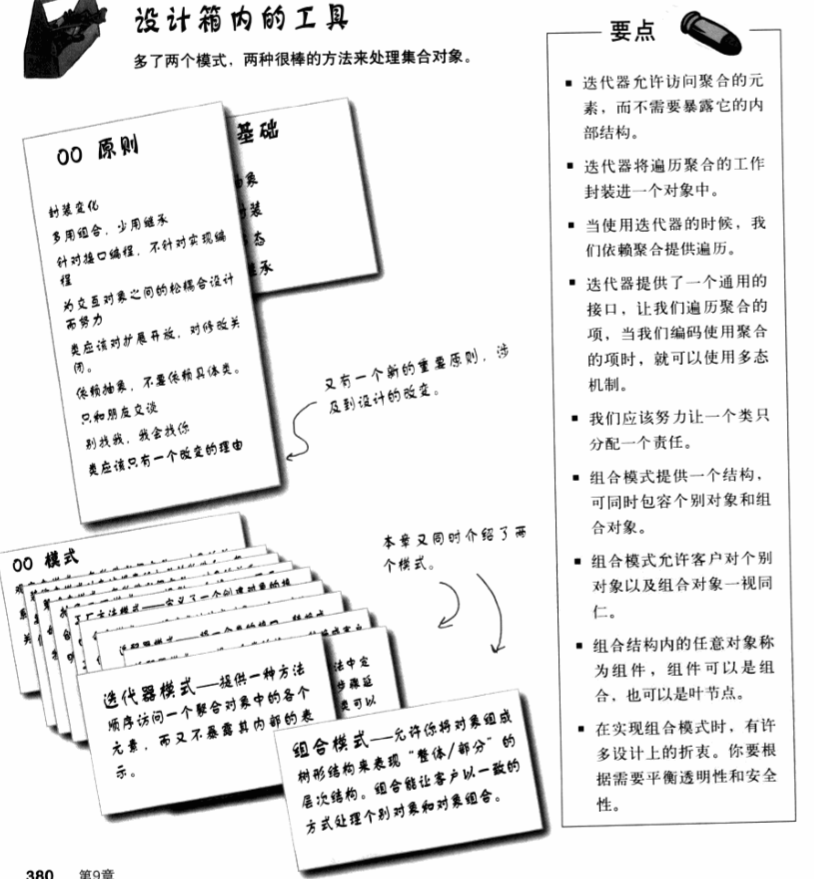

# 设计模式(HeadFirst)

## 序：设计模式六大原则

### 单一职责原则

定 义：一个类只负责一项职责

### 里氏替换原则

定义：所有引用基类的地方必须能透明地使用其子类的对象。

+ 子类可以实现父类的抽象方法,但不能覆盖父类的非抽象方法
+ 子类中可以增加自己特有的方法
+ 当子类的方法重载父类的方法时,方法的前置条件(即方法的形参)要比父类方法的输入参数更宽松
+ 当子类的方法实现父类的抽象方法时,方法的后置条件(即方法的返回值)要比父类更严

### 依赖倒置原则

定义：高层模块不应该依赖低层模块，二者都应该依赖其抽象；抽象不应该依赖细节；细节应该依赖抽象。即要面向接口编程。

```
//将司机模块抽象为一个接口
using System;
interface IDriver
{
    //是司机就应该会驾驶汽车
    void Drive(ICar car);
}

//将汽车模块抽象为一个接口：可以是奔驰汽车，也可以是宝马汽车
public interface ICar
{
    //是汽车就应该能跑
    public void Run();
}

public class Driver : IDriver
{
    //司机的主要职责就是驾驶汽车
    public void Drive(ICar car)
    {
        car.Run();
    }
}

public class Benz : ICar
{
    //汽车肯定会跑
    public void Run()
    {
        Console.WriteLine("奔驰汽车开始运行...");
    }
}

public class BMW : ICar
{
    //宝马车当然也可以开动了
    public void Run()
    {
        Console.WriteLine("宝马汽车开始运行...");
    }
}

//高层模块
public class Client
{
    public static void Main()
    {
        IDriver xiaoLi = new Driver();
        ICar benz = new Benz();
        //小李开奔驰车
        xiaoLi.Drive(benz);
    }
}
```

2. 构造函数传递依赖对象。
   在类通过构造函数声明依赖对象。

```
//将司机模块抽象为一个接口
interface IDriver {
     void drive();
}

public class Driver : IDriver{
    private ICar car;

    //注入
    public void Driver(ICar car){
      this.car = car;
    }

    public void drive(ICar car){
        this.car.run();
    }
}
```

在实际操作过程中，一般做到如下几点：

1. 底层模块尽量都有抽象类/接口
2. 变量声明类型尽量是抽象类或接口
3. 继承时遵循里氏替换原则

### 接口隔离原则

定义：客户端不应该依赖它不需要的接口；类对另一个类的依赖应当建立在最小接口上。建立单一接口，不要建立庞大臃肿的接口，尽量细化接口，接口中的方法尽量少。也就是说，我们要为各个类建立专用的接口，而不要试图去建立一个很庞大的接口供所有依赖它的类去调用。

```
interface I {
	public void method1();
	public void method2();
	public void method3();
	public void method4();
	public void method5();
}

class A{
	public void depend1(I i){
		i.method1();
	}
	public void depend2(I i){
		i.method2();
	}
	public void depend3(I i){
		i.method3();
	}
}

class B : I{
	public void method1() {
		System.out.println("类B实现接口I的方法1");
	}
	public void method2() {
		System.out.println("类B实现接口I的方法2");
	}
	public void method3() {
		System.out.println("类B实现接口I的方法3");
	}
	//对于类B来说，method4和method5不是必需的，但是由于接口A中有这两个方法，
	//所以在实现过程中即使这两个方法的方法体为空，也要将这两个没有作用的方法进行实现。
	public void method4() {}
	public void method5() {}
}
```

由于B只需要I中的一部分方法，而其它的类C用了另外几个方法，这时，就尽量把I拆分成两个接口。
采用接口隔离原则对接口进行约束时，要注意以下几点：

1. 接口尽量小，但是要有限度。对接口进行细化可以提高程序设计灵活性，但是如果过小，则会造成接口数量过多，使设计复杂化。所以一定要适度。
2. 为依赖接口的类定制服务，只暴露给调用的类它需要的方法，它不需要的方法则隐藏起来。只有专注地为一个模块提供定制服务，才能建立最小的依赖关系。
3. 提高内聚，减少对外交互。使接口用最少的方法去完成最多的事情。

### 迪米特法则

定义：也称最小知道原则，一个实体应当尽量少和其它实体发生相互作用，使得系统功能模块相对独立。这样的结果使得各个模块之间耦合度很低。例子就是中介者模式和外观模式(门面模式)

### 合成复用原则

定义：尽量使用合成或聚合，少用继承(少用继承，多用组合)

### 开放封闭原则

定义：系统应当对拓展开放，对修改封闭

## 1 设计模式入门：欢迎来到设计模式世界(涉及模式：策略模式)

### 1.1 OO设计简介

+ 良好的OO设计必须具有可复用，可扩充，可维护三个特性。

### 1.2 鸭子模拟应用


+ 加入新功能fly时：

  + 方法一，在基类中加virtual fly()，不同的鸭子继承它。可导致的问题是，有些鸭子不能飞，只能把fly置空操作。只有部分子类成员具有的行为不应该被定义为基类的方法

    这样的缺点是：

    
    A,B,D,F

  + 方法二，改成接口。能飞的鸭子继承并实现接口，其它的就不继承。但这样的问题在于，代码没法复用

### 1.3 解决办法及其步骤

1. 分开变化和不变的部分

    + **<u>设计原则1：找出可能要变化的部分，将它们独立出来，与不变化的部分区分开来，进行封装</u> **

    + 这里把fly抽取出来放到别的类去，因为有的鸭子能飞，有的不能飞，不放基类中，但也不应放能飞的子类中去实现，代码复用率低。

2. 设计鸭子行为

   + **<u>设计原则2：针对接口编程，而非实现</u> **

   + 这里定义一个IFlyBehavior接口，而抽出来的Fly的类就用来实现这个接口。以往的在子类中去实现的这种就叫依赖实现。如果还有其它的只有某些子类具有的行为，我们也另外定义一个接口，一个抽象基类，一群继承类。但不考虑合并。一般地，如果Fly行为和某个行为，如quack行为都只在某些子类同时出现，我们是不会把它们定义到同一个接口中去的。

     ```c#
     interface IFlyBehavior
     {
         void Fly();
     }
     
     
     public class FlyWithWings : IFlyBehavior
     {
         public void Fly()
         {
             Debug.Log("FlyWithWings");
         }
     }
     
     // 统一了能飞的和不能飞的东西，如果针对实现编程，那么不能飞的鸭子的这些继承类都得把FlyNoWay的Fly函数写一遍。
     public class FlyNoWay : IFlyBehavior
     {
         public void Fly()
         {
             Debug.Log("I can't fly!");
     	}
     }
     
     public class Example : MonoBehaviour, IPointerClickHandler
     {
         public virtual void OnPointerClick(PointerEventData eventData)
         {
             //声明是基类类型，实现是在子类中
             IFlyBehavior flyBehavior = new FlyWithWings();
             flyBehavior.Fly();
             Debug.Log(name);
         }
     }
     ```
     
   
     ```c#
     public abstract class Animal
     {
         public void abstract makeSound();
     }
     public Dog : Animal
     {
         public override void makeSound()
         {
             Debug.Log("Dog barking!");
     	}
     }
     //针对实现编程
     Dog d = new Dog();
     d.bark();
     
     //针对接口编程,Animal可以是抽象类，也可以是继承了接口的基类
     Animal animal = new Dog();
     animal.makeSound();
     
     //子类实例化的动作new Dog()甚至也不用再在代码中写了，可以在运行时指定具体对象
     a = getAnimal();
     a.makeSound();
     ```
   
     
   
   + **针对接口编程的优点：**
   
     + 多态。上面这种做法实际上是针对超类型编程(接口或者抽象类)这样，不管这些继承它的子类是咋实现这个接口的，我们在用的时候完全不用管，因为用的时候统一都是声明它的基类，指向的是实现的子类。
     + 便于复用。Fly的动作已经被剥离出鸭子类了，还可以被其它的对象复用，同一个飞行动作我也不用写多遍代码了。

3. 整合鸭子的行为

   + 首先把之前打算写在基类里的fly函数改成PerformFly()

   + 给基类定义一个IFlyBehavior类型的成员。

   + 如下所示,可以发现，这种鸭子的飞行行为是可以动态改变的，只要给flyBehavior赋值成不同的实现就行了，这里我们在基类中定义一些设定鸭子飞行行为的方法，给flyBehavior配套。这样咱们就可以随时改变鸭子的行为了。

     ```c#
     public class Duck
     {
         IFlyBehavior flyBehavior;
         public void PerformFly()
         {
             flyBehavior.fly();
     	}
         public void SetFlyBehavior(FlyBehavior targetFlyBehavior)
         {
             flyBehavior = targetFlyBehavior;
     	}
     }
     
     public class MallardDuck : Duck
     {
         public MallarDuck()
         {
             flyBehavior = new FlyWithWings();
     	}
     }
     ```

### 1.4 封装行为的大局观


+ 我们把抽出去的”一组行为“定义成”一组算法“。
+ 类与类的关系大致分为继承和组合。组合指的是类中包含另一个类的实例的情况。组合往往更加flexible。既可以将算法封装成类，还可以在运行时弹性地变化改变行为。
+ **<u>设计原则3：多用组合，少用继承</u> **

### 1.5 策略模式

+ 定义：策略模式定义算法组，分别封装起来，实现同一个接口。让同一算法组的可以相互替换，使得算法(Fly)的变化独立于使用算法的客户(Duck or others)。

#### 1.5.1 适用场景和优劣分析

+ 适用场景：
  + 在一个系统里面有许多类，它们之间的区别仅在于它们的行为，那么使用策略模式可以动态地让一个对象在许多行为中选择一种行为。
  +  一个系统需要动态地在几种算法中选择一种。
  +  一个对象有很多的行为，如果不用恰当的模式，这些行为就只好使用多重的条件选择语句来实现
+ 优点:
  + 算法可以自由切换
  + 避免使用多重条件判断
  + 扩展性良好，符合开闭原则
### 1.6 章节总结

+ 三个原则：
  + 封装变化：提取并独立出变化的部分
  + 面向接口编程，别面向实现
  + 多用组合，少用继承。
+ 一个模式：策略模式

### 1.7 其它要点


## 2 观察者模式

### 2.2 气象监测应用

####  2.1 基本分析

+ 主要工作：建立一个应用，利用WeatherDate取得数据并实时更新目前状况，气象统计，天气预报


+ 需求分析：
  + WeatherData类有三个获取数据的方法。
  + 当有新数据时，measurementsChanged()就得被调用。
  + 有三个布告板得实现。
  + 鉴于OO设计的可扩充，可复用，可维护。我们应当允许布告板的随意添加和删除。

#### 2.2 错误实例


+ 存在的问题：A,B,C,E


### 2.3 <u>观察者模式</u>

#### 2.3.1 观察者模式定义与实现

+ 定义：定义了对象之间的一对多的依赖关系，当一个对象改变状态时，这个对象的所有依赖者都会收到通知并自动更新。这个对象被称为主题subject，其它依赖它的就是观察者
+ 实现：实现方式多，以下图这个包含Subject与Observer接口的类设计最常见。


+ subject和Observer都作为一个接口，这里是面向接口的编程。

+ subject包含注册观察者registerObserver，注销观察者removeObserver，更新观察者notifyObserver等函数。是一个具有状态的对象，也是数据的拥有者。常常是把数据”推“向观察者

+ Observer主要有个update方法，用于更新数据。

#### 2.3.2 适用场景和优劣分析

+ 适用场景：
  + 一个抽象模型有两个方面，其中一个方面依赖于另一个方面。将这些方面封装在独立的对象中使它们可以各自独立地改变和复用。
  + 一个对象的改变将导致其他一个或多个对象也发生改变，而不知道具体有多少对象将发生改变，可以降低对象之间的耦合度。
  + 一个对象必须通知其他对象，而并不知道这些对象是谁。
  + 需要在系统中创建一个触发链，A对象的行为将影响B对象，B对象的行为将影响C对象……，可以使用观察者模式创建一种链式触发机制。
+ 优点:
  + 让subject和Observer之间松耦合。我们可以知道，改变其中一方时，并不会影响另一方。
  + 能建立一套触发机制。
+ 缺点:
  + 如果一个**被观察者对象有很多的直接和间接的观察者**的话，将所有的观察者都通知到会**花费很多时间**
  + 如果在**观察者和观察目标之间有循环依赖**的话，观察目标会触发它们之间进行循环调用，可能导致**系统崩溃**。 
  + 观察者模式没有相应的机制让观察者知道所观察的目标对象是怎么发生变化的，而仅仅只是知道观察目标发生了变化。
+ **<u>设计原则4：OO设计尽量设计成让交互对象松耦合</u> **

### 2.4 实现气象站

```c#
// 接口部分
public interface Subject
{
    public void registerObserver(Observer observer);
    public void removeObserver(Observer observer);
    public void notifyObserver();
    public void setChanged();//标记subject产生了改变，这使得通知观察者们的时机更灵活
}

public interface Observer
{
    public void UpdateInfo(float temp, float humidity, float pressure);
}

public interface DisplayElement
{
    public void disaplay();
}
```

+ 实现部分:

  + WeatherData类

  

  + CurrentConditionDisplay类（其中的一个布告板）


### 2.5 Unity中的一个观察者模式的样式

```c#
public interface ISubject
{
    void RegisterObserver(Observer observer);
    void RemoveObserver(Observer observer);
    void NotifyObservers();
    void SetSubjectState();
    bool GetSubjectState();
}

public abstract class Observer
{
    protected ISubject subject;
    protected Observer(ISubject subject)
    {
        this.subject = subject;
    }
}

public class CubeObserver : Observer
{
    public CubeObserver(ISubject subject):base(subject)
    {
        if (subject is CubeSubject)
        {
            CubeSubject cubeSubject = (CubeSubject)subject;
            cubeSubject.RegisterObserver(this);
            cubeSubject.update += this.UpdateInfo;
        }
    }
    public void UpdateInfo(Vector3 position)
    {
        Debug.Log($"Cube is on the position of {position}");
    }
}

public delegate void EventHandler(Vector3 position);
public class CubeSubject : MonoBehaviour, ISubject, IPointerClickHandler
{
    public bool subjectState;
    public event EventHandler update;
    List<Observer> observers = new List<Observer>();
    public void NotifyObservers()
    {
        if (GetSubjectState() == true)
        {
            update(transform.position);
            subjectState = false;
        }
    }

    public void RegisterObserver(Observer observer)
    {
        observers.Add(observer);
    }

    public void RemoveObserver(Observer observer)
    {
        if (observers.Contains(observer))
        {
            observers.Remove(observer);
        }
    }
    public bool GetSubjectState()
    {
        return subjectState;
    }
    public void SetSubjectState()
    {
        subjectState = true;
    }

    public void OnPointerClick(PointerEventData eventData)
    {
        SetSubjectState();
        NotifyObservers();
    }
}
```

### 2.6 章节总结

+ 一个原则：交互对象尽量松耦合
+ 一个模式：观察者模式

### 2.7 其它要点


## 3. 装饰器模式

开闭原则：

+ **<u>设计原则5：类应该对扩展开放，对修改封闭</u>**
+ 例子：观察者模式中，我们只要加入新观察者就实现了对主题subject的拓展，且没有修改subject。
+ 没必要在每个地方都用开闭原则，因为开闭原则需要加入新的抽象参差，增加代码复杂度。

### 3.1 咖啡管理器引入


+ 这些咖啡当加入调料时，又会根据加入的调料收取不同的费用。当然我们不会直接从Beverage派生出多种多样的加了某种调料的咖啡子类，因为一旦调料多了，这个组合数就会导致类的数量爆炸。

+ 一种做法是：基类的cost计算所加调料的价格，子类则在基类基础上加上咖啡价格。如下图所示。这种做法的不足点是，出了一款新饮料时，如果有些调料不适合，则仍将继承它。而且当有新调料时，又要对基类进行修改，调料价格的改变也会对基类进行修改，这样一来，造成基类修改的原因就不止一个了，这不符合单一职责原则。

  

### 3.2 <u>装饰器模式</u>

+ 装饰器和被装饰器装饰的对象具有相同的基类。这也是继承的目的，不是说违背多用组合的原则。

+ 可以用多个装饰器装饰一个对象。有鉴于此，任何被装饰过的对象，也可以当一个装饰器，去装饰别的对象。

+ **装饰器可以在自己委托的被装饰的对象的行为前后加上自己的行为。**

+ 对象能在任何时候，包括运行时动态不限量地进行装饰。

#### 3.2.1 装饰器模式定义

  + 装饰器模式动态地将责任附加到对象上。如要扩展功能，会比继承更flexible。

#### 3.2.2 装饰器模式的适用场景和优劣分析

+ 适用场景：
  + 需要扩展一个类的功能或给一个类增加附加责任。
  
  + 需要动态地给一个对象增加功能，这些功能可以再动态地撤销。
  
  + 需要增加由一些基本功能的排列组合而产生的非常大量的功能。比如给武器改造附魔，给玩家穿装备，DIY角色机甲等，实际就是给对象附加职责。
  
+ 优点:
  + 用于拓展对象行为，和继承有着一样的目的，却比继承灵活。
  + 通过使用不同的具体装饰类以及这些类的排列组合，设计师可以创造出很多不同行为的组合。装饰器模式有很好的可扩展性，同时对修改封闭，如果要修改某个decorator的元素，我们只要去改就行，如果要对decorator功能拓展，我们只要新增decorator子类就行，符合开闭原则。
+ 缺点:
  + 装饰者模式会导致设计中出现许多小的类，如果过度使用，会让程序变的更复杂。并且更多的对象会使得查错变得困难，特别是这些对象看上去都很像。
  + 装饰器模式是针对抽象而不是实现进行编程的，我们在装饰的过程中使用的是基类对象，如果打算对某个继承的子类，这个子类依赖了其它的对象，那么给这个特定组件加上装饰时，那就有问题

### 3.3 用装饰器模式写咖啡管理器（咖啡的生成：装饰者模式+工厂模式/生成器）

```c#
using UnityEngine;

// 饮料抽象类
public abstract class Beverage
{
    string description = "UnKnown Drink!";
    public abstract double Cost();
    public abstract string GetDescription();
}
// 咖啡饮料
public class Coffee : Beverage
{
    public override double Cost()
    {
        return 1;
    }

    public override string GetDescription()
    {
        return "I ordered a cup of coffee";
    }
}

public abstract class Decorator : Beverage{}
// 牛奶装饰器
public class Milk : Decorator
{
    public Beverage beverage;
    public Milk(Beverage beverage)
    {
        this.beverage = beverage;
    }
    public override double Cost()
    {
        return 0.2 + beverage.Cost();
    }
    public override string GetDescription()
    {
        return beverage.GetDescription() + ", Milk";
    }
}
// 摩卡装饰器
public class Mocha : Decorator
{
    public Beverage beverage;
    public Mocha(Beverage beverage)
    {
        this.beverage = beverage;
    }
    public override double Cost()
    {
        return 0.4 + beverage.Cost();
    }
    public override string GetDescription()
    {
        return beverage.GetDescription() + ", Mocha";
    }
}
public class DecorationExample : MonoBehaviour
{
    private void Start() {
        Beverage newCoffee = new Coffee();
        newCoffee = new Milk(newCoffee);
        newCoffee = new Mocha(newCoffee);
        Debug.Log(newCoffee.GetDescription() + $"! It costs {newCoffee.Cost()} dollars!");
    }
}
```

### 3.4 章节总结

+ 一个原则：开闭原则：对扩展开放，对修改封闭。
+ 一个模式：装饰器模式：

### 3.5 其它要点


## *<u>4. 工厂模式：实例化的低耦合</u>*

### 4.1 引入——传统new实例化的不合理性

+ 实例化过程中，适用new，而new的时候必然需要知晓具体的类，这不是针对抽象而是针对实现编程，而当加入新的具体类时，又要修改if-else语块，这不对修改关闭，不符合开闭原则。
+ 实例化的具体的类只有在运行时才知道，有时候会写出很多if-else语句，导致难以进行维护更新。

### 4.2 披萨生产模型

#### 4.2.1 传统处理方式


#### 4.2.2 封装创建对象的代码

+ 抽离if-else实例化语块，迁移到一个新对象factory中

#### 4.2.3 <u>简单工厂</u>


+ 简单地把if-else的实例化过程搬出到Factory中，然后依赖这些产品的tag/枚举生产出对应的产品

#### 4.2.4 进一步抽象

+ 问题：
  + 如果要加入更多的加盟店，有着不同的工厂。
  + 工厂的createPizza不同。但orderPizza是一样的。

+ 解决办法：
  + 有加盟店，这意味着应该把PizzaStore作为抽象类。那么工厂实现的createPizza就可以作为抽象方法放到PizzaStore里，去掉多余的SimplerPizzaFactory，把PizzaStore作为抽象类，让加盟店继承它，并定义自己的createPizza方法
  + 这些加盟店就相当于一个个工厂，而PizzaStore就是一个抽象的工厂，它定义了产品的生产接口，而实现由它的子类去做。
    
    
  + 这样就利用PizzaStore实现了多个工厂的抽象。这样就实现了orderPizza函数和具体的Factory的解耦，因为它定义在基类中，调用了工厂抽象方法createPizza，这个方法的实现在子类中，我不知道它调用了哪个子类工厂的createPizza。

#### 4.2.5 <u>工厂方法模式</u>

+ 与简单工厂将生产集中到一个工厂中不同，工厂方法模式将产品的生产方法定义为一个由子类实现的抽象方法/接口，让子类封装实现它，去实现不同的实例化过程，而让基类作为一个抽象类接口去完成生产的多态。
+ 抽象工厂具体包含两个类，一个是创建者类，Creator类，一个是产品类Product类，比如这里的Pizza抽象类。

 
 

```c#
public abstract class PizzaStore
{
    public Pizza orderPizza(string type)
    {
        Pizza pizza;
        pizza = createPizza(type);
        pizza.prepare();
        pizza.bake();
        pizza.cut();
        pizza.box();
        return pizza;
	}
    
    // 生产实例的抽象方法
    protected abstract Pizza createPizza(string type);
}
```

#### 4.2.6 再进一步抽象

+ 当我们实例化一个类时，就是再依赖它的具体类。

+ **设计原则6：<u>依赖倒置原则:依赖抽象而不要依赖实现</u>**。即：不应让高层组件依赖低层组件，且不管高低，都应依赖抽象。比如上面的PizzaStore的子类就依赖了抽象，在CreatePizza时，参数是抽象的Pizza，而不是一个个具体的类。
  + 如何遵循这个原则？
    1. 变量不能有具体类的引用。因为一旦用new，就会有具体类的引用，我们还是用工厂来生产。
    2. 不能让类从具体类中派生。否则就会依赖具体类了，应当从抽象中派生。
    3. 不要覆盖基类已经实现的方法。覆盖就说明这个基类不适合被继承，要遵循里氏替换。


### 4.3 引入生产原料工厂

+ 在工厂方法实例化物体时，除了各个实例化的工厂的生产过程不同，需要分别实现以外，生产Pizza的prepare函数所需的材料也可能不同。那么，上述方式prepare函数对于需要改变生产材料的情况就很不好修改了。于是对这些相同原料的不同差异定义出抽象基类和子类，产生一个材料工厂。

+ 将材料工厂抽象基类和Pizza子类组合，将pizza的材料准备交由材料工厂完成，实现材料生成与Pizza的解耦。

  

+ 最后，把原料工厂和生成Pizza的PizzaStore基类组合，在PizzaStore子类实例化时，将原料厂也实例化，同时在生成Pizza时传入材料工厂参数，让工厂生产原料。

  

#### 4.3.1 <u>抽象工厂模式</u>

+ 定义：提供一个接口，用于创建相关或者依赖对象的家族，而不需要明确指定具体类。比如上面的原料工厂，实现了Pizza所依赖的所有对象的生产,而这之中也有工厂方法的思想，即，基类提供生产接口，具体生产啥由子类实现。与工厂方法中一个工厂只生产一个子类不同，抽象工厂模式的每个工厂都生产所有的系列产品。

  

  

#### 4.3.2 抽象工厂和工厂方法

+ 区别：
  + 抽象工厂采用组合的方式，而工厂方法采用继承。
  + 抽象工厂可以把产品生产过程中相关的产品集合起来生产。

### 4.4 章节总结

+ 一个原则：依赖倒置原则:依赖抽象而不要依赖实现
+ 三个工厂模式

#### 4.4.1 三个模式的适用场景

+ 简单工厂：一个工厂生产所有的产品，当产品的抽象层只有2层时常用。
+ 工厂方法：抽象基类提供接口，子类工厂实现一个产品的生产，当产品抽象层只有2层时常用。
+ 抽象工厂模式：基类提供接口，子类工厂实现一个基类产品的所有产品的生产，当产品抽象层3层时常用。

### 4.5 其它要点


## 5.单例模式

+ 用于处理仅应该存在一个实例的对象。如线程池，全局对象池，

### 5.1 单例模式

不作过多赘述。摆两个通用模板。

+ 通用模板一

  

+ 通用模板2

  

## 6 命令模式

### 6.1 引入

+ 把方法也封装起来，把运算块包装成形。

### 6.2 <u>命令模式</u>

+ 定义：将”请求“封装成对象，以便使用不同的请求、队列、日志来参数化其它对象。支持撤操作。
+ 例子：一个万用遥控器有8个按钮，每个可以连接某一个电器，用8个按钮控制8个命令。则使用一个接口Command，每个电器继承并实现这个接口，把原来的电器类作为对象成员，接口的方法就调用各个电器成员的方法。使用时，遥控器类应当有一个Command类成员列表，一个设置Command[i]当前控制的方法，一个调用Command方法的方法。


### 6.3 命令模式实例1——命令的执行

+ 实现使用命令的遥控器


+ 实现一个具体的命令

  
  + 这个命令封装了3个命令。
  + 更有趣的是，我们可以在这个具体命令上加一个SetStereo(Stereo newStereo)的方法，并把Stereo视作一个基类，实现更多的复用。

#### 6.3.1 <u>空对象使用</u>

+ 在使用命令时，不用判断onCommands[slot] != null，则可以用一个对象继承接口，但接口函数啥事不干，这个对象就是空对象。

#### 6.3.2 加入撤销功能

+ 在Command接口中加入undo方法，并让这些继承它的类实现它。
+ 在遥控器中，利用栈来存储一个命令栈，根据它进行撤销。

#### 6.3.3 根据状态的命令撤销


### 6.4 命令模式中的宏命令

+ 让一个命令执行其它许多的命令，或者撤销其它许多的命令


### 6.5 命令模式的实例2——命令涉及参数的输入和命令获取

假设要做一个策略回合制游戏，人物每回合可以根据输入移动一个方位。

+ 阶段一

  如果只能移动自己，直接将input和特定的移动指令关联

  ```c#
  public class InputHandler
  {
  	public void HandleInput()
      {
          if (Input.GetKeycodeDown(KeyCode.A))
          {
              Player.MoveLeft();
  		}
          ...
  	}
  }
  ```

  

+ 阶段二

  将指令用命令模式封装一下，但仍然关联

  ```c#
  public interface Command
  {
      void execute();
      void undo();
  }
  
  public MoveLeftCommand : Command
  {
      Player player;
      public void execute()
      {
          player.MoveLeft();
  	}
  }
  
  public class InputHandler
  {
  	public void HandleInput()
      {
          if (Input.GetKeycodeDown(KeyCode.A))
          {
              MoveLeftCommand.execute();
  		}
          ...
  	}
  }
  ```

+ 阶段三

  假设execute有参数，允许移动其它对象。这里采用取得指令，但延后执行的办法。当然，不建议在Command接口execute加参数，这提高了耦合度，不好，应当采用阶段四的办法。

  ```c#
  public interface Command
  {
      void execute(CommandAruguments arguments);
      void undo();
  }
  
  public MoveLeftCommand : Command
  {
      Player player;
      public void execute()
      {
          player.MoveLeft();
  	}
  }
  
  public class InputHandler
  {
  	public Command GetInputCommand()
      {
          if (Input.GetKeycodeDown(KeyCode.A))
          {
              return MoveLeftCommand;
  		}
          ...
          return null;
  	}
      public void GetArguments();
      
      public CommandArguments HandleInput()
      {
          CommandArguments arguments = GetArguments();
          Command command = GetInputCommand();
          if (command != null)
          {
              command.execute(arguments);
  		}
  	}
  }
  ```

+ 阶段四

  假设能够移动一个选定的角色，同时可以撤回命令。

  角色相当于指令执行的参数，我们把参数作为Command子类的成员。利用这些参数并执行的方法放在Command子类中，在execute实现过程中，就调用这些方法。而对于参数的获取，应当放在指令的获取之前，然后用这些参数实例化指令子类。

  ```c#
  public interface Command
  {
      void execute();
      void undo();
  }
  
  //通用移动类
  public enum MoveDirection;
  public MoveCommand : Command
  {
      public MoveObject moveTarget;
      public MoveDirection moveDirection;
      public MoveCommand(MoveObject moveObject, MoveDirection direction)
      {
          moveTarget = moveObject;
          moveDirection = direction;
  	}
      //这里定义一个构造函数，用来把参数进行初始化，得到一个特定的命令子类。
      public void execute()
      {
          player.MoveTowards(moveTarget,moveDirection);
  	}
      //把命令执行的参数作为子类成员
  }
  
  public class InputHandler
  {
  	public Command GetInputCommand()
      {
          MoveObject target = GetMoveObject();
          if (Input.GetKeycodeDown(KeyCode.A))
          {
              return new MoveCommand(target, left);
              //这里实例化通用的移动函数，与上面每个移动都设置一个特定的函数不同。这里实际上把命令的构造放在了命令的获取前，而不是静态地先构造好然后返回。
  		}
          ...
          return null;
  	}
      public CommandArguments HandleInput()
      {
          Command command = GetInputCommand();
          if (command != null)
          {
              command.execute();         	CommandRecorder.Instance.commandStack.Push(command);
  		}
  	}
  }
  
  public class CommandRecorder
  {
      public stack<Command> commandStack;
      private CommandRecorder instance;
      public CommandRecorder Instance{
          get
          {
              if (instance == null)
              {
                  instance = new CommandRecorder;
  			}
              return instance;
  		}
      }
  }
  ```


### 6.6 命令模式的更多应用

+ 工作队列：设计一个处理类，保存命令队列，并对其进行处理。还可以利用多线程对程序进行处理。
+ 日志请求：将操作记录下来，同时能够不断恢复到之前的状态。在命令基类中加入store和load方法

### 6.7 章节总结

+ 一个模式：命令模式。注意命令的参数的获取以及命令的执行，这涉及到命令子类的构造。

### 6.8 其它要点


## 7. 适配器模式&外观模式

### 7.1 适配器模式引入

+ 假设有一个鸭子接口，可以继承它，定义各种鸭子，有一个鸡接口，可以继承它，定义各种鸡，如火鸡Turkey。如何用一只Turkey伪装成一只鸭子?

  ```c#
  public interface Duck
  {
      void Quack();
      void Fly();
  }
  
  public interface Chicken
  {
      void Fly();
      void Shout();
  }
  public class Turkey: Chiken
  {
      void Fly(){}
      void Shout(){}
  }
  
  public class ChickenAdapter : Duck
  {
      Turkey turkey;
      ChickenAdapter(Turkey chicken)
      {
          turkey = Turkey;
  	}
      void Fly(){}
      void Quack(){}
  }
  ```

### 7.2 适配器模式解析

+ 适配器使用被适配的对象的接口，将这些接口用用户使用的接口封装，完成适配。一般地，都是用一个适配器包装一个被适配者。
+ 定义：将一个类的接口转换成客户期望的另一个接口。让原本不兼容的类合作无间。

### 7.3 对象和类的适配器

+ 下图是对象适配器


+ 下图是类适配器


+ 类适配器和对象适配器的唯一区别在于其为多继承，而不是使用组合。

### 7.4 外观模式(Facade Pattern)

+ 外观模式简化接口。将客户与子系统实现解耦。而适配器模式是将接口转换成不同接口。
+ 例如：一个操作可能涉及很多个类的方法，我们就使用一个Facade，将这些类作为其对象成员，为这个操作定义一个方法，这个方法调用这些类的方法，实现接口简化。

+ 定义：外观模式提供一个统一的接口，用来访问子系统中的一群接口，让子系统更容易使用。

  

+ **<u>设计原则7：最小知道原则：尽量减少对象之间的交互不要让太多的类耦合在一起</u>**

  + 这个原则要求在对象具有的方法中所能使用的方法应当是如下这些：

    + 对象本身具有的方法
    + 对象所拥有的对象成员所具有的方法
    + 作为参数传入的对象的方法
    + 方法本身创建的对象的 方法

  + 而不应该当调用另一个调用返回的对象的方法。

    

### 7.5 章节总结

+ 两个模式：适配器模式，外观模式。
  + 适用范围：当需要用一个现有的类但该类的接口不符合需要时使用适配器模式。当需要简化并统一一个很大的接口或者很一群很复杂的接口时使用外观模式。
  + 记住两张图就行。

+ 一个原则：迪米特法则（最小知道原则）

### 7.6 其他要点


+ 区分装饰器模式，外观模式，适配器模式：
  + 目的不同：装饰器模式用于在不改变接口的情况下新增行为。适配器模式在于转换接口，而外观模式在于简化接口。

## 8. 模板模式

### 8.1 模板模式引入

+ 加入现在有咖啡和茶两种饮料制作工序。
  + 咖啡的工序:煮沸水，冲泡，装杯，加糖和牛奶
  + 泡茶的工序:煮沸水，浸泡茶叶，装杯，加柠檬

+ 它们都有煮沸水和装杯操作，但调料和冲泡过程不同。

+ 那么应当定义一个抽象基类CaffeineBeverage，作为饮料冲泡的模板基类。

  

### 8.2 模板方法

+ 定义：模板方法定义了一个算法的步骤，将一些步骤的实现延迟到子类，使得子类在不改变算法结构的情况下，重新定义算法的步骤。

  

+ 优点：
  + 便于实现代码复用
  + 算法只存在于一个地方，便于修改
  + 基类提供了一个框架，便于添加新的部分。
  + 基类专注于算法本身，而子类则专注实现。

+ 基本结构

  ```C#
  abstract class AbstractClass
  {
      void templateMethod()
      {
          primitiveOperation1();
          primitiveOperation2();
          concreteOperation();
          hook();
  	}
      
      abstract void primitiveOperation1();
      //由子类决定的步骤
      abstract void primitiveOperation2();
      void concreteOperation(){}//统一使用的
      void hook(){}//默认不做事的方法
  }
  ```
  
+ 典型例子，C++ algorithm的sort，实现了CompareTo的类都能用

### 8.3 对模板方法进行挂钩

+ hook是一种被声明在抽象类的方法。只有空的或者默认的实现。

  其可以让子类实现算法中可选的部分，可以去实现，也可以不实现，因为不是抽象函数。

+ 用途：

  1. 作为算法中的条件控制部分。

  ```c#
  public abstract class AbstractClass
      {
          void templateMethod()
          {
              primitiveOperation1();
              primitiveOperation2();
              concreteOperation();
              if (hook())
              {
                  primitiveOperation3();
              }
          }
          
          protected abstract void primitiveOperation1();
          //由子类决定的步骤
          protected abstract void primitiveOperation2();
          protected abstract void primitiveOperation3();
          void concreteOperation(){}//统一使用的
          protected virtual bool hook(){return true;}//默认返回true
      }
      public class ConcreteClass1 : AbstractClass
      {
          protected override void primitiveOperation1(){}
          protected override void primitiveOperation2(){}
          protected override void primitiveOperation3(){}
      }
  ```

+ **<u>设计原则8：好莱坞原则：高层组件能调用低层组件，但低层不能直接调用高层</u>**

### 8.4  对比模板方法，策略模式，工厂方法

+ 模板方法：子类决定如何实现算法步骤。适用继承而非组合来实现算法。
+ 策略模式：定义算法家族，让算法可以互换。每个算法都被一个类封装起来了，这些方法的实现由各个算法的子类实现，与模板方法中由模板子类全部实现不同。使用组合而非继承来实现一个方法。
+ 工厂方法：由子类决定实例化哪个具体类。是模板方法的一个特殊版本。

### 8.5 章节总结

+ 一个模式：模板模式
  + 适用范围：
+ 一个原则：好莱坞原则

### 8.6 其它要点


## 9. 迭代器与组合模式

+ 目标：让客户在无法知晓存储方式的情况下遍历对象。

### 9.1 迭代器模式

+ 定义：提供一种方法顺序访问每一个聚合对象中的各个元素，而又不暴露其内部的表示
+ 优点：
  1. 可以顺序访问一个聚合对象中的元素，而又不用知道其内部如何表示。
  2. 把在元素见游走的责任交给了迭代器而非聚合对象本身。符合了单一职责原则


#### 9.1.1 实例

```C#
//通过迭代器模式，将使用不同数据结构存储同一类对象的遍历过程进行了统一
public interface Iterator{
	bool hasNext();
    Object Next();
}

public class DinerMenuIterator : Iterator
{
    MenuItem [] itemArray;
    public bool hasNext(){}
    public Object Next(){}
}
public class BreakfastIterator : Iterator
{
    ArrayList<MenuItem> itemArray;
    public bool hasNext(){}
    public Object Next(){}
}
public interface Menu
{
    Iterator CreateIterator();
}
public class DinerMenu : Menu
{
    MenuItem [] itemArray;
    public Iterator CreateIterator()
    {
        return new DinerMenuIterator(itemArray);
    }
}
public class BreakfastMenu
{
    ArrayList<MenuItem> itemArray;
    public Iterator CreateIterator()
    {
        return new BreakfastIterator(itemArray);
    }
}
public class Waitress
{
    ArrayList<Menu> menuList;//面向接口，而不是实现
    
    public Waitress(ArrayList<Menu> newMenuList)
    {
        menuList = newMenuList;
    }
    
    public void printMenu()
    {
        Iterator menuIterator = menuList.iterator();
        while(menuIterator.hasNext())
        {
            Menu menu = (Menu)menuIterator.next();
            printMenu(menuIterator.CreateIterator());
        }
    }    
    public void printMenu(Iterator iterator){}
}
```

+ **<u>设计原则8：单一职责原则：一个类应该只有一个引起变化的原因，一个类最好不超过一个责任</u>**
+ 内聚：度量一个类或模块紧密地达到单一目的或责任。高内聚说明一个模块或一个类设计成只支持一组相关的功能。如果支持一组不相关的功能，则说它低内聚。

### 9.2 组合模式

+ 定义：允许将对象组合成树状结构来表现“整体/部分”层次结构。以让客户以一致的方式处理个别对象以及对象组合。整体和部分通常是以树的形式展现的。

#### 9.2.1 实例

+ 有多个菜单Menu，每个Menu下有多个MenuItem，同时有的Menu下又有子菜单SubMenu。子菜单和Menu基本一致，如此，可以将MenuItem和SubMenu和Menu抽象一层基类MenuComponent，这样Waitress就依赖MenuComponent,不再依赖Menu，又统一了MenuItem和SubMenu的访问。

  

+ 由于SubMenu和MenuItem本身支持的操作有很多不同，所以基类的默认操作就是抛出异常。子类只覆盖其有用的方法，没用的也是要么返回null/false，要么不管，这样进行统一处理的时候就不用判断到底是哪个子类了。

+ 评价组合模式：我们发现组合模式的抽象基类既负责层次管理，还负责菜单执行操作。违背单一职责原则，且不那么安全，因为有可能使用子类执行不能执行的方法。

### 9.3 回到迭代器模式

+ 空迭代器：有时一个类里面没有可遍历的东西，这时我们创建一个空迭代器，在组合模式的框架下，对于这种类，它的hasNext()总为false

### 9.4 章节总结

+ 两个模式：组合模式、迭代器模式
+ 一个原则：单一职责原则
+ 适用范围：
  + 组合模式常用于需要将不同对象采用一视同仁的方式访问/操作时。
  + 迭代器模式则用于统一对不同集合的访问，而不需要管其内部实现时

### 9.5 其它要点



## 10. 状态模式

+ 最初的方案：

  + 将状态集中在状态持有者。对于方法，则判断当前状态并选择执行不同的部分。

  ```c#
  public class Example
  {
      static int idle = 1;
      static int move = 2;
      static int currentState = idle;
     	
      void operation1()
      {
          switch(currentState)
          {
              case idle:
                  break;
              case move:
                  break;
  		}
      }
  }
  ```

+ 改进方案：充分发挥组合模式的优势，**把变化封装起来作为高层**，子类去实现不同状态下的操作与行为，同时让状态持有者持有状态的成员对象。

### 10.1 状态模式解析

+ 状态模式：封装基于状态的行为，并将行为委托到当前状态。
+ 这和策略模式很类似，都运用了组合的特性，能够在运行时动态改变。


### 10.2 章节总结

### 10.3 其它要点


## 11.代理模式

+ 基本作用：为其它对象提供一种代理来控制这个对象的访问。通常用于网络远程控制的场景。

  
  
  
  
  

+ 客户对象通过客户辅助对象和服务辅助对象的交互来达成与服务对象的交互。

  基本过程：

  + 客户对象通过向客户辅助对象发起请求和调用。
  + 辅助对象则进行远程通信，把信息打包给服务辅助对象。
  + 服务辅助对象得到消息后进行解包，并调用服务对象上的方法，将得到的返回值打包回送给客户辅助对象。
  + 客户辅助对象在得到返回数据后解包，送还给客户对象

