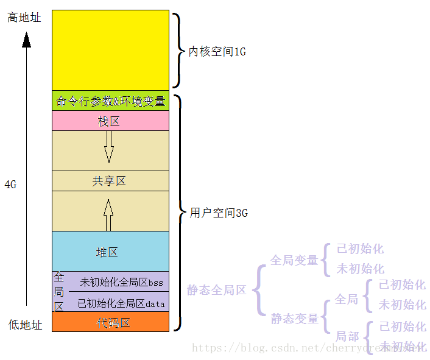
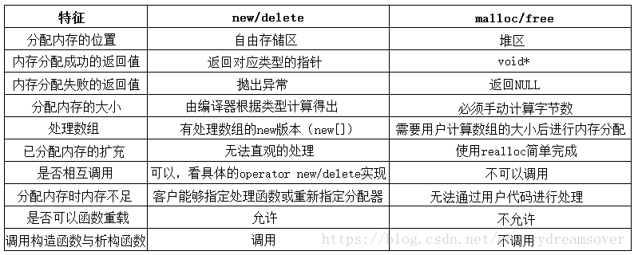

# C++面试

## [杂项]
#### define，const，enum，inline的区别

1. 编译器的处理方式不同

   define在预处理阶段对定义的常量进行替换展开

   const在编译运行阶段使用

   enum在程序运行时起作用

2. 分配内存不同

   define不分配内存，只进行替换展开。

   const常量会分配内存，在堆或者栈

   enum则把内存分配在静态存储区

3. 类型检查方面

   define无类型检查和安全检查，会导致边际效应，出现不可预知的错误。

   const在编译阶段进行类型检查和安全检查

   enum在编译阶和运行阶段段类型检查，但只能进行整形的定义

   inline进行参数类型的安全检查

一般都不使用宏，对于变量，一般是使用enum和const来替换它。对于形似函数的宏定义，则是使用inline替换。

## [指针、引用]

#### 指针和引用的联系和区别

1. 指针可以为空，引用也行。
2. 指针可以不初始化，但引用必须初始化
3. 指针可以随时改变指向的目标，但引用不行

#### 系统如何知道指针越界？

1. VC下有一个结构体_CrtMemBlockHeader，里面有一个Gap属性，这个Gap数组放在你的指针数据的后面，默认为0xFD，当检测到你的数据后不是0xFD的时候就说明的你的数据越界了

## [编译器优化策略]
#### C++编译器常见的优化

1. 常量替换：

   int a = 2； int b = a； return b；优化成return 2

2. 无用代码消除。若返回值与参数与之无关，则直接优化掉。

3. RVO和NRVO：

   RVO：return value optimization，返回值优化

## [模板]

#### C++模板的几个类型

```c++
template <typename T1, typename T2>
void Print(T1 x,T2 y)
{
    cout << x;
    cout << y;
}

template <typename T>
T add(T x, T y)
{
    return x + y;
}

//模板的显示具体化
template<> add<int>(int x, int y)
{
    return x + y;
}

//模板的部分具体化
template <typename T2>
void Print<int>(int x,T2 y)
{
    cout << x;
    cout << y;
}

//非类型模板参数必须是整形类数据（bool、char、int、long、long long，enum）或者指向外部链接对象的指针
template <typename T,int num=10>
int func(T x,T y)
{
    return x*y*num;
}

//默认模板参数
template<typename T=int> void testTemplateFunc(T param)
{
	cout<<"TemplateFunc's param="<<param<<endl;
}
//类的成员模板
class X
{
   template <class T> void mf(T* t) {}
};
```

## [内存管理]
#### 构造函数、复制构造、赋值运算符、析构函数。
+ 构造函数
  + 构造函数不能定义成虚函数，因为虚函数是按照虚函数表进行调用的，但还没构造，连虚函数表都没有，就无从谈起虚函数了。 
  + 如果有基类，先调用基类构造，再调用自己的构造
  + 构造函数分成默认构造函数、自定义的构造函数、复制构造、移动构造
    + 默认构造函数
      1. 没有参数
      2. 如果没有显式定义构造函数，则会自动生成之。否则得自己加
    + 自定义构造函数
    + 复制构造函数
      1. 参数是const classType&
      2. 如果自己没定义，会自动生成一个浅拷贝版本
    + 移动构造函数
      1. 对于临时对象，在利用它进行对象复制时调用
      2. 一般地，对于含有指针内容的类，在移动构造函数会把指针进行移交
+ 赋值运算符重载
  + 当类本身未被构造时，使用＝会调用复制构造函数
  + 仅当类本身已经构造了，再使用＝才会调用赋值运算
+ 析构函数
  + 析构函数
    + 一个类仅有一个构造函数，没显式定义则有自动生成的，不会释放指针
    + 可以是虚函数
    + 在程序结束进行释放时，在同一个语块内，先定义的后释放。
    + 如果有基类，则先调用自己的析构，再调用基类析构
#### 类的大小计算
**空类占一个字节，不为空这个字节就不算了**。空类的一个字节是为了区分不同类的，因为实例化的时候必须得给它分配内存，最少一个字节，所以就加上一个字节的占位

**对于继承了空类的，会有空类字节优化，不再计算父类大小**

**static成员变量，类方法不占类的内存**

**类的局部数据成员按内存对齐原则计算**

**如果有虚函数，则加上虚函数表的指针大小**

**如果是继承的子类，则加上父类数据成员大小**

**如果该子类是多继承，则虚函数表的指针有多个**

**内存对齐：**

+ 结构体第一个成员的**偏移量（offset）**为0，以后每个成员相对于结构体首地址的 offset 都是**该成员大小与有效对齐值中较小那个**的整数倍，如有需要编译器会在成员之间加上填充字节。一般默认是pragma pack()，会挑数据成员里size最大的。对于结构体成员，它的对齐按照结构体内最大的size。

+ **结构体的总大小**为 有效对齐值和最大的成员的size中较小值 的**整数倍**，如有需要编译器会在最末一个成员之后加上填充字节。

#### 内存分配

+ C++主要分为栈、堆、静态区/全局区、常量区、代码区
  + 栈：存放局部变量、函数参数、返回数据、返回地址等
  + 堆：一般存放动态内存分配的东西。malloc/free开辟的内存一般在这
  + 自由存储区：自由存储区是new/delete分配的地方，当然一般也在堆区内
  + 静态区：分为初始化全局区(data)和未初始化全局区(bss)
  + 常量区：存放常量字符串
  + 代码区：存放二进制代码



+ 堆和栈的区别
  + 管理方式不同：栈是由编译器自动申请和释放空间，堆是需要程序员手动申请和释放；
  + 空间大小不同：栈的空间是有限的，在32位平台下，堆往往可分配空间更大。
  + 能否产生碎片：栈和数据结构中的栈原理相同，在弹出一个元素之前，上一个已经弹出了，不会产生碎片，如果不停地调用malloc、free对造成内存碎片很多；
  + 生长方向不同：堆生长方向是向上的，也就是向着内存地址增加的方向，栈刚好相反，向着内存减小的方向生长。
  + 分配方式不同：堆都是动态分配的，没有静态分配的堆。栈有静态分配和动态分配。静态分配是编译器完成的，比如局部变量的分配。动态分配由 malloc 函数进行分配，但是栈的动态分配和堆是不同的，它的动态分配是由编译器进行释放，无需我们手工实现。
  + 分配效率不同：栈的效率比堆高很多。栈是机器系统提供的数据结构，计算机在底层提供栈的支持，分配专门的寄存器来存放栈的地址，压栈出栈都有相应的指令，因此比较快。堆是由库函数提供的，机制很复杂，库函数会按照一定的算法进行搜索内存，因此比较慢。
+ new与malloc
  + 不少new的实现是使用malloc
  + 区别：



+ 静态全局变量和全局变量
  + 都在静态区。都会有默认值
  + 静态的只在本文件生效。全局则在别的也可调用。这也意味着在别的文件不能定义与全局变量相同的变量名。

## [函数多态]

#### 虚函数与虚函数表

+ 如果一个类包含虚函数，则会在类开始分配一个4字节的虚函数指针，指向一个虚函数表。
+ 虚函数表的每个项代表一个虚函数的地址

+ 对于子类，其虚函数表会将父类虚函数表照搬过来，然后在后面按顺序加上自己新定义的虚函数地址，如果有重写父类虚函数，就把重写的覆盖掉父类的对应函数地址。

+ 如果子类是多继承，则会有多个虚函数指针和多个虚函数表。自己新定义的虚函数会接在第一个虚函数表后面。

+ 动态联编实际上是利用偏移地址决定使用哪个函数的，在多继承时，以指针为例，此处把Base2\*强制赋值给Base1\*，调用时发现Base1->X1()调用了Base2->X2()。

  ```c++
  class Base1
  {
  public:
      virtual void X1(){cout << "X1\n";}
  };
  
  class Base2
  {
  public:
      virtual void X2()
      {
          cout << "X2\n";
      }
  };
  
  class Child : public Base1,public Base2
  {
  };
  int main()
  {
      Child b;
      Base1* ptr1 = &b;
      Base2* ptr2 = &b;
      ptr1 = (Base1*) ptr2;
      ptr1->X1();
      system("pause");
  }
  //这里输出结果是X2
  ```

  
