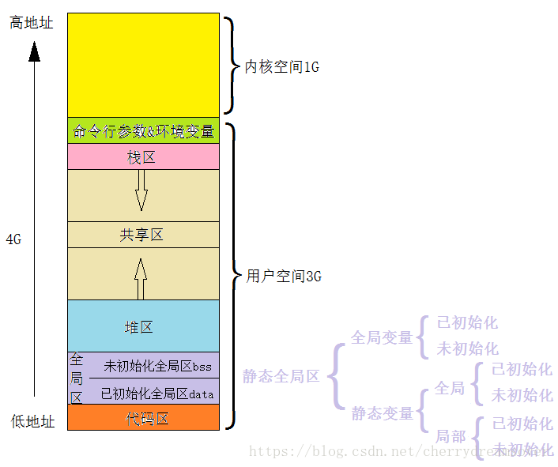
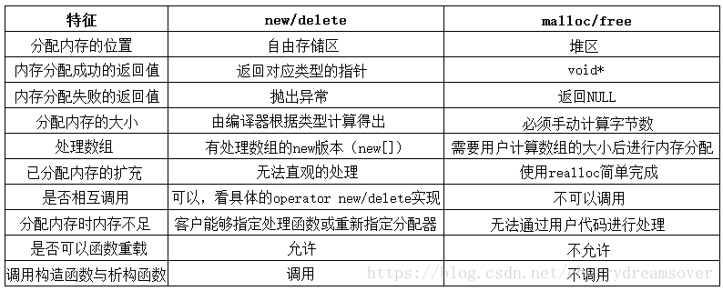

# C++面试

## [关键字]

#### 1. define，const，enum，inline的区别

1. 编译器的处理方式不同

   define在预处理阶段对定义的常量进行替换展开

   const在编译运行阶段使用

   enum在程序运行时起作用

2. 分配内存不同

   define不分配内存，只进行替换展开。

   const常量会分配内存

   enum则把内存分配在静态存储区

3. 类型检查方面

   define无类型检查和安全检查，会导致边际效应，出现不可预知的错误。

   const在编译阶段进行类型检查和安全检查

   enum在编译阶和运行阶段段类型检查，但只能进行整形的定义

   inline进行参数类型的安全检查

一般都不使用宏，对于变量，一般是使用enum和const来替换它。对于形似函数的宏定义，则是使用inline替换。

#### 2. static的作用

1. 定义静态变量，静态变量只能在本文件夹中进行使用，放在静态区（全局区）
2. 定义静态函数
3. C++中，static还可以在类内部定义静态成员变量以及函数。这样的成员或者函数都是类的一部分，所有类的实例都共享该对象
   + static还能用来实现线程安全的懒汉式单例
   + 由于**static成员是共享的，所以没有this指针**，this指针是在调用类的非静态成员函数时，作为参数放在寄存器里面传入的

## [面向对象]

#### 1. C++面向对象三大特点

+ 封装
  + 封装就是指把对象的全部数据和全部方法结合在一起形成一个不可分割的独立单位。
  + 好处：用户只能见到对象封装界面上的信息，对象内部对用户是隐蔽的。
+ 继承
  + 子类继承父类的数据成员和方法
  + 好处：提高复用性
+ 多态
  + 动态多态性是指在基类中定义的属性或服务被派生类继承后，可以具有不同的数据类型或表现出不同的行为。
  + 好处：提高复用性

#### 2. 静态多态和动态多态

+ 动态多态/运行时多态
  + 动态多态是指以虚函数为依托的**运行时多态**，基类的虚函数由派生的子类重写，通过指向**基类的指针/引用**实现多态。**除了返回类型协变这个特殊情况以外。协变就是基类返回基类指针，子类重写返回子类指针，即使返回类型不同，也认为是重写了父类的虚函数**
  + 动态多态本质上就是**面向对象设计**中的继承、多态的概念。动态多态中的接口是显式接口（虚函数），主要也是用在面向对象编程。
  + 优点：
    + 便于处理异质对象
  + 缺点：
    + 运行期间通过虚函数绑定，提高了开销。且编译器无法对其优化
    + 类继承层次庞大，对类的修改影响继承层次
+ 静态多态/编译期多态
  + 静态多态就是**各个类实现相同的函数接口**，这些个接口是隐式接口，即没有继承而是都在内部有相同的函数声明。而**操作这些对象的函数被定义成模板函数**，通过传入不同的模板类，实现静态多态。
  + **模板编程及泛型编程**中，是以**隐式接口和编译器**多态来实现静态多态
  + 优点：
    + 带来了泛型编程和STL
    + 编译期完成多态，提高了效率
    + 具有很强的适配性与松耦合性，对于特殊类型可由模板偏特化、全特化来处理。
  + 缺点：
    + 可读性降低，调试也困难
    + 无法实现模板的分离编译，工程量大时，编译时间也长
    + 无法处理异质对象集合，这类似于重载函数在编译期进行推导，以确定哪一个函数被调用。

#### 3. 重写和重载

+ 重载就是函数名相同，但参数类型 / 参数个数 / 参数顺序 / 返回值不同的同名函数
  + 内部其实是编译期间通过命名倾轧，改写函数名来区分不同的。
+ 重写就是多态里面子类对父类的完全相同的函数的重写。需要注意的是，如果父类里面有对虚函数的重载，即使子类只想重写一个虚函数，它也必须重写重载出来的所有函数。

#### 4. 虚函数与虚函数表

+ 如果一个类包含虚函数，则会在类最前面分配一个4字节的虚函数表指针（32位系统），指向一个虚函数表。虚函数表指针在对象创建时生成。
+ 虚函数表的每个项代表一个虚函数的地址。虚函数表编译期生成。

+ 对于子类，其虚函数表会将父类虚函数表照搬过来，然后在后面按顺序加上自己新定义的虚函数地址，如果有重写父类虚函数，就把重写的覆盖掉父类的对应函数地址。

+ 如果子类是多继承，则会有多个虚函数指针和多个虚函数表。自己新定义的虚函数会接在第一个虚函数表后面。

+ 动态联编实际上是利用偏移地址决定使用哪个函数的，在多继承时，以指针为例，此处把Base2\*强制赋值给Base1\*，调用时发现Base1->X1()调用了Base2->X2()。

  ```c++
  class Base1
  {
  public:
      virtual void X1(){cout << "X1\n";}
  };
  
  class Base2
  {
  public:
      virtual void X2()
      {
          cout << "X2\n";
      }
  };
  
  class Child : public Base1,public Base2
  {
  };
  int main()
  {
      Child b;
      Base1* ptr1 = &b;
      Base2* ptr2 = &b;
      ptr1 = (Base1*) ptr2;
      ptr1->X1();
      system("pause");
  }
  //这里输出结果是X2
  ```

#### 5. 构造函数、复制构造、赋值运算符、析构函数。
+ 构造函数
  + 构造函数不能定义成虚函数，因为虚函数是按照虚函数表进行调用的，但还没构造，连虚函数表都没有，就无从谈起虚函数了。 
  + 构造函数分成默认构造函数、自定义的构造函数、复制构造、移动构造
    + 默认构造函数
      1. 没有参数
      2. 如果没有显式定义构造函数，则会自动生成之。否则得自己加
    + 自定义构造函数
    + 复制构造函数
      1. 参数是const classType&
      2. 如果自己没定义，会自动生成一个浅拷贝版本
    + 移动构造函数
      1. 对于临时对象，在利用它进行对象复制时调用
      2. 一般地，对于含有指针内容的类，在移动构造函数会把指针进行移交
+ 赋值运算符重载
  + 当类本身未被构造时，使用＝会调用复制构造函数
  + 仅当类本身已经构造了，再使用＝才会调用赋值运算
+ 析构函数
  + 析构函数
    + 一个类仅有一个构造函数，没显式定义则有自动生成的，不会释放指针
    + 可以是虚函数
    + 在程序结束进行释放时，在同一个语块内，先定义的后释放。
    + 如果有基类，则先调用自己的析构，再调用基类析构

#### 6. 构造一个对象的过程和析构的过程

构造函数的调用顺序与成员初始化列表无关

+ 先构造基类
  + 先虚拟继承的虚基类
  + 再非虚拟继承的基类
  + 注意虚拟继承的类只保留一个虚的父类
+ 再按照内部声明顺序构造成员对象
+ 再调用构造函数括号内的构造语句

析构的话则相反

#### 7. 向下转型和向上转型

+ 子类->父类：向上转型，使用dynamic_cast即可
+ 父类->子类：向下转型，不安全

#### 8. 析构函数为啥是虚函数，构造为啥不行

+ 析构函数是虚函数主要是能保证在使用基类指针指向子类对象时，子类对象的数据能正确释放。
+ 构造函数为啥不行，老生常谈了。

#### 9. 简述移动构造函数和移动赋值函数

+ 移动构造函数就是构造过程中把一个对象的数据移动到另一个对象，对于copy构造函数而言，它则是将数据复制过去。

+ 对于对象里面含有指针的这种，在进行构造时，移动构造就能够节省深拷贝带来的性能消耗。

+ 注意移动构造函数

+ > Example(Example&& x){}

#### 10. C++ 类内可以定义引用数据成员吗？

+ 可以
+ 在构造类的时候，必须初始化引用，如果要使用形参对引用进行初始化，那形参也必须是引用类型。
+ 初始化的时候必须在初始化成员列表里面进行

#### 11. 常函数及其作用

+ 常函数：类的成员函数后面加上const修饰的。
+ 意义：表示不会对这个类对象的非静态数据成员进行修改。也就是当前调用这个常函数的对象是readonly的
+ 对于const对象，它只能调用常函数s

#### 12. 虚拟继承，实现方式？

+ 主要用于解决多继承时某个基类存在多份copy的情况，典型情况就是菱形的继承
  + 一个是浪费空间
  + 一个是二义性
+ 实现原理：类似虚函数表指针和虚函数表。虚拟继承的这个子类，都有这样一个4字节的虚基类指针和一个虚基类表，虚基类指针指向这个表，表里面记录了虚基类和直接继承的这个子类的偏移地址。同时虚基类只会在子类里面至多存在一份拷贝。当虚继承的子类被当做父类继承时，虚基类指针也会被继承，并且通过虚基类表指针，知道它们继承了公共的一个虚基类，所以这个子类就会直接去继承虚基类的成员，而不是从两个父类里面继承。

#### 13. 纯虚函数，实现原理

+ 

## [杂项]

#### 1.  静态变量啥时候初始化

+ C是编译期
+ C++中对于静态的对象以及全局的对象，只有在首次用到的时候才会初始化
  + 类似fork的写时复制、cache的写回策略

#### 4. 显式接口和隐式接口

+ 显式接口是指在类继承层次中定义的接口，在动态多态中的接口是显式接口。

  通常显示接口由**函数的签名(也就是函数名称、参数类型、返回类型)构成**

+ 隐式接口是静态多态的一个概念。操作静态多态的类的函数往往定义成模板函数，而该模板函数往往要求传入的模板类必须实现某些功能/接口，这些功能和接口在模板函数执行操作的表达式里面可以观察到，这些在模板函数内对模板实参的类所要求必须支持的接口就是隐式接口。

  **因此，它并不基于函数签名式，而是由有效表达式组成。**

#### 5. 右值引用和转移语义

+ 什么是右值、左值？移动/转移语义是什么？

  + 右值左值：

    而实际上，左值就是对应一个变量的存储位置；右值则是对应的值本身。

+ 移动语义

  + 移动语义基于资源转移而不是资源拷贝。目的是将资源从一个对象转移到另一个对象。减少不必要的复制，销毁，提高数据的利用率。
  + 通过提供右值引用的函数，实现移动语义，比如移动构造，移动赋值。对于有指针成员的对象，而又存在使用右值进行构造的情况时，能够减少拷贝，节省资源。

#### 6. C++11新特性

+ auto自动类型推断
+ lambda表达式
+ 智能指针
+ 可变模板参数
+ 左值引用右值引用，移动语义，完美转发

#### 7. C++里的struct和class的区别

+ struct一般用于描述一个数据结构集合，而 class 是对一个对象数据的封装；
+ struct 中默认的访问控制权限是 public 的，而 class 中默认的访问控制权限是 private 的
+ 在继承关系中，struct 默认是公有继承，而 class 是私有继承；
+ class 关键字还可以用于定义模板参数，就像 typename，而 struct 不能用于定义模板参数

#### 8. 说说include头文件的顺序以及双引号""和尖括号<>的区别

+ ""是用于自定义的头文件；<>则是用于系统文件
+ 搜索路径上：
  + ""先从当前头文件的目录下查找，再到编译器设置的头文件路径查找，最后才到系统变量里面查找
  + <>则只有后面两个路径

#### 9. C++和C的struct的区别

+ 一个允许函数；一个不允许
+ 一个访问权限可以设置；一个只能是public
+ 一个可以继承；一个不行
+ 一个使用不用加struct关键字；一个必须要用

#### 10. 静态变量、全局变量、局部变量的特点

+ 作用域

  + 全局变量：全局作用域，可以通过extern作用于其他非定义的源文件。

    静态全局变量 ：全局作用域+文件作用域，所以无法在其他文件中使用。

    局部变量：局部作用域，比如函数的参数，函数内的局部变量等等。

    静态局部变量 ：局部作用域，只被初始化一次，直到程序结束。

+ 所在空间

  + 除了局部变量在栈上外，其他都在静态存储区。因为静态变量都在静态存储区，所以下次调用函数的时候还是能取到原来的值。

+ 生命周期

  + 局部变量在栈上，出了作用域就回收内存；而全局变量、静态全局变量、静态局部变量都在静态存储区，直到程序结束才会回收内存。

#### 11. 内联函数和宏定义的区别

+ 宏定义不是函数，而内联函数则是函数。宏定义如果没有调用一个具体函数，那么它就可以省去函数压栈退栈的过程，提高效率
+ 两者都在编译期间进行。宏定义实际是一个宏名替换；而内联函数则是进行代码插入，会在调用内联函数的地方将内联函数展开。
+ 宏定义无类型检查，而函数是有的。
  + 内联不是什么时候都能展开的，一个好的编译器将会根据函数的定义体，自动地取消不符合要求的内联。

#### 12. 内联函数和函数的区别

+ 内联函数比普通函数多了关键字**inline**
+ 内联函数避免了函数调用的**开销**；普通函数有调用的开销
+ 普通函数在被调用的时候，需要**寻址（函数入口地址）**；内联函数不需要寻址。
+ 内联函数有一定的限制，内联函数体要求**代码简单**，不能包含复杂的结构控制语句；普通函数没有这个要求。

#### 13. const和define的区别

+ const用于定义常量；而define用于定义宏
  + 在C++里面const则只表明是readonly的
+ const在编译期间；define在预处理阶段
+ const定义的常量是带类型的；define定义的常量不带类型。因此define定义的常量不利于类型检查。

## [C++的多泛型编程范式]

+ C++既是面向过程范式，也是面向对象范式，也可函数式编程范式，也可元数据编程范式，也可泛型编程范式。

## [指针、引用]

#### 1. 指针和引用的联系和区别

1. 指针可以为空，引用也行。
2. 指针可以不初始化，但引用必须初始化
3. 指针可以随时改变指向的目标，但引用不行

#### 2. 系统如何知道指针越界？

1. VC下有一个结构体_CrtMemBlockHeader，里面有一个Gap属性，这个Gap数组放在你的指针数据的后面，默认为0xFD，当检测到你的数据后不是0xFD的时候就说明的你的数据越界了

#### 3. 简述C++中智能指针的特点

+ 常规指针的问题在于**它不是一个对象**，因此，在对象过期时，必须显式地进行delete或delete[]操作。

+ 智能指针，则是一个对象，它可以在生命周期结束时，利用自动调用析构函数的特点，在析构函数内使用delete，就能释放相关内存

+ 智能指针能像普通的指针一样使用，归根结底是因为运算符重载

+ 智能指针分类
  + auto_ptr(最早的，也被淘汰了)
    + 和unique_ptr一样，基于所有权概念，但不及unique_ptr
    + 没有auto_ptr<T []>
    
  + shared_ptr
    + 使用引用计数，每次赋值，计数+1，过期，则减1，最后一个指针过期的时候，才delete
    + 没有shared_ptr<T []>
    + 如果要实现这样一个类，则需要涉及引用计数count，当然count不应该存在于shared_ptr内，而可以另外构造这样一个对象
    
    ```c++
    class Counter {
        friend class SmartPointPro;
    public:
        Counter(){
            ptr = NULL;
            cnt = 0;
        }
        Counter(Object* p){
            ptr = p;
            cnt = 1;
        }
        ~Counter(){
            delete ptr;
        }
    
    private:
        Object* ptr;
        int cnt;
    };
    
    class SmartPointPro {
    public:
        SmartPointerPro(Object* p){
            ptr_counter = new Counter(p);
        }
        SmartPointerPro(const SmartPointerPro &sp){
            ptr_counter = sp.ptr_counter;
            ++ptr_counter->cnt;
        }
        SmartPointerPro& operator=(const SmartPointerPro &sp){
            ++sp.ptr_counter->cnt;
            --ptr_counter.cnt;
            if(ptr_counter.cnt == 0)
                delete ptr_counter;
            ptr_counter = sp.ptr_counter;
        }
        ~SmartPointerPro(){
            --ptr_counter->cnt;
            if(ptr_counter.cnt == 0)
                delete ptr_counter;
        }
    private:
        Counter *ptr_counter;
    };
    
    ```
    
    
    
  + unique_ptr
    + 基于所有权概念，即进行智能指针赋值时，所有权转移，只有一个指针能获得访问权限。
    + 与auto_ptr不同的是
      + auto_ptr允许你将指针赋值到另一个，并将所有权转移，原来的就变成了悬挂指针。
      + 而且auto_ptr不能与new []一起用
    + unique_ptr则是
      + 在编译时检测赋值行为，如果发现是在将左值赋值过来，就会报错，不允许进行赋值；右值倒是没事。如果硬要赋左值，则需要使用move，它就会调用移动构造函数进行赋值了。
      + 有unique_ptr<T []>

#### 4. 简述new和malloc的区别

+ new与delete是操作符，而malloc/free是函数故new/delete允许重载；malloc不行
+ new操作无须指定内存块的大小，malloc则要显式地指出size
+ new返回对应类型指针，而malloc返回void *
+ new分配失败抛出异常，malloc则返回NULL
+ 对自定义类型，new会调用operator new函数，分配空间，低层用malloc实现，然后调用构造函数，初始化成员变量，返回对应指针。delete则先调用析构，再调用operator delete，底层用的free；malloc和free则无法强制调用构造函数和析构函数
+ new可以通过定位new在栈上分配内存，当然也可以在堆上分配；malloc则只能在堆上分配

#### 5. malloc实现原理

+ malloc实现原理：当开辟的空间小于 128K 时，调用 brk（）函数；当开辟的空间大于 128K 时，调用mmap（）。malloc采用的是内存池的管理方式，以减少内存碎片。先申请大块内存作为堆区，然后将堆区分为多个内存块。当用户申请内存时，直接从堆区分配一块合适的空闲快。采用隐式链表将所有空闲块，每一个空闲块记录了一个未分配的、连续的内存地址。

#### 5. palcement_new

```c++
#include <new>
p1 = new (buffer) char[10];
```

+ 定位new不能用delete删除，delete只能删除常规的new分配的堆内存；因此，如果使用定位new在某个区域创建对象了，要让它消除，只能显式地调用析构函数，而且还得注意调用顺序，早创建的晚析构，防止出现依赖缺失的问题

#### 6. 数组和指针的区别

+ 数组是用于存储多个相同类型数据的集合。数组名是数组首元素的地址
+ 指针可以存放一个变量的地址，用它来访问和修改该变量
+ 区别：
  + 赋值：指针可以赋值；数组则需要一个个copy
  + sizeof：数组得到的是元素的个数；指针得到的是指针的大小（地址的大小）

#### 7. 指针函数、函数指针。如何定义函数指针，有啥使用场景？

+ 指针函数就是返回值为指针的函数
+ 函数指针则是定义一个指针，它指向的是一个特定类型的函数。
+ 应用场景：
  + 主要就是用于回调。
  + 像是所谓观察者模式。被观察对象发生某个事件，需要通知观察者，当它发送了某个信号给观察者，这时候就可以使用函数指针，使用统一的信号处理接口，在函数里传入不同的回调函数，来执行不同信号的不同信号处理函数。
  + 又比如qsort这个C语言库函数，它的第4个参数就是一个函数指针int (*compare)(const void *,const void *)这个回调函数
    + 而在C++引入了STL之后有了更高明的做法，像是sort这样一个算法，它的第三个参数是一个模板参数，既可以传递函数名（实际就是传入了函数指针），又可传入lambda表达式，也可传入仿函数的对象。
    + sort的设计体现了STL的许多特点，非常具有学习意义。（当然，不能传入这样一个函数内部定义的成员函数，因为编译后会带this指针导致接口不一致）
      + 一是单一职责原则。而sort作为用户调用的接口，实际就是调用了内部的一个不为用户所知的实现__sort。
      + 二是利用函数调用的自动推断来解决创建特定模板类过于复杂的问题。这个__sort的第三个参数是一个统一的仿函数类型，而该仿函数的创建则是使用的一个函数来进行创建的，并不将具体对象的复杂创建过程暴露出来。
      + 三是多态的实现。所谓静态多态，就是基于模板以及模板的部分具体化和完全具体化来实现不同类型的不同处理。更广泛的说，静态多态和动态多态的理念一样，都是借由统一的接口而去使用不同的处理，即使是统一的实现，也可以通过操作符重载来实现不同的处理。
        + 这里的多态就在于利用仿函数存储不同的算法，而实际调用这样一个仿函数的接口，也就是仿函数所重载的()运算符。

#### 8. nullptr调用成员函数可以吗？为啥？

+ 当然可以，因为成员函数在编译期间就绑定了函数地址，和指针空不空无关，因为成员函数并不在类的内部

#### 9. 啥是野指针，如何产生的？如何避免？

+ 野指针就是指向的位置不确定的这样一个指针
+ 产生原因：释放指针之后没有及时置为nullptr或者NULL
+ 避免：
  + 声明的时候定义值置空
  + 申请内存的时候判空
  + 释放后置空
  + 使用智能指针

#### 10. const int*, int const\*, int * const a, const int * const a

+ 主要看const修饰谁
+ const int* = int const *表明指针可变，指针指向的内容不变
+ int * const a则是指针不变

## [编译相关]
#### 1. C++编译器常见的优化

1. 常量替换：

   int a = 2； int b = a； return b；优化成return 2

2. 无用代码消除。若返回值与参数与之无关，则直接优化掉。

3. RVO和NRVO：

   RVO：return value optimization，返回值优化

#### 2. C++里面导入C函数的关键字是啥？C++和C在编译上的区别？

+ 关键字是extern "C" int strcmp(const char \*s1,const char* s2)
+ 主要能让C++代码调用其它的C代码。加上后会用C语言的来编译，而不是C++的
+ 编译上：C++支持函数重载，在翻译函数的时候会将函数的参数类型也传到编译器后的代码中，而不仅仅是函数名；C则不支持这个特性，编译时并不带上函数的参数类型，一般只包括函数名。

#### 3. 简述C++从代码到可执行文件的过程

+ 预处理：主要是处理预编译指令

  + 将#define删除，**展开所有宏定义**
  + **处理所有的条件预编译指令**，如#if、#ifndef
  + **处理#include预编译指令**，将文件插入到对应位置
  + 过滤注释
  + 添加行号和文件名标识

  > g++ -e test.cpp -o test.i

+ 编译

  + 主要是通过从词法、语法、语义对代码进行分析，将C++代码转变为汇编语言代码
  + 进行代码的优化

  > g++ -s test.cpp -o test.s

+ 汇编

  + 将汇编代码转变成目标机器代码文件

  > g++ -c test.cpp -o test.o

+ 链接

  + 将不同的源文件产生的目标文件进行链接，从而形成一个可以执行的程序。
  + 链接主要有静态链接和动态链接
    + **静态链接，是在链接的时候就已经把要调用的函数链接到了生成的可执行文件中**，就算你在去把静态库删除也不会影响可执行程序的执行；生成的静态链接库，Windows下以.lib为后缀，Linux下以.a为后缀。
    + **动态链接，是在链接的时候没有把调用的函数代码链接进去**，而是在执行的过程中，再去找要链接的函数，生成的可执行文件中没有函数代码，只包含函数的重定位信息，所以当你删除动态库时，可执行程序就不能运行。生成的动态链接库，Windows下以.dll为后缀，Linux下以.so为后缀。

## [模板]

#### 1. C++模板的几个类型

```c++
template <typename T1, typename T2>
void Print(T1 x,T2 y)
{
    cout << x;
    cout << y;
}

template <typename T>
T add(T x, T y)
{
    return x + y;
}

//模板的显示具体化
template<> add<int>(int x, int y)
{
    return x + y;
}

//模板的部分具体化
template <typename T2>
void Print<int>(int x,T2 y)
{
    cout << x;
    cout << y;
}

//非类型模板参数必须是整形类数据（bool、char、int、long、long long，enum）或者指向外部链接对象的指针
template <typename T,int num=10>
int func(T x,T y)
{
    return x*y*num;
}

//默认模板参数
template<typename T=int> void testTemplateFunc(T param)
{
	cout<<"TemplateFunc's param="<<param<<endl;
}
//类的成员模板
class X
{
   template <class T> void mf(T* t) {}
};
```

#### 2. 模板何时实现的

实例化和具体化都是编译期间完成的

+ 模板实例化
  + 分显示实例化或者隐式实例化，就是根据模板生成一个定义
+ 模板具体化
  + 不依据模板的定义，而采用具体化的版本

## [内存管理]

#### 2. 类的大小计算与内存对齐
**空类占一个字节，不为空这个字节就不算了**。空类的一个字节是为了区分不同类的，因为实例化的时候必须得给它分配内存，最少一个字节，所以就加上一个字节的占位

**对于继承了空类的，会有空类字节优化，不再计算父类大小**

**static成员变量，类方法不占类的内存**

**类的局部数据成员按内存对齐原则计算**

**如果有虚函数，则加上虚函数表的指针大小**

**如果是继承的子类，则加上父类数据成员大小**

**如果该子类是多继承，则虚函数表的指针有多个**

**内存对齐：**

+ 结构体第一个成员的**偏移量（offset）**为0，以后每个成员相对于结构体首地址的 offset 都是**该成员大小与有效对齐值中较小那个**的整数倍，如有需要编译器会在成员之间加上填充字节。一般默认是pragma pack()，会挑数据成员里size最大的。对于结构体成员，它的对齐按照结构体内最大的size。
+ **结构体的总大小**为 有效对齐值和最大的成员的size中较小值 的**整数倍**，如有需要编译器会在最末一个成员之后加上填充字节。
+ sizeof(union)，则以结构里面size最大元素为union的size，因为在某一时刻，union只有一个成员真正存储于该地址。

**内存对齐主要是提高数据的访问效率，比如一个32位的CPU，每次读周期可以从地址为4的整数倍的位置读取4个字节，如果4个字节的数据都是4的整数倍的位置，就能一次读周期里面完成读取，否则就至少要2个读周期**

#### 3. C++内存管理

+ C++主要分为栈、堆、静态区/全局区、常量区、自由存储区
  + 栈：存放局部变量、函数参数、返回数据、返回地址等
  + 堆：一般存放动态内存分配的东西。malloc/free开辟的内存一般在这
  + 自由存储区：自由存储区是new/delete分配的地方，当然一般也在堆区内
    + **堆是C语言和操作系统的术语、是操作系统维护的一块内存，而自由存储是C++中通过new与delete动态分配和释放对象的抽象概念。堆与自由存储区并不等价。**
    + **new所申请的内存区域在C++中称为自由存储区。藉由堆实现的自由存储，可以说new所申请的内存区域在堆上。**
  + 静态区：分为初始化全局区(data)和未初始化全局区(bss，会在程序执行前清0)
  + 常量区：存放常量字符串。
  + 代码区：存放二进制代码



+ 堆和栈的区别
  + 管理方式不同：栈是由编译器自动申请和释放空间，堆是需要程序员手动申请和释放；
  + 空间大小不同：栈的空间是有限的，在32位平台下，堆往往可分配空间更大。
  + 能否产生碎片：栈和数据结构中的栈原理相同，在弹出一个元素之前，上一个已经弹出了，不会产生碎片，如果不停地调用malloc、free对造成内存碎片很多；
  + 生长方向不同：堆生长方向是向上的，也就是向着内存地址增加的方向，栈刚好相反，向着内存减小的方向生长。
  + 分配方式不同：堆都是动态分配的，没有静态分配的堆。栈有静态分配和动态分配。静态分配是编译器完成的，比如局部变量的分配。动态分配由 malloc 函数进行分配，但是栈的动态分配和堆是不同的，它的动态分配是由编译器进行释放，无需我们手工实现。
  + 分配效率不同：栈的效率比堆高很多。栈是机器系统提供的数据结构，计算机在底层提供栈的支持，分配专门的寄存器来存放栈的地址，压栈出栈都有相应的指令，因此比较快。堆是由库函数提供的，机制很复杂，库函数会按照一定的算法进行搜索内存，因此比较慢。
+ new与malloc
  + 不少new的实现是使用malloc
  + 区别：



+ 静态全局变量和全局变量
  + 都在静态区。都会有默认值
  + 静态的只在本文件生效。全局则在别的也可调用。这也意味着在别的文件不能定义与全局变量相同的变量名。

#### 4. 内存泄露以及解决办法

+ 内存泄露就是申请了内存，使用完了之后没有释放
  + new和malloc申请资源后没有使用delete / free
  + 多态里面父类的析构函数没设置为虚函数
  + 句柄资源使用后没有及时释放
+ 解决办法
  + 使用完了要删除
  + 使用智能指针

#### 5. 常量存放在哪？

+ 对于局部变量的一些赋值涉及到的立即数，放在栈区里面。对全局常量，一般不分配内存，而是放在符号表里面提高效率；对于字面值常量，如字符串，则放常量区。

## [函数]

#### 1. 静态成员函数和普通的成员函数有啥区别

+ 静态成员函数只能访问类的静态变量、而普通的成员函数都可以
+ 静态成员函数并没有this指针，也就意味着它无法访问一个类的非静态成员；而普通的成员函数则是有一个隐藏的this指针。

## [STL]

#### 1. 常用的STL的数据结构

+ vector
+ array
+ list
+ deque
+ stack
+ queue
+ priority_queue
+ set / multiset
+ map / multimap
+ unordered_map
+ unoredered_set

#### 2. map由什么实现的？你知道红黑树和AVL树有什么区别吗？为什么像map，set都用红黑树来实现？你有听过skip-list吗？

+ map是由红黑树实现的
+ 区别：
  + 调整平衡的机制不同
  + 红黑树的插入删除效率更高
  + 红黑树的统计性能比AVL树更高
  + AVL的查找效率更高

#### 3. 用过vector.reserve()吗，vector的数组是怎么增长的？

+ 是两倍两倍增长的，但容量不够的时候，会分配原来容量的两倍大小的空间，然后将原来空间的数据搬移过去
+ 实际上看vector的源代码可以发现，在它继承的_vector_base里面定义了一个struct，它就保存了三个指针，start开始位置，finish，存储元素部分的结束位置，还有end_of_storage，表示capacity的结束位置

#### 4. STL vector插入左值，右值还有析构的区别

