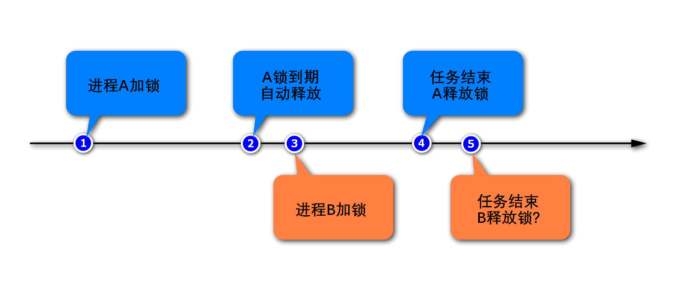
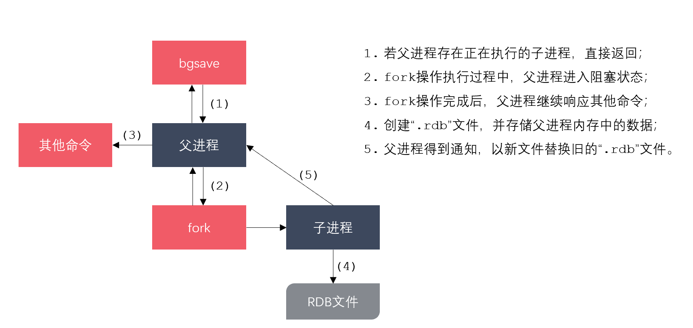
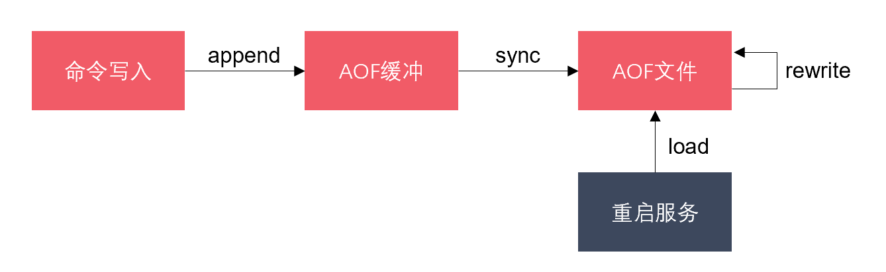
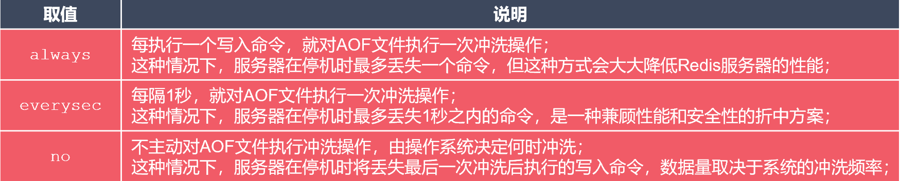
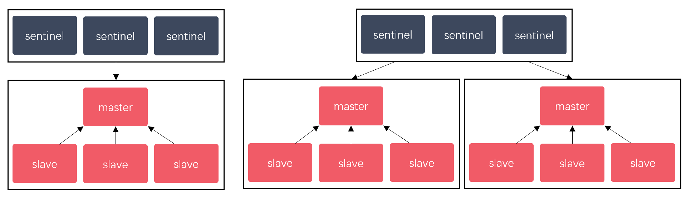

## Redis面试

#### 1. Redis可以用来做什么？

1. Redis最常用来做**缓存**，是实现**分布式缓存**的首先中间件；
2. Redis可以作为**数据库**，实现诸如点赞(set)、关注(set)、排行(zset)等对**性能要求极高的互联网需求**；
3. Redis可以作为**计算工具**，能用很小的代价，**统计诸如PV/UV、用户在线天数等数据；**
4. Redis还有很多其他的使用场景，例如：可以实现**分布式锁**，可以作为**消息队列**使用。

#### 2. Redis和传统的关系型数据库有什么不同？

+ Redis是一种基于键值对的NoSQL数据库，而键值对的值是由多种数据结构和算法组成的。Redis的数据都存储于内存中，因此它的速度惊人，读写性能可达10万/秒，远超关系型数据库。

+ 关系型数据库是基于二维数据表来存储数据的，它的数据格式更为严谨，并支持关系查询。关系型数据库的数据存储于磁盘上，可以存放海量的数据，但性能远不如Redis。

#### 3. Redis有哪些数据类型？

1. Redis支持5种核心的数据类型，分别是**字符串、哈希、列表、集合、有序集合**；
2. Redis还提供了Bitmap、HyperLogLog、Geo类型，但这些类型都是基于上述核心数据类型实现的；
3. Redis在5.0新增加了Streams数据类型，它是一个功能强大的、支持多播的、可持久化的消息队列。

#### 4. Redis是单线程的，为什么还能这么快？

**参考答案**

1. 对服务端程序来说，**线程切换和锁**通常是性能杀手，而单线程避免了线程切换和竞争所产生的消耗；
2. Redis的大部分操作是在内存上完成的，这是它实现高性能的一个重要原因；
3. Redis采用了**IO多路复用机制**，使其在网络IO操作中能并发处理大量的客户端请求，实现高吞吐率。

#### 5. Redis在持久化时fork出一个子进程，这时已经有两个进程了，怎么能说是单线程呢？

+ Redis是单线程的，主要是指**Redis的网络IO和键值对读写**是由一个线程来完成的。而Redis的其他功能，如持久化、异步删除、集群数据同步等，则是依赖其他线程来执行的。所以，说Redis是单线程的只是一种习惯的说法，事实上它的底层不是单线程的。

#### 6. set和zset有什么区别？

set：

- 集合中的元素是**无序、不可重复的**，一个集合最多能存储**2^32-1个元素**；
- 集合除了支持对元素的增删改查之外，还支持对多个集合取**交集、并集、差集**。

zset：

- 有序集合保留了集合元素不能重复的特点；
- 有序集合会给**每个元素设置一个分数，并以此作为排序的依据**；
- 有序集合**不能包含相同的元素，但是不同元素的分数可以相同**。

#### 7. 说一下Redis中的watch命令

很多时候，要确保事务中的数据没有被其他客户端修改才执行该事务。Redis提供了watch命令来解决这类问题，这是一种乐观锁的机制。客户端通过watch命令，要求服务器对一个或多个key进行监视，如果在客户端执行事务之前，这些key发生了变化，则服务器将拒绝执行客户端提交的事务，并向它返回一个空值。

#### 8. 说说Redis中List结构的相关操作

列表是线性有序的数据结构，它内部的元素是可以重复的，并且一个列表最多能存储2^32-1个元素。列表包含如下的常用命令：

- lpush/rpush：从列表的左侧/右侧添加数据；
- lrange：指定索引范围，并返回这个范围内的数据；
- lindex：返回指定索引处的数据；
- lpop/rpop：从列表的左侧/右侧弹出一个数据；
- blpop/brpop：从列表的左侧/右侧弹出一个数据，若列表为空则进入阻塞状态。

#### 9. 你要如何设计Redis的过期时间？

1. **热点数据**不设置过期时间，使其达到“物理”上的永不过期，可以避免缓存击穿问题；
2. 在设置过期时间时，可以**附加一个随机数**，避免**大量的key同时过期，导致缓存雪崩**。

#### 10. Redis中，setnx命令的返回值是什么，如何使用该命令实现分布式锁？

+ setnx命令返回整数值，当返回1时表示设置值成果，当返回0时表示设置值失败（key已存在）。

+ 一般我们不建议直接使用setnx命令来实现分布式锁，因为为了避免出现死锁，我们要给锁设置一个自动过期时间。而setnx命令和设置过期时间的命令不是原子的，可能加锁成果而设置过期时间失败，依然存在死锁的隐患。对于这种情况，Redis改进了set命令，给它增加了nx选项，启用该选项时set命令的效果就会setnx一样了。

+ 采用Redis实现分布式锁，就是在Redis里存一份代表锁的数据，通常用字符串即可。采用改进后的setnx命令（即set...nx...命令）实现分布式锁的思路，以及优化的过程如下：

加锁：

第一版，这种方式的缺点是容易产生死锁，因为客户端有可能忘记解锁，或者解锁失败。

```
setnx key value
```

第二版，给锁增加了过期时间，避免出现死锁。但这两个命令不是原子的，第二步可能会失败，依然无法避免死锁问题。

```
setnx key value expire key seconds
```

第三版，通过“set...nx...”命令，将加锁、过期命令编排到一起，它们是原子操作了，可以避免死锁。

```
set key value nx ex seconds 
```

解锁：

解锁就是删除代表锁的那份数据。

```
del key
```

问题：

看起来已经很完美了，但实际上还有隐患，如下图。进程A在任务没有执行完毕时，锁已经到期被释放了。等进程A的任务执行结束后，它依然会尝试释放锁，因为它的代码逻辑就是任务结束后释放锁。但是，它的锁早已自动释放过了，它此时释放的可能是其他线程的锁。



想要解决这个问题，我们需要解决两件事情：

1. 在**加锁时就要给锁设置一个标识**，进程要记住这个标识。当进程**解锁的时候，要进行判断，是自己持有的锁才能释放，否则不能释放。**可以为key赋一个**随机值**，来充当进程的标识。
2. **解锁时要先判断、再释放，这两步需要保证原子性**，否则第二步失败的话，就会出现死锁。而获取和删除命令不是原子的，这就需要采用**Lua脚本，通过Lua脚本将两个命令编排在一起，而整个Lua脚本的执行是原子的。**

+ 如果主节点宕机了，可能会存在问题。要保证分布式锁的高可用，则可以采用RedLock算法的实现方案。该算法基于多个Redis节点，它的基本逻辑如下：
  - 这些节点相互独立，不存在主从复制或者集群协调机制；
  - 加锁：以相同的KEY向N个实例加锁，只要超过一半节点成功，则认定加锁成功；
  - 解锁：向所有的实例发送DEL命令，进行解锁；

#### 11. 说一说Redis的持久化策略

**参考答案**

Redis支持**RDB持久化、AOF持久化、RDB-AOF混合持久化**这三种持久化方式。

+ RDB：

  + **RDB(Redis Database)是Redis默认采用的持久化方式**，它以**快照**的形式将进程数据持久化到硬盘中。RDB会创建一个经过压缩的二进制文件，文件以“.rdb”结尾，内部存储了各个数据库的键值对数据等信息。RDB持久化的触发方式有两种：

    - **手动触发**：通过**SAVE或BGSAVE**命令触发RDB持久化操作，创建“.rdb”文件；

    - **自动触发**：通过配置选项，让服务器在满足指定条件时自动执行BGSAVE命令。

  + 其中，SAVE命令执行期间，Redis服务器将阻塞，直到“.rdb”文件创建完毕为止。而BGSAVE命令是异步版本的SAVE命令，它会使用Redis服务器进程的子进程，创建“.rdb”文件。BGSAVE命令在创建子进程时会存在短暂的阻塞，之后服务器便可以继续处理其他客户端的请求。总之，**BGSAVE命令是针对SAVE阻塞问题做的优化，Redis内部所有涉及RDB的操作都采用BGSAVE的方式，而SAVE命令已经废弃！**

  + BGSAVE命令的执行流程，如下图：
    + 

  + BGSAVE命令的原理，如下图：
    + 

  + RDB持久化的**优缺点**如下：

    - 优点：RDB生成**紧凑压缩的二进制文件，体积小**，使用该文件**恢复数据的速度非常快；**

    - 缺点：BGSAVE每次运行都要执行fork操作**创建子进程，属于重量级操作，不宜频繁执行，**所以RDB持久化没办法做到实时的持久化。

+ AOF：

  + AOF（Append Only File），解决了数据持久化的**实时性**，是目前Redis持久化的主流方式。AOF以**独立日志**的方式，**记录了每次写入命令**，重启时再重新执行AOF文件中的命令来恢复数据。AOF的工作流程包括：**命令写入（append）、文件同步（sync）、文件重写（rewrite）、重启加载（load）**，如下图：
    + 

  + 文本协议格式优点：
    1. 文本协议具有很好的**兼容性**；
    2. 直接采用文本协议格式，可以**避免二次处理的开销**；
    3. 文本协议**具有可读性，方便直接修改和处理**。

  + AOF持久化的文件同步机制：

    + 为了提高程序的写入性能，现代操作系统会**把针对硬盘的多次写操作优化为一次写操作**。

      + 当程序调用write对文件写入时，系统不会直接把书记写入硬盘，而是先将数据写入内存的缓冲区中；

      + 当达到特定的时间周期或缓冲区写满时，系统才会执行flush操作，将缓冲区中的数据冲洗至硬盘中；

    + 对于AOF这样的持久化功能来说，冲洗机制将直接影响AOF持久化的安全性；

    + 为了消除上述机制的不确定性，Redis向用户提供了**appendfsync选项，来控制系统冲洗AOF的频率**；

    + Linux的glibc提供了fsync函数，可以将指定文件强制从缓冲区刷到硬盘，上述选项正是基于此函数。

    + appendfsync选项的取值和含义如下：

  + 

  + AOF持久化优缺点：
    + 优点：与RDB持久化可能丢失大量的数据相比，AOF持久化的**安全性**要高很多。通过使用everysec选项，用户可以将数据丢失的时间窗口限制在1秒之内。
    + 缺点：**AOF文件存储的是协议文本**，它的体积要比二进制格式的”.rdb”文件大很多。AOF需要通过执行AOF文件中的命令来恢复数据库，其**恢复速度比RDB慢很多**。AOF在进行重写时也需要创建子进程，在**数据库体积较大时将占用大量资源，会导致服务器的短暂阻塞。**

  + RDB-AOF混合持久化：

    + Redis从4.0开始引入RDB-AOF混合持久化模式，这种模式是基于AOF持久化构建而来的。用户可以通过配置文件中的“aof-use-rdb-preamble yes”配置项开启AOF混合持久化。Redis服务器在执行AOF重写操作时，会按照如下原则处理数据：

      - 像执行BGSAVE命令一样，根据数据库当前的状态生成相应的RDB数据，并将其写入AOF文件中；

      - 对于重写之后执行的Redis命令，则以协议文本的方式追加到AOF文件的末尾，即RDB数据之后。

    + 通过使用RDB-AOF混合持久化，用户可以同时获得RDB持久化和AOF持久化的优点，服务器既可以通过AOF文件包含的RDB数据来实现快速的数据恢复操作，又可以通过AOF文件包含的AOF数据来将丢失数据的时间窗口限制在1s之内。

#### 12. 如何实现Redis的高可用？

实现Redis的高可用，主要有**哨兵和集群**两种方式。

哨兵：

Redis Sentinel（哨兵）是一个分布式架构，它包含若干个哨兵节点和数据节点。每个哨兵节点会对数据节点和其余的哨兵节点进行监控，当发现节点不可达时，会对节点做下线标识。如果被标识的是主节点，它就会与其他的哨兵节点进行协商，当多数哨兵节点都认为主节点不可达时，它们便会选举出一个哨兵节点来完成自动故障转移的工作，同时还会将这个变化实时地通知给应用方。整个过程是自动的，不需要人工介入，有效地解决了Redis的高可用问题！

一组哨兵可以监控一个主节点，也可以同时监控多个主节点，两种情况的拓扑结构如下图：



哨兵节点包含如下的特征：

1. 哨兵节点会**定期监控数据节点，其他哨兵节点**是否可达；
2. 哨兵节点会**将故障转移的结果通知给应用方**；
3. 哨兵节点**可以将从节点晋升为主节点，并维护后续正确的主从关系**；
4. **哨兵模式下，客户端连接的是哨兵节点集合，从中获取主节点信息；**
5. **节点的故障判断是由多个哨兵节点共同完成的，可有效地防止误判；**
6. **哨兵节点集合是由多个哨兵节点组成**的，即使个别哨兵节点不可用，整个集合依然是**健壮**的；
7. **哨兵节点也是独立的Redis节点，是特殊的Redis节点，它们不存储数据，只支持部分命令。**


集群：

Redis集群采用**虚拟槽分区**来实现数据分片，它把所有的键根据哈希函数映射到0-16383整数槽内，计算公式为slot=CRC16(key)&16383，**每一个节点负责维护一部分槽以及槽所映射的键值数据**。虚拟槽分区具有如下特点：

1. **解耦数据和节点之间的关系**，简化了**节点扩容和收缩**的难度；
2. 节点自身维护槽的映射关系，不需要客户端或者代理服务维护槽分区元数据；
3. 支持**节点、槽、键之间的映射查询，用于数据路由，在线伸缩等场景。**

Redis集群中数据的分片逻辑如下图：


#### 13. Redis的主从同步是如何实现的？

**参考答案**

从2.8版本开始，Redis使用psync命令完成主从数据同步，同步过程分为**全量复制和部分复制**。全量复制一般用于初次复制的场景，部分复制则用于处理因网络中断等原因造成数据丢失的场景。psync命令分为完整重同步和部分重同步。psync命令需要以下参数的支持：

1. **复制偏移量**：主节点处理写命令后，会把命令长度做累加记录，从节点在接收到写命令后，也会做累加记录；从节点会每秒钟上报一次自身的复制偏移量给主节点，而主节点则会保存从节点的复制偏移量。
2. **积压缓冲区**：保存在主节点上的一个固定长度的队列，默认大小为1M，当主节点有连接的从节点时被创建；主节点处理写命令时，不但会把命令发送给从节点，还会写入积压缓冲区；缓冲区是先进先出的队列，可以保存最近已复制的数据，用于部分复制和命令丢失的数据补救。
3. **主节点运行ID**：每个Redis节点启动后，都会动态分配一个40位的十六进制字符串作为运行ID；如果使用IP和端口的方式标识主节点，那么主节点重启变更了数据集（RDB/AOF），从节点再基于复制偏移量复制数据将是不安全的，因此当主节点的运行ID变化后，从节点将做全量复制。

#### 14. Redis为什么存的快，内存断电数据怎么恢复？

+ **数据都存放在内存**里
+ Redis还提供了三种数据的持久化机制，即**RDB持久化、AOF持久化、RDB-AOF混合持久化**。若服务器断电，那么我们可以利用持久化文件，对数据进行恢复。理论上来说，AOF/RDB-AOF持久化可以将丢失数据的窗口控制在1S之内。

#### 15 说一说Redis的缓存淘汰策略

+ 当写入数据将导致超出maxmemory限制时，Redis会采用maxmemory-policy所指定的策略进行数据淘汰，该策略一共包含如下8种选项

| **策略**        | **描述**                                                 | **版本** |
| --------------- | -------------------------------------------------------- | -------- |
| noeviction      | 直接返回错误；                                           |          |
| volatile-ttl    | 从设置了过期时间的键中，选择过期时间最小的键，进行淘汰； |          |
| volatile-random | 从设置了过期时间的键中，随机选择键，进行淘汰；           |          |
| volatile-lru    | 从设置了过期时间的键中，使用LRU算法选择键，进行淘汰；    |          |
| volatile-lfu    | 从设置了过期时间的键中，使用LFU算法选择键，进行淘汰；    | 4.0      |
| allleys-random  | 从所有的键中，随机选择键，进行淘汰；                     |          |
| allkeys-lru     | 从所有的键中，使用LRU算法选择键，进行淘汰；              |          |
| allkeys-lfu     | 从所有的键中，使用LFU算法选择键，进行淘汰；              | 4.0      |

其中，volatile前缀代表从设置了过期时间的键中淘汰数据，allkeys前缀代表从所有的键中淘汰数据。关于后缀，ttl代表选择过期时间最小的键，random代表随机选择键，需要我们额外关注的是lru和lfu后缀，它们分别代表采用lru算法和lfu算法来淘汰数据。

LRU（Least Recently Used）是按照最近最少使用原则来筛选数据，即最不常用的数据会被筛选出来！

- 标准LRU：把所有的数据组成一个链表，表头和表尾分别表示MRU和LRU端，即最常使用端和最少使用端。刚被访问的数据会被移动到MRU端，而新增的数据也是刚被访问的数据，也会被移动到MRU端。当链表的空间被占满时，它会删除LRU端的数据。
- 近似LRU：Redis会记录每个数据的最近一次访问的时间戳（LRU）。Redis执行写入操作时，若发现内存超出maxmemory，就会执行一次近似LRU淘汰算法。近似LRU会随机采样N个key，然后淘汰掉最旧的key，若淘汰后内存依然超出限制，则继续采样淘汰。可以通过maxmemory_samples配置项，设置近似LRU每次采样的数据个数，该配置项的默认值为5。

LRU算法的不足之处在于，若一个key很少被访问，只是刚刚偶尔被访问了一次，则它就被认为是热点数据，短时间内不会被淘汰。

LFU算法正式用于解决上述问题，LFU（Least Frequently Used）是Redis4新增的淘汰策略，它根据key的最近访问频率进行淘汰。LFU在LRU的基础上，为每个数据增加了一个计数器，来统计这个数据的访问次数。当使用LFU策略淘汰数据时，首先会根据数据的访问次数进行筛选，把访问次数最低的数据淘汰出内存。如果两个数据的访问次数相同，LFU再比较这两个数据的访问时间，把访问时间更早的数据淘汰出内存。

#### 16. 请介绍一下Redis的过期策略

Redis支持如下两种过期策略：

**惰性删除**：客户端访问一个key的时候，Redis会先检查它的过期时间，如果发现过期就立刻删除这个key。

**定期删除**：Redis会将设置了过期时间的key放到一个独立的字典中，并对该字典进行每秒10次的过期扫描，

过期扫描不会遍历字典中所有的key，而是采用了一种简单的贪心策略。该策略的删除逻辑如下：

1. 从过期字典中随机选择20个key；
2. 删除这20个key中已过期的key；
3. 如果已过期key的比例超过25%，则重复步骤1。

#### 17. 缓存穿透、缓存击穿、缓存雪崩有什么区别，该如何解决？

+ **缓存穿透**：**客户端查询根本不存在的数据**，使得请求直达存储层，导致其负载过大，甚至宕机。出现这种情况的原因，可能是业务层误将缓存和库中的数据删除了，也可能是有人恶意攻击，专门访问库中不存在的数据。

  + 解决方案：

    1. **缓存空对象**：存储层未命中后，仍然将空值存入缓存层，客户端再次访问数据时，缓存层会直接返回空值。

    2. **布隆过滤器**：将数据存入布隆过滤器，访问缓存之前以过滤器拦截，若请求的数据不存在则直接返回空值。

+ **缓存击穿**：一份热点数据，它的访问量非常大。在其缓存失效的瞬间，大量请求直达存储层，导致服务崩溃。

  + 解决方案：

    1. **永不过期**：热点数据不设置过期时间，所以不会出现上述问题，这是“物理”上的永不过期。或者为每个数据设置逻辑过期时间，当发现该数据逻辑过期时，使用单独的线程重建缓存。

    2. **加互斥锁**：对数据的访问加互斥锁，当一个线程访问该数据时，其他线程只能等待。这个线程访问过后，缓存中的数据将被重建，届时其他线程就可以直接从缓存中取值。

+ **缓存雪崩**：在某一时刻，**缓存层无法继续提供服务**，导致所有的请求直达存储层，造成数据库宕机。可能是缓存中有**大量数据同时过期，也可能是Redis节点发生故障**，导致大量请求无法得到处理。

  + 解决方案：

    1. **避免数据同时过期**：设置过期时间时，附加一个随机数，避免大量的key同时过期。

    2. **启用降级和熔断措施**：在发生雪崩时，若应用访问的不是核心数据，则直接返回预定义信息/空值/错误信息。或者在发生雪崩时，对于访问缓存接口的请求，客户端并不会把请求发给Redis，而是直接返回。

    3. **构建高可用的Redis服务**：采用哨兵或集群模式，部署多个Redis实例，个别节点宕机，依然可以保持服务的整体可用。

#### 18. 如何保证缓存与数据库的双写一致性？

四种同步策略：

+ 想要保证缓存与数据库的双写一致，一共有4种方式，即4种同步策略：
  + 先更新缓存，再更新数据库；
  + 先更新数据库，再更新缓存；
  + 先删除缓存，再更新数据库；
  + **先更新数据库，再删除缓存。**（这个影响最小）

+ 从这4种同步策略中，我们需要作出比较的是：
  1. 更新缓存与删除缓存哪种方式更合适？
     + 删除更合适，操作更简单
  2. 应该先操作数据库还是先操作缓存？
     + 先操作数据库，再操作缓存

延时双删

上面我们提到，如果是先删缓存、再更新数据库，在没有出现失败时可能会导致数据的不一致。如果在实际的应用中，出于某些考虑我们需要选择这种方式，那有办法解决这个问题吗？答案是有的，那就是采用延时双删的策略，延时双删的基本思路如下：

1. 删除缓存；
2. 更新数据库；
3. sleep N毫秒；
4. 再次删除缓存。

阻塞一段时间之后，再次删除缓存，就可以把这个过程中缓存中不一致的数据删除掉。而具体的时间，要评估你这项业务的大致时间，按照这个时间来设定即可。

#### 22. 说一说hash类型底层的数据结构

哈希对象有两种编码方案，当同时满足以下条件时，哈希对象采用ziplist编码，否则采用hashtable编码：

- 哈希对象保存的键值对数量小于512个；
- 哈希对象保存的所有键值对中的键和值，其字符串长度都小于64字节。

其中，ziplist编码采用压缩列表作为底层实现，而hashtable编码采用字典作为底层实现。

压缩列表（ziplist），是Redis为了节约内存而设计的一种线性数据结构，它是由一系列具有特殊编码的连续内存块构成的。一个压缩列表可以包含任意多个节点，每个节点可以保存一个字节数组或一个整数值。

压缩列表的结构如下图所示：


| **属性** | **类型** | **长度** | **说明**                                                     |
| -------- | -------- | -------- | ------------------------------------------------------------ |
| zlbytes  | uint32_t | 4字节    | 压缩列表占用的内存字节数；                                   |
| zltail   | uint32_t | 4字节    | 压缩列表表尾节点距离列表起始地址的偏移量（单位字节）；       |
| zllen    | uint16_t | 2字节    | 压缩列表包含的节点数量，等于UINT16_MAX时，需遍历列表计算真实数量； |
| entryX   | 列表节点 | 不固定   | 压缩列表包含的节点，节点的长度由节点所保存的内容决定；       |
| zlend    | uint8_t  | 1字节    | 压缩列表的结尾标识，是一个固定值0xFF；                       |

#### 26. 说一说你对布隆过滤器的理解

布隆过滤器可以用很低的代价，估算出数据是否真实存在。例如：给用户推荐新闻时，要去掉重复的新闻，就可以利用布隆过滤器，判断该新闻是否已经推荐过。

布隆过滤器的核心包括两部分：

1. 一个大型的位数组；
2. 若干个不一样的哈希函数，每个哈希函数都能将哈希值算的比较均匀。

布隆过滤器的工作原理：

1. 添加key时，每个哈希函数都利用这个key计算出一个哈希值，再根据哈希值计算一个位置，并将位数组中这个位置的值设置为1。
2. 询问key时，每个哈希函数都利用这个key计算出一个哈希值，再根据哈希值计算一个位置。然后对比这些哈希函数在位数组中对应位置的数值：
   - **如果这几个位置中，有一个位置的值是0，就说明这个布隆过滤器中，不存在这个key。**
   - 如果这几个位置中，所有位置的值都是1，就说明这个布隆过滤器中，极有可能存在这个key。之所以不是百分之百确定，是因为也可能是其他的key运算导致该位置为1。