# 面试之计算机系统


## Linux I/O复用和网络编程
1. 简述 Linux 的 I/O模型

   + I/O模型里面的同步异步是不同于并发编程的同步异步的。在I/O里面，只要是应用程序负责将数据从kernel拷贝到user的，就是同步，反之是异步。

   + I/O实际上就是一个双缓冲的get-copy的问题

   + I/O模型主要分成2类

     + 同步I/O

       + 阻塞I/O

         + 程序阻塞在I/O调用函数，等待数据和数据从kernel到user空间都阻塞

           

       + 非阻塞I/O

         + 程序在等待kernel来数据的时候不阻塞，而会阻塞在I/O

           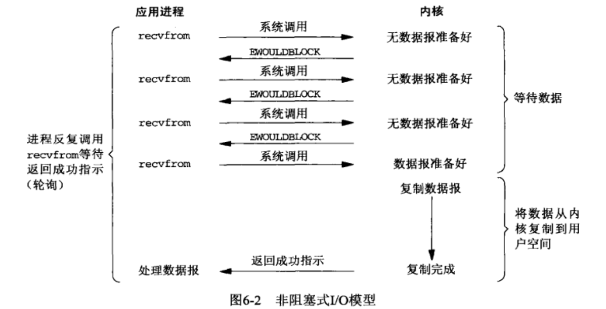

       + I/O复用

         + 诸如select，poll，epoll。

         + 进程既阻塞在select/poll系统调用上，也阻塞在I/O上

           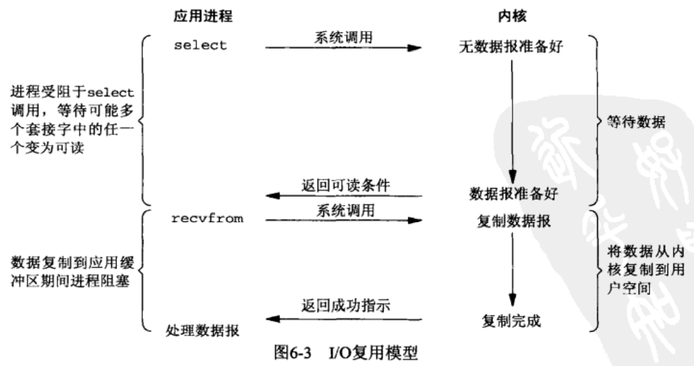

       + 信号驱动I/O

         + 信号触发读写就绪事件，用户程序执行读写操作，程序没有阻塞阶段

           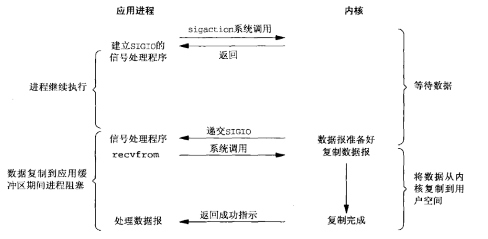

     + 异步I/O

       + 内核执行读写操作并触发读写完成事件，程序不阻塞。

2. 简述select、poll、epoll的使用场景和区别，epoll中水平触发以及边缘触发有什么不同

   + 网络连接的实现过程以及三种I/O复用的实现
     + 以一个连接为例。网络连接涉及若干过程，首先是create socket，这时系统会创建一个socket对象，它包含了发送缓冲区、接收缓冲区、等待队列等结构，等待队列指向所有等待socket上的事件的进程，然后返回该socket的文件描述符。然后是bind，将本地的ip和端口赋予该socket。接着是listen，启动监听。调用recv系统调用，传入socket文件描述符作为参数，recv将进程挂起，并插入到socket的等待队列，进程会一直阻塞到socket就绪。网卡消息到来，网卡根据运输层报文段指示的端口号知道目标的socket，接着引发硬件中断，让CPU运行网卡中断处理程序，将网卡得到的数据copy到目标socket的接收缓冲区，并将socket就绪。socket就绪就会将等待队列的进程pcb移至CPU就绪队列，进程重新执行，recvfrom就将socket的信息copy到传入的缓冲区，然后返回。
     + 接下来就是I/O复用的部分了。
     + 如果不是使用recvfrom，而是使用select时，首先会将socket_fdsets作为参数，调用select。这时，select会将进程挂到传入的socket的等待队列上，如果有socket已经就绪了，就将进程转为就绪，这时select轮询一遍sockets，找到这个socket，然后把该socket插入到这个fdsets里面，接着再返回。接下来就是recvfrom大显身手。
     + 如果是使用poll，也大差不差，因为poll也是传入一个表，不过不是文件描述符表，而是事件表pollfd，pollfd里面包含了socket_fd，以及关心的事件events，还有一个用于传回真实发生事件的revents。
     + 而如果是使用epoll，则大不相同。首先调用epoll_create()创建一个epoll文件描述符，它会在内核创建一个eventpoll对象，它里面给你生成一个红黑树rbr，这主要用来索引文件描述符，还有一个用于存储就绪socket的双向链表rdllist。接着调用epoll_ctl将socket加入到红黑树上，这个时候系统会将epfd挂到socket的等待队列上；如果某个socket已经就绪了，就会将当前的socket文件描述符插入到rdllist上；当我们调用epoll_wait时，系统会轮询rdllist，如果为空，则阻塞，反之直接把rdllist上面的信息copy到应用程序指定内存区域，再看是否将它从rdllist上移除。前面两个在socket上挂的都是进程本身，而epoll则不是挂的这个进程。

   + 应用场景：主要用于I/O的多路复用。其中epoll一般用于连接数量多，但是活动连接少的情况，比如聊天室。而select，poll一般用于连接数比较少的情况。
     + client要同时处理多个连接socket时
     + 同时处理user的输入和连接时
     + 同时处理连接socket和监听socket时（最常用）
     + 同时处理TCP请求和UDP请求时。
     + 同时监听多个端口或者处理多种服务时。
   + 区别：
     + 事件集的区别：
       + select
         + fd_set并没将文件描述符和具体事件绑定，而是提供了3个类型参数传入可读，可写，异常事件。
         + fd_set在每次调用都被修改，copy到内核，然后结果copy回来。
         + 会返回整个就绪文件索引，时间复杂度为O(n)
       + poll
         + 文件描述符和事件都定义其中
         + 每次都是修改列表结构体的revents成员，而events成员则不变，故下次调用无须重置
         + 返回整个就绪文件索引，时间复杂度为O(n)
       + epoll
         + 内核维护一个事件表，提供独立的系统调用来控制
         + 每次都能从内核事件表中取出注册的事件，无须反复读入。时间复杂度为O(1)
     + 最大支持的文件描述符的数量
       + select一般不到65535
       + poll能达到最大的65536
       + epoll_wait能达到65535
     + 工作模式
       + select和poll都只有相对低效的LT水平触发模式，而epoll则可以工作在高效的ET模式
       + epoll还有EPOLLONESHOT事件，进一步减少可读可写异常事件的触发次数
     + 具体实现
       + select和poll
         + 采用的都是轮询技术，每次调用都扫描所有注册的文件描述符集合，然后将就绪的作为输出参数返回。
       + epoll_wait
         + 采用回调方式检测。

3. 怎么判断写文件时buffer已经写满？

   + 要么可以设置计数器统计写入的数量来判断

4. 简述mmap，sendfile的使用场景以及原理

   + 在此之前，需要提到一个叫DMA的技术，也即直接内存访问技术。

     + 在传统的磁盘读写中，通过read系统调用，CPU发送读取的IO请求到磁盘控制器，然后返回；磁盘控制器收到命令，准备好要读取的数据，将数据放入磁盘控制器的内部缓冲区，然后引发中断；CPU收到并启动中断处理，将磁盘控制器内的数据一个个通过register读到内核缓冲区中，这个期间CPU没法进行其它工作。
     + 使用DMA之后，CPU不会直接将IO请求发给磁盘，而是继续将IO请求发给DMA，让DMA负责读取数据到内核缓冲区，这个过程CPU可以做其它的事情，接着等CPU收到DMA的数据读完成中断信号，就将数据从内核缓冲区copy到用户缓冲区，read完成。由于CPU不再承担数据搬运的工作，所以CPU的利用率提高了
     + 这个内核缓冲区实际是磁盘高速缓存page cache，采用LRU淘汰算法。所以只能用于小文件，而大文件就应当使用异步还有直接IO方式进行传输。

   + 传统的DMA文件传输，需要4次内核态和用户态的切换，需要4次拷贝，两次DMA做的，两次CPU做的。上下文切换和不必要的copy消耗了CPU资源

     + read调用从用户态到内核态。这时CPU会和DMA一起将数据准备好，并copy到内核缓冲区。

     + read调用返回，从内核态到用户态。这时CPU在read调用中已经将内核缓冲区数据copy到了用户缓冲区

     + write调用从用户态到内核态。CPU将数据从用户缓冲区copy到内核缓冲区。然后由DMA将内核缓冲区的数据copy到网卡

     + write返回，从内核态到用户态。

       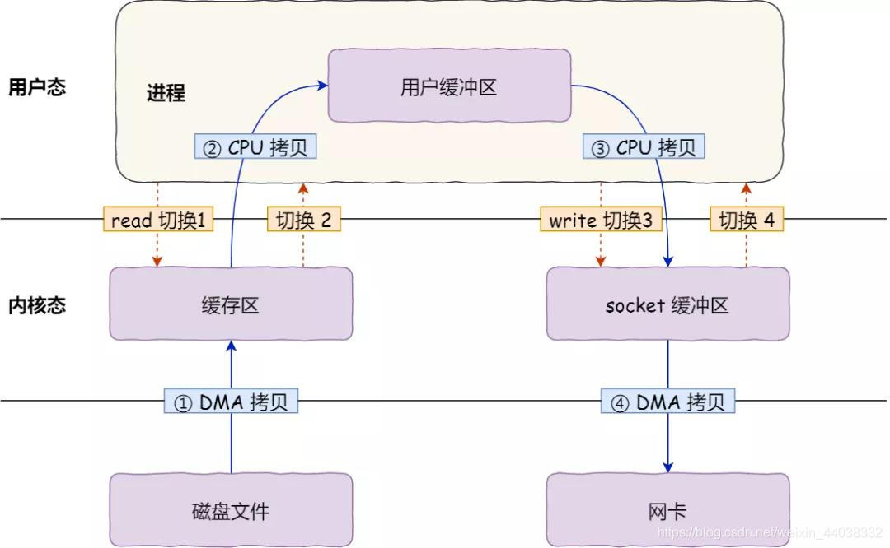

   + 与此相关的就是**零拷贝技术**，初心就是**减少用户态和内核态的上下文切换；减少内存拷贝次数**

     + 原来是read + write，现在用零拷贝，实现方式有两种
       + mmap + write
       + sendfile

   + mmap + write

     + 原理：mmap()系统调用会直接将内核缓冲区数据映射到用户空间，所以操作系统内核与用户空间之间不用再进行拷贝工作，减少了1次CPU的拷贝工作。总计4次内核态用户态的上下文切换，3次拷贝，其中2次DMA，1次CPU

       

   + sendfile

     + 使用一个系统调用替代了前面的两个。这样就减少了2次上下文切换的开销。

       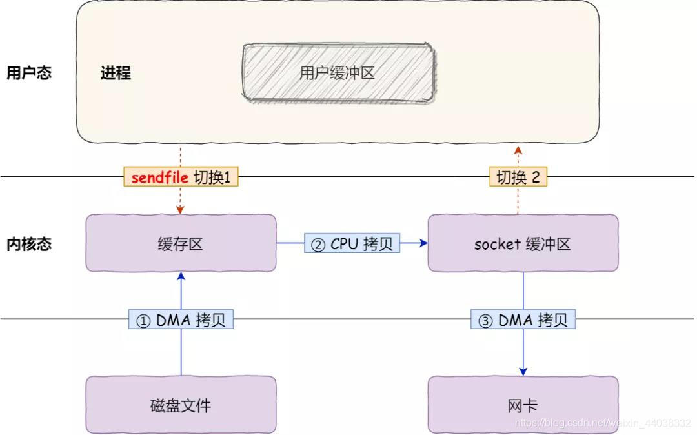

5. Linux端口复用

   + Linux的端口复用能将一个程序的多个套接字对象绑定在同一个端口而不出现差错。

     ```c++
     //基本做法就是设置SO_REUSEADDR选项，就是得在每次bind前完成设置
     int opt = 1；
     setsockopt(sockfd, SOL_SOCKET, SO_REUSEADDR, (const void *)&opt, sizeof(opt));
     ```

   + 什么情况会用到？
     + 当这样的一个socket处于TIME_WAIT状态的时候，而正好有一个新的socket想用这样的address和port的时候
     + 同一个端口上启动了多个server的实例，但每个实例绑定的address不能相同的多网卡机器或者是用了IP Alias技术的机器
     + 一个进程把ip address绑到了多个socket上，但每个ip都不相同
     + 允许完全相同的ip address和port的重复绑定，只用于UDP的多播，不用于TCP，TCP是没法做到相同ip和port的

   + 这种情况下，网卡向哪个socket发送信息？
     + 当把一个port绑定到了多个socket上的时候，各个socket发送信息是正常的，但在接收信息的时候，只有第一个socket能正常接收数据。除非是UDP组播

   + 意义和用途
     + 最常见的情形就是防止server restart时，之前运行时绑定的port还没释放，或者system没能释放端口导致无法绑定端口的情况。

   + 端口复用和fork出的子进程共享父进程的socket fd的区别
     + 在bind之后fork出的子进程，由于和父进程共享文件描述符，好像是父子进程绑定了相同的端口似的。但需要明确的是，绑定端口的自始至终是socket对象，而不是进程本身。父子进程实际是共用一个socket，而不是创建了具有相同port和ip的socket对象的所谓端口复用。
     + 在bind之前就fork的，父子进程都去fork，并设置了SO_RESUSEADDR的时候，就是上面提到的父子进程的端口复用了

   + 存在的问题
     + 就像上面的TIME_WAIT的情况，如果一个socket正在time_wait状态，而又急着使用端口复用来重新创建这样一个socket的话，就可能收到不属于这个socket的过期数据。

6. 惊群问题
   + 问题背景：
     + 当多个进程同时监听一个socket 的时候，比如在bind之后用fork创建的子进程是和父进程共享socket fd的，那么完全可以用accept同时监听一个socket，而当socket就绪的时候，就可能会同时通知所有的相关进程，而又只有一个能accept，那么其余的刚被唤醒，又要重新休眠。
   + 解决办法
     + 对于accept：
       + Linux2.6开始，就解决了accept的惊群问题，它只会唤醒等待队列上的第一个进程或者线程。可惜，常常我们会使用I/O复用，进程并不阻塞在accept，而是会在epoll_wait、select、poll这样I/O复用上。
     + 对于epoll_wait
       + 它并不会只唤醒等待队列上的第一个进程，也不会同时全部唤醒。它本身并不处理惊群问题
       + 用户可以通过加速来实现惊群的处理
       + Nginx则

+ 

### Nginx相关


## 进程管理和资源调度

### 进程和线程
1. 进程和线程有什么区别？

   注意在Linux下并不区分进程和线程，它们都是内核调度实体，只是一些系统资源，比如虚拟内存，打开的文件描述符，对信号的处理，进程ID等资源的共享程度不相同而已。

+ **从属关系：一个线程只能属于一个进程，而一个进程可以有多个线程**。进程至少有一个线程。线程依赖于进程而存在。
+ **CPU调度方面：进程是CPU资源分配的最小单位，线程是CPU调度的最小单位**。
+ **资源共享：进程有独立的系统资源，而同一进程内的线程共享进程的大部分系统资源**。资源分配给进程，同一进程的所有线程共享该进程的所有资源。同一进程中的多个线程共享代码段（代码和常量），数据段（全局变量和静态变量），扩展段（堆存储）。但是每个线程拥有一些在运行中必不可少的资源，如栈段，栈段又叫运行时段，用来存放所有局部变量和临时变量。
+ **系统开销：进程在创建、切换和销毁时开销比较大，而线程比较小。** 由于在创建或撤消进程时，系统都要为之分配或回收资源，如内存空间、I/O设备等。因此，操作系统所付出的开销将显著地大于在创建或撤消线程时的开销。类似地，在进行进程切换时，涉及到整个当前进程CPU环境的保存以及新被调度运行的进程的CPU环境的设置。而线程切换只须保存和设置少量寄存器的内容，并不涉及存储器管理方面的操作。可见，进程切换的开销也远大于线程切换的开销。
+ **通信方面：进程间通信比线程间通信更复杂。**由于同一进程中的多个线程具有相同的地址空间，致使它们之间的同步和通信的实现，也变得比较容易。
+ **进程间相互独立；线程间相互影响。**一个进程崩溃，不会对其他进程产生影响；而一个线程崩溃，会让同一进程内的其他线程也死掉。
+ **进程编程调试简单可靠性高，但是创建销毁开销大；线程正相反，开销小，切换速度快，但是编程调试相对复杂。**
+ **进程适应于多核、多机分布；线程适用于多核**

2. 多进程和多线程之间各有什么优缺点？为什么Nginx会使用多进程而不是多线程呢？

   + 进程间相互独立；而线程间相互影响。一个进程崩溃，不会对其它进程产生影响；而一个线程崩溃，就很可能会让同一进程内的其它线程也发送故障。

3. Linux进程创建和线程创建的区别？

   + Linux可以使用fork创建一个子进程，这个fork调用到内核的do_fork接口；Linux使用pthread_create创建线程，会调用到_clone接口，这个接口也会调用到do_fork接口。可以说，进程线程创建时，最终使用的接口都是do_fork，只是传入的参数不同，对共享的内容的设置不相同。
   + 创建进程时，不使用共享的属性，使得进程拥有独立的运行环境。而使用pthread_create创建进程时，设置这些属性，并调用do_fork。
   + 实际上，线程在Linux里面可以认为是轻量级的进程。拥有独立的进程表项。

4. 进程间的通信方式有哪些？

   + 管道（命名管道和匿名管道）
     + 概念：
       + 在内核中申请一块固定大小的缓冲区，让程序又读写权利
     + 分类：
       + 匿名的管道一般是fork的父子进程才能通信；而命名的则是让没有亲缘关系的进程也可以通信。
     + 原理：
       + 它可以看做是一个特殊的文件。但是是只存在于内存中的，不属于文件系统管理。
       + **本质是一个单向半双工的内核缓冲区**
       + 分成匿名管道pipe和命名管道fifo两种。匿名管道用于父子进程的通信，fork返回值为0表示子进程，而大于0的，则是父进程。命名管道会在磁盘上创建对应结点，但没有数据块，所有进程都可对其读写，不再被使用时，会在内存中释放，但磁盘结点依然存在。
     + 特点：
       + 面向字节流
       + 生命周期随内核
       + 自带同步互斥机制
       + 半双工，单向通信，但可以用两个管道实现双向通信
     
   + 信号
     + 信号通信主要依靠三个接口
     
       + 一个是发送信号的接口
     
         > int kill(pid_t pid, int signal)
     
       + 另外两个是设置信号处理的接口
     
         > __sighandler_t_  signal(int signal, _sighandler_t  handler);
         >
         > int sigaction(int signal, const struct sigaction* act, struct sigaction* oact);
     
   + 信号量
     + 概念：
       + 在内核中创建一个信号量集合（本质是个数组），数组的元素（信号量）都是1，使用P操作进行-1，使用V操作+1。
         + P：--s；如果s < 0则挂起到信号量的等待队列上。
         + V：++s；如果s <= 0,说明有其它进程等待s且被挂在等待队列上，这时就恢复一个运行；
       + PV在同个进程可以实现互斥；不同进程可以实现同步。主要就是实现对临界资源的保护
     
   + 消息队列
     + 概念：
       + 在内核中创建一队列，队列中每个元素是一个数据报，不同的进程可以通过句柄去访问这个队列。
       +  消息队列提供了⼀个从⼀个进程向另外⼀个进程发送⼀块数据的⽅法
     + 原理：
       + 也是保存在内核中的一个缓冲区。
       + 和管道类似，但是它的优势在于，它对每个消息指定了特定的消息类型，接收的时候不用按队列的次序，而是能根据自定义条件接收特定类型的信息。
     + 特点：
       + 消息队列可以认为是一个全局的一个链表，链表节点中存放着数据报的类型和内容，有消息队列的标识符进行标记。
       + 允许多个进程读写。可双向通信
       + 生命周期随内核
     
   + 共享内存
     + 概念：
       + 将同一块物理内存一块映射到不同的进程的虚拟地址空间中，实现不同进程间对同一资源的共享。是最有用的进程通信方式
     + 特点：
       + 生命周期随内核。 
       + 可以多个进程之间共享
       + 共享内存是临界资源，所以需要操作时必须要保证原子性。使用信号量或者互斥锁都可以。
       + 不用从用户态到内核态的频繁切换和拷贝数据，直接从内存中读取就可以
     + 原理：
       + 将同一块物理内存一块映射到不同的进程的虚拟地址空间中，实现不同进程间对同一资源的共享。与管道还有消息队列在内核有个缓冲区不同，它是对同一个物理内存的不同虚拟映射，这样就不用在内核缓冲区和用户缓冲区来回copy4次了，就只要copy2次，效率也更高。这和零拷贝技术的思想异曲同工
       + 对于这种映射，一般也是采取类似cache的写回策略。它会保持共享区域，直到通信完毕解除映射了再将内存写回文件。
     
   + socket
     + 主要用于网络通信

5. 线程间有哪些通信方式？

   与进程通信中数据交换的需求不同，线程通信的主要目的在于线程同步，所以可以与进程同步相关联。

   + 锁机制
     + 互斥锁
       + 以排他形式防止数据结构被并发修改
     + 条件变量
       + 以原子的方式阻塞线程，直到某个条件为真；测试条件时，一般是在互斥锁的保护下进行的，条件变量的使用离不开互斥锁
     + 读写锁
       + 比如：读者优先；写者优先；读写同步
   + 信号量机制：包括匿名线程信号量和命名线程信号量
   + 信号机制

6. 死锁的条件有哪些？如何处理死锁？

   + 死锁的条件：
     + 互斥条件。一个资源一次只能被一个进程访问。
     + 占有并等待条件。一个进程如果申请资源阻塞了，已经申请的资源不会被释放。
     + 不剥夺条件。一个进程在获得的资源没用完以前，不会被强行释放。
     + 环路条件。请求资源的各个线程/进程构成环路。
   + 处理死锁：
     + 检测和修复死锁
       + 每个进程报上它已经占有的资源，需要的最大资源数。系统根据资源矩阵计算，可判断死锁。
       + 检测时机：
         + 进程等待时检测
         + 定时检测
         + 系统资源利用率下降时检测
       + 修复死锁：
         + 从某个中间检验点重起各死锁进程。可能发生死锁，也可能不会。这得看重起之后的各个进程的推进顺序，有些时候还是死锁，继续回到检验点重起。
         + 逐个撤销死锁进程，直至死锁不再存在。
         + 从死锁进程中逐个抢占某些资源，直至死锁不再存在。
     + 预防死锁
       + 采用静态分配资源的方式，预防死锁
     + 避免死锁
       + 有序资源分配。
       + 银行家算法。

7. 进程有多少种状态？

   + 运行，阻塞，就绪三种状态

     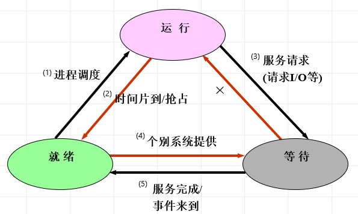

     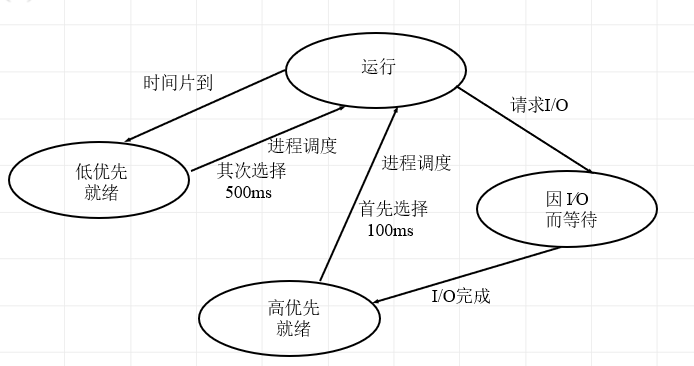

8. 简述创建进程的流程

   + Linux创建进程有两个系统调用clone()和fork()；vfork是用来创建线程的，不过被clone代替了。它们三个都会以不同的形式调用到do_fork。
   + fork创建进程时会让子进程copy父进程的资源，使用**写时复制技术**，这个技术类似于CPU高速缓冲存储器里的**写回策略**，实际就是采取延迟和分散的策略，将复制过程时间尺度上拉长，任务粒度上分细。主要原因是子进程之后可能会使用exec系统调用，这个系统调用就是用新进程替换掉原进程的上下文
   + 具体过程：
     + fork调用后，子进程复制了父进程的栈空间，虚页表，并将父子共享的页面标记为只读；如果父子进程对这个页面进行了写操作，内核就会复制一个物理页面给这个进程用，同时修改页表，然后把原来的页面标记为可读可写，给另一个进程用。
     + 子进程返回0，父进程则返回子进程的pid

9. 什么情况下，进程会进行切换？

   + 进程时间片到
   + 进程发出IO请求进入等待状态
   + 在可抢占式调度中，就绪队列中出现了更高优先级的进程

10. 简述Linux进程调度的算法

   + Linux前后使用了多种进程调度算法。
     
   + 优先级的范围为0到139，0到99是实时优先级，100到139是普通优先级；每个进程有个nice友好值，为-20到19，用于修正优先级。进程默认的优先级是120
     
     + 首先是Unix搬来的O(n)调度器。调度时，遍历就绪队列上的进程，计算优先级，并调度优先级最高的。
     
     + 在2.5版本引入了O(1)调度器。进程有两个优先级，静态优先级和动态优先级。其中静态优先级用于计算进程运行时间片长度，动态优先级则是调度器调度时需要使用的。这里使用两个优先级数组，一个过期数组，一个活动数组，活动数组里的表示时间片没花完的进程；expired则是时间片用完的。如果要进程调度，就到对应的array里面根据bitmap找到对应的这个优先级的进程链表，再取出链表头的进程运行。如果bitmap显示active里已经没有了，就交换active和expired的指针。
     
       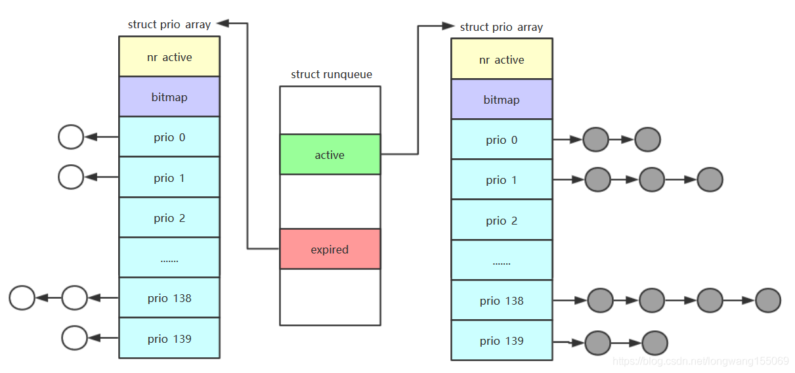
     
     + 到了2.6版本改用CFS进程调度算法。
     
   + 目前的Linux采用的是CFS调度算法，即完全公平调度程序。不同点在于：
     + CFS 调度程序并不采用严格规则来为一个优先级分配某个长度的时间片，而是为每个任务分配一定比例的 CPU 处理时间
       + 虚拟CPU时间 = 实际运行时间 * (nice值为0时映射到的权重) ÷ 进程权重
       + 分配CPU时间 = 调度周期T * 进程权重 ÷ 权重之和（但是是有最小值限制的，防止过于频繁的不必要的进程切换）
     + 每次都调用虚拟CPU时间最少的进程来运行，同时按权重分配运行时间，有种平衡或者说负反馈的思想。
     + 观察虚拟CPU时间的计算，使用反比例函数，起到负反馈的作用。
     + 在实现的数据结构上，使用了红黑树，而不是链表或者数组。因为涉及频繁的插入删除，只考虑调度时达到选取的O(1)，但插入删除O(n)还是不妥。不仅如此，如果是多核调度，则每个核都有一棵自己的红黑树。
     
   + CFS的其它细节
     + 新创建进程的vruntime如何决定？
       + CPU运行队列会维护一个min_vruntime字段，记录队列内的最小vruntime。再依据父进程的vruntime和创建的参数决定。
         + 子进程在创建时，vruntime初值首先被设置为min_vruntime；
         + 如果想要新进程延迟一下运行，则vruntime会在min_vruntime的基础上再增大一些。
         + 设置完子进程的vruntime之后，检查sched_child_runs_first参数，如果为1的话，就比较父进程和子进程的vruntime，若是父进程的vruntime更小，就对换父、子进程的vruntime，这样就保证了子进程会在父进程之前运行。
     + 休眠进程的vruntime如何确定？
       + 也是基于min_vruntime进行补偿

11. clone和fork有什么区别？

    + clone和fork的调用方式不同，clone需要传入一个函数，在子进程中执行。

    + clone和fork最大的不同在于clone不再赋值父进程的栈空间，而是自己创建一个新的。

      

12. waiting。。。

### 资源调度

1. 什么时候会由用户态陷入内核态？

   + 系统调用
   + 中断。比如一些硬件中断
   + 异常。比如缺页异常。
     + 缺页异常是：（如fork在写的时候引发权限不足的情况）
       + 线性地址不在虚拟空间中
       + 线性地址不在虚拟空间中，但无访问权限
       + 线性地址在虚拟空间中，但没有建立映射
       + 映射关系建立了，但在交换分区中

2. 系统调用的过程是怎样的？操作系统是通过什么机制触发系统调用的？

   + 系统调用和普通库函数调用非常相似，只是系统调用由操作系统内核提供，运行于内核核心态，而普通的库函数调用由函数库或用户自己提供，运行于用户态。

   + 过程

     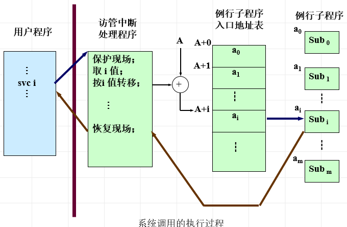

     + 类似于中断的实现，只是在判断到是异步中断就进中断处理；判断到访管中断就到系统调用
       + ​		1）  系统产生软中断（或陷入），由中断硬件完成部分现场信息保护：  PSW  的值和  PC  寄存器的值；并通过中断向量转向系统总控中断处理程序完成其他  CPU  现场信息的保存：如陷入类型、参数表指针、其他  CPU  寄存器的值等
       
         ​      2）    然后转向执行系统调用处理程序：使用系统调用功能号查找系统调用入口表，找到相应系统调用的处理子程序的入口地址；
       
         ​      3）    执行系统调用处理子程序，完毕后返回执行成功与否以及成功时的执行结果给调用者；恢复被中断进程或新调度进程的  CPU  现场，返回被中断进程或新调度进程执行。

   + 机制

     + 主要是通过陷入机制

3. 简述 CPU L1, L2, L3 多级缓存的基本作用

   + CPU缓存的基本作用就是解决CPU的处理速度和访存速度不匹配的问题。
   + 三级缓存都是集成在CPU内的缓存，容量依次增大，但速度依次递减。先到L1，再L2找，再L3，找不到就该访存了。

### 同步与互斥
1. 简述Linux的4种锁机制

   + mutex互斥锁

     + 保证任何时刻都只能有一个线程访问该对象。获取锁失败的被挂起进入睡眠状态，释放时被唤醒。

   + rwlock读写锁

     + 分为读锁和写锁。默认是一个读者优先的设计。

       ```c++
       reader(){
           P(mutex)
               if (readCount == 0) 
                   P(W)
               readCount++
           V(mutex)
           read text in buffer
           P(mutex)
           	--readCount;
          		if (readCount == 0)
                   V(W)
           V(mutex)
       }
       
       writer(){
           P(W)
           write text to buffer
           V(W)
       }
       ```

   + spinlock自旋锁

     + 自旋锁用于处理器之间的互斥，适合保护很短的临界区，不允许在临界区睡眠，就是一个忙等待锁。申请自旋锁的时锁如果被其它处理器占用，本处理器将自旋等待，也就是一直**循环“测试并设置”的原子操作**，而不会进入睡眠挂起状态，内核也不会被抢占。这也是与互斥锁的区别。
     + 这常用于中断里面加锁

   + RCU

     + 是一种重要的数据同步的方式。
     + 所谓RCU，就是read-copy-update。读者不需要获取任何锁就能读取，但执行修改时，首先会对原来部分进行拷贝，在拷贝的这部分上进行修改，修改完成后，会在合适的时机（所有要访问临界区的CPU都退出了临界区的操作时）将修改的部分对原部分进行替换。
     + RCU适用于频繁读取数据，且修改数据不多的情况。
   
2. 简述自旋锁和互斥锁的使用场景
    + 临界区开销小的，要加锁优先使用自旋锁。而代码复杂 / 循环量大 / 竞争激烈的就用互斥锁。
    + 如果要在中断里面加锁，那么只能使用自旋锁。
    + 自旋锁是忙等待锁，等待时不会进入睡眠状态，因此如果临界区的时间很短的话，使用自旋锁会有更高的效率。

2. 简述同步和异步的区别，阻塞和非阻塞的区别

   I/O模型里的同步异步和并发的同步异步不同，阻塞还是一样的

   + 并发里面的

     + 同步与异步
       + 同步就是被调用对象得到结果才会return；异步就是直接return，结果会另外通知。

     + 阻塞和非阻塞是一个对象的状态
       + 当调用者A调用了一个被调用的B时。A在B处理过程中的状态决定了是阻塞还是非阻塞。阻塞是A在B处理的过程中被挂起，直到得到了处理的结果为止。非阻塞则是B在处理过程中可以做其它事情。

   + I/O模型里面的

     + 同步和异步取决于内核和应用程序谁完成了数据在内核和应用程序之间的拷贝
       + 如果是内核完成的，那就是异步，反之则是同步。同步I/O中，向应用程序通知的是I/O就绪事件，而异步I/O通知的是I/O完成事件
     + 同种表述：
       + 应用程序向内核注册的是I/O就绪事件还是I/O完成事件。就绪则是同步，完成则是异步
       + 应用程序是否阻塞在I/O过程上

4. 信号量是如何实现的？

    + 信号量使用计数器count表示允许同时访问共享资源的最大进程数。
      + 如果有进程想访问共享资源，先用原子操作--count，如果count >= 0，则直接访问资源；反之说明需要等待，它会挂起到一个等待队列，同时进入不可中断的睡眠状态，只能在释放资源时由内核唤醒。
      + 如果有进程要释放共享资源，先用原子操作++count，如果count <= 0，则唤醒一个等待队列中的进程。

5. 两个线程交替打印一个共享变量

    + 这就是一个线程通信的问题。可以考虑使用锁或信号量

      ```c++
      Print1()
      {
          while(true)
          {
              P(tick)
                  if (time for print1)
                  {
                      PrintWord();
                      set tick for print2;
                  }
              V(tick)
          }
      }
      
      // print2也是一样
      ```

## Linux
1. 简述几个常用的Linux命令以及它们的功能

   + ls列出目录下文件
     + ls -l详细信息
     + ls -a列出目录所有文件
   + mkdir创建目录
   + cd目录切换
   + touch修改文件或者目录的时间属性，不存在文件就新建
   + echo输出字符串
   + cat用于连接文件并打印到标准输出设备上
   + cp用于copy
   + mv用于移动文件或者重命名
   + rm删除文件
     + rm -r将目录及其之下的逐一删除
     + rm -f强制删除，即使是只读的
   + find在指定目录下查找文件
   + grep查找文件里符合条件的字符串
   + rmdir删除目录
     + rmdir -p如果父目录在该目录被删了之后变空目录，它也会被递归删

2. Linux下如何排查CPU以及内存占用过多？

3. 简述Linux虚拟内存的页面置换算法

   + Linux使用的是LRU算法。
     + 当发送缺页中断要载入新的页面时，会将最近最少使用的页面置换出去。
   + 值得一提的是，在这种页面置换算法中，<font color = "red">页表项有个改变位的东西，它类似cache的脏位，类似fork的写时复制机制</font>，如果对应的页面被修改了，在替换时会写入磁盘。页表项主要包括**页号、块号、辅存地址、引用位、中断位、改变位**

4. Linux中虚拟内存和物理内存有什么区别？这种设计有何优点？

   + 区别：虚拟内存是为了满足物理内存的不足而利用磁盘空间虚拟出的一块逻辑内存。物理内存则是实际载入主存块内的内存。
   + 优点：主要是缓解了主存空间不足的一个问题。
     + 基于程序执行时的**局部性原理：在较短时间内，程序执行的指令及其操作数地址总是局限在一定区域内**。可以将暂时不要用到的部分放入磁盘，仅将使用的部分载入主存。

5. 简述操作系统中malloc的实现原理

   + 1、空闲存储空间以**空闲链表**的方式组织（地址递增），每个块包含一个长度、一个指向下一块的指针以及一个指向自身存储空间的指针。（ 因为程序中的某些地方可能不通过malloc调用申请，因此malloc管理的空间不一定连续。）
      2、当有申请请求时，malloc会**扫描空闲链表**，直到找到一个**足够大的块**为止（首次适应）(因此每次调用malloc时并不是花费了完全相同的时间）。
      3、如果该块恰好与请求的大小相符，则将其从链表中移走并返回给用户。如果该块太大，则将其分为两部分，尾部的部分分给用户，剩下的部分留在空闲链表中（更改头部信息）。因此**malloc分配的是一块连续的内存。**
      4、释放时，首先**搜索空闲链表**，找到可以**插入被释放块的合适位置**。如果与被释放块相邻的任一边是一个空闲块，则将这两个块**合为一个更大的块**，以**减少内存碎片**。
   + 当开辟空间小于128k时，malloc调用brk()函数，将堆段末尾地址_edata推移相对的位置，分配虚拟内存。
   + 当开辟空间大于128k时，使用mmap系统调用，在堆和栈的公共区域找一块空间开辟虚拟内存。
   + 分配虚拟内存，在进行访问的时候引发缺页中断，才会分配物理块。

6. malloc 创建的对象在堆还是栈中？

   + 在堆中

7. Linux下如何查看CPU荷载，正在运行的进程以及某个端口对应的进程？

   + 一般使用top命令查看系统负载，按q可以退出查看

     + Tasks行展示CPU状态

     + CPU行展示了CPU状态

       us表示用户进程所占的CPU比例

       sy表示系统进程所占的CPU比例

       id表示空闲CPU比例

       wa表示等待的比例

     + Mem行展示了内存状态

       total为总内存大小

       free表示空闲的

       used是已使用的

     + Swap行同Mem行

   + 查看正在运行的进程可以使用ps命令

     + 选项：
       + a：显示一个终端的所有进程，就是all
       + u：显示进程归属用户及内存使用情况，used
       + x：显示没有控制终端的进程
       + -l：长格式显示更详细的信息
       + -e：显示所有进程

   + 查看某个端口对应的进程

     + lsof -i 端口号（list open files）
     + netstat -tunlp|grep 端口号

8. Linux 如何查看实时的滚动日志？

   + tail -f 文件名
     + tail可用于查看文件内容，使用-f则可以不断刷新

## 主存管理
1. 简述操作系统如何进行内存管理

   + 目前操作系统主要有分区内存管理、页式存储管理以及段页式存储管理。

   + 分区存储管理将空闲的内存资源用链表结构连接起来，当需要分配资源时，使用首次适应 / 最佳适应 / 最坏适应算法分配对应大小的内存空间。释放时则将其放回链表中，合并连续的块。

   + 页式存储管理使用虚拟内存，它的访存过程如下：使用CPU生成的逻辑地址，通过查询页表，得到相应主存的块号，得到物理地址，访问主存资源。将页号+偏移   映射到   块号 + 偏移。页式存储管理将程序分页，主存分块；能将暂时不要用的部分放在辅存中，同时借助映射关系，扩大了地址空间。

   + 段页式存储管理将程序分段

     + 代码段
     + 数据段
     + BSS段
     + 堆
     + 栈

     主要是将原来的虚拟地址的  页号 + 偏移   转变为  

     段号  +  页号  +  偏移。通过段表寄存器和段号找到对应的页表地址，再结合段内的页号得到对应的主存块号，将块号和偏移结合，得到对应主存的物理地址。这总共会有三次访存。可以使用一个高速缓冲寄存器，访问时，就同时使用段号和页号检索高速缓存，得到页号对应的块号，这就快多了。

   + 还有一个涉及到页表淘汰机制。
     + OPT最佳置换算法
     + 先进先出
     + LRU
     + 时钟置换

2. 简述操作系统中的缺页中断

   + malloc()和mmap()等内存分配函数，在分配时只是建立了进程虚拟地址空间，并没有分配虚拟内存对应的物理内存。当进程访问这些没有建立映射关系的虚拟内存时，处理器自动触发一个缺页异常。

     缺页中断：在请求分页系统中，可以通过查询页表中的状态位来确定所要访问的页面是否存在于内存中。每当所要访问的页面不在内存中，会产生一次缺页中断，此时操作系统会根据页表中的外存地址在外存中找到所缺的一页，将其调入内存。

     缺页本身是一种中断，与一般的中断一样，需要经过4个处理步骤：

     1、保护CPU现场

     2、分析中断原因

     3、转入缺页中断处理程序进行处理

     4、恢复CPU现场，继续执行

     但是缺页中断是由于所要访问的页面不存在于内存时，由硬件所产生的一种特殊的中断，因此，与一般的中断存在区别：

     1、在指令执行期间产生和处理缺页中断信号

     2、一条指令在执行期间，可能产生多次缺页中断

     3、缺页中断返回时，执行产生中断的一条指令，而一般的中断返回是，执行下一条指令。

   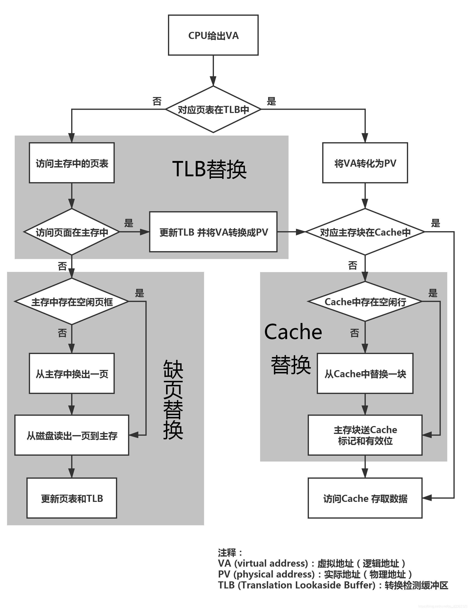

   + 当CPU通过虚拟地址在TLB表和页表中都没找到对应的主存块时，引发缺页中断，这时会将磁盘中对应的页读取到主存单元，同时建立TLB表和页表中的页号和主存块号的映射。

3. 操作系统中，虚拟地址和物理地址之间如何映射？

   + 在页式存储管理系统中，虚拟地址被切分成“页号 + 页内偏移”的形式，CPU通过页表地址寄存器和页号查找对应页的主存块号，将主存块号替换页号，得到“块号 + 块内偏移”的形式，这就是物理地址。
   + 段页式则被切分成“段号+页号+页内偏移”，也是找到对应的段表、页表，查找到主存块号，得到物理地址。

4. 进程空间从高位到低位都有些什么？

   + 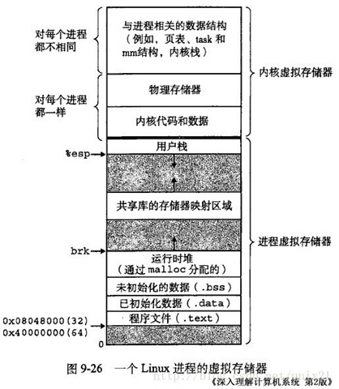

5. Linux 页大小是多少？

   4kb

## 设备管理

## 文件系统

## 场景题目
1. 如何调试服务器内存占用过高的问题？

