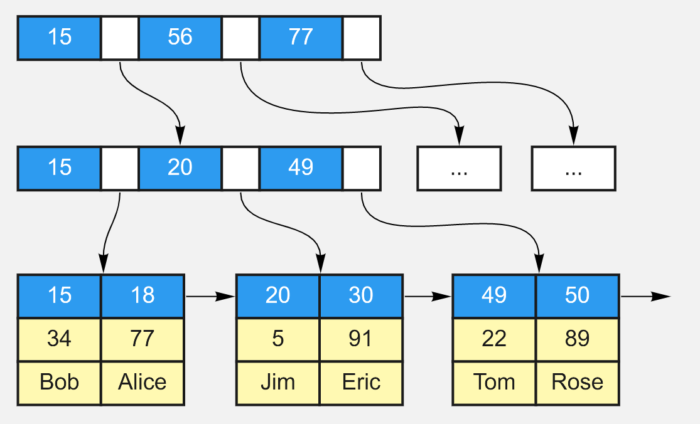

# 数据库面试

## SQL

#### 1. 介绍下数据库分页

+ MySQL分页语法

  + 默认情况下SELECT返回所有匹配行，而使用LIMIT，可以进行分页查询

  + LIMIT优化

    + 当偏移量很大的时候，比如LIMIT 10000， 20。应尽可能用索引覆盖扫描，或者是已知位置的查询

      ```mysql
      SELECT film_id,description FROM sakila.film ORDER BY title LIMIT 50,5;
      
      #换为索引覆盖扫描
      SELECT film.film_id,film.description  FROM sakila.film INNER JOIN (SELECT film_id FROM sakila.film ORDER BY title LIMIT 50,5 ) AS lim USING(film_id);
      
      #转为已知位置的查询
      SELECT film_id,description FROM skila.film WHERE position BETWEEN 50 AND 54 ORDER BY position;
      ```

#### 2. 介绍一下SQL中的聚合函数

```mysql
COUNT()统计数据表中记录的行的总数
COUNT(*)不论是不是空，都统计
COUNT(字段)是计算指定列的非空的行数

AVG()计算平均值

SUM()计算和

MAX()返回指定列的最大值

MIN()返回指定列的最小值
```

#### 3. 表和表的关联

+ 内连接
  + INNER JOIN，返回满足条件的连接数据
+ 外连接
  + 左外连接LEFT OUTER JOIN，返回左表中的所有记录和右表中满足连接条件的记录
  + 右外连接RIGHT OUTER JOIN
+ 等值连接
  + 这主要是靠WHERE完成的，效果等同于内连接，一般也更建议用内连接而非等值连接
+ 当然，从表的关系上说，常见的关联关系有：一对多关联、多对多关联、自关联
  + 一对多关联：主要是主表的主键关联从表的外键
  + 多对多关联：有时需要中间表来关联，中间表存储两张表的主键。与两张表各自形成一对多关联。
  + 自关联：就是一张与自己相关联的表，在关联时可通过别名将它们当作两表来看待。

#### 4. 怎么将行转换为列？

+ 

  

  ```mysql
  SELECT userid, 
  SUM(CASE `subject` WHEN '语文' THEN score ELSE 0 END) as '语文', 
  SUM(CASE `subject` WHEN '数学' THEN score ELSE 0 END) as '数学', 
  SUM(CASE `subject` WHEN '英语' THEN score ELSE 0 END) as '英语', 
  SUM(CASE `subject` WHEN '政治' THEN score ELSE 0 END) as '政治'  FROM tb_score  GROUP BY userid
  ```

  ```mysql
  #也可改用if
  SELECT userid, SUM(IF(`subject`='语文',score,0)) as '语文', SUM(IF(`subject`='数学',score,0)) as '数学', SUM(IF(`subject`='英语',score,0)) as '英语', SUM(IF(`subject`='政治',score,0)) as '政治'  FROM tb_score  GROUP BY userid
  ```

#### 5. SQL注入

+ 原理就是将SQL代码伪装到输入参数中，传递到Server解析并执行的一种手段。
+ 如何解决SQL注入
  + 严格参数校验
    + 不让不该出现的字符出现
  + SQL预编译
    + MySQL server在启动时，client先把语句模板发到服务器，空位直接用占位符，server服务器对SQL语句模板进行编译，编译之后根据语句的优化分析对相应的索引进行优化，在最终绑定参数时把相应的参数传送给MySQL服务器，直接进行执行，节省了SQL查询时间，以及MySQL服务器的资源，达到一次编译、多次执行的目的，除此之外，还可以防止SQL注入。
    + 具体是怎样防止SQL注入的呢？实际上当将绑定的参数传到MySQL服务器，MySQL服务器对参数进行编译，即填充到相应的占位符的过程中，做了转义操作。我们常用的JDBC就有预编译功能，不仅提升性能，而且防止SQL注入。

#### 6. Where和having的区别

+ WHERE是约束声明，在结果返回前作用，不能用聚合函数
+ HAVING是过滤声明，在结果返回后对结果进行过滤，可以使用聚合函数，但不能使用除了分组字段和聚合函数之外的其他字段。
  + 如果使用了分组字段作为过滤条件，就应该替换为WHERE子句

## 索引

#### 1. 什么是索引

+ 索引是一个单独的、存储在磁盘上的数据库结构，**包含着对数据表里所有记录的引用指针**。
+ 使用索引**可以快速找出在某个或多个列中有一特定值的行**
+ 所有MySQL列类型都可以被索引，对相关列使用索引是提高查询操作速度的最佳途径。
+ 索引是在存储引擎中实现的，因此，每种存储引擎的索引都不一定完全相同，并且每种存储引擎也不一定支持所有索引类型。
+ MySQL中索引的存储类型有两种，即BTREE和HASH，具体和表的存储引擎相关。**MyISAM和InnoDB存储引擎只支持BTREE索引；MEMORY/HEAP存储引擎可以支持HASH和BTREE索引。**

#### 2. 索引的作用与缺点

+ 作用
  + 创建唯一索引，可以保证数据库表中每一行数据的唯一性。
  + 加快数据的查询速度
  + 实现数据的参考完整性方面，可以加速表和表之间的连接
  + 使用分组和排序子句进行数据查询时，也可以显著减少查询中分组和排序的时间。
+ 缺点
  + 创建索引和维护索引要耗费时间，并且随着数据量的增加所耗费的时间也会增加。
  + 索引需要占磁盘空间，除了数据表占数据空间之外，每一个索引还要占一定的物理空间，如果有大量的索引，索引文件可能比数据文件更快达到最大文件尺寸。
  + 对表中的数据进行增加、删除和修改的时候，索引也要动态地维护，这样就降低了数据的维护速度

#### 3. 索引的分类

+ 普通索引、唯一索引、主键索引
  + 普通索引允许重复和NULL
  + 唯一索引不允许重复
  + 主键索引不允许NULL
+ 单列索引和组合索引
  + 单列就是只包含一个列
  + 组合则是多个字段的
+ 全文索引
  + FULLTEXT，可以在CHAR,VARCHAR,TEXT类型上创建，支持值的全文查找
  + 允许重复和NULL
+ 空间索引

#### 4. 怎么创建和保存MySQL索引

+ 建表时创建

  ```mysql
  CREATE TABLE mytable(  
  ID INT NOT NULL,   
  username VARCHAR(16) NOT NULL,  
  INDEX [indexName] (username(length))  
  );
  
  ALTER table tableName ADD INDEX indexName(columnName)
  
  ALTER TABLE tbl_name ADD PRIMARY KEY (column_list)
  ```

+ 在已有的表上添加表约束时创建

  ```mysql
  CREATE INDEX indexName ON table_name (column_name)
  ```

#### 5. MySQL怎么判断要不要加索引？

+ 当唯一性是某种数据本身的特征时，指定唯一索引。使用唯一索引需能确保定义的列的数据完整性，以提高查询速度。
+ 在频繁进行排序或分组（即进行group by或order by操作）的列上建立索引，如果待排序的列有多个，可以在这些列上建立组合索引。

#### 6. 只要创建了索引，就一定会走索引吗？

+ 不一定。必须遵循”最左前缀“的原则进行搜索
+ 比如id、name、age字段成功建立的组合索引。只有按照id,(id, name), (id, name, age)进行的搜索，才能使用索引与局部索引

#### 7. 如何判断数据库的索引是不是生效？

+ 使用EXPLAIN来查看索引是否在使用

  ```mysql
  EXPLAIN SELECT * FROM book WHERE year_publication=1990;
  ```

  + possible_keys给出了MySQL在搜索数据记录时可选用的各个索引
  + key行是MySQL实际使用的索引。只要key和possible_keys出现了同一字段，说明索引生效

#### 8. 如何判断索引创建是否合理？

+ 避免对经常更新的表进行过多的索引，并且索引中的列要尽可能少。应该经常用于查询的字段创建索引，但要避免添加不必要的字段。
+ 数据量小的表最好不要使用索引，由于数据较少，查询花费的时间可能比遍历索引的时间还要短，索引可能不会产生优化效果。
+ 在条件表达式中经常用到的不同值较多的列上建立索引，在不同值很少的列上不要建立索引。比如在学生表的“性别”字段上只有“男”与“女”两个不同值，因此就无须建立索引，如果建立索引不但不会提高查询效率，反而会严重降低数据更新速度。
+ 当唯一性是某种数据本身的特征时，指定唯一索引。使用唯一索引需能确保定义的列的数据完整性，以提高查询速度。
+ 在频繁进行排序或分组（即进行group by或order by操作）的列上建立索引，如果待排序的列有多个，可以在这些列上建立组合索引。

#### 9. 索引是越多越好吗？

+ 索引并非越多越好，一个表中如有大量的索引，不仅占用磁盘空间，还会影响INSERT、DELETE、UPDATE等语句的性能，因为在表中的数据更改时，索引也会进行调整和更新。

#### 10. 说一说MySQL索引的实现原理？

+ 在MySQL中，索引是在存储引擎层实现的，不同存储引擎对索引的实现方式是不同的。

+ MyISAM索引实现：

  + MyISAM引擎使用**B+Tree**作为索引结构，叶节点的**data域存放的是数据记录的地址**，MyISAM索引的原理图如下。这里假设表一共有三列，假设我们以Col1为主键，则下图是一个MyISAM表的主索引（Primary key）示意。可以看出**MyISAM的索引文件仅仅保存数据记录的地址**。在MyISAM中，**主索引和辅助索引（Secondary key）在结构上没有任何区别**，只是主索引要求key是唯一的，而辅助索引的key可以重复。

    

  + MyISAM中索引检索的算法为首先按照B+Tree搜索算法搜索索引，如果指定的Key存在，则取出其data域的值，然后以data域的值为地址，读取相应数据记录。

+ InnoDB索引实现

  + 区别一：**InnoDB的数据文件本身就是索引文件**，**而MyISAM索引文件和数据文件是分离的**，索引文件仅保存数据记录的地址。而在InnoDB中，表数据文件本身就是按B+Tree组织的一个索引结构，这棵树的叶节点data域保存了完整的数据记录。这个索引的key是数据表的主键，因此InnoDB表数据文件本身就是主索引。
  + 区别二：**InnoDB的辅助索引data域存储相应记录主键的值而不是地址，主索引和辅助索引（Secondary key）在结构上没有任何区别**。**InnoDB的所有辅助索引都引用主键作为data域**。聚集索引这种实现方式使得按主键的搜索十分高效，**但是辅助索引搜索需要检索两遍索引：首先检索辅助索引获得主键，然后用主键到主索引中检索获得记录。**

  + 下图是InnoDB主索引（同时也是数据文件）的示意图，可以看到**叶节点包含了完整的数据记录。这种索引叫做聚集索引**。因为InnoDB的数据文件本身要按主键聚集，所以**InnoDB要求表必须有主键（MyISAM可以没有）**，如果没有显式指定，则MySQL系统会自动选择一个可以唯一标识数据记录的列作为主键，如果不存在这种列，则MySQL自动为InnoDB表生成一个隐含字段作为主键，这个字段长度为6个字节，类型为长整形。

    

#### 11. 为什么不使用AVL树或者红黑树，而是使用B树或者B+树呢？为什么使用B+树而不用B树呢？

+ 为什么不用AVL树、红黑树而用B、B+树？
  1. **磁盘查找存取的次数往往由树的高度所决定**。B+树在数据库中有高扇出性。相比于红黑树，AVL树，需要的磁盘IO次数更少。
  2. B+树的聚集索引结构可以很好的利用**磁盘预读原理**。

+ 为什么用B+树而不用B树？
  1. B+树非叶子结点无data域，可存放更多键值对。相对来说，磁盘IO次数就会更少
  2. B+树所有的Data域在叶子节点，一般来说都会进行一个优化，就是**将所有的叶子节点用指针串起来**。这样**遍历**叶子节点就能获得全部数据，这样就能进行区间访问啦。在数据库中基于范围的查询是非常频繁的，而B树不支持这样的遍历操作。

+ **B+树只有叶节点存放数据，其余节点用来索引，而B-树是每个索引节点都会有Data域。**所以从Mysql（Inoodb）的角度来看，B+树是用来充当索引的，一般来说索引非常大，尤其是关系性数据库这种数据量大的索引能达到亿级别，所以为了减少内存的占用，索引也会被存储在磁盘上。
  **那么Mysql如何衡量查询效率呢？– 磁盘IO次数。** B-树/B+树 的特点就是每层节点数目非常多，层数很少，目的就是为了就少磁盘IO次数，但是B-树的每个节点都有data域（指针），这无疑增大了节点大小，说白了增加了磁盘IO次数（磁盘IO一次读出的数据量大小是固定的，单个数据变大，每次读出的就少，IO次数增多，一次IO多耗时），而B+树除了叶子节点其它节点并不存储数据，节点小，磁盘IO次数就少。**这是优点之一。**
  **另一个优点是：** B+树所有的Data域在叶子节点，一般来说都会进行一个优化，就是**将所有的叶子节点用指针串起来**。这样**遍历**叶子节点就能获得全部数据，这样就能进行区间访问啦。在数据库中基于范围的查询是非常频繁的，而B树不支持这样的遍历操作。

  ##### B树相对于[红黑树](https://so.csdn.net/so/search?q=红黑树&spm=1001.2101.3001.7020)的区别

  **AVL 数和红黑树基本都是存储在内存中才会使用的数据结构**。在大规模数据存储的时候，红黑树往往出现由于**树的深度过大**而造成磁盘IO读写过于频繁，进而导致效率低下的情况。为什么会出现这样的情况，我们知道要获取磁盘上数据，必须先通过磁盘移动臂移动到数据所在的柱面，然后找到指定盘面，接着旋转盘面找到数据所在的磁道，最后对数据进行读写。磁盘IO代价主要花费在查找所需的柱面上，树的深度过大会造成磁盘IO频繁读写。根据**磁盘查找存取的次数往往由树的高度所决定**，所以，只要我们通过某种较好的树结构减少树的结构尽量减少树的高度，B树可以有多个子女，从几十到上千，可以降低树的高度。

  **数据库系统的设计者巧妙利用了磁盘预读原理**，将一个节点的大小设为等于一个页，这样每个节点只需要一次I/O就可以完全载入。为了达到这个目的，在实际实现B-Tree还需要使用如下技巧：每次新建节点时，直接申请一个页的空间，这样就保证**一个节点物理上也存储在一个页里**，加之计算机存储分配都是按页对齐的，就实现了一个node只需一次I/O。
+ 局部性相关：
  + InnoDB存储引擎的页为16k，磁盘的文件系统的页为4k，磁盘存储数据的最小单元是块，一个块为512byte。内存的页和磁盘页大小一致，都是4k，每次进行磁盘IO读取到内存里面的时候，就可以利用局部性原理，实现磁盘预读。


#### 12. MySQL的Hash索引和B树索引有什么区别？

+ hash索引底层就是hash表，进行查找时，调用一次hash函数就可以获取到相应的键值，之后进行回表查询获得实际数据。B+树底层实现是多路平衡查找树，对于每一次的查询都是从根节点出发，查找到叶子节点方可以获得所查键值，然后根据查询判断是否需要回表查询数据。它们有以下的不同：

- **hash索引进行等值查询更快**(一般情况下)，但是却无法进行范围查询。因为在hash索引中经过hash函数建立索引之后，索引的顺序与原顺序无法保持一致，不能支持范围查询。而B+树的的所有节点皆遵循(左节点小于父节点，右节点大于父节点，多叉树也类似)，天然支持范围。
- hash索引**不支持使用索引进行排序**，原理同上。
- hash索引**不支持模糊查询以及多列索引的最左前缀匹配**，原理也是因为hash函数的不可预测。
- hash索引任何时候都避免不了**回表查询数据**，而B+树在符合某些条件(聚簇索引，覆盖索引等)的时候可以只通过索引完成查询。
- hash索引虽然在等值查询上较快，但是不稳定，性能不可预测，当某个键值存在大量重复的时候，发生hash碰撞，此时效率可能极差。而B+树的查询效率比较稳定，对于所有的查询都是从根节点到叶子节点，且树的高度较低。

因此，在大多数情况下，直接选择B+树索引可以获得稳定且较好的查询速度。而不需要使用hash索引。

#### 13. 聚簇索引和非聚簇索引有什么区别？

+ 在InnoDB存储引擎中，可以将B+树索引分为**聚簇索引和辅助索引**（非聚簇索引）。无论是何种索引，每个页的大小都为16KB，且不能更改。

+ 聚簇索引是根据主键创建的一棵B+树，聚簇索引的叶子节点存放了表中的所有记录。辅助索引是根据索引键创建的一棵B+树，与聚簇索引不同的是，其叶子节点仅存放索引键值，以及该索引键值指向的主键。也就是说，如果通过辅助索引来查找数据，那么当找到辅助索引的叶子节点后，很有可能还需要根据主键值查找聚簇索引来得到数据，这种查找方式又被称为书签查找。因为辅助索引不包含行记录的所有数据，这就意味着每页可以存放更多的键值，因此其高度一般都要小于聚簇索引。

#### 14. 联合索引？

+ **联合索引是指对表上的多个列进行索引**，联合索引的创建方法与单个索引创建的方法一样，不同之处仅在于有多个索引列。从本质上来说，联合索引还是一棵B+树，不同的是联合索引的键值数量不是1，而是大于等于2，参考下图。另外，只有在查询条件中使用了这些字段的左边字段时，索引才会被使用，所以使用联合索引时遵循最左前缀集合。

## 事务

#### 1. 说一说你对数据库事务的了解

事务可由一条非常简单的SQL语句组成，也可以由一组复杂的SQL语句组成。在**事务中的操作，要么都执行修改，要么都不执行**，这就是事务的目的，也是事务模型区别于文件系统的重要特征之一。

**事务ACID四个特性：**

- A（atomicity），原子性。原子性指整个数据库**事务是不可分割的工作单位**。只有使事务中所有的数据库操作都执行成功，整个事务的执行才算成功。事务中任何一个SQL语句执行失败，那么已经执行成功的SQL语句也必须撤销，数据库状态应该退回到执行事务前的状态。
- C（consistency），一致性。一致性指事务将数据库从一种状态转变为另一种一致的状态。在**事务开始之前和事务结束以后，数据库的完整性约束没有被破坏。**
- I（isolation），隔离性。事务的隔离性要求每个读写事务的对象与其他事务的操作对象能相互分离，即该事务提交前对其他事务都不可见，这通常使用锁来实现。
- D（durability） ，持久性。事务一旦提交，其结果就是永久性的，即使发生宕机等故障，数据库也能将数据恢复。持久性保证的是事务系统的高可靠性，而不是高可用性。

**事务可以分为以下几种类型：**

- **扁平事务**：是事务类型中最简单的一种，而在实际生产环境中，这可能是使用最为频繁的事务。在扁平事务中，所有操作都处于同一层次，其由BEGIN WORK开始，由COMMIT WORK或ROLLBACK WORK结束。处于之间的操作是原子的，要么都执行，要么都回滚。
- **带有保存点的扁平事务**：除了支持扁平事务支持的操作外，允许在事务执行过程中回滚到同一事务中较早的一个状态，这是因为可能某些事务在执行过程中出现的错误并不会对所有的操作都无效，放弃整个事务不合乎要求，开销也太大。保存点（savepoint）用来通知系统应该记住事务当前的状态，以便以后发生错误时，事务能回到该状态。
- **链事务**：可视为保存点模式的一个变种。链事务的思想是：在提交一个事务时，释放不需要的数据对象，将必要的处理上下文隐式地传给下一个要开始的事务。注意，**提交事务操作和开始下一个事务操作将合并为一个原子操作**。这意味着下一个事务将看到上一个事务的结果，就好像在一个事务中进行的。
- **嵌套事务**：是一个层次结构框架。有一个顶层事务（top-level transaction）控制着各个层次的事务。顶层事务之下嵌套的事务被称为子事务（subtransaction），其控制每一个局部的变换。**子事务既可以提交也可以回滚。但它的提交不会立马生效，除非其父事务提交。**因此，任何子事务都在顶层事务提交后才真正的提交。
- **分布式事务**：通常是一个在分布式环境下运行的扁平事务，因此需要根据数据所在位置访问网络中的不同节点。对于分布式事务，同样需要满足ACID特性，要么都发生，要么都失效。
- 对于MySQL的InnoDB存储引擎来说，它**支持扁平事务、带有保存点的扁平事务、链事务、分布式事务**。对于嵌套事务，MySQL数据库并不是原生的，因此对于有并行事务需求的用户来说MySQL就无能为力了，但是用户可以通过带有保存点的事务来模拟串行的嵌套事务。

#### 2. MySQL的ACID特性分别是怎么实现的？

**原子性**：

实现原子性的**关键是当事务回滚时能够撤销所有已经成功执行的sql语句**。InnoDB实现回滚靠的是**逻辑日志undo log**

**持久性**：

InnoDB作为MySQL的存储引擎，数据是存放在磁盘中的，但如果每次读写数据都需要磁盘IO，效率会很低。为此，InnoDB提供了缓存(Buffer Pool)，Buffer Pool中包含了磁盘中部分数据页的映射，作为访问数据库的缓冲。当从数据库读取数据时，会首先从Buffer Pool中读取，如果Buffer Pool中没有，则从磁盘读取后放入Buffer Pool。当向数据库写入数据时，会首先写入Buffer Pool，Buffer Pool中修改的数据会定期刷新到磁盘中（这一过程称为刷脏）。

Buffer Pool的使用大大提高了读写数据的效率，但是也带了新的问题：如果MySQL宕机，而此时Buffer Pool中修改的数据还没有刷新到磁盘，就会导致数据的丢失，事务的持久性无法保证。

于是，**redo log**被引入来解决这个问题。**当数据修改时，除了修改Buffer Pool中的数据，还会在redo log记录这次操作。当事务提交时，会调用fsync接口对redo log进行刷盘**。如果MySQL宕机，重启时可以读取redo log中的数据，对数据库进行恢复。redo log采用的是WAL（Write-ahead logging，预写式日志），所有**修改先写入日志，再更新到Buffer Pool**，保证了数据不会因MySQL宕机而丢失，从而满足了持久性要求。

既然redo log也需要在事务提交时将日志写入磁盘，为什么它比直接将Buffer Pool中修改的数据写入磁盘(即刷脏)要快呢？主要有以下两方面的原因：

- **刷脏是随机IO**，因为每次修改的数据位置随机，但写**redo log是追加操作，属于顺序IO**。
- **刷脏是以数据页（Page）为单位的，MySQL默认页大小是16KB，一个Page上一个小修改都要整页写入。而redo log中只包含真正需要写入的部分，无效IO大大减少。**

**隔离性**：

隔离性追求的是并发情形下事务之间互不干扰。简单起见，我们主要考虑最简单的读操作和写操作(加锁读等特殊读操作会特殊说明)，那么隔离性的探讨，主要可以分为两个方面。

第一方面，**(一个事务)写操作对(另一个事务)写操作的影响：锁机制保证隔离性**。

隔离性要求同一时刻只能有一个事务对数据进行写操作，InnoDB通过**锁机制**来保证这一点。锁机制的基本原理可以概括为：事务在修改数据之前，需要先获得相应的锁。获得锁之后，事务便可以修改数据。该事务操作期间，这部分数据是锁定的，其他事务如果需要修改数据，需要等待当前事务提交或回滚后释放锁。

按照粒度，锁可以分为**表锁、行锁以及其他位于二者之间的锁**。表锁在操作数据时会锁定整张表，并发性能较差。行锁则只锁定需要操作的数据，并发性能好。但是由于加锁本身需要消耗资源，因此在锁定数据较多情况下使用表锁可以节省大量资源。MySQL中不同的存储引擎支持的锁是不一样的，例如**MyIsam只支持表锁，而InnoDB同时支持表锁和行锁，且出于性能考虑，绝大多数情况下使用的都是行锁。**

第二方面，**(一个事务)写操作对(另一个事务)读操作的影响：MVCC保证隔离性。**

InnoDB默认的隔离级别是RR（REPEATABLE READ），RR解决脏读、不可重复读、幻读等问题，使用的是MVCC。MVCC全称Multi-Version Concurrency Control，即多版本的并发控制协议。它最大的优点是读不加锁，因此读写不冲突，并发性能好。InnoDB实现MVCC，多个版本的数据可以共存，主要基于以下技术及数据结构：

1. **隐藏列**：InnoDB中每行数据都有隐藏列，隐藏列中包含了本行数据的事务id、指向undo log的指针等。
2. **基于undo log的版本链**：每行数据的隐藏列中包含了指向undo log的指针，而每条undo log也会指向更早版本的undo log，从而形成一条版本链。
3. **ReadView**：通过隐藏列和版本链，MySQL可以将数据恢复到指定版本。但是具体要恢复到哪个版本，则需要根据ReadView来确定。所谓ReadView，是指**事务（记做事务A）在某一时刻给整个事务系统（trx_sys）打快照**，之后再进行读操作时，会将读取到的数据中的事务id与trx_sys快照比较，从而判断数据对该ReadView是否可见，即对事务A是否可见。

**一致性**：

可以说，一致性是事务追求的最终目标。前面提到的原子性、持久性和隔离性，都是为了保证数据库状态的一致性。此外，除了数据库层面的保障，一致性的实现也需要应用层面进行保障。实现一致性的措施包括：

- 保证原子性、持久性和隔离性，如果这些特性无法保证，事务的一致性也无法保证。
- 数据库本身提供保障，例如不允许向整形列插入字符串值、字符串长度不能超过列的限制等。
- 应用层面进行保障，例如如果转账操作只扣除转账者的余额，而没有增加接收者的余额，无论数据库实现的多么完美，也无法保证状态的一致。

#### 3. InnoDB怎么解决幻读问题的？

**3.1. innodb是怎么解决快照读的幻读问题的？**

快照读就是每一行数据中额外保存两个隐藏的列，插入这个数据行时的版本号，删除这个数据行时的版本号（可能为空），滚动指针(指向undo log中用于事务回滚的日志记录)。

事务在对数据修改后，进行保存时，如果数据行的当前版本号与事务开始取得数据的版本号一致就保存成功，否则保存失败。

当我们不显式使用BEGIN来开启事务时，我们执行的每一条语句就是一个事务，每次开始事务时，会对系统版本号+1作为当前事务的ID。

**插入操作**

插入一行数据时，将事务的ID作为数据行的创建版本号。

**删除操作**

执行删除操作时，会将原数据行的删除版本号设置为当前事务的ID，然后根据原数据行生成一条INSERT语句，写入undo log，用于事务执行失败时回滚。delete操作实际上不会直接删除，而是将delete对象打上delete flag，标记为删除，最终的删除操作是purge线程完成的。但是会将数据行的删除版本号设置为当前的事务的ID，这样后面的事务B即便查到这行数据由于事务B的ID>删除版本号，也会忽略这条数据。

**更新操作**

更新时可以简单的认为是先将旧数据删除，然后插入一条新数据。

所以执行更新操作时，其实是会将原数据行的删除版本号设置为当前事务的ID，生成一条INSERT语句，写入undo log，用于事务执行失败时回滚。插入一条新的数据，将事务的ID作为数据行的的创建版本号。

**查询操作**

数据行要被查询出来必须满足两个条件，

- 数据行删除版本号为空或者>当前事务版本号的数据（否则数据已经被标记删除了)
- 创建版本号<=当前事务版本号的数据（否则数据是后面的事务创建出来的）

简单来说，就是查询时，

- **如果该行数据没有被加行锁中的X锁（也就是没有其他事务对这行数据进行修改），那么直接读取数据（前提是数据的版本号<=当前事务版本号的数据,不然不会放到查询结果集里面）。**
- **该行数据被加了行锁X锁（也就是现在有其他事务对这行数据进行修改），那么读数据的事务不会进行等待，而是回去undo log端里面读之前版本的数据（这里存储的数据本身是用于回滚的），在可重复读的隔离级别下，从undo log中读取的数据总是事务开始时的快照数据(也就是版本号小于当前事务ID的数据)，在提交读的隔离级别下，从undo log中读取的总是最新的快照数据。**

**3.2. innodb是怎么解决当前读的幻读问题的？**

+ 通过Next-Key Lock算法实现的

  ```mysql
  // 触发当前读
  select v from t where id=1 for update; -- 给ID为1的行增加写锁（X锁，排它锁）
  select v from t where id=1 lock in share mode; -- 给ID为1的行增加读锁（S锁，共享锁）
  ```

#### 4. 谈谈MySQL的事务隔离级别

**参考答案**

SQL 标准定义了四种隔离级别，这四种隔离级别分别是：

- 读未提交（READ UNCOMMITTED）；
- 读提交 （READ COMMITTED）；
- 可重复读 （REPEATABLE READ）；
- 串行化 （SERIALIZABLE）。

事务隔离是为了解决脏读、不可重复读、幻读问题，下表展示了 4 种隔离级别对这三个问题的解决程度：

| 隔离级别         | 脏读   | 不可重复读 | 幻读   |
| ---------------- | ------ | ---------- | ------ |
| READ UNCOMMITTED | 可能   | 可能       | 可能   |
| READ COMMITTED   | 不可能 | 可能       | 可能   |
| REPEATABLE READ  | 不可能 | 不可能     | 可能   |
| SERIALIZABLE     | 不可能 | 不可能     | 不可能 |

上述4种隔离级别MySQL都支持，并且InnoDB存储引擎默认的支持隔离级别是REPEATABLE READ，但是与标准SQL不同的是，InnoDB存储引擎在REPEATABLE READ事务隔离级别下，使用**Next-Key Lock的锁算法，因此避免了幻读的产生**。所以，InnoDB存储引擎在默认的事务隔离级别下已经能完全保证事务的隔离性要求，即达到SQL标准的SERIALIZABLE隔离级别。

#### 5. 如何实现可重复读？

MySQL的InnoDB引擎，在默认的**REPEATABLE READ的隔离级别下，实现了可重复读**，**同时也解决了幻读问题**。它使用**Next-Key Lock算法实现了行锁**，并且不允许读取已提交的数据，所以解决了不可重复读的问题。另外，该算法包含了**间隙锁，会锁定一个范围，因此也解决了幻读的问题。**

#### 6. MySQL事务如何回滚？

在MySQL默认的配置下，事务都是自动提交和回滚的。当显示地开启一个事务时，可以使用ROLLBACK语句进行回滚。该语句有两种用法：

- ROLLBACK：要使用这个语句的最简形式，只需发出ROLLBACK。同样地，也可以写为ROLLBACK WORK，但是二者几乎是等价的。回滚会结束用户的事务，并撤销正在进行的所有未提交的修改。
- ROLLBACK TO [SAVEPOINT] identifier ：这个语句与SAVEPOINT命令一起使用。可以把事务回滚到标记点，而不回滚在此标记点之前的任何工作。

## 锁

#### 1. 了解数据库的锁吗？

**锁是数据库系统区别于文件系统的一个关键特性**，锁机制用于管理对共享资源的并发访问。下面我们以MySQL数据库的InnoDB引擎为例，来说明锁的一些特点。

**1.1 锁的类型：**

InnoDB存储引擎实现了如下两种标准的行级锁：

- 共享锁（S Lock），允许事务读一行数据。
- 排他锁（X Lock），允许事务删除或更新一行数据。

如果一个事务T1已经获得了行r的共享锁，那么另外的事务T2可以立即获得行r的共享锁，因为读取并没有改变行r的数据，称这种情况为锁兼容。但若有其他的事务T3想获得行r的排他锁，则其必须等待事务T1、T2释放行r上的共享锁，这种情况称为锁不兼容。下图显示了共享锁和排他锁的兼容性，可以发现X锁与任何的锁都不兼容，而S锁仅和S锁兼容。需要特别注意的是，S和X锁都是行锁，兼容是指对同一记录（row）锁的兼容性情况。

**1.2 锁的粒度**

InnoDB存储引擎支持多粒度锁定，这种锁定允许事务在行级上的锁和表级上的锁同时存在。为了支持在不同粒度上进行加锁操作，InnoDB存储引擎支持一种额外的锁方式，称之为意向锁。**意向锁是将锁定的对象分为多个层次，意向锁意味着事务希望在更细粒度上进行加锁。**

InnoDB存储引擎支持意向锁设计比较简练，其意向锁即为表级别的锁。设计目的主要是为了在一个事务中揭示下一行将被请求的锁类型。其支持两种意向锁：

- 意向共享锁（IS Lock），事务想要获得一张表中某几行的共享锁。和意向锁兼容，和排他锁不兼容。
- 意向排他锁（IX Lock），事务想要获得一张表中某几行的排他锁。和意向锁兼容，和共享锁，排他锁不兼容。

由于InnoDB存储引擎支持的是行级别的锁，因此意向锁其实不会阻塞除全表扫以外的任何请求。

**1.3 锁的算法：**

InnoDB存储引擎有3种行锁的算法，其分别是：

- **Record Lock**：单个行记录上的锁。
- **Gap Lock**：间隙锁，锁定一个范围，但不包含记录本身。它的作用是为了阻止多个事务将记录插入到同一范围内，而这会导致幻读问题的产生。
- **Next-Key Lock**∶Gap Lock+Record Lock，锁定一个范围，并且锁定记录本身。

Record Lock总是会去锁住索引记录，如果InnoDB存储引擎表在建立的时候没有设置任何一个索引，那么这时InnoDB存储引擎会使用隐式的主键来进行锁定。Next-Key Lock是结合了Gap Lock和Record Lock的一种锁定算法，在Next-Key Lock算法下，InnoDB对于行的查询都是采用这种锁定算法。采用Next-Key Lock的锁定技术称为Next-Key Locking，其设计的目的是为了解决Phantom Problem（幻读）。而利用这种锁定技术，锁定的不是单个值，而是一个范围，是谓词锁（predict lock）的一种改进。

#### 2. 数据库的死锁以及解决死锁的办法

死锁是指两个或两个以上的事务在执行过程中，因争夺锁资源而造成的一种互相等待的现象。若无外力作用，事务都将无法推进下去。

1. **设置超时间隔**，即当两个事务互相等待时，当一个等待时间超过设置的某一阈值时，其中一个事务进行回滚，另一个等待的事务就能继续进行。

2. **wait-for graph**（等待图）的方式来进行**死锁检测**。较之超时的解决方案，这是一种更为主动的死锁检测方式。InnoDB存储引擎也采用的这种方式。wait-for graph要求数据库保存以下两种信息：

   - 锁的信息链表；

   - 事务等待链表；

通过上述链表可以构造出一张图，而在这个图中若存在回路，就代表存在死锁，因此资源间相互发生等待。这是一种较为主动的死锁检测机制，在每个事务请求锁并发生等待时都会判断是否存在回路，若存在则有死锁，通常来说**InnoDB存储引擎选择回滚undo量最小的事务。**

#### 3. 锁升级

锁升级（Lock Escalation）是指将当前**锁的粒度降低**。举例来说，数据库可以把一个表的1000个行锁升级为一个页锁，或者将页锁升级为表锁。InnoDB存储引擎不存在锁升级的问题。因为其不是根据每个记录来产生行锁的，相反，其根据每个事务访问的每个页对锁进行管理的，采用的是位图的方式。因此不管一个事务锁住页中一个记录还是多个记录，其开销通常都是一致的。

#### 4. InnoDB中行级锁是怎么实现的？

**InnoDB行级锁**是通过**给索引上的索引项加锁**来实现的。**只有通过索引条件检索数据，InnoDB才使用行级锁，否则，InnoDB将使用表锁。**当表中锁定其中的某几行时，不同的事务可以使用不同的索引锁定不同的行。另外，不论使用主键索引、唯一索引还是普通索引，InnoDB都会使用行锁来对数据加锁。

## 优化

#### 1. 1000万的数据，想存到MySQL里，要求查询尽可能快，怎么设计？

1. 优化SQL和索引：尽量少用子查询，而改用join连接；尽量不在where子句里使用!=的判断，防止全表查询；尽量使用索引，例如InnoDB的聚簇索引，辅助索引，查询时还可以用索引覆盖的办法。
2. 增加缓存，如memcached、redis；
3. 读写分离，可以采用主从复制，也可以采用主主复制；
4. 使用MySQL自带的分区表，这对应用是透明的，无需改代码，但SQL语句是要针对分区表做优化的；
5. 做垂直拆分，即根据模块的耦合度，将一个大的系统分为多个小的系统；
6. 做水平拆分，要选择一个合理的sharding key，为了有好的查询效率，表结构也要改动，做一定的冗余，应用也要改，sql中尽量带sharding key，将数据定位到限定的表上去查，而不是扫描全部的表。

#### 2. MySQL的慢查询优化有了解吗？

优化MySQL的慢查询，可以按照如下步骤进行：

开启慢查询日志：

MySQL中慢查询日志默认是关闭的，可以通过配置文件my.ini或者my.cnf中的log-slow-queries选项打开，也可以在MySQL服务启动的时候使用--log-slow-queries[=file_name]启动慢查询日志。

启动慢查询日志时，需要在my.ini或者my.cnf文件中配置long_query_time选项指定记录阈值，如果某条查询语句的查询时间超过了这个值，这个查询过程将被记录到慢查询日志文件中。

分析慢查询日志：

直接分析mysql慢查询日志，利用explain关键字可以模拟优化器执行SQL查询语句，来分析sql慢查询语句。

常见慢查询优化：

1. 索引没起作用的情况

   - 在使用LIKE关键字进行查询的查询语句中，如果匹配字符串的第一个字符为“%”，索引不会起作用。只有“%”不在第一个位置，索引才会起作用。
   - MySQL可以为多个字段创建索引。一个索引可以包括16个字段。对于多列索引，只有查询条件中使用了这些字段中的第1个字段时索引才会被使用。
   - 查询语句的查询条件中只有OR关键字，且OR前后的两个条件中的列都是索引时，查询中才使用索引。否则，查询将不使用索引。

2. 优化数据库结构

   - 对于字段比较多的表，如果有些字段的使用频率很低，可以将这些字段分离出来形成新表。因为当一个表的数据量很大时，会由于使用频率低的字段的存在而变慢。
   - 对于需要经常联合查询的表，可以建立中间表以提高查询效率。通过建立中间表，把需要经常联合查询的数据插入到中间表中，然后将原来的联合查询改为对中间表的查询，以此来提高查询效率。

3. 分解关联查询

   很多高性能的应用都会对关联查询进行分解，就是可以对每一个表进行一次单表查询，然后将查询结果在应用程序中进行关联，很多场景下这样会更高效。

4. 优化LIMIT分页

   当偏移量非常大的时候，例如可能是limit 10000,20这样的查询，这是mysql需要查询10020条然后只返回最后20条，前面的10000条记录都将被舍弃，这样的代价很高。优化此类查询的一个最简单的方法是尽可能的使用索引覆盖扫描，而不是查询所有的列。然后根据需要做一次关联操作再返回所需的列。对于偏移量很大的时候这样做的效率会得到很大提升。
