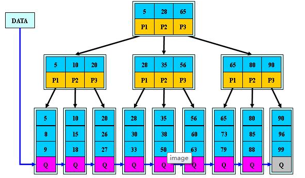
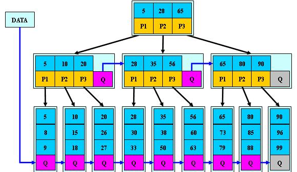

# 数据结构与算法面试

## 一、数组

## 二、链表

## 三、字符串

## 四、 队列、栈、堆

## 五、树

### 平衡二叉树和红黑树的区别？使用范围？

+ AVL Tree就是左右子树高度差<=1的树，它的左右子树也有这样的规律。它是一种高度平衡的二叉树。适合进行查找，但频繁插入删除则会导致相比RB Tree更多的再平衡操作。
+ RB Tree则是弱平衡二叉树。更适合频繁插入删除的操作。它的插入、删除、查找的时间复杂度都是O(logn)
  + 性质：
    + 每个结点有颜色
    + 根和叶子(null)都黑色
    + 红色结点的子结点必为黑色
    + 任意结点到它的叶子结点的路径上经过的黑色结点数量相同。
      + 这也意味着从某个结点出发，没有一条路径会是另一条的两倍长
  + 应用：
    + 比如插入删除次数比查找的情况多的多的时候，如STL里的map和set都是红黑树；Linux的epoll里也有红黑树；CFS进程调度也有红黑树。

### 哈夫曼编码

+ 实际就是最优树。计算每个结点的权值，然后权值最低的两两组合成一个新结点，最后形成这样的树。
+ 应用：哈夫曼编码实现文件压缩

### B树、B-树、B+树、B*树

1. B树

   + 就是二叉搜索树（并不要求平衡）
   + 每个结点只存储一个关键字，等于则命中，小于走左结点，大于走右结点

2. B-树

   + 是一个多路搜索树（孩子数大于2）
   + 每个结点存储M/2到M个关键字，非叶子结点存储指向关键字范围的子结点
   + 关键字的个数等于儿子指针数量 - 1
   + 所有关键字在整颗树中出现，且只出现一次，非叶子结点可以命中；
   + 搜索的时候可以在每个结点那里二分查找；实际搜索性能就等价于在全体关键字内二分查找

   

3. B+树

   + 是一个多路搜索树（孩子数大于2）

   + 非叶子结点的子树指针与关键字个数相同；而B-树则是子树指针数量 = 关键字个数 + 1

   + 非叶子结点的子树指针P[i]，指向关键字值属于[K[i], K[i+1])的子树（B-树是开区间）

   + 为所有叶子结点增加一个链指针；

   + 所有关键字都在叶子结点出现；

   + 非叶子结点实际就是叶子结点的索引；B+树总是到叶子结点才命中；

   + 应用：

     + 适合文件索引系统。为磁盘或者其它直接存取辅助设备设计的平衡查找树
     + 每个非叶子结点只存key；而叶子结点是维护记录

     

4. B*树

   + 在B+树的基础上增加了中间结点指向兄弟结点的指针

     

## 六、图

## 七、 哈希

## 八、 算法部分

### 8.1 排序

### 8.2 动态规划

