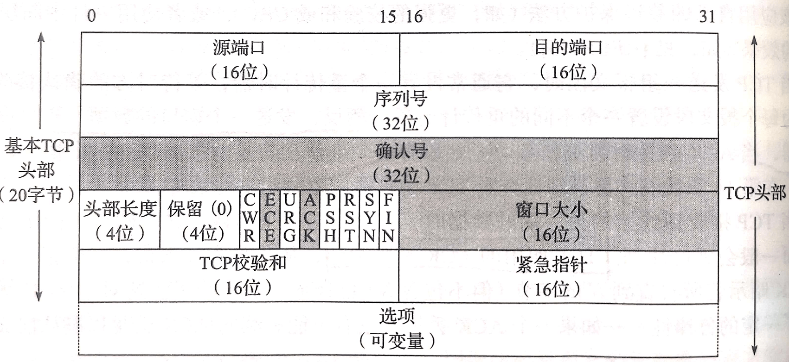
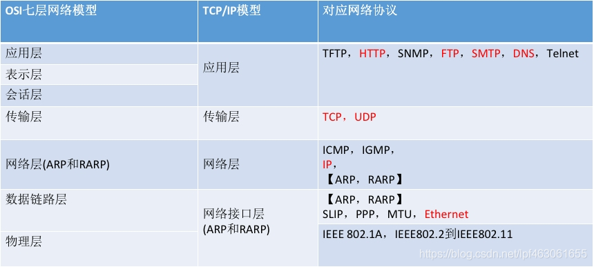

## 面试之计算机网络 ##

## 应用层

### http协议

1. 从输入 URL 到展现页面的全过程

   1. 检查HSTS列表（HTTP严格传输安全列表）

      + 如果网站在列表里，就使用HTTPS进行连接；否则先使用http协议发出http请求，然后web server返回301状态码，提示重定向到https站点，这时浏览器会再使用https发送请求

   2. DNS查询

      + 先检查url域名是不是在浏览器缓存里面；没有，则查看本地host文件是否有该url的域名缓存；如果也没有，则向DNS服务器发送DNS查询报文
      + 如果DNS服务器在同一个子网，则直接对DNS服务器进行ARP查询；否则对网关进行ARP查询
      + ARP查询完毕，则向DNS服务器或网关发送查询报文。如果DNS是在子网内，则使用DNS的ip和DNS的mac；如果不在子网内，则要用DNS的ip和网关的mac，到了网关后，链路层帧被拆解像上层呈递，网络层得到DNS的ip，就变成了由路由器向目的ip为DNS服务器ip的主机发消息了。
      + DNS服务器最终收到查询报文，并发送对应url的ip地址的UDP报文

      ARP过程

      简介：ARP协议是介于网络层和链路层之间的一个协议。每个主机都有一个ARP表，用来记录自己子网内主机的ip到mac的映射。发送消息需要网络层的目的ip和链路层的目的mac。如果目的ip的mac未知，就会发送一个目的mac为ff.ff.ff.ff.ff.ff的ARP查询报文，传入自己的ip和mac，还有目的ip，让子网内的其它设备收到并返回它的mac，再记录到ARP表，这时就可以发送了。

      + ARP过程：
        1. 如果ARP缓存命中，则直接返回结果，得到目标mac；反之，则查看路由表，看DNS目标IP是否在本地路由表中的某个子网内，如果在，则使用对应的接口，反之使用默认网关的接口
        2. 发送查询对应接口的mac地址的ARP请求，等响应后得到默认网关的mac地址或者DNS服务器的mac地址

   3. Web交互

      + 首先是TCP三次握手，client发送目的ip为url对应ip，mac为路由器mac的TCP SYN报文
      + server收到SYN报文,发送TCP SYNACK报文段，封装到IP数据报，继续装到链路层帧发送。
      + client收到后就开始发送HTTP GET报文
      + server收到后，就发送HTTP响应报文
      + client最终收到了HTTP响应报文，如果响应报文内有其它的html资源，则继续申请，完毕后执行4次挥手，并显示html网页。

2. HTTP 与 HTTPS 有哪些区别？

   简述：

   + HTTP是一种发布和接收html页面的方法，常用于web服务器和网站服务器之间传信息。默认在80端口
   + HTTPS中的S是secure的关系，实际就是利用HTTP通信，但使用了SSL/TLS来加密，提供了对网站服务器的身份认证，保护交换数据的隐私和完整性。默认在TCP协议443端口

   区别：

   + HTTP 明文传输，数据都是未加密的，安全性较差，HTTPS（SSL+HTTP） 数据传输过程是加密的，安全性较好。
   + HTTPS协议需要服务端申请证书，浏览器端安装对应的根证书
   + HTTP 页面响应速度比 HTTPS 快，主要是因为 HTTP 使用 TCP 三次握手建立连接，客户端和服务器需要交换 3 个包，而 HTTPS除了 TCP 的三个包，还要加上 ssl 握手。
   + http 和 https 使用的是完全不同的连接方式，用的端口也不一样，前者是 80，后者是 443。

   优缺点：

   + HTTPS优点：

     + HTTPS传输数据过程中使用密钥进行加密，所以安全性更高

     + HTTPS协议可以认证用户和服务器，确保数据发送到正确的用户和服务器

   + HTTPS缺点：

     + HTTPS握手阶段延时较高：由于在进行HTTP会话之前还需要进行SSL握手，因此HTTPS协议握手阶段延时增加

     + HTTPS部署成本高：一方面HTTPS协议需要使用证书来验证自身的安全性，所以需要购买CA证书；另一方面由于采用HTTPS协议需要进行加解密的计算，占用CPU资源较多，需要的服务器配置或数目高

3. HTTP 中 GET 和 POST 区别

   + get是从指定资源请求数据
   + post是向指定资源提交数据

4. 简述常见的 HTTP 状态码的含义（301，304，401，403）

   + 200 OK：请求成功
   + 301 Moved Permanently：对象永久转移，新的url会在响应报文的Location首部行中。
   + 400 Bad Request：通用差错代码，提示请求不能被服务器理解。
   + 401  Unauthorized：需要身份验证
   + 403  Forbidden：服务器理解请求客户端的请求，但是拒绝执行此请求
   + 404 Not Found：无法根据客户端的请求找到资源（网页）
   + 505 HTTP Version Not Supported：服务器不支持请求的HTTP协议的版本，无法完成处理

5. HTTP 的方法有哪些？

   + GET发送请求来获得服务器上的资源

   + HEAD方法请求一个与GET请求的响应相同的响应，但没有响应体，只有头部。

   + POST向服务器提交资源让服务器处理，比如提交表单、上传文件等，可能导致建立新的资源或者对

     原有资源的修改

   + PUT发送资源到服务器，并存储在服务器指定位置，要求客户端事先知

     道该位置。比如post是在一个集合上（/province），而put是具体某一个资源上（/province/123）。所以put是安全的，

     无论请求多少次，都是在123上更改，而post可能请求几次创建了几次资源。

   + DELETE方法删除指定的资源。

   + HTTP/1.1协议中预留给能够将连接改为管道方式的代理服务器。就是把服务器作为跳板，去访问其他网页

     然后把数据返回回来，连接成功后，就可以正常的get、post了。

   + OPTIONS方法用于描述目标资源的通信选项。

   + TRACE回显服务器收到的请求，主要用于测试或诊断，一般禁止使用。

6. 简述 HTTP 短链接与长链接的区别

   + 长链接就是一个连接上可以连续发送多个数据包，保持期间，如果没有数据包发送，需要双方发送链路检测包。
     + 优点是如果连接数少，且连接双方要频繁发送数据，就不用每次建立连接，但安全性较差。
     + 常用于对数据库的连接。
   + 短连接就是数据要发送时建立连接，发完就断开连接。
     + 优点是对于连接数量庞大但单个连接请求资源较少时，可以减少长链接的资源浪费

7. 简述http1.0和http1.1的不同

   + Host头处理
     + http1.0认为每台服务器绑定了一个IP地址，这就使得URL里没有传递主机名，但是之后一个物理服务器可有共用统一IP的多个虚拟主机，于是在1.1版本里面的请求和响应消息都支持Host域，且没有Host域就会报400 bad Request错。

   + 长连接
     + **Http1.1支持长链接和请求的流水线处理**，默认Connection:keep-alive；现在的http1.0则是默认close。长连接可以让一个TCP连接上传送多个HTTP请求，减少了建立和关闭连接的消耗和延迟。
       + 所谓非流水线方式，就是接收到前一个响应后才能发出下一个请求，流水线则不必等响应，这样可以节省许多的连接空闲时间
   + 带宽优化及网络连接的使用
     + 带宽优化
       + http1.0里，存在带宽浪费的情况。例如客户端只是需要某个对象的一部分，而服务器却将整个对象送过来了，并且不支持**断点续传**功能，HTTP1.1则在请求头引入了range域，它允许只请求资源的某个部分，即返回码是206（Partial Content），这样就方便了开发者自由的选择以便于充分利用带宽和连接。
       + 客户端发送的请求里，是range域，表示想取的是哪个部分的数据；而服务器的响应里，则是Content-Range。而且如果请求成功，状态码会是206 Partial Content
       + 如何防止续传出错？
         + 背景：终端发起续传请求，而这个时候的文件内容却在server内发生了改变
         + 解决办法：
           + 在http1.1的响应报文头部，有ETag域和Last-Modified域来标识文件内容是否被修改。ETag就是文件的标志值，当client再次请求同一文件时，会将先前得到的ETag发给server，以判断文件是否发生变化。Last-Modified则是web文件最后的修改时间。
           + 而对于请求报文头部，声明了If-Match或者If-Modified-Since字段，就会让服务器识别文件变化。如果server发现资源相同，就返回304 Not Modified，告知其本地资源是最新的。
             + If-Match是只要ETag没变就没变
             + If-Modified-Since则是和响应头的时间Last-Modified相当
           + 还有个If-Range，表示如果文件没变，就把我缺的发过来，返回206；变了就整个发过来，返回200。它总是和Range头部一起用
   + 缓存处理
     + http1.0里，主要是用header里的If-Modified-Since还有Expires来判断缓存；http1.1里面引入了更多的缓存控制策略，如Entity Tag(ETag)，If-Unmodified-Since, If-Match, If-None-Match等更多的缓存头。这个缓存处理也和上面提到的断点续传的特殊情况息息相关
   + 错误通知的处理
     + http1.1新增了24个错误状态响应码，如409 Conflict表示请求资源与其资源的当前状态冲突；410 Gone表示资源被永久删除。

8. 简述http2.0和http1.x的不同

   + 背景http1.x的不足
     + 1.0一次只允许在一个TCP连接上发起请求，1.1的流水线也只能部分处理请求并发，存在队列头阻塞的问题，这就使得客户端通常会建立多个连接来减少延迟
     + 单向请求，只能由客户端发起
     + 报文的首部信息冗余量大。
     + 数据未压缩，使得数据的传输量大。
   + http2.0的新特性
     + 二进制分帧。
       + 与http1.x基于文本的解析不同，http2.0基于二进制格式。
       + 实现上：http2.0在http应用层和tcp传输层之间加一个二进制分帧层，将所有的消息分割为更小的消息和帧，它们采用二进制编码，并会将http1.x的头部封装到帧头部，帧的数据域则是http1.x的数据域。这就使得可以将多个http1.x的请求统一封装成多个帧，每个帧都有自己的id，再一次性将帧发出去，实现并行发送多个http请求的效果，与http1.x的串行发送相比更好。
     + 多路复用
       + 也就是连接共享。一个TCP连接上有多个reqeust，而每个request可以通过上面的二进制分帧随机地混杂在一起，receiver可以根据request的id来归属到不同的服务请求里面。
       + 多路复用的出现，解决了http1.x的串行连接出现的**线头阻塞HOL**的问题，进而降低了延迟。
       + 原来，http的性能关键在于低延迟而非高带宽。因为TCP连接慢启动的作用，开始的带宽比较低，而http1.x的请求又往往是突发性又短暂性的。自从多路复用之后，一个TCP连接里并行发送多个请求，使得高带宽也能真正提升http的性能。这也就是说，原来的1.1版本的资源合并，减少请求的优化手段对于2.0来说没啥效果 
     + header压缩
       + 很多http1.x的信息是冗余的，每次都重复发送，而http2.0则使用encoder来减少要传输的header大小，使得通信双方各自缓存一份header fields首部表，避免了重复headers的发送，也减少了网络传输的数据量。如果有变化的headers，也只要发送这个变化的部分，在receiver会追加到首部表里。
     + 服务端推送server push：server有时会发送连带的数据，一旦client请求这些数据，就直接从它的cache直接取得而不再需要发送请求。比如一些静态资源，就常常是这样

   

   

   

   

### 其它

1. Cookie 和 Session 的关系和区别是什么？

   + Cookie是客户端保存用户信息的一种机制，用来记录用户的一些信息。每次HTTP请求时，客户端都会发送相应的Cookie信息到服务端

   + Session是在无状态的HTTP协议下，**服务端记录用户状态时用于标识具体用户**的机制。它是在服务端保存的用来跟踪用户的状态的数据结构，可以保存在文件、数据库或者内存中。

   + 区别：

     1. Cookie在客户端（浏览器），Session在服务器端。

     2. 安全性：Cookie的安全性一般，他人可通过分析存放在本地的Cookie并进行Cookie欺骗。在安全性第一的前提下，选择Session更优。重要交互信息比如权限等就要放在Session中，一般的信息记录放Cookie就好了。

     3. 大小：单个Cookie保存的数据不能超过4k，很多浏览器限制一个站点最多保存20个Cookie。
     
	     Session可以放在文件、数据库或内存中，比如在使用Node时将Session保存在redis中。由于一定时间内它是保存在服务器上的，当访问增多时，会较大地占用服务器的性能。考虑到减轻服务器性能方面，应当适时使用Cookie。
     
     4. 依赖关系：Session的运行依赖Session ID，而Session ID是存在Cookie中的，也就是说，如果浏览器禁用了Cookie，Session也会失效（但是可以通过其他方式实现，比如在URL中传递Session ID）。
     
        用户验证这种场合一般会用Session。因此，维持一个会话的核心就是客户端的唯一标识，即Session ID。
   

## 运输层

### TCP && UDP

1. 简述 TCP 三次握手以及四次挥手的流程。为什么需要三次握手以及四次挥手？

   TCP是一个全双工的协议，意味着通信双方可以互相、同时发送数据。

   + 三次握手流程：

     + client发送**SYN报文段**。该报文段的SYN置为1，且不包含任何正文，同时随便选一个序号client_isn放在seq上。
     + server收到了TCP SYN报文段，为该连接分配缓存和变量，然后发送允许连接的报文段，由于要全双工，所以这个报文段也具有SYN报文段的特点，会将SYN标志位置1，选择初始序号server_isn放到seq上，同时把ACK置为client_isn + 1，表示收到了client的请求。这个报文段叫**ACKSYN报文段**
     + client收到了ACKSYN报文段。也分配缓存和变量。client接着也要向server发送ACK报文，将ACK设置为server_isn + 1，由于连接已经建立，所以SYN置0；同时这个报文段还可以加正文了

   + 为什么要三次握手，而不是2次或者4次？

     握手就是要确定双方的收发能力正常。

     第一次握手，server可以确定自己的接收没问题，client的发送没问题。client此时还啥都不知道。

     第二次握手，client可以确定自己的接收发送没问题，server的接收发送也没问题。而server可以确定client的发送没问题，但是并不知道client的接收状况还有server自身的发送状况如何。所以两次握手是不够的。

     第三次握手，server可以确定自己的发送和接收没问题，client的接收发送也没问题，这时，通信双方都知道了双方的收发情况，完成握手。

     三次握手也避免了这样一个情况：防止已失效的连接请求报文段传到服务器而引发的连接异常。

     + 为什么不是2次？

       两次握手之后，服务器并不知道客户的接收能力如何，也并不知道自己的发送能力如何。故必然需要第三次握手。

     + 为什么不是4次？

       既然三次足以做到，那就没必要4次握手了，因为SYN和ACK可以同时发，没必要分开分别发送ACK，发送SYN。节省资源。

   + 四次挥手流程：

     + client发送一个结束请求报文，该报文的FIN标志位设置为1。表示client没有数据要发送给server了。此时client进入FIN_wait_1状态
     + server收到FIN报文，server从established状态进入closed_wait状态，并发送ACK到client。client收到后进入FIN_wait_2状态。
     + server发送一个结束请求报文，该报文的FIN标志位设置为1。之后server进入Last_ack状态
     + client收到FIN报文，进入TIME_Wait状态，并发送ACK到server。而server收到ACK后进入到CLOSED状态，client会在TIME_WAIT阶段后等待一段时间再进入Close状态。

   + 为什么是4次挥手，而不是像建立连接那样使用3次挥手呢？

     我们知道，TCP是一种全双工的通信机制。A发送FIN报文的时候，可能B还有消息正在发送到A，只能让B发完它发送的信息之后，才能关闭B到A的连接。而如果规定只有当双方都没有信息发送给对方时才关闭连接，那么3次确实足矣，但是这样会占用先提出中断连接的一方的socket数量，影响效率。

2. TCP 怎么保证可靠传输？

   + **数据校验**，在TCP首部字段里面设置了16bit的校验和，由发送方计算，由接收方检测，如果有差错就丢弃之。
   + **数据合理分片和排序**：UDP在IP数据报大于1500字节的MTU（链路层帧长度）时，会将数据分片，然后会在接收方重组。而TCP则会根据MTU合理设置MSS，比如说1500的MTU，去掉TCP / IP首部字段的40字节，就剩了1460的MSS。接收方会缓存乱序分组，重新排序好再交给应用层
   + **确认和重传机制**
   + **流量控制**：详细见第9题
   + **拥塞控制**：详细见第10题

3. TCP 与 UDP 在网络协议中的哪一层，他们之间有什么区别？

   + TCP和UDP都是运输层协议

   区别：

   + TCP协议可靠；UDP协议不可靠
     + 如果要让UDP有可靠传输的功能，则需要由应用层去实现，正如TCP在运输层实现可靠传输一样。
   + TCP协议是面向连接；UDP协议采用无连接
   + TCP首部更长，有20字节；UDP则仅8字节
   + TCP有拥塞控制；UDP没有

4. 从系统层面上，UDP 如何保证尽量可靠？

   + TCP是一种可靠传输协议，而它所依赖的链路层却是一种不可靠的协议。
     + 下层不可靠，就依赖上层去实现，利用这一点，可以在应用层去实现可靠传输服务。
     + 另一种思路则是引入一层中间协议，类似于ARP协议的这种思路。
   + 参考TCP的实现方式，可以在上层引入序列和确认号来实现确认和重传的机制，引入窗口大小字段实现流量控制等，引入拥塞窗口字段实现。
   + 例子：UDT基于UDP，引入新的拥塞控制，数据可靠性控制的机制。是一种面向连接的双向的应用层协议。

5. 简述 TCP 的 TIME_WAIT 和 CLOSE_WAIT

   + TIME_WAIT和CLOSE_WAIT是TCP断开连接时的四次挥手中的通信双方的状态。
   + 以客户向服务器发送断开请求为例。则客户是主动断开的一方，服务器是被动断开的一方。在第一二次挥手时，client向server发送FIN，server回一个ACK，这时server进入CLOSE_WAIT阶段。第三四次挥手时，client收到了server的FIN，然后发了ACK，就进入到TIME_WAIT阶段。TIME_WAIT的时间一般是2 * MSL(一个报文的最大生命时常)总计4分钟
   + TIME_WAIT的作用就是为了解决网络丢包和网络不稳定带来的问题。
     + **保证全双工的 TCP 连接正常终止**。假如最后一次挥手发送的ACK丢失，如果没有TIME_WAIT，则主动关闭的一方不再能收到对方因为超时而重传的FIN了。
     + **保证网络中迷失的数据包正常过期**。socket就是一个五元组(源ip，port，目的ip，port，以及是TCP还是UDP)。比如第三次挥手的时候被动关闭的一方发送了FIN过来，而在FIN到之后，有可能有之前发的数据辗转很久才到，虽然已经确认过了，但是又到了一样的数据。如果没有TIME_WAIT，由于已经CLOSED了，socket里设置的端口、ip什么的又重新可用，而恰巧使用了一摸一样的socket建立了新连接在发数据中，结果这些上一个连接辗转的数据到了，导致这些数据被认为是新的连接socket里发送的。而如果这个包恰好是个FIN包，那就会造成连接的关闭
   + CLOSE_WAIT是被动关闭一方在第一二次挥手，发送了ACK过去之后所进入的状态。由于TCP是全双工的，而且使用了序号和确认号对发送的信息进行确认，所以基本都是一来一回或者二来一回的情况，CLOSE_WAIT状态持续时间就会很短。
   + 而如果实现不当，就可能导致CLOSE_WAIT时间过长。例如使用fork出的子进程处理业务，父进程用于处理监听网络请求，我们知道父子进程共享文件描述符socket，而close(socket)会对socket引用计数--，为0的时候才会关闭；shutdown则直接关闭，如果子进程使用了close来进行结束连接，就可能会导致这样的一个问题。

6. TCP 挥手时出现大量 CLOSE_WAIT 或 TIME_WAIT 怎么解决？

   + 出现大量的CLOSE_WAIT一般是系统的设计出现了问题
   + 而大量的TIME_WAIT问题则主要是由于高并发的短连接
     + 1）可以改为长连接，但代价较大，长连接太多会导致服务器性能问题，而且PHP等脚本语言，需要通过proxy之类的软件才能实现长连接；
       2）修改ipv4.ip_local_port_range，增大可用端口范围，但只能缓解问题，不能根本解决问题；
       3）客户端程序中设置socket的SO_LINGER选项；
       4）客户端机器打开tcp_tw_recycle和tcp_timestamps选项；
       5）客户端机器打开tcp_tw_reuse和tcp_timestamps选项；
       6）客户端机器设置tcp_max_tw_buckets为一个很小的值；

7. TCP 的 keepalive 了解吗？说一说它和 HTTP 的 keepalive 的区别？

   + TCP有个这样的保活机制，如果在保活计时器时间内连接不活跃，则开启了保活功能的一端会向对方发送一个保活探测报文。

   + | 状态                                                   | 处理                                                         |
     | ------------------------------------------------------ | ------------------------------------------------------------ |
     | 对方主机仍在工作，并且可达                             | TCP连接正常，将保活计时器重置。                              |
     | 对方主机已崩溃，包括：已关闭或者正在重启               | TCP连接不正常，经过指定次数的探测依然没得到响应，则断开连接  |
     | 对方主机崩溃并且已经重启                               | 重启后原连接已失效，对方由于不认识探测报文，会响应重置报文段，请求端将连接断开 |
     | 对方主机仍在工作，但由于某些原因不可达（如：网络原因） | TCP连接不正常，经过指定次数的探测依然没得到响应，则断开连接  |

   + HTTP是一个无状态协议，基本特点就是每次client要向server发出请求时，都建立TCP连接，进行通信，然后发完了就关闭连接。

   + 使用connection: keep-alive可以打开。在http1.0中默认关闭，而1.1开始都是默认打开的。开启后，在响应完成后不会断开此TCP连接，而会将TCP连接维持一段时间timeout，如果再次发送http请求，就会复用该链接，并重置timeout计时器。如果在规定时间内没有再发起请求，则关闭连接。

   + TCP和HTTP的keep-alive的区别：

     + 1、TCP的是维护了长连接，因为它具备双端连续收发报文的能力；开启了keep-alive的HTTP连接，也是一种长连接，但是它由于协议本身的限制，服务端无法主动发起应用报文。

       2、TCP中的keepalive是用来保鲜、保活的；HTTP中的keep-alive机制主要为了让支撑它的TCP连接活的的更久，所以通常又叫做：HTTP persistent connection（持久连接） 和 HTTP connection reuse（连接重用）。

8. 简述TCP流量控制

   + TCP协议在收发双方设置一个缓冲区。在网络通畅的情况下，为了避免发送速度过快导致接收方缓冲溢出的情况，会利用接收方的缓冲的空闲区域大小来动态改变发送方的窗口大小。
   + 接收方的空闲区域的大小rwnd = buffer Size - (last Received - last Read)；每次发送ACK确认报文时，将rwnd放在窗口大小这个首部行字段上发到发送方去。
   + 发送方根据rwnd大小，保证last Sent - last Acked <= rwnd，进而进行流量控制。
   + 有个问题在于，如果rwnd = 0，且已经告知了发送方时，但是应用程序等会会读取buffer提供空闲区域。为避免发送方阻塞，发送方这时依然会发送大小为1byte的数据报过来，应用程序清空buffer时，又使得rwnd不为0了，这时再发消息给发送方，窗口大小不为0了，让发送方得以继续传输。

9. 简述TCP拥塞控制机制

   + TCP的拥塞控制主要基于三个原则
     + 丢包事件说明拥塞，适当减少速率。丢包一般就是路由器的缓存不足以处理到达的海量数据报导致数据报丢弃，或者是传输过程中经过带宽较小的链路。TCP的丢包事件认为是超时事件间隔内没有收到数据确认ACK报文或者是收到了3个冗余ACK。
     + 收到ACK适当增加传输速率。
     + 进行带宽的探测。没出现丢包时不断增加速率，出现丢包就减少。
   + TCP拥塞控制算法
     + 慢启动：慢启动过程中，拥塞窗口大小cwnd首先被设置为1个MSS大小，然后按照指数递增，慢启动的结束有如下情况
       + 此时发生了超时丢包事件。将cwnd / 2设置为阈值ssthresh，并将cwnd设置为1，重新慢启动。
       + 此时到达了设置的阈值ssthreash，进入拥塞避免阶段。
       + 此时发生了冗余ACK指示的丢包事件。进入快速恢复状态。
     + 拥塞避免：此时cwnd按照线性增加，拥塞避免的结束有如下情况
       + 此时发生了超时丢包事件。和慢启动的方式一样。将cwnd / 2设置为阈值ssthresh，并将cwnd设置为1，重新慢启动。
       + 此时发生了冗余ACK指示的丢包事件。将cwnd / 2设置为阈值ssthresh，同时设置cwnd = cwnd / 2，进入快速恢复阶段。（TCP Reno是这么做的；而TCP Tahoe则和超时丢包一致）
     + 快速恢复
       + 先将cwnd = cwnd + 3。然后进入拥塞避免状态。

10. 简述 TCP 滑动窗口以及重传机制

    滑动窗口：

    + TCP滑动窗口分为若干部分

      | 已发送且确认 | 已发送未确认 | 未发送但允许发送 | 不允许发送的 |
      | ------------ | ------------ | ---------------- | ------------ |

    + 滑动窗口的大小由接收方决定。和**流量控制**有关

    重传机制：

    + TCP主要有超时重传机制和快速重传机制。

    + 超时重传：

      + 超时重传涉及重传时间间隔的计算，它要用到**估计往返时间**。估计往返时间必须大于等于RTT。

      + 估计往返时间 = 前一次估计往返时间和样本RTT的加权

      + 偏差时间 = 估计往返时间和 （估计往返时间 - 样本RTT）的加权

      + 没发生超时事件时：超时间隔 = 估计往返时间 + 4 * 偏差时间

        当超时事件发生时：超时间隔 = 超时间隔 * 2，同时发送方重传报文。

    + 快速重传：

      + 仅使用超时重传，会导致超时周期比较长。而使用快速重传可以更快地知道有报文段发生了丢失。
      + 快速重传主要是检测冗余ACK。当接收方接收到了比期望序号大的报文段时，即所谓失序到达的报文段，它会立刻发送冗余ACK。

    + 当TCP进行重传时，只会重传ack所指示的序号的报文段

11. 什么是 TCP 粘包和拆包？

    原因在于TCP协议是基于字节流的，不包含消息，数据包等概念，所以需要应用层协议自己设计消息的边界，也即消息帧。

    + 如果一次请求发送的数据量比较小，没达到缓冲区大小，TCP则会将多个请求合并为同一个请求进行发送，这就形成了粘包问题。

    + 如果一次请求发送的数据量比较大，超过了缓冲区大小，TCP就会将其拆分为多次发送，这就是拆包。

      如何进行装包拆包？

      + 以**行**为单位进行数据包解码
      + 0以**特殊符号作为分割**来进行数据包解码
      + 以**固定长度**进行数据包解码
      + **在消息头包含消息的长度**

12. 简述 TCP 协议的延迟 ACK 和累计应答

    + 延迟ACK是接收端的一个ack响应机制。当接收到一个数据报时，先不立刻发送ACK，而是等待一段时间，比如500ms，如果500ms内到达了下一个数据报，就发送累计的ACK确认报文；没到达，就发送之前延迟的ACK确认报文。

13. 简述 TCP 半连接发生场景

    + 半连接
      + 就是三次握手的期间，被动连接的一方发送SYN-ACK报文段之后，还未收到ACK的这段期间的状态。此时的被动连接的一方处于SYN-RECIEVED状态
      + 如果一个半连接状态下没有收到对应的ACK报文，就会重新发送SYNACK报文，重传一定的次数后依然没收到，就会断开连接，将其从半连接队列里面删除。
    + 半连接队列
      + 在三次握手协议中，服务器维护一个半连接队列，存放半连接。该队列为每个客户端的SYN包（syn=j）开设一个条目，该条目表明服务器已收到SYN包，发出了SYNACK报文，并正在等待客户的ACK确认包。这些条目所标识的连接在服务器处于Syn_RECV状态，当服务器收到客户的确认包时，删除该条目，服务器进入ESTABLISHED状态。

14. 什么是 SYN flood，如何防止这类攻击？

    + SYN flood就是对13题里面的半连接的一种攻击手段，通过发送大量的半连接请求，发一个SYN报文，但是就是不给你发ACK，让服务器维护庞大的半连接队列，而如果数量过多溢出，就导致服务器不能再接收其它连接，导致瘫痪。

    + 避免攻击可以这么操作，收到攻击的原因在于维护了一个半连接队列，假如采取某种无须维护资源就能完成确认的手段就能避免这种因为资源占用而出错的情况。

      可以使用一种叫**SYN cookie**的手段

      + 在对面发出SYN请求时，利用对面的IP，端口等信息以及自己的某些信息计算一个哈希值作为SYNACK报文的序号seq，发送这样一个SYNACK报文。
        + 如果对方没回复，这边反正也没维护任何资源，没有问题。
        + 如果对方回复了ACK，那我可以利用它的IP，端口等信息再算一次哈希，看是不是等于它发来的ACK - 1。是，则说明连接建立。

15. 简述 TCP 的报文头部结构

    + 
      + **序列号和确认号**：用于重传机制。确认号是主机期望收到的下一个报文的序列号。TCP提供累积确认机制，如果确认号是a，则已经收到了0到a-1的所有数据。如果收到了失序报文，TCP会像选择重传协议那样，将失序报文缓存。
      + **首部长度**：TCP首部一般是20字节，和IP数据报的首部一样。
      + **标志字段**：ACK用于确认字段值是否有效。RST、SYN、FIN用于连接建立和删除。CWR和ECE用于明确拥塞通告。
      + **窗口大小**：就是表示滑动窗口的大小
      + TCP校验和和紧急指针

16. waiting

### 

### 其它

1. RestFul 与 RPC 的区别是什么？RestFul 的优点在哪里？

2. RestFul 是什么？RestFul 请求的 URL 有什么特点？

3. DNS 查询服务器的基本流程是什么？DNS 劫持是什么？

4. 简述 WebSocket 是如何进行传输的

5. 简述 OSI 七层模型，TCP，IP 属于哪一层？

   

## 网络层

1. 简述 iPv4 和 iPv6 的区别

2. 简述IP地址和MAC地址的作用

   MAC地址是一个硬件地址，用来定义网络设备的位置，主要由数据链路层负责。而IP地址是IP协议提供的一种统一的地址格式，为互联网上的每一个网络和每一台主机分配一个逻辑地址，以此来屏蔽物理地址的差异。

3. 简述静态路由和动态路由

   + 静态路由是由系统管理员设计与构建的路由表规定的路由。适用于网关数量有限的场合，且网络拓朴结构不经常变化的网络。其缺点是不能动态地适用网络状况的变化，当网络状况变化后必须由网络管理员修改路由表。
   + 动态路由是由路由选择协议而动态构建的，路由协议之间通过交换各自所拥有的路由信息实时更新路由表的内容。动态路由可以自动学习网络的拓朴结构，并更新路由表。其缺点是路由广播更新信息将占据大量的网络带宽。

4. 说说有哪些路由协议，都是如何更新的

   1. 路由可分为静态&动态路由。静态路由由管理员手动维护；动态路由由路由协议自动维护。

      路由选择算法的必要步骤：

      1）向其它路由器传递路由信息；

      2）接收其它路由器的路由信息；

      3）根据收到的路由信息计算出到每个目的网络的最优路径，并由此生成路由选择表；

      4）根据网络拓扑的变化及时的做出反应，调整路由生成新的路由选择表，同时把拓扑变化以路由 信息的形式向其它路由器宣告。

      两种主要算法：距离向量法（Distance Vector Routing）和链路状态算法（Link-State Routing）。

      由此可分为距离矢量（如：RIP、IGRP、EIGRP）&链路状态路由协议（如：OSPF、IS-IS）。 路由协议是路由器之间实现路由信息共享的一种机制，它允许路由器之间相互交换和维护各 自的路由表。当一台路由器的路由表由于某种原因发生变化时，它需要及时地将这一变化通 知与之相连接的其他路由器，以保证数据的正确传递。路由协议不承担网络上终端用户之间 的数据传输任务。

   2. 1）RIP 路由协议：RIP 协议最初是为 Xerox 网络系统的 Xerox parc 通用协议而设计的，是 Internet 中常用的 路由协议。RIP 采用距离向量算法，即路由器根据距离选择路由，所以也称为距离向量协议。 路由器收集所有可到达目的地的不同路径，并且保存有关到达每个目的地的最少站点数的路 径信息，除到达目的地的最佳路径外，任何其它信息均予以丢弃。同时路由器也把所收集的 路由信息用 RIP 协议通知相邻的其它路由器。这样，正确的路由信息逐渐扩散到了全网。RIP 使用非常广泛，它简单、可靠，便于配置。但是 RIP 只适用于小型的同构网络，因 为它允许的最大站点数为 15，任何超过 15 个站点的目的地均被标记为不可达。而且 RIP 每 隔 30s 一次的路由信息广播也是造成网络的广播风暴的重要原因之一。

      2）OSPF 路由协议：0SPF 是一种基于链路状态的路由协议，需要每个路由器向其同一管理域的所有其它路 由器发送链路状态广播信息。在 OSPF 的链路状态广播中包括所有接口信息、所有的量度和 其它一些变量。利用 0SPF 的路由器首先必须收集有关的链路状态信息，并根据一定的算法 计算出到每个节点的最短路径。而基于距离向量的路由协议仅向其邻接路由器发送有关路由 更新信息。与 RIP 不同，OSPF 将一个自治域再划分为区，相应地即有两种类型的路由选择方式： 当源和目的地在同一区时，采用区内路由选择；当源和目的地在不同区时，则采用区间路由 选择。这就大大减少了网络开销，并增加了网络的稳定性。当一个区内的路由器出了故障时 并不影响自治域内其它区路由器的正常工作，这也给网络的管理、维护带来方便。

      3）BGP 和 BGP4 路由协议：BGP 是为 TCP／IP 互联网设计的外部网关协议，用于多个自治域之间。它既不是基于纯 粹的链路状态算法，也不是基于纯粹的距离向量算法。它的主要功能是与其它自治域的 BGP 交换网络可达信息。各个自治域可以运行不同的内部网关协议。BGP 更新信息包括网络号／ 自治域路径的成对信息。自治域路径包括到达某个特定网络须经过的自治域串，这些更新信 息通过 TCP 传送出去，以保证传输的可靠性。为了满足 Internet 日益扩大的需要，BGP 还在不断地发展。在最新的 BGP4 中，还可以 将相似路由合并为一条路由。

      4）IGRP 和 EIGRP 协议：EIGRP 和早期的 IGRP 协议都是由 Cisco 发明，是基于距离向量算法的动态路由协议。 EIGRP(Enhanced Interior Gateway Routing Protocol)是增强版的 IGRP 协议。它属于动态内部网 关路由协议，仍然使用矢量－距离算法。但它的实现比 IGRP 已经有很大改进，其收敛特性 和操作效率比 IGRP 有显著的提高。它的收敛特性是基于 DUAL ( Distributed Update Algorithm ) 算法的。DUAL 算法使得路径 在路由计算中根本不可能形成环路。它的收敛时间可以与已存在的其他任何路由协议相匹敌

      Enhanced IGRP 与其它路由选择协议之间主要区别包括：收敛宽速（Fast Convergence）、 支持变长子网掩模（Subnet Mask）、局部更新和多网络层协议。执行 Enhanced IGRP 的路由 器存储了所有其相邻路由表，以便于它能快速利用各种选择路径（Alternate Routes）。如果没有合适路径，Enhanced IGRP 查询其邻居以获取所需路径。直到找到合适路径，EnhancedIGRP 查询才会终止，否则一直持续下去。

      EIGRP 不作周期性更新。取而代之，当路径度量标准改变时，Enhanced IGRP 只发送局 部更新（Partial Updates）信息。局部更新信息的传输自动受到限制，从而使得只有那些需 要信息的路由器才会更新。基于以上这两种性能，因此 Enhanced IGRP 损耗的带宽比 IGRP 少得多。

## 链路层

## 物理层

## 其它

1. 简述对称与非对称加密的概念
2. 为什么需要序列化？有什么序列化的方式？
3. 什么是中间人攻击？如何防止攻击？

